# CSS3教程

vim：取消对ctrl + c的覆盖：
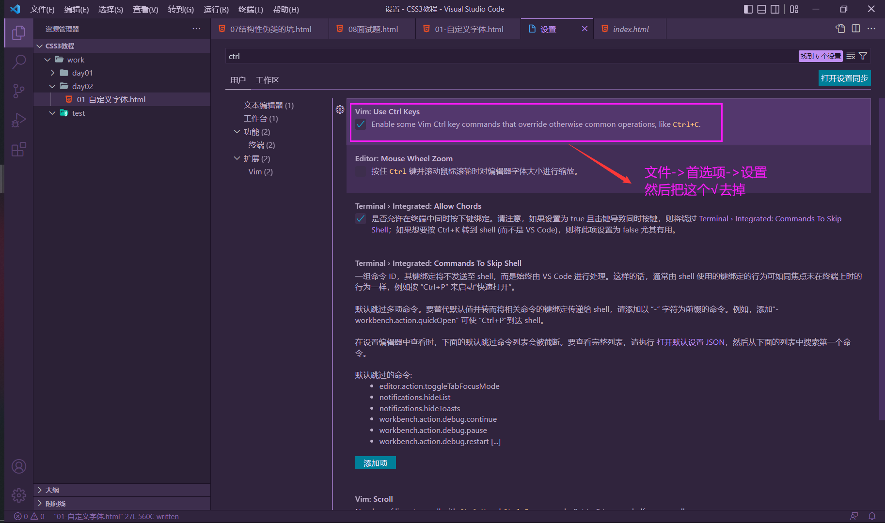


# CSS3基础教程：

视频教程：https://www.bilibili.com/video/BV1eW411T7Nr?from=search&seid=4282835502181908639&spm_id_from=333.337.0.0&vd_source=365d13057e58bb6a007cdd5275785229


CSS3规范文档：www.w3.org/TR/2011/REC-css3-selectors-20110929

项目路径：

# 1、导学

**==<font color='blue'>css全称：cascading style sheets（层叠样式表）</font>==**

```html
<!DOCTYPE html>
<html lang="en">
<head>
    <meta charset="UTF-8">
    <meta http-equiv="X-UA-Compatible" content="IE=edge">
    <meta name="viewport" content="width=device-width, initial-scale=1.0">
    <title>Document</title>
    <style type="text/css">
        /* 1、样式表
            2、样式表由规则组成 
            3、规则由选择器 和 {}的声明块组成
            4、声明块由css属性和css属性值组成的键值 构成
        */

        * {
            margin: 0px;
            padding: 0px;
        }
    </style>
</head>
<body>
    
</body>
</html>
```

- 基础的概念：样式表，规则，选择器，声明块，css属性，css属性值


```css
        /* 浏览器编译解析选择器的顺序 */
        div ul li #test {

        } 
```

**<font color='purple'>浏览器解析选择器的顺序，是从右往左的，因为这样子性能比较高；看上述的案例如果从左往右，他就得先遍历所有的div一个一个找过去，然后再遍历所有的ul一个一个找过去，那太sb了。。。。。所以从右往左进行解析，解析遇到#test直接找到了，然后就不需要去解析li了对吧，性能上会搞很多的</font>**


# 2、选择器

以后所有的前端都在MDN上进行查找就行了。

https://developer.mozilla.org/zh-CN/docs/Learn


## 2.1、基础选择器

基础选择器类型 6种

```c
        /* 
        通配符选择器  

        id #
        类 .
        元素选择器 div
        后代选择器 空格
        分组选择器  , (结合符)
        */

```

案例：
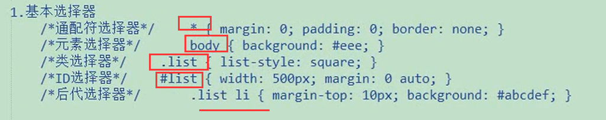


**<font color='purple'>选择器的声明具有优先级顺序，而不是选择器</font>**

```html
<!DOCTYPE html>
<html lang="en">
<head>
    <meta charset="UTF-8">
    <meta http-equiv="X-UA-Compatible" content="IE=edge">
    <meta name="viewport" content="width=device-width, initial-scale=1.0">
    <title>Document</title>
    <style type="text/css">

        /* 
        通配符选择器  

        id #
        类 .
        元素选择器 div
        后代选择器 空格
        分组选择器  , (结合符)
        */

        /*
        平常我们所说的选择器的优先级其实是一个错误的概念，
        准确的来说应该是声明的优先级
        */
        h1,h2,h3 {
            color: pink; 
        }

        #test {
            color: deeppink
        }
    </style>
</head>
<body>
    <div id="wrap">
        <h1 id="test">1-1 </h1>
        <h2>2-2</h2>
        <h3>3-3</h3>
    </div>
    
</body>
</html>
```


## 2.2、子元素选择器

- **<font color='red'>就是 > 符号，和后代选择器不同的是，这个东西只会选择它的儿子</font>**

```css
    <style type="text/css">
        /*
            > 这个东西只会选择儿子
        */
        .wrapper > div{
            color: pink;
        }

    </style>
```

```html
<body>
    <div class="wrapper">
        <div>
            1-1
            <div>1-1-1</div>
        </div>
        <div>1-2</div>
        <div>1-3</div>
        <div>1-4</div>
    </div>
</body>
```

**结果：**
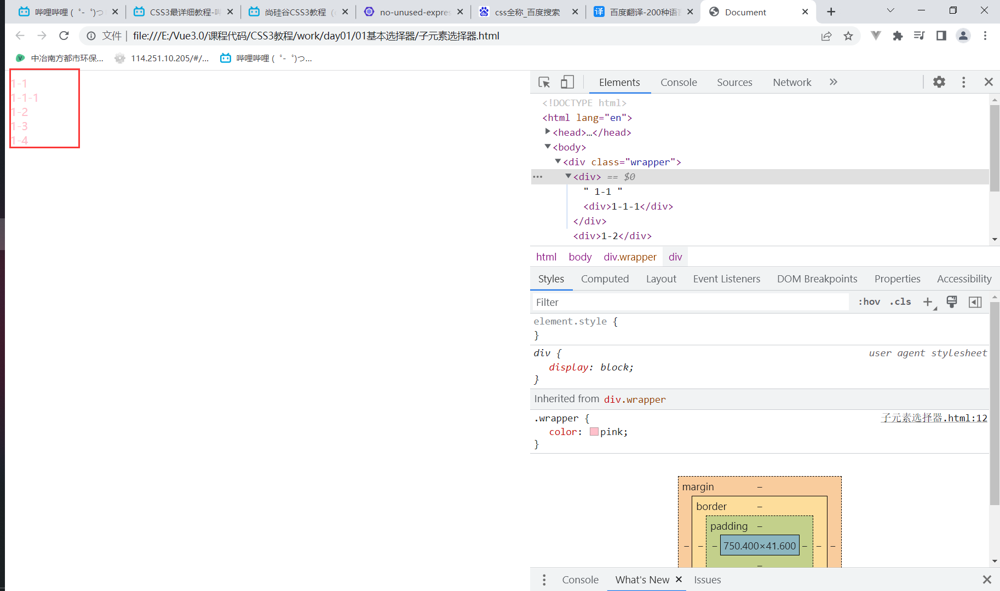

- ***<font color='blue'>为什么 1-1-1也变成pink了呢？他又没有被选择到？？？？</font>***

- **<font color='red'>因为它继承了div.wrapper的样式，所以在css中还要注意：css默认值和继承值</font>**


## 2.3、相邻弟弟选择器

- 符号就是 + 

```html
    <style type="text/css">
        #wrapper > .first + .inner {
            color: pink;
        }
    </style>
</head>
<body>
    <div id="wrapper">
        <div class="inner">inner</div>
        <div class="first">first</div>
        <div class="inner">inner</div>
        <div class="inner">inner</div>
        <div class="inner">inner</div>
    </div>
</body>
```

结果：


**==<font color='red'>只有紧挨着first元素的下一个元素才可以被选择</font>==**

- 如果改成这样：

```html
    <div id="wrapper">
        <div class="inner">inner</div>
        <div class="first">first</div>
        <div></div>
        <div class="inner">inner</div>
        <div class="inner">inner</div>
        <div class="inner">inner</div>
    </div>
```

结果：


## 2.4、通用弟弟选择器

- 就是 ~ 这个符号

```html
    <style type="text/css">
        #wrapper .first ~ .inner{
            border: 1px solid red;
        }
    </style>
</head>
<body>
    <div id="wrapper">
        <div class="inner">inner</div>
        <div class="first">first</div>
        <div class="nihao">你好呀，设备</div>
        <div class="inner">inner</div>
        <div class="inner">inner</div>
        <div class="inner">inner</div>
        <div class="inner">inner</div>
    </div>
</body>
```

结果：


***==<font color='blue'>~通用兄弟选择器和+相邻兄弟选择器不同在于 他不用紧挨，只要是下面的都是兄弟（同一个父框框）;还有他不会匹配兄弟的儿子</font>==***

```html
    <div id="wrapper">
        <div class="inner">inner</div>
        <div class="first">first</div>
        <div class="nihao">你好呀，设备</div>
        <div class="inner">inner<div class="inner">zzw</div></div>
        <div class="inner">inner</div>
        <div class="inner">inner</div>
        <div class="inner">inner</div>
    </div>
```


**==<font color='red'>在这里之所以我们要选择border属性就是因为它不会被继承的、可以更加的直观。</font>==**


## 2.5 、属性选择器


```html
    <div id="wrapper">
        <div name="" style="" fkadsljf=""></div>
    </div>
```

- **<font color='red'>在html标签中我们可以自定义属性的，一般我们把这些属性都称之为attrs ，然后style是一个标签的属性和css没有任何关系，但是它的值和css样式有关系，这个逻辑要理清楚。</font>**

### 2.5.1、属性存在选择器

- **目标选择器[属性名]**

```html
    <style type="text/css">
        * {
            margin: 0px;
            padding: 0px;
        }

        div[name] {
            border: 1px solid blue;
        }
    </style>
</head>
<body>
    <div id="wrapper">
        <div name="zzw  ">zzw</div>
        <div name="xujei">xujie</div>
        <div name="xujieru ">xujieru</div>
        <div name="shaoyingfei ">shaoyingfei</div>
    </div>
</body>
```

**==<font color='red'>就是选择含有name属性的div</font>==**

### 2.5.2、属性值选择器

就两个

- div[name="zzw"]
- div[name~="zzw"]

```html
    <style type="text/css">
        * {
            margin: 0px;
            padding: 0px;
        }

        div[name="xujie"] {
            border: 1px solid blue;
        }
    </style>
</head>
<body>
    <div id="wrapper">
        <div name="zzw">zzw</div>
        <div name="xujie">xujie</div>
        <div name="xujieru ">xujieru</div>
        <div name="shaoyingfei ">shaoyingfei</div>
    </div>
</body>
```

***==<font color='blue'>关注一下细节，你看就是属性选择器[]中的表达式和 div标签中的表达式其实是完全一样的对吧</font>==***


***<font color='red'>第二个就是 约等于的意思</font>***


```html
    <style type="text/css">
        * {
            margin: 0px;
            padding: 0px;
        }

        /**约等于许洁 **/
        div[name~="xujie"] {
            border: 1px solid blue;
        }
    </style>
</head>
<body>
    <div id="wrapper">
        <div name="zzw">zzw</div>
        <div name="xujie zzw">xujie</div>
        <div name="xujieru ">xujieru</div>
        <div name="shaoyingfei ">shaoyingfei</div>
    </div>
</body>
```


### 2.5.3、CSS3属性值选择器

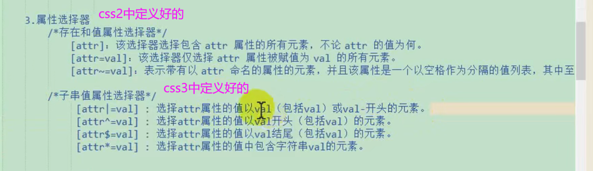

- [attr|=val]

```html
        div[name|="zzw"] {
            border: 1px solid red;
        }

    </style>
</head>
<body>
    <div id="wrapper">
        <div name="zzw">zzw</div>
        <div name="zzw-ss">zzw-ss</div>
        <div name="zzw_ss">zzw-ss</div>
        <div name="zzwss">zzw-ss</div>
```


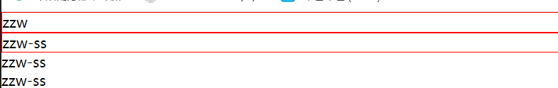


**==显然它只能选择 zzw和zzw-ss==**


- [attr^=val]

**这个^叫做拖字符，正则里也有代表匹配开始的位置**

```html

//样式
div[name^="xujieru"] {
            border: 1px solid yellowgreen;
        }

//代码
<div name="xujieru">xujieru</div>
        <div name="xujieru-fd">xujieru-fd</div>
        <div name="xujieru_fd">xujieru_fd</div>
        <div name="xujierufd">xujierufd</div>
        <div name="xujieru fjkj">xujieru fjkj</div>
```

这个结果没有什么疑问都是能匹配到的，因为它相当于正则
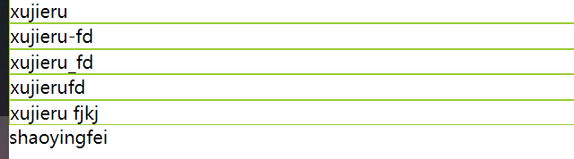

- [attr$=val]和[attr*=val]就没有什么用了。


## 2.6、伪类与伪元素选择器

**<font color='red'>伪类和伪元素是不存在与dom树当中的。之所以要设计伪类和伪元素的选择器，就是让CSS有能力选中这些不在dom树中的东西</font>**

- ***伪类是用来拿到dom节点的状态***

- ***伪元素是真的元素，只不过它不在dom树中的。***

### 2.6.1、链接伪类


**==<font color='red'>因为a标签的的 :link 和 :visited 已经覆盖了所有的a标签的所有状态（点过和没点过）所以如果在a标签中要加入 :hover 和 :active属性，就必须放在link和visited的后面才行，也就是 l v h a</font>==**

==注意：在visited中只有color、backgroud-color、border-color能被访问到！其他属性都没有用，这是定死的！！！==

#### 2.6.1.1、纯CSS做选项卡

- 专属于a标签的 target的灵活运用

```html
    <style type="text/css">
        a {
            text-decoration: none;
            color: pink;
        }

        div {
            width: 100px;
            height: 100px;
            background-color: pink;
            text-align: center;
            font: 32px/100px "微软雅黑";
            display: none;
        }
        :target {
            display: block;
        }
    </style>
</head>
<body>
    <a href="#div1">商品列表</a>
    <a href="#div2">购物车列表</a>
    <a href="#div3">我的</a>
    <div id="div1">
        c++
    </div>
    <div id="div2">
        fjsldkj
    </div>
    <div id="div3">
        zzw
    </div>

</body>
```

效果：
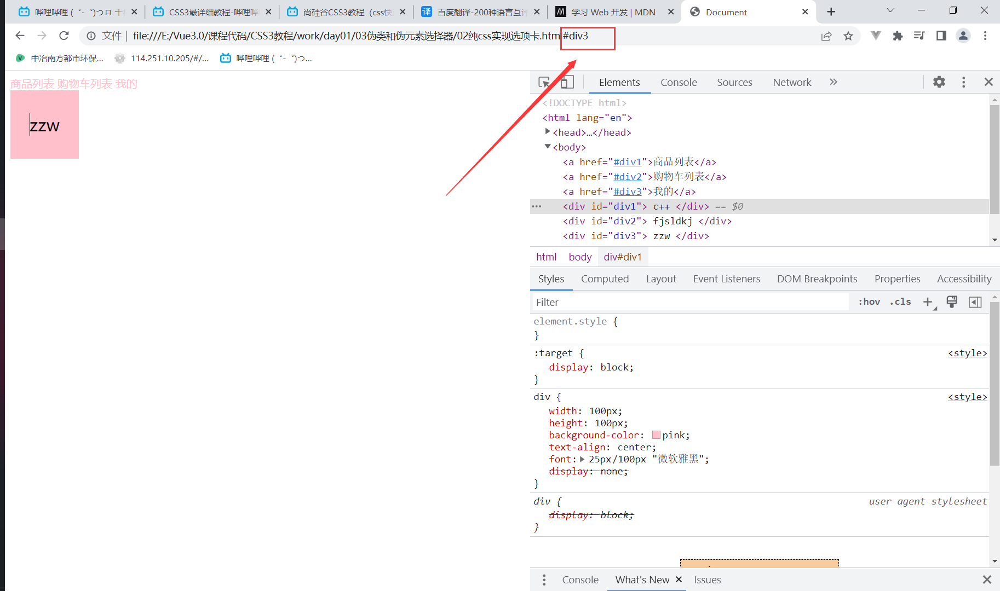


**<font color='red'>这里可以总结出三个知识点：</font>**

- **target作用于在浏览器地址栏的url中出现过的片段的标签，(就是当#div3在url中出现的时候，css的target就会找到id是div3的属性，然后把自己的 声明块中的属性添加到div3上去就行了)**

- **a标签不换行的.**

- **框框内字体居中**

   **text-align: center;**

  **font: 字体大小/框框高度   字样**


### 2.6.2、动态伪类

:hover和:active

```html
    <style type="text/css">
        * {
            margin: 0px;
            padding: 0px;
        }
        .inner {
            font-size:32px;
            color: black;
        }
        .inner:hover {
            font-size:48px;
            color: purple;
        }
        .inner:active {
            font-size:78px;
            color: pink;
        }

    </style>
</head>
<body>
    <div id="wrapper">
        <div class="inner">zzejflkejlkjlkjlkjfei j</div>
    </div>
```

==hover不用多说，active就是当keydown的时候触发的==

### 2.6.3、表单伪类


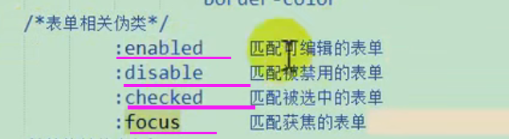

```html
    <style type="text/css">
        * {
            margin: 0px;
            padding: 0px;
        }
        input:enabled {
            background: yellow;
        }
        input:disabled {
            background: deepskyblue;

        }
        /** 这个样式只对复选框有作用*/
        input:checked {
            width: 100px;
            height: 100px;
        }

        input:focus {
            /* border: 2px solid red; */
            background: pink;
        }

    </style>

</head>
<body>
    <input type="text" placeholder="请输入一些内容">
    <input type="text" placeholder="请输入一些内容" disabled>
    <input type="checkbox">
    <input type="text" placeholder="请输入一些内容">
</body>
```

**==<font color='red'>:checked伪类只对复选框有作用，如果input是disabled，那么:focus状态不会生效的。</font>==**


https://www.jianshu.com/p/170d1332e29b：行内元素，块级元素，行内-块级元素说明。


### 2.6.4、自定义单选框

- 最基础的单选框

```html
    <label>
        <input type="radio" name="radioGroup">
        <span>zzw</span>
    </label>
    <label>
        <input type="radio" name="radioGroup">
        <span>xujie</span>
    </label>
    <label>
        <input type="radio" name="radioGroup">
        <span>lty</span>
    </label>
```

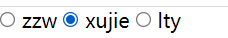

**==<font color='red'>这里的单选框有两个要点，第一：只有name相同，单选框才会生效；第二：label标签可以将radio和span关联起来，然后点击span就能够使得单选框选中，这是实现自定义单选框的基础铺垫。</font>==**


具体实现：

```html
    <style>        
label {
            /** 因为label是一个内联元素，所以只用width和height是没有效果的，
                使用float可以将内联元素转换成块级元素，这样，width和height就有效了
                当然使用absolute也可以使得label的宽和高生效的。
            */
            float: left;
            position: relative;
            width: 50px;
            height: 50px;
            border: 1px solid blue;
        }

        input {
            position: absolute;
            top: -100px  /** 隐藏元素*/
        }

        span {
            position: absolute;
            width: 50px;
            height: 50px;
            /** 当然你也可以不用设置w和h直接设置top:0 left:0 ...就行了*/
        }


        label > input:checked + span {
            background: pink;
        }

    </style>

</head>
<body>
    <label>
        <input type="radio" name="radioGroup">
        <span></span>
    </label>
    <label>
        <input type="radio" name="radioGroup">
        <span></span>
    </label>
    <label>
        <input type="radio" name="radioGroup">
        <span></span>
    </label>

    
</body>
```

**==<font color='red'>label和span都是内联元素，所以要设置宽和高时，需要设置position:absolute;或者float:left;然后就是兄弟选择器的妙用了，哈哈太秀了</font>==**

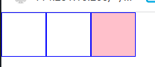


## 2.7、结构性伪类

***==<font color='red'>nth-child(index)系列和nth-of-type(index)系列，注意index最小从1开始!!!</font>==***

示例：这段代码会生效么？

```html
    <style type="text/css">
        * {
            margin: 0px;
            padding: 0px;
        }

        .wrap ul > li:nth-child(1) {
            color: pink;
        }

    </style>
</head>
<body>
    <div class="wrap">
        <ul>
            <p></p>
            <li>1</li>
            <li>2</li>
            <li>3</li>
        </ul>
    </div>

    
</body>
```

输出：
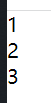

**==<font color='red'>为什么不生效了呢？因为.wrap ul > li:nth-child(1)的真正含义是：找到.wrap下面的所有ul，然后找到ul下面的第一个子元素，并且这个子元素一定要是li，不然就不生效了。</font>==**


- 再看看nth-of-type

```html
        .wrap ul > li:nth-child(1) {
            color: pink;
        }

        .wrap ul > li:nth-of-type(1) {
            color: red;
        }

    </style>
</head>
<body>
    <div class="wrap">
        <ul>
            <p></p>
            <li>1</li>
            <li>2</li>
            <li>3</li>
        </ul>
    </div>
```

输出：
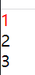

**==<font color='red'>它是找到ul下面第一次出现的li和nth-child的找到第一个子元素不太一样的</font>==**

### 2.7.1、nth-child衍生

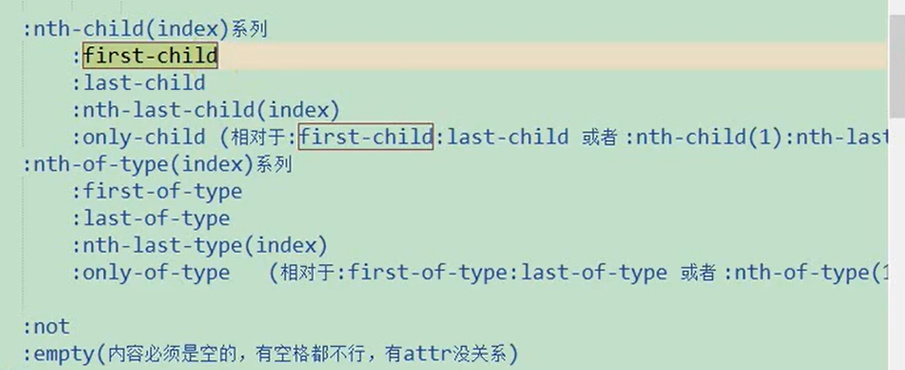


#### part1:first-child（没有索引）

- ***first-child***

```html
        :first-child {
            border: 1px solid red;
        }


    </style>
</head>
<body>
    <div class="wrap">
        <ul>
            <p></p>
            <li>1</li>
            <li>2</li>
            <li>3</li>
        </ul>
    </div>
```

输出：


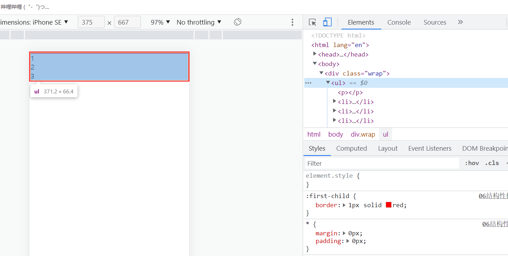

**==如果不指定选择器的话，那么每一个大儿子都会有border的，相当于前面加了一个*==**

```css
        p:first-child {
            border: 1px solid red;
        }
```

==这个表示是 是第一个儿子并且是p标签的元素。==

#### part2:last-child（没有索引）

和first-child是一样的，只不过是最后一个儿子，并且是p标签


#### part3:nth-last-child（有索引）

这个是nth-child的倒序版本而已


#### part4:only-child（没有索引）

这个相当于是 :first-child和:last-child的组合选择器。说明只能有一个子元素！！！

```html
        li:only-child {
            border: 1px solid pink;
        }

    </style>
</head>
<body>
    <div class="wrap">
        <ul>
            <li>2</li>
        </ul>
    </div>
```

输出：
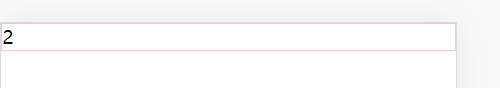


### 2.7.2、nth-of-type衍生

其余的都和nth-child的衍生是差不多的，不过最后一个only-of-type有一点不一样

```html
        p:only-of-type{
            border: 1px solid purple;
        }


    </style>
</head>
<body>
    <div class="wrap">
        <ul>
            <li>2</li>
            <li>2</li>
            <li>2</li>
            <li>2</li>
            <p>3</p>
            <li>2</li>
            <li>2</li>
        </ul>
    </div>
```

==nth-of-type的真正含义应该是仅仅出现一次！==


### 2.7.3、结构性伪类的坑

```html
        #wrapper .inner:nth-of-type(1) {
            border: 1px solid red;
        }
    </style>
</head>
<body>
    <div id="wrapper">
        <div class="inner">div</div>
        <p class="inner">p</p>
        <h1 class="inner">h1</h1>
        <h2 class="inner">h2</h2>
    </div>
```

看看结果：

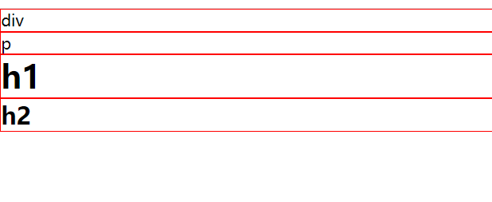

**<font color='red'>为什么明明nth-of-type(1)，却选中了所有的元素呢？这就是nth-of-type坑的地方了，就是说它在编译的时候会把.inner编译成含有.inner类的元素名，所以就相当于</font>**

```css
        #wrapper div:nth-of-type(1) {
            border: 1px solid red;
        }

        #wrapper p:nth-of-type(1) {
            border: 1px solid red;
        }
......
```

**<font color='red'>这就是它的大坑！</font>**


### 2.7.4、面试题

- **最后一项没有 横杠**

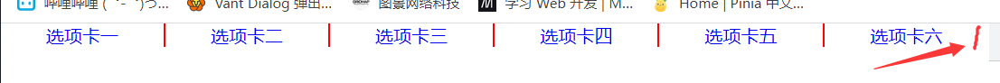


```html
        div > a:not(:last-child) {
            border-right: 2px solid red;
        }

    </style>
</head>
<body>
    <div>
        <a href="#">选项卡一</a>
        <a href="#">选项卡二</a>
        <a href="#">选项卡三</a>
        <a href="#">选项卡四</a>
        <a href="#">选项卡五</a>
        <a href="#">选项卡六</a>
    </div>
```

**==<font color='red'>重点就是:not(:last-child)这个东西</font>==**


- 给空元素指定特殊样式：**:empty伪类**

```html
        div > a:empty {
            background: blue;
        }
    </style>
</head>
<body>
    <div>
        <a href=""></a>
```


## 2.8、伪元素选择器

**==<font color='deeppink'>伪元素选择器就一个before和after，用他们的时候要注意一定要加content:""就行，还可以使用display:block;这样的改变他们的块级状态</font>==**

- ::first-letter 第一个字母
- ::first-line  第一行
- ::selected  被选中时候的状态

这些都很简单


## 2.9、根元素选择器

**<font color='deeppink'>:root 这就用来选中html标签的，要知道</font>**


# 3、声明的优先级

## 3.1、选择器特殊性

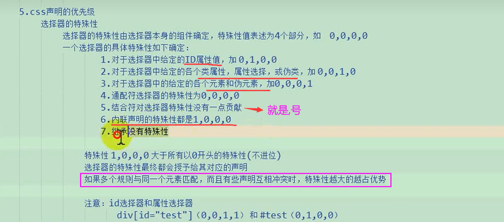

**==<font color='deeppink'>只要明白一点，就是如果有规则有冲突，那么特殊性越大的优先级越高！如果特殊性一样，那么声明在后面的会覆盖声明在前面的</font>==**

## 3.2、重要声明

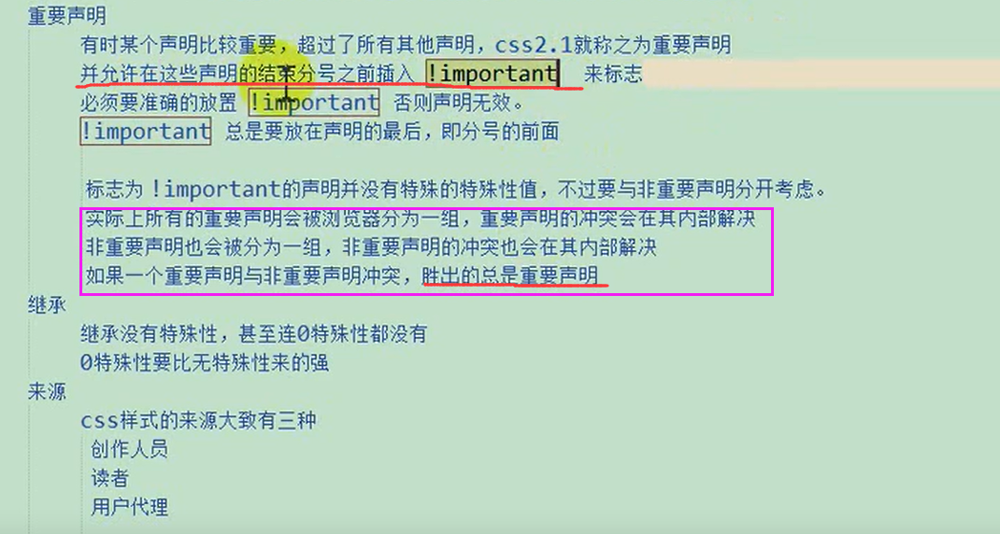

重要声明优先级考虑：

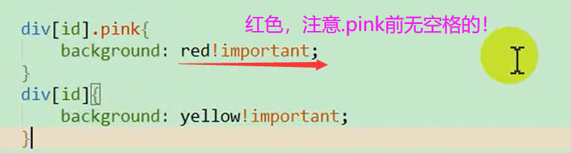


# 4、自定义字体&字体图标

字体图标：

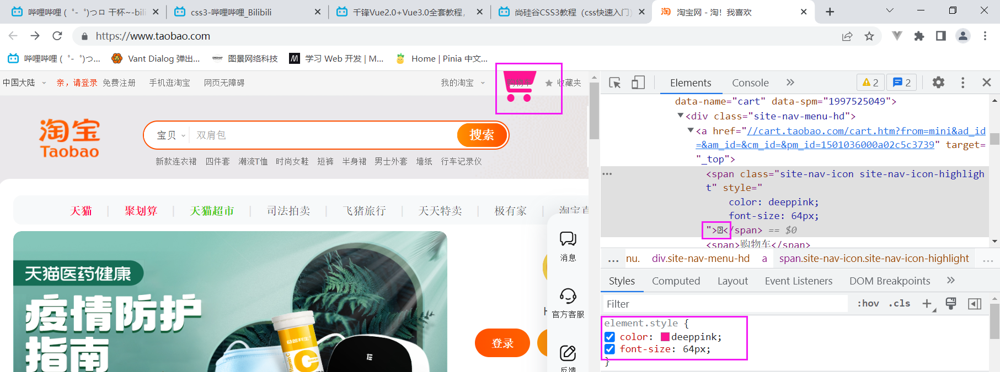

- 这个东西就是字体图标

- 字体图标的好处：

  - 矢量图不会失真
  - 大小通过font-size调整（哈哈，难怪那个anti-design-vue的图标大小也是用font-size调整的，哈哈）

  - 而且不用从后台获取，减少带宽消耗，提升系统性能


## 4.1、自定义字体

操作系统中所有的自带字体如下所示：C:\Windows\Fonts
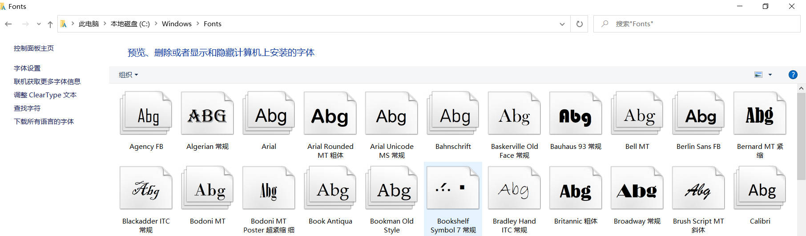


==操作系统的自带字体，浏览器不一定能用的，因为还要看浏览器对字体的支持情况。==


```html
        .test {
            font: bold 50px "Lucida Sans";
        }

    </style>
</head>
<body>
    <div class="test">
        圆滚滚，QHF
    </div>
```

==这里的font是一个联合属性：分别是font-weight、font-size和font-family的联合==


### 4.1.1、UI自定义字体

在本地目录下，放一个字体文件，然后就可以引用它了
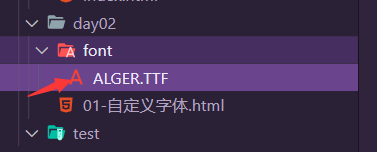


```html
        @font-face {
            font-family: "my-font-zzw";
            src: url(./font/ALGER.TTF);
        }

        .test {
            font: bold 50px "my-font-zzw";
        }

    </style>
</head>
<body>
    <div class="test">
        HTJK，Just Do It!
    </div>
```

效果：
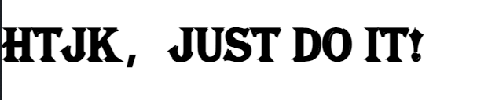


==一般情况下，这个字体文件都放在服务器上，然后使用@font-face的src指向字体的url就行了==


### 4.1.2、字体图标

***到底什么是自定义字体？***

#### **==<font color='deeppink'>所谓自定义字体，其实就是把汉字、英文字母 和一张矢量图对应起来，这张矢量图上面就是各种好看的字体样式了！根据这个原理，所以我们可以把一些字符和矢量图标联系在一起，从而生成字体图标了！</font>==**

#### part1、生成字体图标的方法

网站：https://icomoon.io/app/#/select

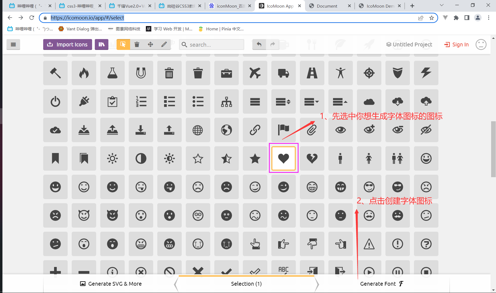


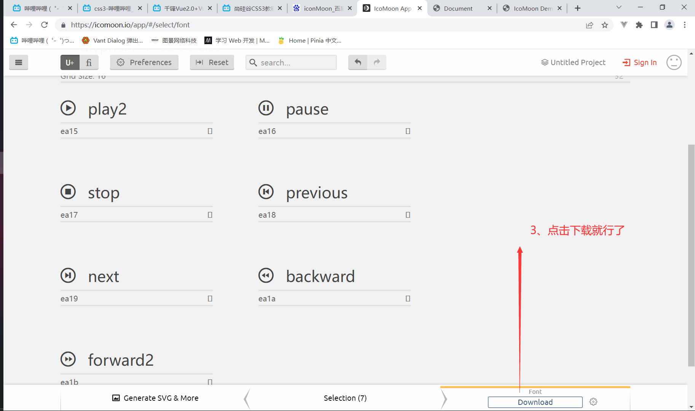


**==<font color='red'>可以download到一个压缩包，这个压缩包里面就是示例，可以根据这个示例来使用你的字体图标就行了。</font>==**


***使用说明：***

原理：

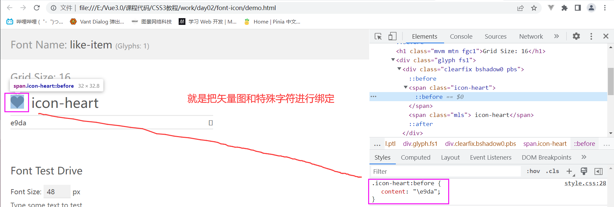


使用：
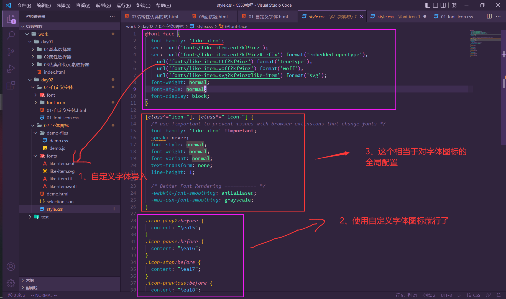


# 5、C3新增UI样式

## 5.1、新增文本样式

- 文本新增样式
  - opacity（老的是用：visibility）**==<font color='red'>注意：opacity不是一个可以继承的属性，但是可以影响到自己的子元素！</font>==**
  - rgba （可以定义透明度了）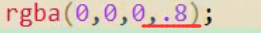

**==<font color='deeppink'>以后rgba的标准写法都用.x的形式，前面不要再加0了！</font>==**


### 5.1.1、小需求

文字透明,背景不透明；背景透明，文字不透明

**==<font color='deeppink'>很简单只要是用rgba修改color和background就行了</font>==**

- tips:超级好用的捏！

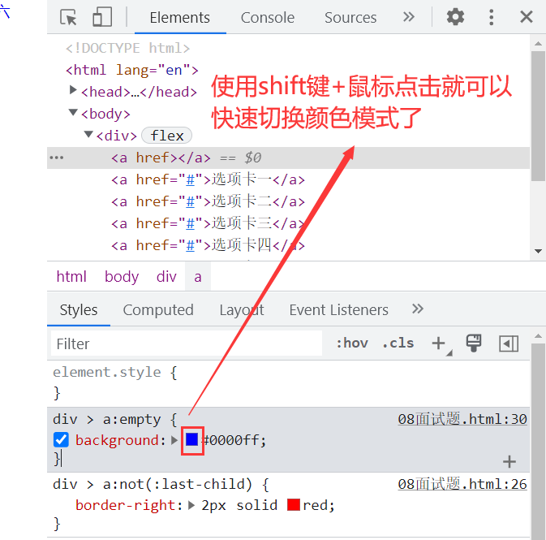

### 5.1.2、文字阴影（text-shadow属性）

```html
        .test {
            text-align: center;
            /** 第二个是指定它的行高！line-height:可以是一个px值（如果要居中的话，就设定它是盒子的高就行了），也可以是1.5小数*/
            font: 100px/200px "微软雅黑";
            /** 阴影颜色，阴影x轴偏移值，阴影y轴偏移值，阴影模糊像素，越高越模糊
                你可以叠加多层模糊的
            */
            text-shadow: purple 10px 10px 20px,pink 15px 15px 25px;
        }

    </style>
</head>
<body>

    <div class="test">
        尚硅谷
    </div>
```

**==<font color='purple'>text-shadow有4个属性，分别是阴影颜色、x方向偏移量、y方向偏移量、模糊度；可以叠加多个阴影</font>==**

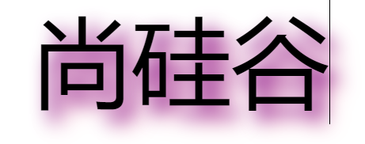

#### part1：浮雕字体

```html
        body {
            background-color: blueviolet;
        }

        .test {
            text-align: center;
            font: 100px/200px "微软雅黑";
            color: blueviolet;
            text-shadow: black 2px 2px 8px;
        }
    </style>
</head>
<body>
    <div class="test">
        行天道，无后悔！
    </div>
```

效果：


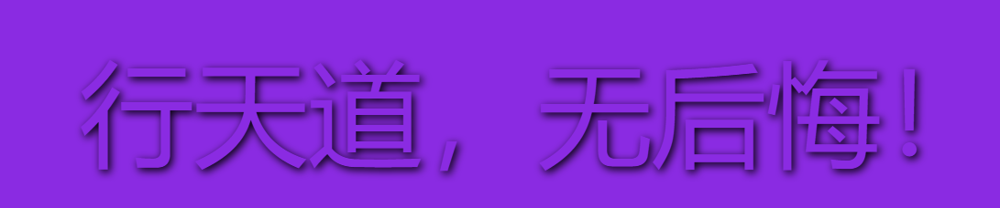


### 5.1.3、背景图片透明模糊

**==<font color='purple'>这个需求是一个经典需求啊！</font>==**

```html
        .wrapper {
            position: relative;
            background: rgba(0,0,0,.5);
        }

		img {
            /** 上右下左*/
            margin: 50px 0 50px 50px;
        }

        .wrapper .bg {
            position: absolute;
            top: 0;
            bottom: 0;
            left: 0;
            right: 0;
            background: url(img/bg.jpg) no-repeat ;
            z-index: -1;
            /** 这个东西是模糊整个元素的 */
            filter: blur(3px);
        }
    </style>
</head>
<body>
    <div class="wrapper">
        <!-- 这里使用img标签把wrapper容器撑开了,因为img标签是block元素 -->
        
        <div class="bg">
        </div>
    </div>
```

要点：

- 背景颜色透明、绝对定位、top控制大小、z-index
- **==<font color='deeppink'>最重要的：就是filter: blur();这个函数，在C3中，这个函数是用来模糊的，而且会模糊一整个元素的！</font>==**

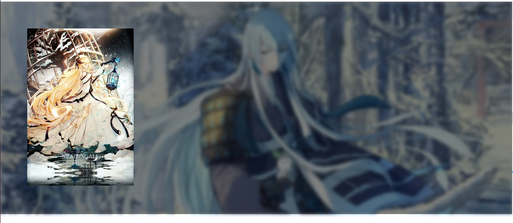

### 5.1.4、文字描边

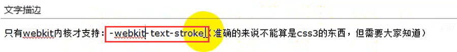

- ***他需要webkit的内核支持才行！***

- 不太会用到

### 5.1.5、文字排版

```html
        /** C3文字排版*/
        div {
            width: 200px;
            height: 200px;
            border: 1px solid red;
            /** 文字排版方向*/
            direction: rtl;
            unicode-bidi: bidi-override;
        }

    </style>
</head>
<body>
    <div>
        尚硅谷
    </div>
```

==- direction控制文字方向，unicode-bidi:控制文字内的方向==


#### part1: 文字过多时候省略！

```html
    <div>
        尚硅谷尚硅谷尚硅谷尚硅谷尚硅谷尚硅谷尚硅谷尚硅谷尚硅谷尚硅谷尚硅谷尚硅谷尚硅谷尚硅谷尚硅谷尚硅谷尚硅谷尚硅谷尚硅谷尚硅谷尚硅谷
    </div>
```

如果你这样写的话，会发现它换行了
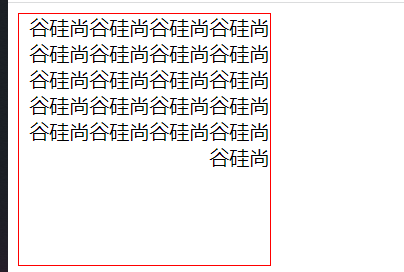

==不让他换行的办法：==

```css
        div {
            width: 200px;
            height: 200px;
            border: 1px solid red;
            /** 文字排版方向*/
            /* direction: rtl; */
            /* unicode-bidi: bidi-override; */
            /** 禁止文字换行*/
            white-space: nowrap;
        }
```

==显示省略号的方法：==

```css
            overflow: hidden;
            text-overflow: ellipsis;
```


**==<font color='deeppink'>注意：如果display为inline的话，就不能显示省略号了，因为元素是由内容撑开的了！</font>==**


## 5.2、盒模型新增样式

**前端中的x轴和y轴的方向如下：**
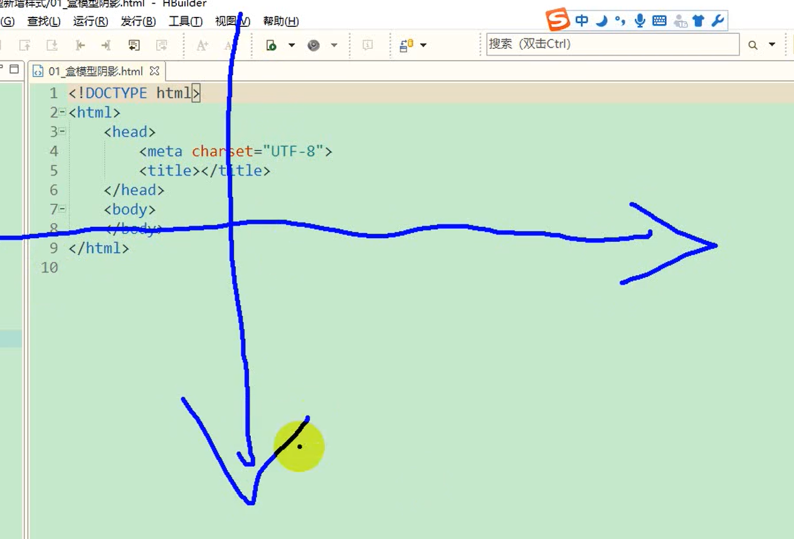

==这个很重要，不能忘记的！==


### 5.2.1、盒子阴影

#### part1：水平垂直居中的方案

```css
        .test {
            position: absolute;
            top: 0;
            left: 0;
            right: 0;
            bottom: 0;
            background-color: violet;
            width: 300px;
            height: 300px;
            /** 这个属性必须要加上的！不然就不行*/
            margin: auto;
        }
```

**==<font color='red'>注意：</font>==**

- ***==<font color='deeppink'>width和height是必须要定下来的，不然就会变成这样张开来</font>==***

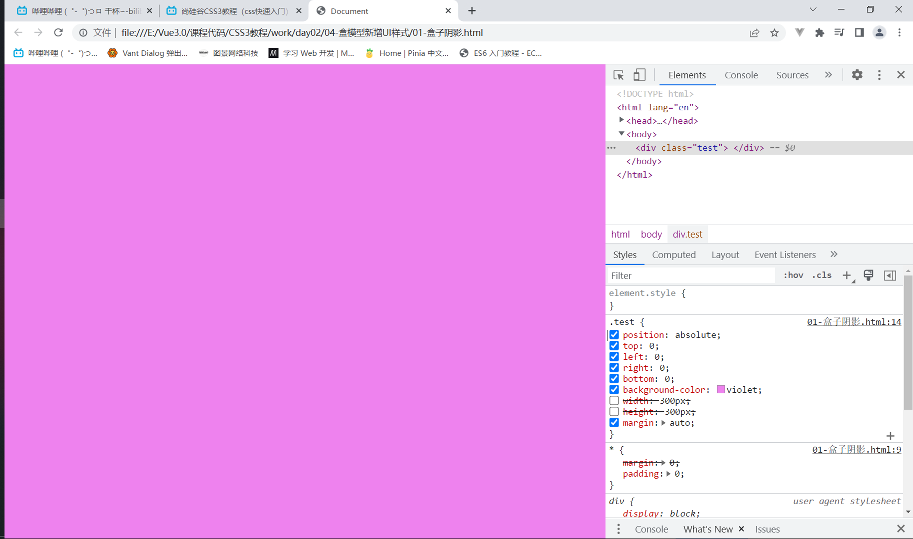

- ***==<font color='deeppink'>这里的margin: auto也是必须的，不然会变成这样的</font>==***


- ***==<font color='deeppink'>top、left的百分比是相较于父盒子的宽度和高度来定的</font>==***

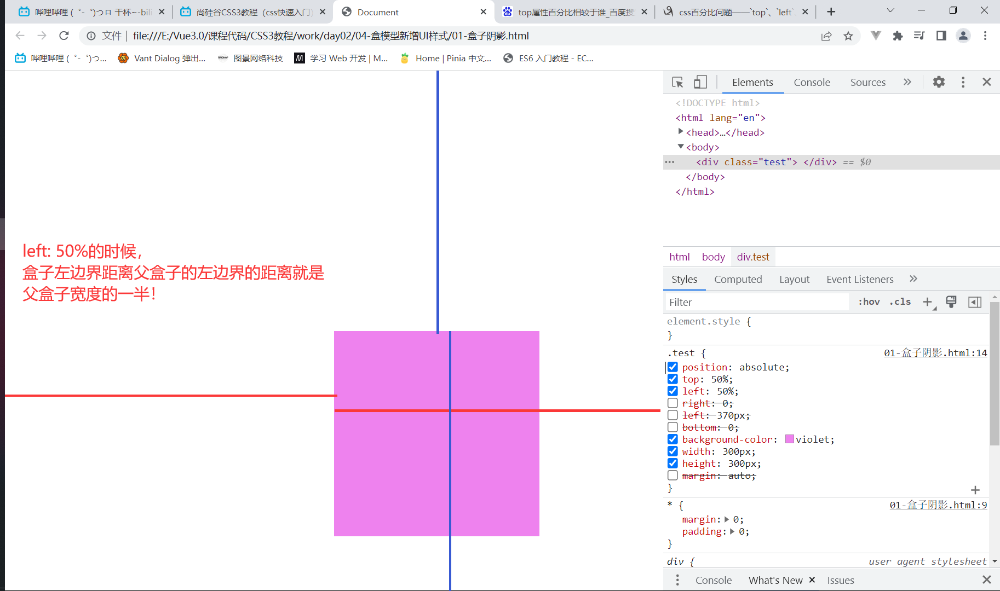


#### part2：box-shadow

**继承性：不可以继承！**

```css
        .test {
            position: absolute;
            top: 0;
            left: 0;
            right: 0;
            bottom: 0;
            background-color: violet;
            width: 300px;
            height: 300px;
            /** 这个属性必须要加上的！不然就不行*/
            margin: auto;

            box-shadow: 13px 13px 13px black;
        }
```

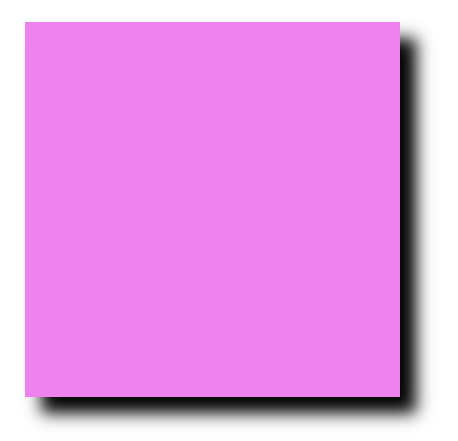

==box-shadow: 参数->x轴偏移量，y轴偏移量， 模糊程度， 颜色（和text-shadow一样可以叠加多个阴影的）；相较于text-shadow，还有两个参数==

```css
            box-shadow: 13px 13px 13px 20px black inset;
```

**==<font color='deeppink'>参数四表示阴影的大小；最后一个表示阴影的往内还是往外的</font>==**

### 5.2.2、倒影

这个和文字描边一样都是需要webkit内核才行的。


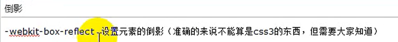


#### part1：图片水平垂直居中的方案

方案一：

```css
        /** 图片水平垂直居中的方案一*/
        /* img {
            position: absolute;
            top: 0;
            left: 0;
            right: 0;
            bottom: 0; 
            margin: auto;
        } */
```

**==<font color='violet'>这个方案有一个坏处，就是把img元素变成浮动的了（难怪需要子绝父相）</font>==**

```css
        /** 方案二*/
        /** 首先要撑开body，这里之所以要加一个html，是因为body在html里面，所以
        要先设置html，才能把body也设置为屏幕高度的100%*/
        html,body {
            height: 100%;
        }

        body {
            text-align: center;
        }

        body::after {
            content: "";
            height: 100%;
            display: inline-block;
            /** 竖直对齐方式*/
            vertical-align: middle;  
        }

        img {
            vertical-align: middle;  
        }
```

**==<font color='deeppink'>这个居中的原理就很骚了，因为::after和img在渲染的时候是兄弟元素，对吧，所以把::after高度设置为100%（宽度为0），然后设置inline-block，把::after和img的竖直对齐都设置为middle，img就会参照::after的middle了所以是竖直居中。</font>==**

- img也是inline-block，和::after是同一个级别的
- 级别相同，谁高听谁的

#### part2：倒影

```html
        html,body {
            height: 100%;
        }

        body {
            text-align: center;
        }

        body::after {
            content: "";
            height: 100%;
            display: inline-block;
            /** 竖直对齐方式*/
            vertical-align: middle;  
        }

        img {
            vertical-align: middle;  
			/** 倒影方向，以及与原图的距离*/
            -webkit-box-reflect: right 10px;
        }

    </style>
</head>
<body>
    
</body>
```

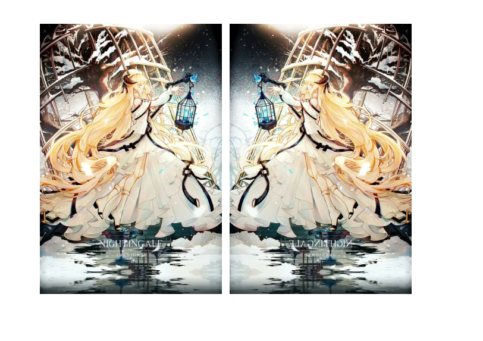

### 5.2.3、任意调整元素大小（resize）

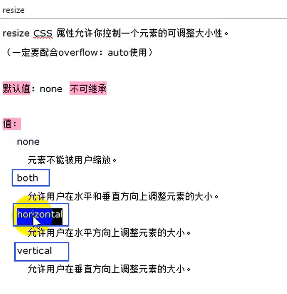

```html
        .test {
            position: absolute;
            top: 0;
            left: 0;
            right: 0;
            bottom: 0;
            background-color: violet;
            width: 300px;
            height: 300px;
            /** 这个属性必须要加上的！不然就不行*/
            margin: auto;

            resize: both;
            overflow: auto;

        }
    </style>
</head>
<body>
    <div class="test">

    </div>
```

### 5.2.4、box-sizing

#### part1：第三种居中方案

```css
        .test {
            position: absolute;
            top: 50%;
            left: 50%;
            width: 300px;
            height: 300px;
            margin-left: -150px;
            margin-top: -150px;
            background-color: violet;
        }
```


这种方案本来是很好的，但是如果加了padding呢？

```css
        .test {
            position: absolute;
            top: 50%;
            left: 50%;
            width: 300px;
            height: 300px;
            margin-left: -150px;
            margin-top: -150px;
            background-color: violet;

            padding: 50px;

        }
    </style>
</head>
<body>
    <div class="test">
    </div>
```

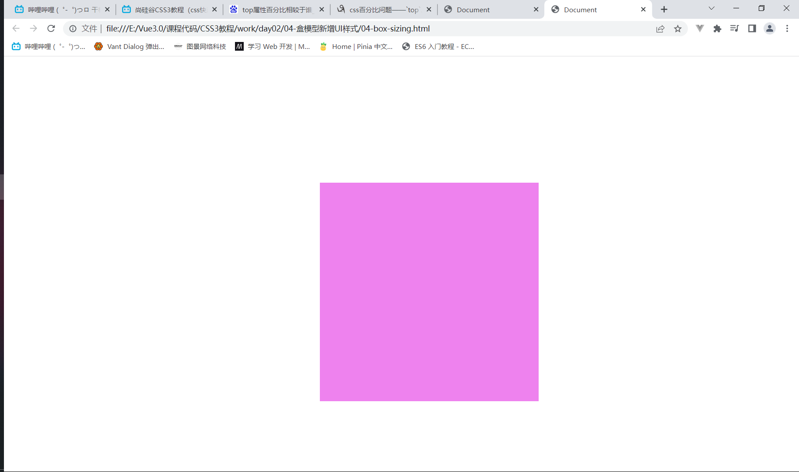

**==<font color='violet'>他不居中的原因是因为，padding的值也被算在盒子的宽和高里面了。。。想要避免这种情况的发生，只能使用box-sizing: border-box</font>==**

```css
        .test {
            position: absolute;
            top: 50%;
            left: 50%;
            width: 300px;
            height: 300px;
            margin-left: -150px;
            margin-top: -150px;
            background-color: violet;

            padding: 50px;
            box-sizing: border-box;

        }
```


#### part1：输入框的右边偏移

box-size: border-box在输入框中也很常用的，嘻嘻

```css
        input[type="text"] {
            width: 245px;
            padding-left: 50px;
            box-sizing: border-box;
            background-color: aqua;
        }
```

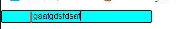


==难怪要在* {}添加border-box了，哈哈懂了==


## 5.3、圆角新增的样式

```css
        .test {
            width: 200px;
            height: 200px;
            position: absolute;
            top: 50%;
            left: 50%;
            margin-left: -100px;
            margin-top: -100px;
            border: 3px solid purple;
            border-radius: 50%;
        }
```

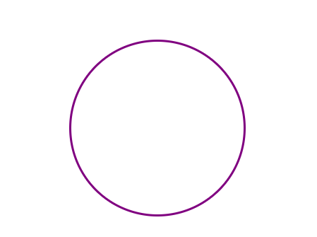

**==<font color='red'>这里为什么是一个圆捏？因为border-radius的值就是一个圆形的半径，50%说明半径是100px，然后生成一个圆把原来的框框隐藏掉了（而又因为一个框框中，生成的圆的最大半径必然是50%所以就算你写70%也不会有任何的变化的。。。）</font>==**


```css
            border-radius: 10px;
```

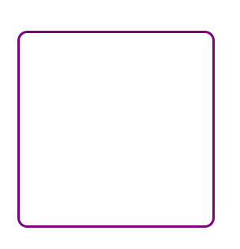


**==<font color='purple'>要想了解这个属性，就必须要知道它产生圆角的原理，其实很简单，就是产生上、右、下、左的半径为10px的圆，然后去和左上、右下...这些方向上的直角进行香蕉、裁剪操作，然后就可以得到圆角了。知道了原理就知道了另一种很骚的写法了，哈哈</font>==**

```css
            border-radius: 10px 20px 30px 45px;
```

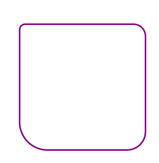


两个值的写法：

```css
           border-radius: 10px 50px;
```

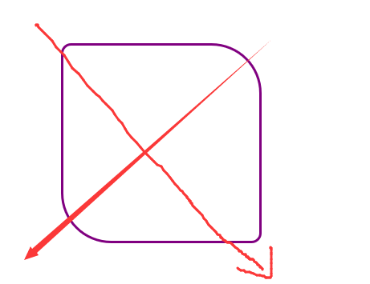

==/斜杠是后面的值，\\是前面的值==


### 5.3.1、长半轴和短半轴

说白了就是水平半轴和竖直半轴，这两个方向上的长度，长度一样的时候就是圆，长度不一样的时候就是椭圆了，嘻嘻

```css
            border-radius: 20px/60px ;
```

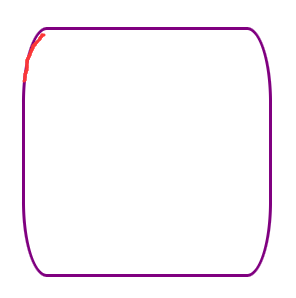


- 两个值的写法：

```css
            border-radius: 20px/60px 20px;
```

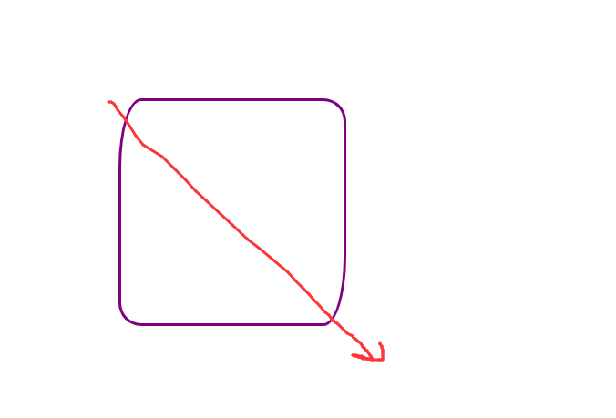

**==<font color='purple'>\\方向上是一个短半轴20px，长半轴40px的椭圆；/方向上是一个短半轴为20px（由开头第一个值定的）长半轴也为20px的圆。</font>==**


- 画一个正常的椭圆（从矩形里面画）

```css
        .test {
            width: 200px;
            height: 300px;
            position: absolute;
            top: 50%;
            left: 50%;
            margin-left: -100px;
            margin-top: -100px;
            border: 3px solid purple;
            /* border-radius: 10px 20px 30px 45px; */
            border-radius: 100px/150px;
        }
```


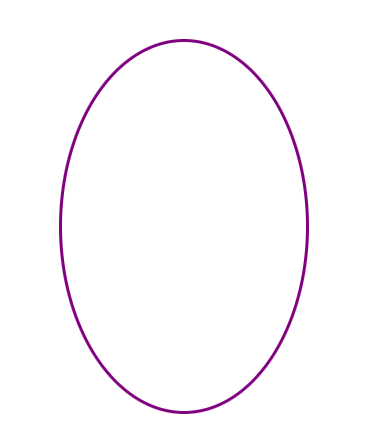

### 5.3.2、注意

**==<font color='purple'>在手机端开发的时候尽量不要用%，而是用px来确定长半轴和短半轴的值</font>==**


# 6、拓展

## 6.1、奇怪的布局

```html
        body > div:nth-child(1) {
            width: 100px;
            height: 100px;
            float: left;
            background: red;
        }

        body > div:nth-child(2) {
            width: 100px;
            height: 100px;
            position: relative;
            background: purple;
            z-index: -1;

        }

        body > div:nth-child(3) {
            width: 100px;
            height: 100px;
            background: blue;

        }
    </style>
</head>
<body>
    <div>zzw</div>
    <div>xujie</div>
    <div>lty</div>
</body>
```


**==<font color='deeppink'>结果：红，紫，蓝的排版如下</font>==**

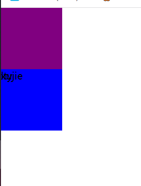

**==<font color='deeppink'>为什么会xujie会被挤到下面去，而许洁这个盒子还在上面覆盖住了zzw呢？？？这就要涉及到两个根本性原理了，1：一个元素有两层，分别是盒模型层和文本层，文本层在下，盒模型层在上；2：然后float只把整个元素提升半层，而position会把整个元素提升一层，所以 xujie这个文本层被 red这个层给挤掉了，而purple又在red层的上面，所以就是这个样子了。</font>==**


## 6.2、滚动条出现在谁身上

```html
        html {
            height: 80%;  /** 窗口高度的80%*/
            border: 1px solid black;
        }
        body {
            height: 80%;  /** 因为body是被html所包裹的，所以是html的高度的80%*/
            border: 1px solid deeppink;
        }

        #test {
            height: 3000px;
            /* background: pink; */
        }

    </style>
</head>
<body>
    <div id="test">
    </div>
    </body>
</html>
```

结果：
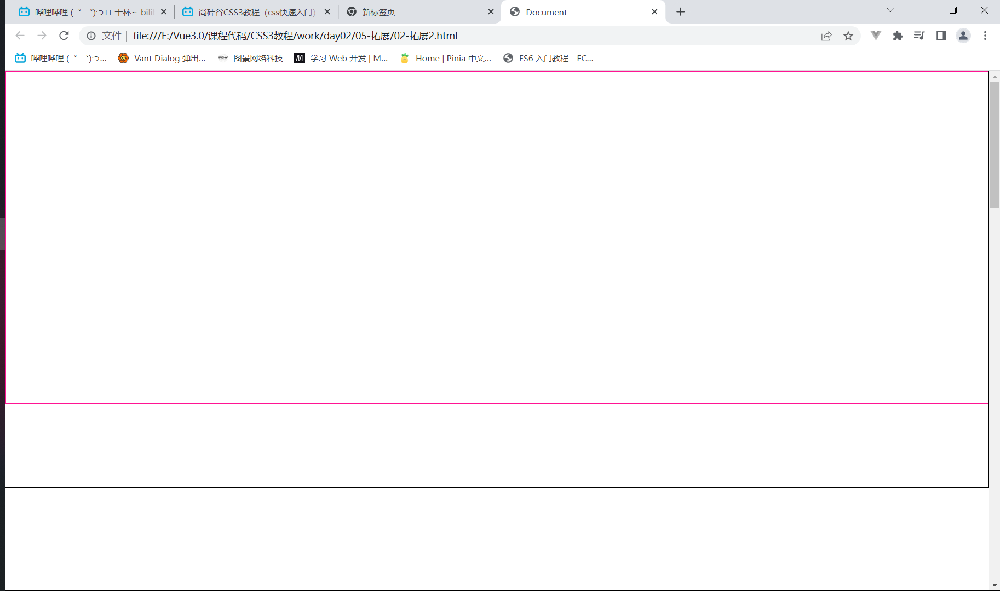

**==<font color='deeppink'>可以发现，把html缩小后，滚动条并不是出现在html身上，也不是在body身上，而是在窗口身上的，也就是Document身上的，那怎么样才能让它出现在自己想要的位置上呢？</font>==**


如果我想要把滚动条放到html的身上，就可以用下面的方式：

```css
        html {
            height: 80%;  /** 窗口高度的80%*/
            border: 1px solid black;
            overflow: auto;
        }
        body {
            height: 80%;  /** 因为body是被html所包裹的，所以是html的高度的8%*/
            border: 1px solid deeppink;
        }
```

结果：


**==<font color='deeppink'>结果你会发现，滚动条还是TM的窗口上面，为什么呢？直接说结论：1、html元素身上永远不可能出现滚动条！（因为它身上的滚动条一定会出现的Document中的...）2、要想让body身上出现滚动条，就必须得设置html和body同时有overflow属性！</font>==**

```css
        html {
            height: 80%;  /** 窗口高度的80%*/
            border: 1px solid black;
            overflow: auto;
        }
        body {
            height: 80%;  /** 因为body是被html所包裹的，所以是html的高度的8%*/
            border: 1px solid deeppink;
            overflow: auto;
        }
```

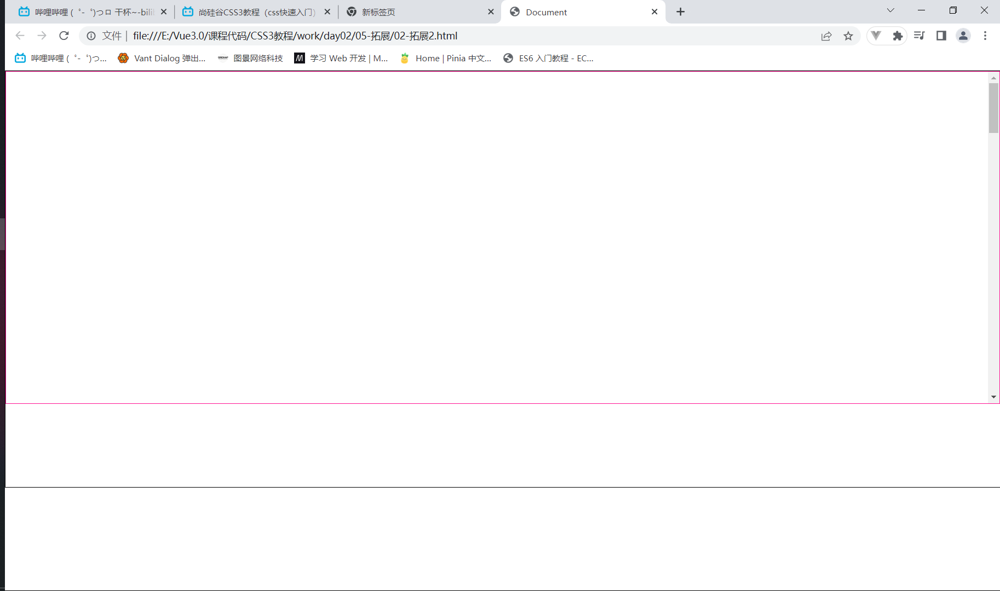


***tips: overflow属性解释：auto表示超出时候有滚动条，scroll表示无论是否超出都有滚动条，hidden就是超出也不给滚动条***


### 6.2.1、随便设置滚动条

**==<font color='deeppink'>如果不想让滚动条出现在body和Document上，只要在html或body中写一个overflow: hidden就行了，两个都写hidden更好哈哈（：html上没有滚动条【它的在上一层Document窗口上】，body上要有滚动条不仅需要自己写overflow: auto，还要经过html的允许）</font>==**


```css
        html {
            height: 80%;  /** 窗口高度的80%*/
            border: 1px solid black;
        }
        body {
            height: 80%;  /** 因为body是被html所包裹的，所以是html的高度的8%*/
            border: 1px solid deeppink;
            overflow: hidden;
        }
```

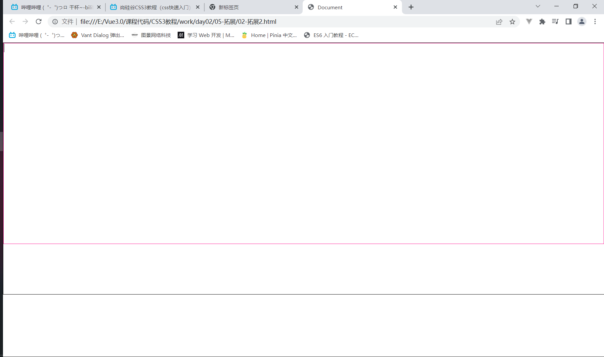


***技巧：禁止系统滚动条，让wrapp去搞滚动条***

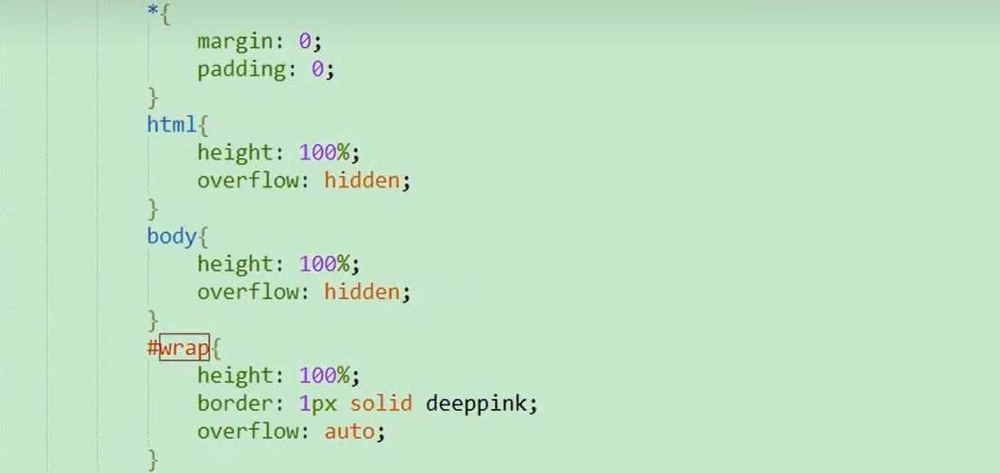

更常用的写法：
```css
html, body {
	height: 100%;
    overflow: hidden;
}
```


### 6.2.2、用绝对定位模拟position: fixed

```html
<!DOCTYPE html>
<html lang="en">
<head>
    <meta charset="UTF-8">
    <meta http-equiv="X-UA-Compatible" content="IE=edge">
    <meta name="viewport" content="width=device-width, initial-scale=1.0">
    <title>Document</title>
    <style type="text/css">
        * {
            margin: 0;
            padding: 0;
            box-sizing: border-box;
        }
        html {
            height: 100%;  
            border: 1px solid black;
        }
        body {
            height: 100%;  
            border: 1px solid deeppink;
            overflow: hidden;
        }

        .wrapper {
            height: 100%;
            overflow: auto;
        }

        .block {
            position: absolute;
            width: 200px;
            height: 200px;
            top: 0;
            left: 0;
            background: red;

        }

        #test {
            height: 3000px;
            /* background: pink; */
        }

    </style>
</head>
<body>
    <div class="wrapper">
        <div class="block">
        </div>
        <div id="test">
            ...
        </div>
    </div>
</body>
</html>
```

效果：

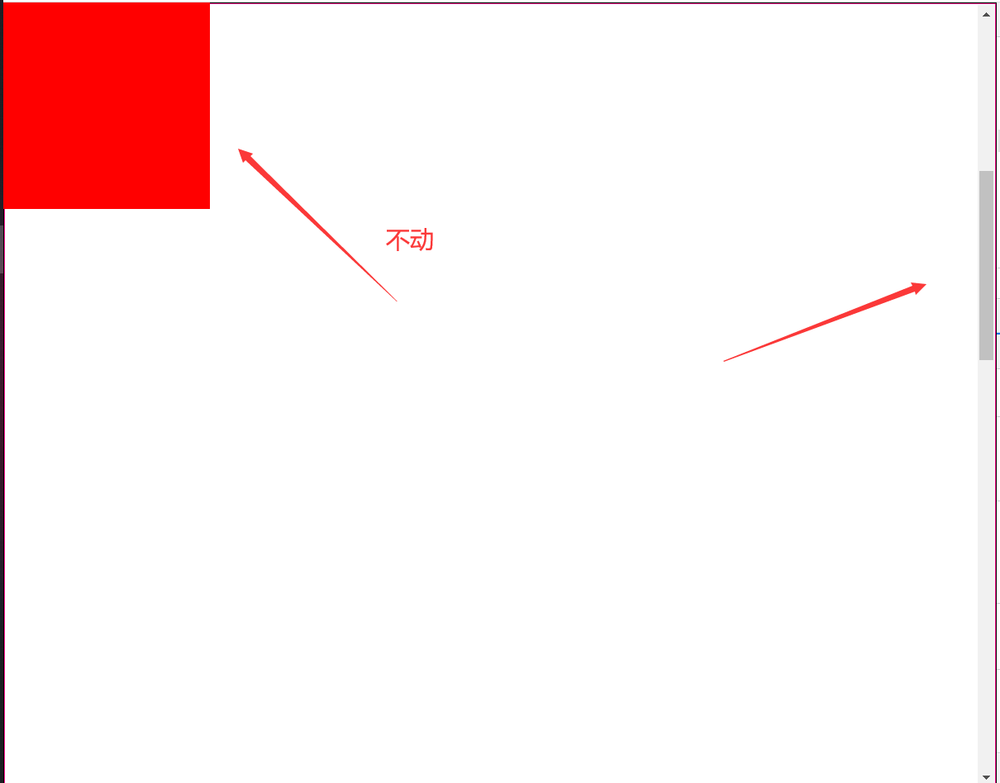

**==<font color='red'>道理很简单，因为wrapper没有设置relative，所以这个absolute是相对于body的absolute对吧，而又因为系统滚动条被禁止了，这个滚动条是wrapper上的，所以滚动条滚动的时候只有wrapp自己的内部的东西才会滚动的咯</font>==**


## 6.3、边框图片

### 6.3.1、border-image-source

很少用但是要知道：

**border-image-source属性：定义一张图片来代替默认的边框样式，默认值为none，不可继承**

```css
        .wrapper {
            position: absolute;
            top: 0;
            right: 0;
            left: 0;
            bottom: 0;
            margin: auto;
            width: 200px;
            height: 200px;
            border: 50px solid;
            border-image-source: url(./border.jpg);
        }
```

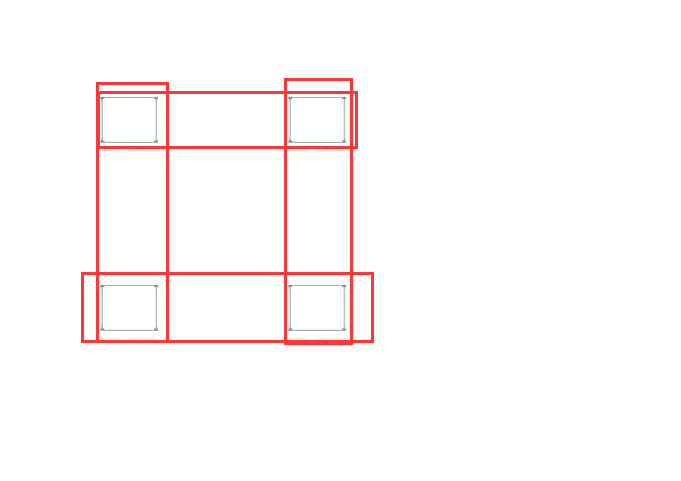

**==<font color='red'>默认边框图片会在四个角上面显示出来...</font>==**

### 6.3.2、border-image-slice

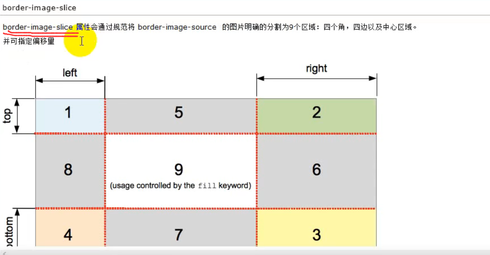


**==<font color='red'>...这个东西确实没有什么用，还不如用background然后铺一张有边框的图片来得快，几乎不会用到的，如果有需要请参考下面的教程</font>==**

https://www.bilibili.com/video/BV1eW411T7Nr?p=20&vd_source=365d13057e58bb6a007cdd5275785229


# 7、css背景

## 7.1、css2背景

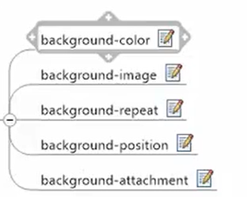

- ## **background-color**


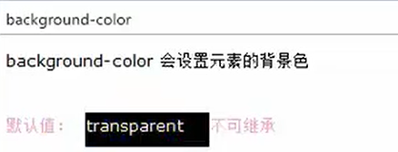


- ## **background-image**

```css
            background-color: red;
            background-image: url(./border2.jpg), url(./border.jpg);
```

**==<font color='deeppink'>background-image会覆盖掉bg-color属性，然后可以叠加多张图片，排在前面的图片叠加在排在后面的图片上面（border2.jpg在border.jpg的上面）</font>==**


- ## **background-repeat很简单看下就行**

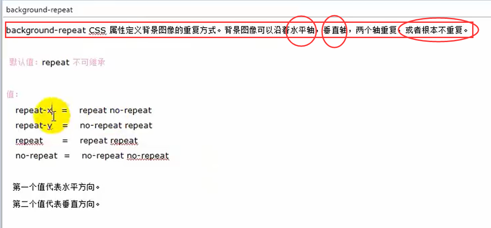

**==<font color='violet'>这个一般会在位图大小<盒子的宽高的时候会用到</font>==**


- ## **background-position**

```css
            background-position: 10px 20px;
```


 **==<font color='violet'>当background-position的值为百分比的时候，这个百分比是相对于 (盒子的宽度 - 位图的宽度 )的，</font>==**

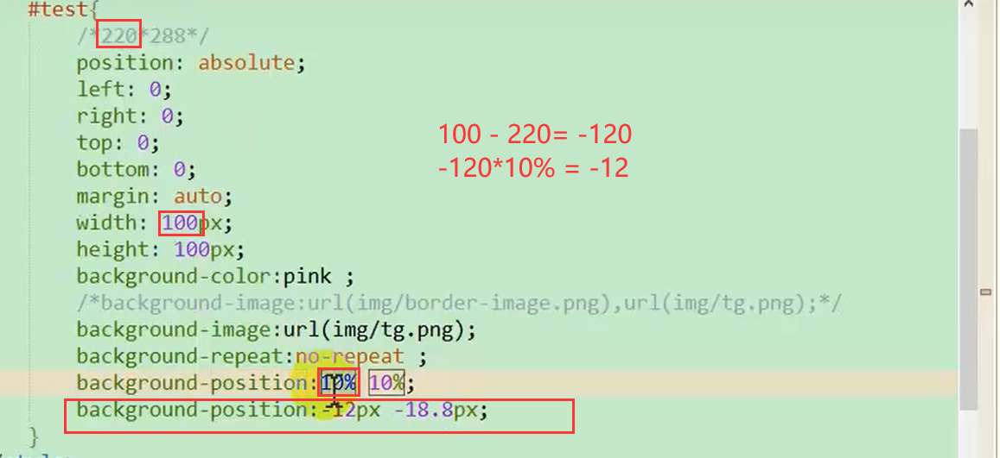


- ## background-attachment

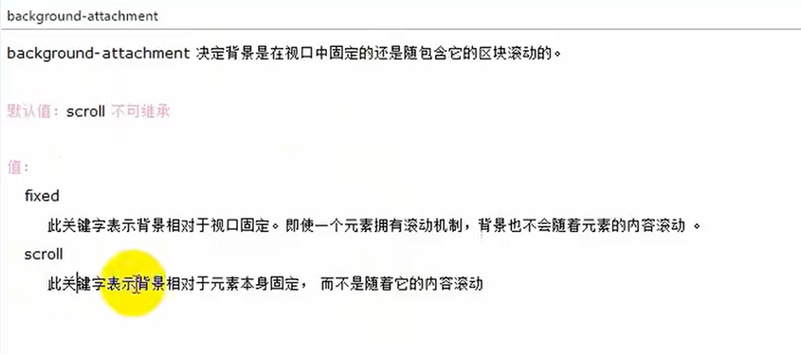


```html
        .wrapper {
            /** 700 * 700*/
            position: absolute;
            top: 0;
            right: 0;
            left: 0;
            bottom: 0;
            margin: auto;
            width: 200px;
            height: 200px;
            background-color: red;
            background-image: url(./border2.jpg);
            /* background-position: 100% 100%; */
            background-position: -275px -200px;
            background-attachment: scroll;
            overflow: auto;
        }
    </style>
</head>
<body>
    <div class="wrapper">
        许洁<br\>许洁<br\>许洁<br\>许洁<br\>许洁<br\>许洁<br\>许洁<br\>许洁<br\>许洁<br\>许洁<br\>许洁<br\>许洁<br\>
        许洁<br\>许洁<br\>许洁<br\>许洁<br\>许洁<br\>许洁<br\>许洁<br\>许洁<br\>许洁<br\>许洁<br\>许洁<br\>许洁<br\>
        许洁<br\>许洁<br\>许洁<br\>许洁<br\>许洁<br\>许洁<br\>许洁<br\>许洁<br\>许洁<br\>许洁<br\>许洁<br\>许洁<br\>
        许洁<br\>许洁<br\>许洁<br\>许洁<br\>许洁<br\>许洁<br\>许洁<br\>许洁<br\>许洁<br\>许洁<br\>许洁<br\>许洁<br\>
        许洁<br\>许洁<br\>许洁<br\>许洁<br\>许洁<br\>许洁<br\>许洁<br\>许洁<br\>许洁<br\>许洁<br\>许洁<br\>许洁<br\>
        许洁<br\>许洁<br\>许洁<br\>许洁<br\>许洁<br\>许洁<br\>许洁<br\>许洁<br\>许洁<br\>许洁<br\>许洁<br\>许洁<br\>
        许洁<br\>许洁<br\>许洁<br\>许洁<br\>许洁<br\>许洁<br\>许洁<br\>许洁<br\>许洁<br\>许洁<br\>许洁<br\>许洁<br\>
        许洁<br\>许洁<br\>许洁<br\>许洁<br\>许洁<br\>许洁<br\>许洁<br\>许洁<br\>许洁<br\>许洁<br\>许洁<br\>许洁<br\>
        许洁<br\>许洁<br\>许洁<br\>许洁<br\>许洁<br\>许洁<br\>许洁<br\>许洁<br\>许洁<br\>许洁<br\>许洁<br\>许洁<br\>
        许洁<br\>许洁<br\>许洁<br\>许洁<br\>许洁<br\>许洁<br\>许洁<br\>许洁<br\>许洁<br\>许洁<br\>许洁<br\>许洁<br\>
        许洁<br\>许洁<br\>许洁<br\>许洁<br\>许洁<br\>许洁<br\>许洁<br\>许洁<br\>许洁<br\>许洁<br\>许洁<br\>许洁<br\>
        许洁<br\>许洁<br\>许洁<br\>许洁<br\>许洁<br\>许洁<br\>许洁<br\>许洁<br\>许洁<br\>许洁<br\>许洁<br\>许洁<br\>
    </div>
</body>
```

结果：


**==<font color='deepred'>scroll确实不会随着他内容的滚动而滚动，fixed的话，就是整个图片都TM的相对于窗口定位了，当然wrapp中的background-position属性还是有用的【scroll和fixed的区别在于背景图片相对于谁进行定位呢？】</font>==**

- 你用fixed还不如直接用img包裹然后fixed定位来的方便

## 7.2、css3背景

**==<font color='deepred'>背景图片默认的渲染起始位置是在padding-box中的（background-position: 0 0;不重复）</font>==**

- **<font color='deepred'>背景颜色默认的渲染起始位置就是在border-box中了,哈哈</font>**


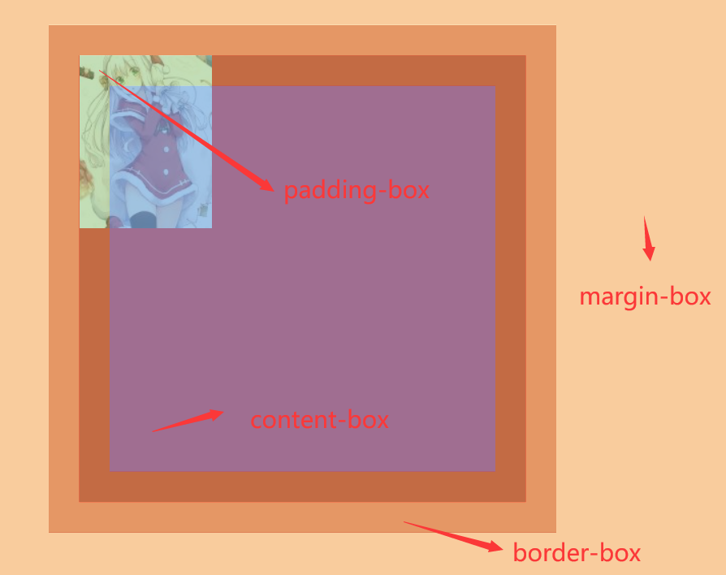

**==<font color='deepred'>不过图片的剪裁就是从border-box开始的了（就是设置repeat的时候【你可以清楚的看到渲染开始的位置确实是padding-box而剪裁开始位置就是border-box了】）</font>==**

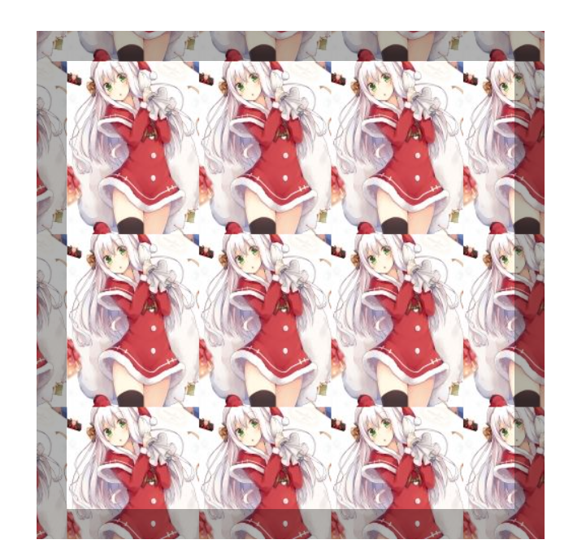

### 7.2.1、渲染与剪裁背景图片

- **background-origin：设置从哪里开始渲染图片。**
  - border-box：从border盒子开始渲染;
  - padding-box：默认
  - content-box：从内容盒子开始渲染

```css
            background-origin: border-box;
```

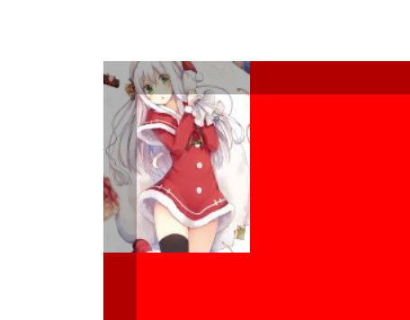


- **background-clip：设置从哪里开始剪裁图片。**

- border-box：默认;
- padding-box：从padding-box盒子开始剪裁
- content-box：从内容盒子开始剪裁

```css
            background-repeat: repeat;
            background-origin: border-box;
            background-clip: content-box;
```

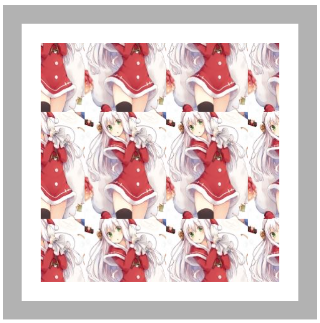


### 7.2.2、需求，文字以外的背景全部裁掉

- **<font color='purple'>细节：如果要文字竖直居中对齐的话，它的行高应该是content-box的高度，而不是整个box的高度！！！非常重要！</font>**

```css
        .wrapper {
            position: absolute;
            top: 0;
            right: 0;
            left: 0;
            bottom: 0;
            margin: auto;
            width: 500px;
            height: 500px;
            border: 30px solid rgba(0,0,0,.3);
            padding: 30px;
            text-align: center;
            font: bolder 90px/380px "微软雅黑";
            background-color: red;
            background-image: url(./mn.jpg);
            background-repeat: repeat;
            -webkit-background-clip: text;
            color: rgba(0,0,0,.3);
        }
```

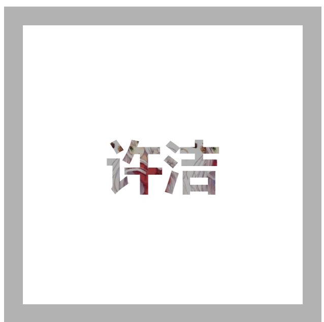


### 7.2.3、背景图片大小

- **<font color='deeppink'>css中图片有一个特性：就是高宽自适应，改变了高度，宽度就会自动跟着改变的</font>**


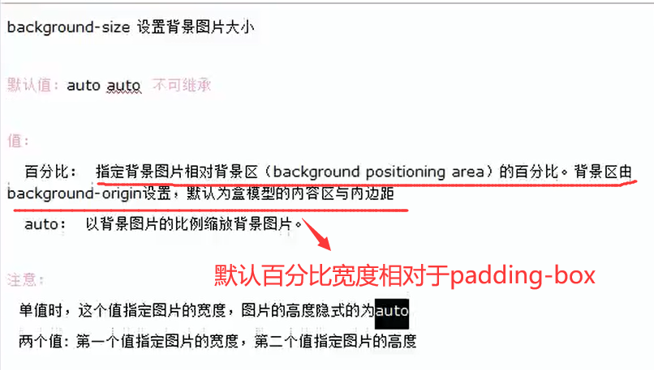


```css
        .wrapper {
            position: absolute;
            top: 0;
            right: 0;
            left: 0;
            bottom: 0;
            margin: auto;
            width: 300px;
            height: 300px;
            border: 30px solid rgba(0,0,0,.3);
            padding: 30px;
            background-color: red;
            background-image: url(./mn.jpg);
            background-repeat: no-repeat;
            background-size: 100% 100%;
        }
```

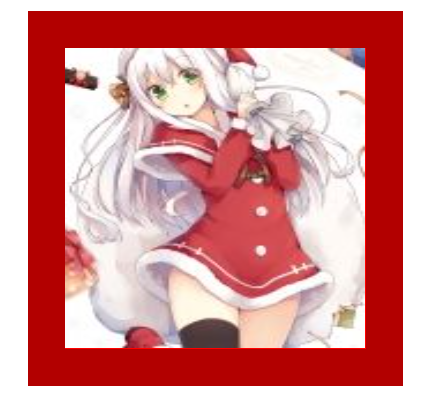


- 简写属性的坏处：

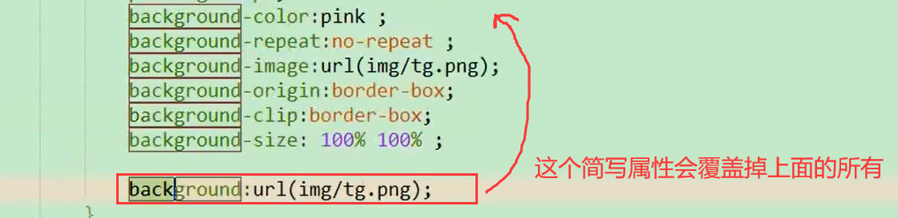


- 代码规范：

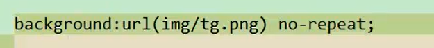

先把这个写上面，然后下面再去补子属性样式

## 7.3、CSS3渐变

**<font color='deeppink'>渐变是图片不是颜色</font>**

### 7.3.1、线性渐变

- **<font color='deepred'>linear-gradient：参数一是渐变的方向，然后是渐变的颜色，可以有任意多种颜色的</font>**

```css
            background-image: linear-gradient(to right, red, yellow, green);
```

- 
- **<font color='deeppink'>渐变的角度</font>**

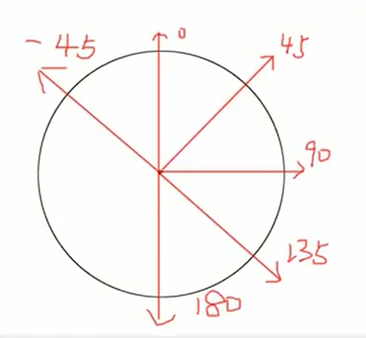


```css
            background-image: linear-gradient(45deg, red, yellow, green);
```

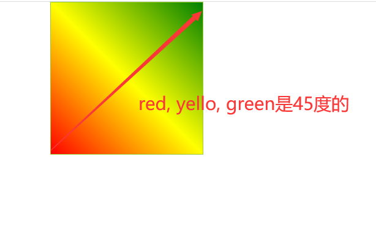

```css
            background-image: linear-gradient(130deg, rgb(204, 51, 255,0) 100px,rgb(204, 51, 255,1) 160px,rgb(204, 51, 255,0) 220px);
```

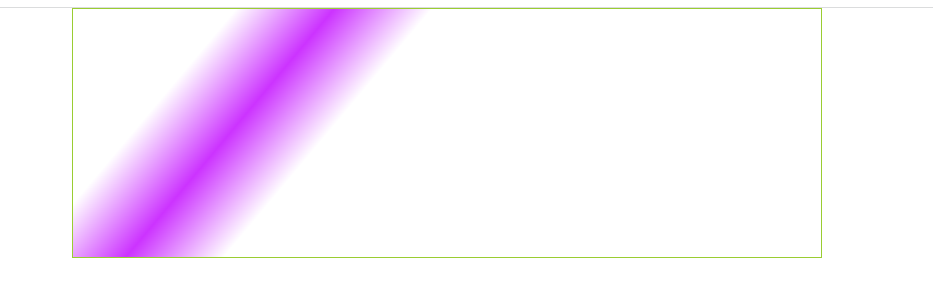


- **<font color='deeppink'>渐变占比</font>**

```css
            background-image: linear-gradient(90deg, red 10%, yellow 20%, green 30%);
```

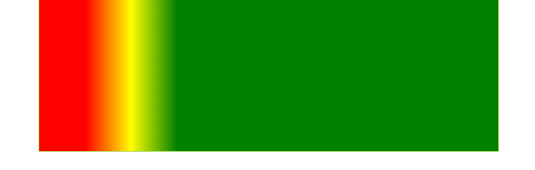

**==<font color='red'>这个是什么意思呢？就是说0-10%这一段都是红色的，然后是10%-20%这一段是red to yellow，然后是20% - 30%这一段是yellow to green剩下的30% - 70%这一段就都是绿色了</font>==**

**==<font color='deeppink'>占比不仅可以用百分比，也可以用px值，效果是一样的</font>==**


- **<font color='deeppink'>渐变重复</font>**

```css
            background-image: repeating-linear-gradient(90deg, red 10%, yellow 20%, green 30%);
```

**==<font color='whiblue'>说白了，就是把10%-30%这一段有渐变效果的不断的重复填充整个容器</font>==**


## 7.4、案例：发廊灯


问题：为什么这个没有重复呢？

```csss
            background-image: repeating-linear-gradient(black 10%,white 10%);
```

因为repeating重复的是渐变色！不是纯色，这样子写0-10是纯黑色，10-100是纯白色！没有渐变所以不会重复的！

解决办法：

```css
            background-image: repeating-linear-gradient(black 0px,black 10px,white 10px,white 20px);
```

==渐变就是0px到10px的黑色自己的渐变，这样就有渐变了而且还是纯色的了，哈哈==

完整示例：

```html
<!DOCTYPE html>
<html lang="en">
<head>
    <meta charset="UTF-8">
    <meta http-equiv="X-UA-Compatible" content="IE=edge">
    <meta name="viewport" content="width=device-width, initial-scale=1.0">
    <title>Document</title>
    <style>
        * {
            margin: 0;
            padding: 0;
            box-sizing: border-box;
        }
        html,body {
            width: 100%;
            overflow: hidden;
        }

        #wrapper {
            height: 300px;
            width: 40px;
            margin: 100px auto;
            border: 1px solid;
            overflow: hidden;
        }

        #wrapper > .light {
            height: 600px;
            background-image: repeating-linear-gradient(135deg, black 0px,black 10px,white 10px,white 20px);
        }

        /* #wrapper > .light:hover {
            margin: -300px;
        } */


    </style>
</head>
<body>
    <div id="wrapper">
        <div class="light">
        </div>
    </div>
    <script>
        var light = document.querySelector('.light');
        var offset = 0;
        setInterval(function () {
            offset ++ ;
            if (offset === 300) {
                offset = 0;
            } 
            light.style.marginTop = -offset + 'px';
        },24);

    </script>
</body>
</html>
```

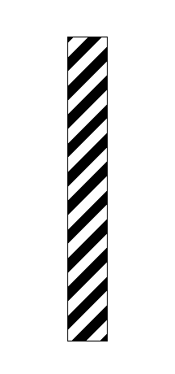

**==<font color='deeppink'>这里动的是margin-top的值</font>==**

## 7.5、光斑动画

```html
<!DOCTYPE html>
<html lang="en">
<head>
    <meta charset="UTF-8">
    <meta http-equiv="X-UA-Compatible" content="IE=edge">
    <meta name="viewport" content="width=device-width, initial-scale=1.0">
    <title>Document</title>
    <style type="text/css">
        * {
            margin: 0;
            padding: 0;
            box-sizing: border-box;
        }

        html,body {
            height: 100%;
            overflow: hidden;
            background-color: black;
            text-align: center;
        }

        h1 {
            /** 行内文字居中，整个inline-block块也就居中了，很好玩*/
            display: inline-block;
            color: rgba(128, 128, 128, .5);
            font: bold 100px "微软雅黑";
            background-image: linear-gradient(130deg, rgba(255,255,255,0) 100px,rgba(255,255,255,1) 180px,rgba(255,255,255,0) 260px);
            background-repeat: no-repeat;
            -webkit-background-clip: text;
        }

    </style>
</head>
<body>
    <h1>行天下道，救天下易</h1>
    <script>
        var light = document.querySelector('h1');
        var offset = -160;
        setInterval(function () {
            offset += 10;
            if (offset === 1000) {
                offset = -160;
            } 
            light.style.backgroundPositionX = offset + 'px';
        },24);

    </script>
</body>
</html>
```

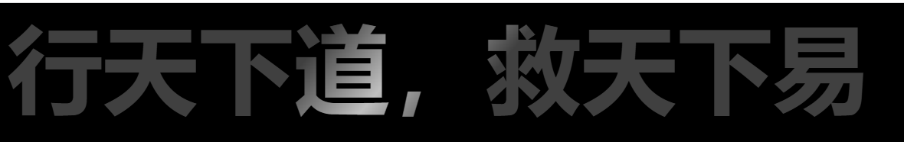

**==<font color='deepred'>这里动的是backgroud-position的值</font>==**


## 7.6、径向渐变

- radial-gradient(yellow,green,pink);

```css
        .test {
            position: absolute;
            right: 0;
            left: 0;
            margin: 30px auto;
            width: 200px;
            height: 200px;
            border: 1px solid black;
            /** 径向渐变*/
            background-image: radial-gradient(yellow,green,pink);
        }
```

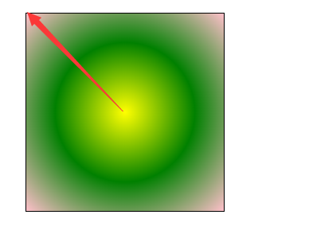

- **渐变占比，和线性渐变是一样的原理**

```css
            background-image: radial-gradient(yellow 20%,green 40%,pink 60%);
```


- **改变径向渐变的形状**

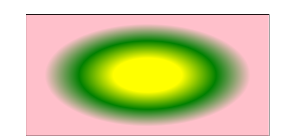

当容器变成一个矩形的时候，径向渐变也变成了椭圆，但其实我们可以指定径向渐变的形状的，如下所示：

```css
            background-image: radial-gradient(circle, yellow 20%,green 40%,pink 60%);
```


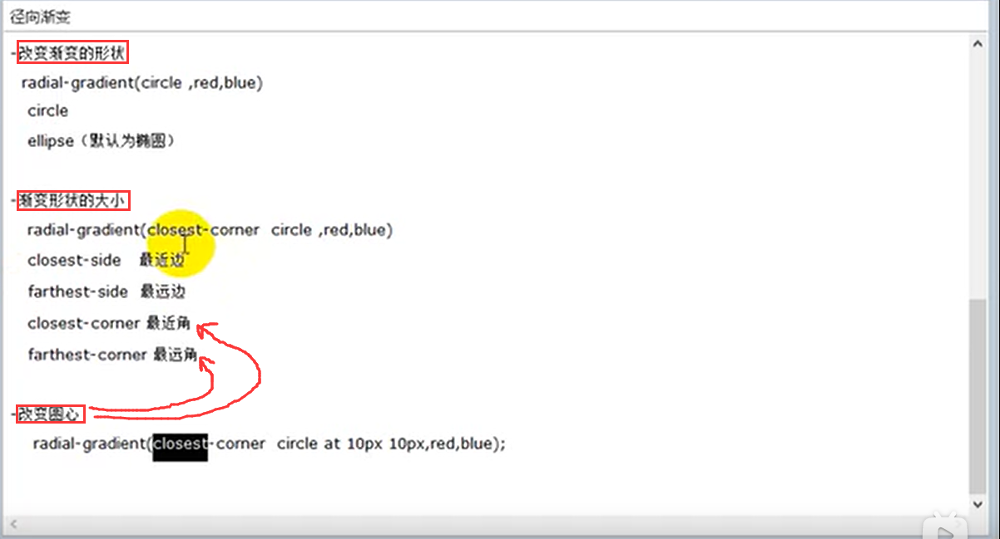

- **改变渐变形状的大小**

  - 最远边

  ```css
              background-image: radial-gradient(farthest-side circle, yellow,green 50%,pink);
  ```

  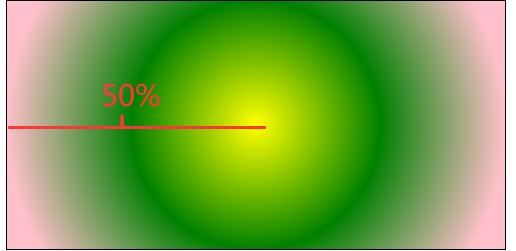

  - 最近边

  ```css
  background-image: radial-gradient(closest-side circle, yellow,green 50%,pink);
  ```

  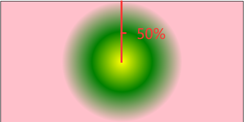

  - 最近角

  ```css
  background-image: radial-gradient(closest-corner circle at 20% 20%, yellow,green 50%,pink);
  ```

  

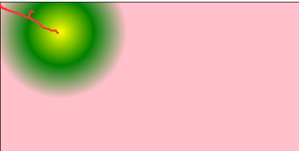


# 8、过渡属性和过渡周期

**==<font color='deepred'>C3中最重要的部分就是 过渡、2D/3D变形、动画、还有布局扩展了</font>==**

```css
        #test {
            position: absolute;
            top: 0;
            left: 0;
            right: 0;
            bottom: 0;
            margin: auto;
            width: 200px;
            height: 200px;
            border-radius: 50%;
            background-color: pink;
            text-align: center;
            font: bold 40px/200px "微软雅黑";

            /** 过渡属性 */
            transition: 2s;

        }

        #test:hover {
            font: bold 20px/100px "微软雅黑";
            width: 100px;
            height: 100px;
        }
```

**==<font color='red'>这是一个普通动画效果的展示，但是不是所有的属性都有动画效果的！就比如，display: block;变成display: none;就没有动画的效果了</font>==**


- 记住transition是一个简写的属性：

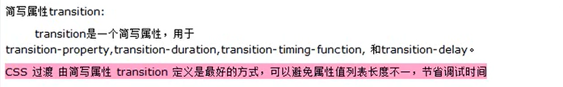


## 8.1、property & duration

- ***<font color='red'>transition-property属性可以指定一个或者多个过渡属性，默认是all</font>***

```css
            transition-property: width, height;
            transition-duration: 2s;
```


- ***<font color='red'>可以指定每一个过渡属性的过渡时间</font>***

```css
            /** 过渡属性 */
            transition-property: background-color, width, height;
            transition-duration: 5s, 2s, 2s;
```


- ***<font color='red'>当周期列表不能满足属性列表的时候，周期列表会进行复制的。</font>***

```css
            transition-property: background-color, width, height;
            transition-duration: 5s, 2s;
```

比如这样，那么会被复制成这样：

```css
            transition-property: background-color, width, height;
            transition-duration: 5s, 2s, 5s, 2s;
```


## 8.2、timing-function & delay

- ***<font color='red'>timing-function就是用来控制动画的速度的，默认是ease（贝塞尔曲线）先加速在减速</font>***

**==常用的一些属性值：==**

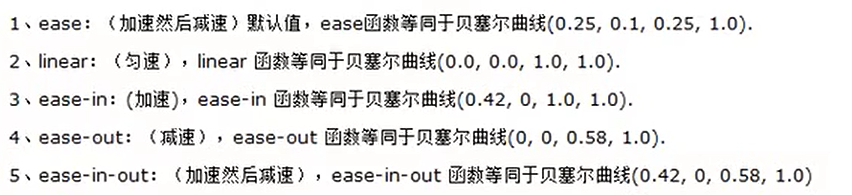

**==特殊的属性值==**

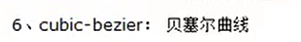

贝塞尔曲线在线生成的网站：https://cubic-bezier.com/#.17,.67,.83,.67


示例：
```css
            transition-property: width;
            transition-duration: 5s;
            transition-timing-function: cubic-bezier(.44,1.98,.52,-0.87);
```


步长函数：

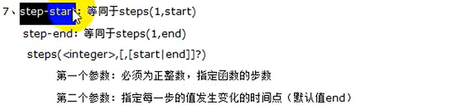


- step-start和step-end

```css
            transition-property: width;
            transition-duration: 5s;
            transition-timing-function: step-start;
```

一开始就变完了。


```css
            transition-property: width;
            transition-duration: 5s;
            transition-timing-function: step-end;
```

过了5s后，才瞬间变完。


```css
            transition-property: width;
            transition-duration: 5s;
            transition-timing-function: steps(5,start);
```


**==<font color='red'>这个东西的原理其实很简单的，就是把持续时间分成五段，每一段的开头处瞬间变一下而已；如果steps(5,end);这样写的话，就是在每一段的末尾变一下，所以就会产生机器人一样的一卡一卡的效果</font>==**


- ***<font color='red'>delay就是延迟几秒开始进行变化，没有什么好说的</font>***

## 8.3、当属性和列表长度不一样的时候

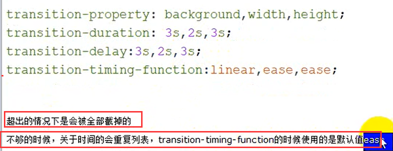


# CSS3flex布局

教程：https://www.bilibili.com/video/BV1N54y1i7dG?from=search&seid=17813754073632202728&spm_id_from=333.337.0.0&vd_source=365d13057e58bb6a007cdd5275785229


- **<font color='red'>使用flex布局之后就没有什么行内元素和块级元素的区分了，都是有大小的！</font>**


# 1、flex布局原理

- **==<font color='purple'>flex布局全称是flexible Box布局，就是弹性布局的意思，任何一个容器都可以指定为flex布局的！！！不论它是行内元素还是块级元素</font>==**

- **==<font color='red'>当我们为父盒子设定flex布局的时候，子元素的float、clear和vertical-aligin属性都将失效</font>==**

- **==<font color='blue'>设置了flex布局的盒子被称为 flex container，弹性盒子；里面的每一个项目被称为 flex item项</font>==**

- ***==通过设置父盒子的flex相关属性和子盒子的flex相关属性就可以完成flex的布局了==***


# 2、Container属性相关

**==<font color='red'>主要有六种属性：</font>==**

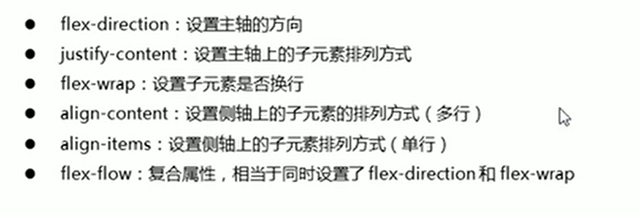

**六个里面主要是 align-content和flex-flow还不太熟悉**


## 2.1、flex-direction属性值

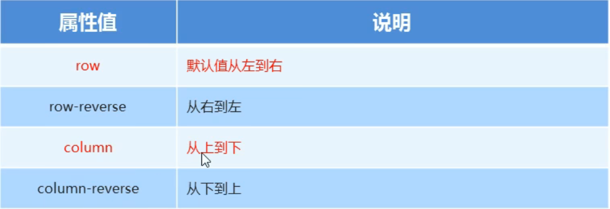

- **<font color='red'>这里最重要的还是row和column，另外两个真的没有必要。</font>**

## 2.2、justify-content属性

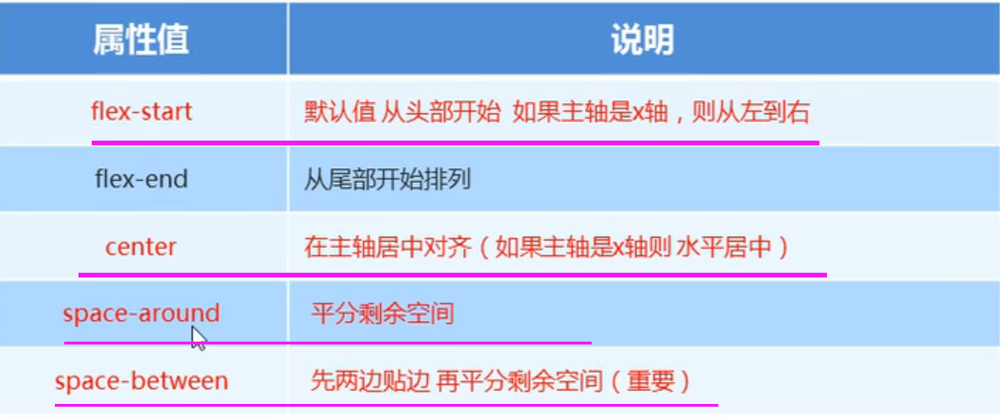

- **<font color='red'>注意space-around和space-between两者的区别，一个是直接平分剩余空间，一个是先贴边再平分。</font>**


## 2.3、flex-wrap属性

**<font color='purple'>flex布局有比较特殊的情况，就是当一行内盒子的总体宽度超过容器框框的宽度，那么，盒子们的宽度会被压缩的。</font>**

```css
        .container { 
            display: flex;
            width: 800px;
            height: 500px;
            background-color: pink;
            /** 默认主轴是x轴，也就是行*/
            /** 元素是按照主轴的位置进行排列的*/
            flex-direction: row;

        }

        .item:nth-child(1) {
            width: 300px;
            height: 50px;
            font: 10px/50px "微软雅黑";
            background-color: purple;
        }

        .item:nth-child(2) {
            width: 300px;
            height: 50px;
            font: 10px/50px "微软雅黑";
            background-color: red;
        }

        .item:nth-child(3) {
            width: 300px;
            color: white;
            height: 50px;
            font: 10px/50px "微软雅黑";
            background-color: black;
        }

```


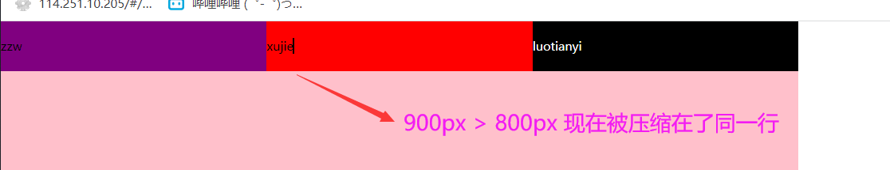


- **默认情况下，容器中的所有元素都排在一行内不进行换行，如果width超出了容器的width，那么item项的width会缩小**
- **可以通过flex-wrap: wrap;来进行换行操作。**


## 2.4、align-items属性

**==<font color='red'>注意，他只对单行的侧轴上的元素生效</font>==**


- **==<font color='red'>最后一个属性比较特殊，需要item项不设置高度才能生效，否则不生效</font>==**

## 2.5、align-content属性

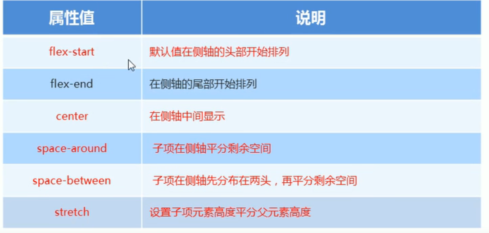


## 2.6、子项目属性

- flex：份数
- align-self（单行）
- order：主轴上子项排列的顺序。


## 2.7、案例

- **<font color='red'>flex布局，container的宽一定要确定，不能由子项的宽来决定的。。。</font>**

示例一：

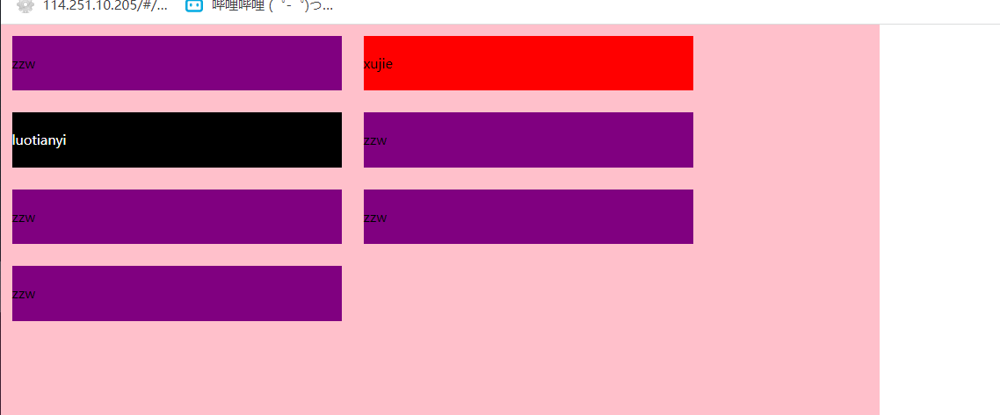

- **justify-content: flex-start;align-content:space-around;就行了，通过调整子项的百分比宽度，完成子项的居中**


示例二：

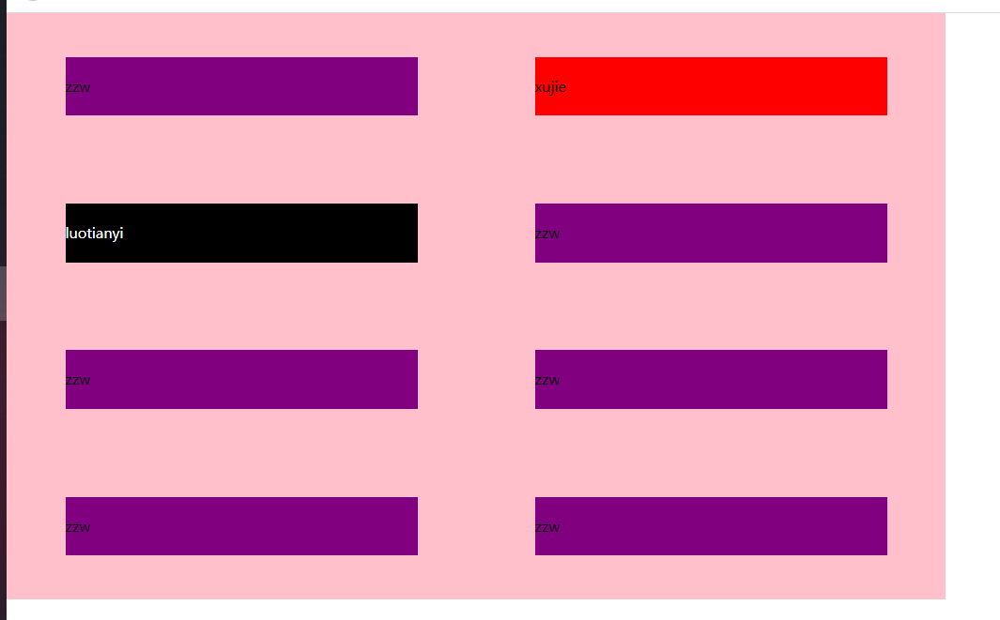

- 两个都space-around就行了。


# 六个案例学会响应式布局

教程：https://www.bilibili.com/video/BV1ov411k7sm/?spm_id_from=trigger_reload&vd_source=365d13057e58bb6a007cdd5275785229

# 1、媒体查询

**<font color='violet'>定义：为不同的屏幕设置不同的css样式，一般在移动端使用的频率高一些</font>**

```css
        /*这两个写了，.div1的height:75%才会生效*/
        html {
            height: 100%;
        }
        body {
            height: 100%;
        }

        .div1 {
            width: 50%;
            height: 75%;
        }

        @media screen and (min-device-width:200px) and (max-device-width:500px){
            .div1 {
                background-color: pink;
            }
        }

        @media screen and (min-device-width:501px) and (max-device-width:1024px){
            .div1 {
                background-color: deeppink;
            }
        }

        @media screen and (min-device-width:1025px) and (max-device-width:1920px){
            .div1 {
                background-color: violet;
            }
        }
    </style>
</head>
<body>
    <div class="div1">

    </div>

    
</body>
</html>
```

**==<font color='violet'>注意点1：媒体查询在h5页面伸缩的时候不会生效的</font>==**

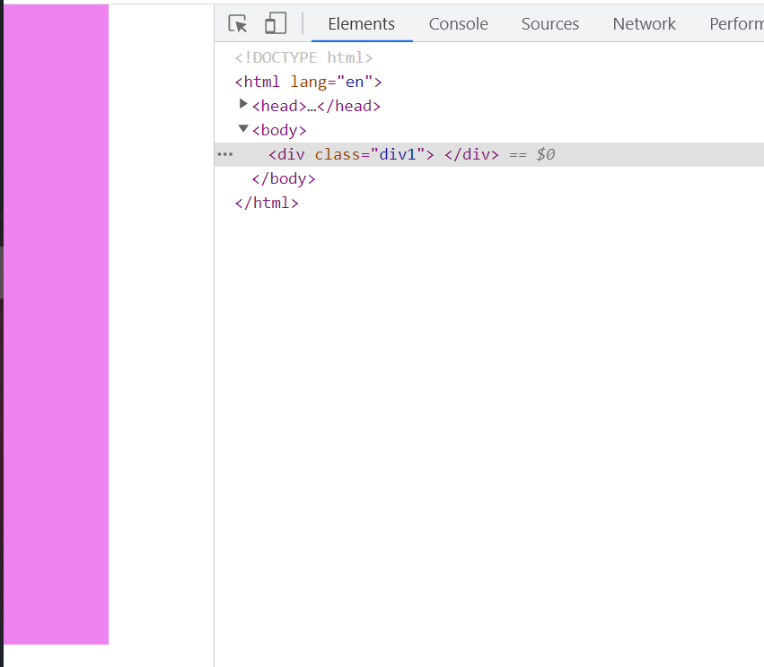


**<font color='violet'>注意点2：媒体查询在移动端页面会生效，可以通过chrome的responsive模式快速随意拉动窗口大小的</font>**

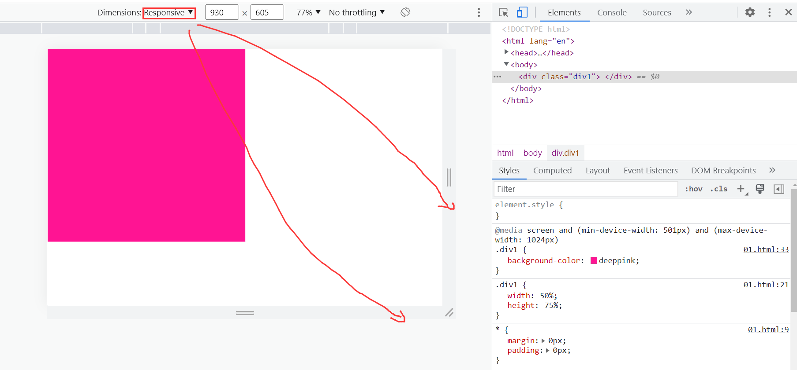


# 2、媒体查询常用参数

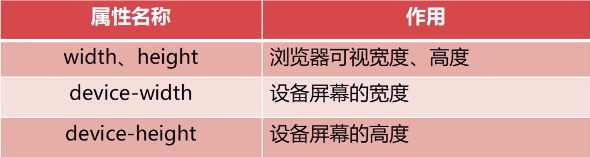

**==<font color='red'>原来使用min-width和min-height就可以设置h5宽度不同的时候样式也不同了，哈哈</font>==**


**<font color='red'>示例：屏幕大小不同块级元素换行</font>**

```css
        .div1 {
            width: 100%;
            height: 500px;
        }

        .div1 > div {
            float: left;
        }

        @media screen and (min-width:200px) and (max-width:300px){
            .div1 > div {
                width: 100%;
                height: 200px;
            }
            .div1 > div:nth-child(1) {
                background-color: red;
            }
            .div1 > div:nth-child(2) {
                background-color: green;
            }
            .div1 > div:nth-child(3) {
                background-color: blue;
            }
            
        }
        @media screen and (min-width:301px) and (max-width:400px){
            .div1 > div {
                width: 50%;
                height: 200px;
            }
            .div1 > div:nth-child(1) {
                background-color: red;
            }
            .div1 > div:nth-child(2) {
                background-color: green;
            }
            .div1 > div:nth-child(3) {
                background-color: blue;
            }
             
        }
        @media screen and (min-width:401px){
            .div1 > div {
                width: 33.3%;
                height: 200px;
            }
            .div1 > div:nth-child(1) {
                background-color: red;
            }
            .div1 > div:nth-child(2) {
                background-color: green;
            }
            .div1 > div:nth-child(3) {
                background-color: blue;
            }
             
        }
    </style>
</head>

<body>
    <div class="div1">
        <div></div>
        <div></div>
        <div></div>
    </div>
</body>
```

**<font color='violet'>核心就是一个父框框里面有三个子框框，然后当媒体查询的范围不同的时候，三个子框框的的width不一样就行了，哈哈</font>**

## 2.1、媒体查询引入方法一

```css
    <style media="(max-width:300px)">
        .div1>div {
            width: 100%;
        }
    </style>
    <style media="(min-width:301px) and (max-width:400px)">
        .div1>div {
            width: 50%;
        }
    </style>
    <style media="(min-width:401px)">
        .div1>div {
            width: 33.33%;
        }
    </style>
```

**==<font color='deeppink'>其实@media的那个后面的 screen是为了打印机这些东西使用的根本没有什么用，直接扔掉也没事的；然后这里可以通过style标签中的media属性进行不同屏幕样式的适配。</font>==**


## 2.2、媒体查询引入方式二

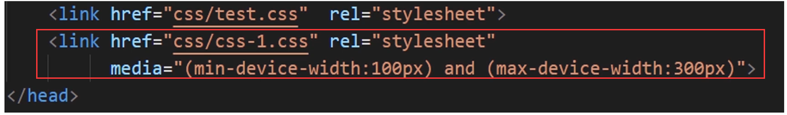

**==<font color='deepred'>就是在不同的屏幕引入不同的样式文件就行了</font>==**

# 3、flex设置伸缩比

- **<font color='deepred'>flex-basis属性：是Item的基准宽度，可以设置px值也可以设置%，设置后会覆盖到item项目原有的宽度，如下所示</font>**

```css
        #wrapper {
            width: 500px;
            height: 600px;
            border: 1px solid black;
            display: flex;
        }

        #wrapper > div:nth-child(1) {
            width: 100px;
            height: 200px;
            background-color: deeppink;
            flex-basis: 20px;
        }

        #wrapper > div:nth-child(2) {
            width: 200px;
            height: 200px;
            background-color: violet;
            flex-basis: 25px;
        }
    </style>
</head>
<body>
    <div id="wrapper">
        <div></div>
        <div></div>
    </div>
</body>
</html>
```

结果，原来的宽度被覆盖掉了

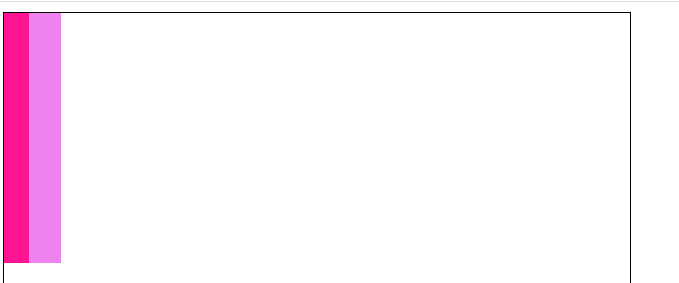


- **<font color='deeppink'>flex-grow属性，这个属性是用来决定当所有盒子的宽度加一起不够container的宽度的时候，剩下的宽度该怎么分配的问题</font>**

```css
        #wrapper {
            width: 500px;
            height: 600px;
            border: 1px solid black;
            display: flex;
            flex-wrap: wrap;
            justify-content: flex-start;
        }

        #wrapper > div:nth-child(1) {
            height: 200px;
            background-color: deeppink;
            flex-basis: 100px;
            flex-grow: 1;
        }

        #wrapper > div:nth-child(2) {
            height: 200px;
            background-color: violet;
            flex-basis: 200px;
            flex-grow: 4;
        }
```

**==<font color='deepred'>这里直接把计算的结果说明一下，就是说现在盒子一的宽度是100px，而盒子二的宽度是200px对吧，所以总宽度还有200px是剩余的，而这200px通过flex-grow属性一共被分成了5分，每一份是40px，所以盒子一的宽度被扩充为100 + 40\=140px；而盒子二的宽度被扩充为200 \+ 160px \= 360px了捏，哈哈</font>==**


公式 500px - 100px -200px = 200px多余的

200px/5 = 40px 多余的被分成5等分，每一份是40px然后和盒子一扩充40px，盒子二扩充了160px


- **<font color='deeppink'>flex-shrink属性，这个属性是当子item项目的总宽度超过container容器的宽度时候，多出来的部分该怎么分配裁剪的问题，和上面的分配扩充是一个道理</font>**

- flex属性，是上面三个属性的简写：**<font color='deepred'>注意三者的顺序是不能调整的！</font>**

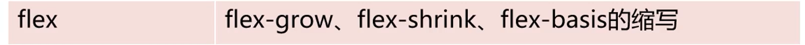


## 3.1、flex的特殊写法

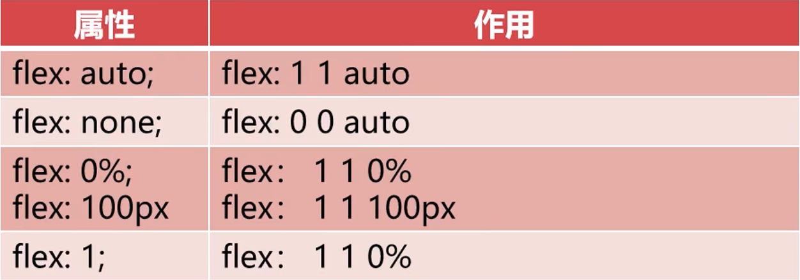


- **当给flex设置 1 1 300px的时候，表明它是自动伸缩的，所以最后一个值就不生效了，当flex: 0 0 auto的时候，item的宽度就是自己设定的width值了，哈哈**


### 3.1.1、示例一：输入框布局

```html
<!DOCTYPE html>
<html lang="en">
<head>
    <meta charset="UTF-8">
    <meta http-equiv="X-UA-Compatible" content="IE=edge">
    <meta name="viewport" content="width=device-width, initial-scale=1.0">
    <title>Document</title>
    <style type="text/css">
        * {
            margin: 0;
            padding: 0;
            box-sizing: border-box;
        }

        .container {
            width: 350px;
            display: flex;
            border: 1px solid #dcdcdc
        }

        .container label {

            flex:1;
            text-align: center;
            padding: 10px;
            background-color: #dcdcdc;
        }

        .container>label:nth-child(3) {
            flex: 0 0 10%;
        }

        .container input {
            flex: 3;
            border: none;
            outline: none;
            padding: 10px;
        }


    </style>
</head>
<body>
    <div class="container">
        <label>姓名</label>
        <input type="text">
        <label>GO</label>
    </div>
</body>
</html>
```

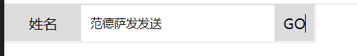

**==<font color='deepred'>除了flex的自适应性以外，还有比较重要的两点：1通过外部框框包裹input使得输入框好像变大，2通过border: none把输入框的外框框去掉，然后是通过outline: none把这个鼠标聚焦时候的外边框去掉！真的挺有用的，嘻嘻</font>==**

### 3.1.2、示例二：长表单布局

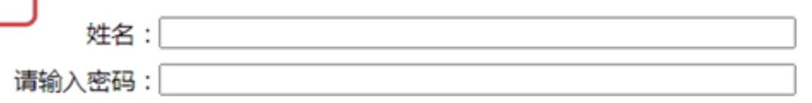


**==<font color='deepred'>flex布局的经典场景，方案一般就是外面是一个大的框框，然后是每一行一个小的框框，小框框里面采用flex进行布局，我们来实现一下</font>==**


基本雏形：
```html
<!DOCTYPE html>
<html lang="en">
<head>
    <meta charset="UTF-8">
    <meta http-equiv="X-UA-Compatible" content="IE=edge">
    <meta name="viewport" content="width=device-width, initial-scale=1.0">
    <title>Document</title>
    <style type="text/css">
        * {
            margin: 0;
            padding: 0;
            box-sizing: border-box;
        }


        #form div {
            display: flex;
        }

        #form div label {
            text-align: right;
            flex: 0 0 100px;
        }


    </style>
</head>
<body>
    <div id="form">
        <div>
            <label for="">姓名:</label>
            <input type="text">
        </div>
        <div>
            <label for="">请输入密码:</label>
            <input type="text">
        </div>
    </div>
</body>
</html>
```

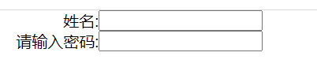

**==那怎么样才能把上面和下面一样分离开呢==**

**<font color='deeppink'>方案一：</font>**

直接margin-top: 10px；不过太捞了

**<font color='deeppink'>方案二：</font>**

```css
        #form div {
            display: flex;
            height: 50px;
            align-items: flex-start;
        }
```

**==<font color='deepred'>设置每一行的高度，然后设置align-items: flex-start这个做法就很有意思了</font>==**


**<font color='deeppink'>方案三：</font>**

```css
        #form {
            display: flex;
            flex-direction: column;
        }

        #form div {
            display: flex;
            align-items: flex-start;
            flex: 0 0 50px;
        }

        #form div label {
            text-align: right;
            flex: 0 0 100px;
        }
```

**==<font color='deeppink'>就是用flex的基准值把height给它换掉就行了</font>==**


# 4、rem的使用方法

**<font color='deepred'>定义：rem是相对于根元素字体大小的单位</font>**

- 最最原始的rem使用

```css
        /*根元素字体大小*/
        html,body {
            font-size: 16px;
        }
        div {
            font-size: 1rem;
        }

    </style>
</head>
<body>
    <div>
        许洁，许我一劫
    </div>
</body>
```

**==<font color='deeppink'>通常情况下，把根元素字体的大小设置为10px，这样子方便我们进行换算；使用了rem后不仅仅在字体大小上面，其他宽度、高度、等等单位都是可以使用rem的捏</font>==**


## 4.1、案例

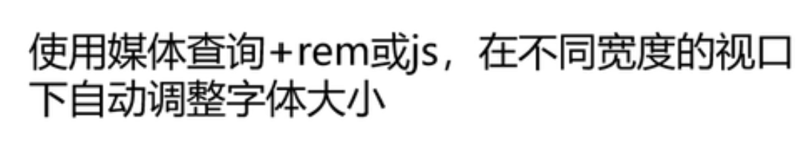

***额，这里的 ‘或’ 字应该改为和***

```js
<script>
    const fn = () => {
        /**1、先获取屏幕的宽度*/
        let w = document.documentElement.clientWidth;
        /**2、计算出合适于该宽度的根字体的大小*/
        let rootSize = 20*(w/320) > 40? 40 + 'px' : (20*(w/320)) + 'px';

        document.documentElement.style.fontSize = rootSize;
    }

    window.addEventListener('load',fn);
    window.addEventListener('resize',fn);

</script>
<style type="text/css">
    * {
        margin: 0;
        padding: 0;
        box-sizing: border-box;
    }

    /*根元素字体大小*/
    /* html,body {
        font-size: 16px;
    } */
    div {
        font-size: 1rem;
    }
</style>
```

**==<font color='deeppink'>这个案例要求我们做的就是改变根字体的大小，从中我们可以学到很多的东西：1、获取屏幕宽度=>document.documentElement.clinetWidth，2、设置基准大小为20然后根据宽度/320的这个比例来调整根字体的大小；3、使用load事件设置初始大小</font>==**


# 5、自适应布局

- 不同的设备使用不同的页面

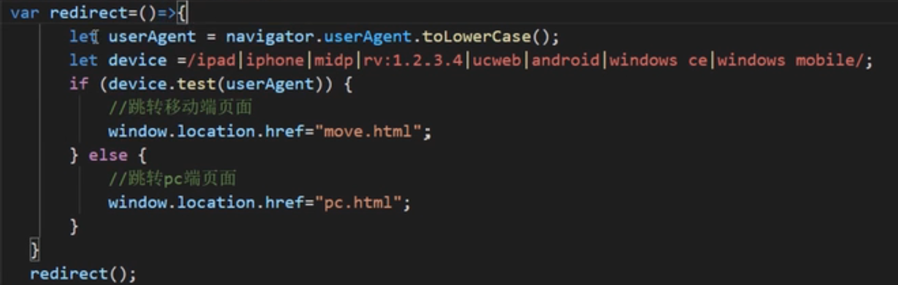

```js
    <script>
        let redirect = () => {
            /**1、获取用户设备的名称*/
            let userAgent = navigator.userAgent.toLowerCase();
            console.log(userAgent);
            /**2、设备枚举*/
            let device = /ipaid|iphone|window mobile/;
            if(device.test(userAgent)) {
                /**移动端进入page1的页面*/
                window.location.href = "page1.html";
            }else {
                /**pc端进入page2的页面*/
                window.location.href = "page2.html";
            }
        }
        redirect();
    </script>
```

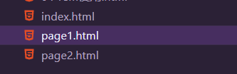


- **<font color='deepred'>三列布局，中间缩小放大，两个边不变的写法：</font>**

**==<font color='red'>就是大框框使用flex布局，然后两边两个的基准值设定为200px定死，中间的flex: 1 1 auto就行了。</font>==**

# 6、响应式布局

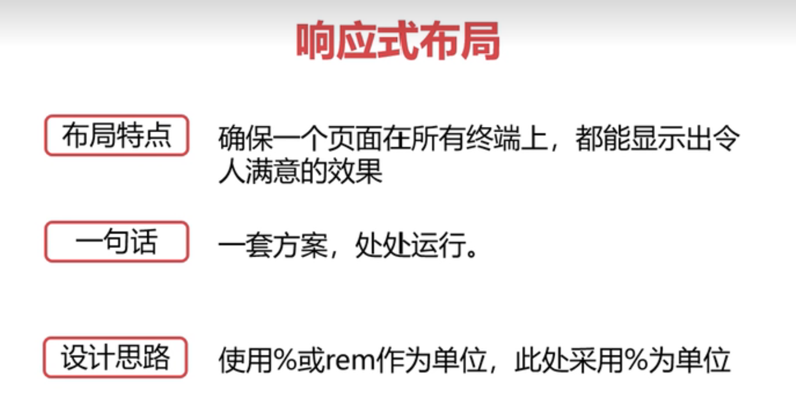


html结构：
```html
    <link rel="stylesheet" href="./06css/small.css" media="(min-device-width:200px) and (max-device-width:480px)">
    <link rel="stylesheet" href="./06css/big.css" media="(min-device-width:980px)">
</head>
<body>
    <div id="wrapper">
        <div class="top"></div>
        <div class="content">
            <div>
                <li>分类一</li>
                <li>分类二</li>
                <li>分类三</li>
                <li>分类四</li>
                <li>分类五</li>
                <li>分类六</li>
                <li>分类七</li>
                <li>分类八</li>
            </div>
            <div>
                <li>图片1</li>
                <li>图片2</li>
                <li>图片3</li>
                <li>图片4</li>
                <li>图片5</li>
                <li>图片6</li>
                <li>图片7</li>
                <li>图片8</li>
                <li>图片9</li>
                <li>图片10</li>
            </div>
        </div>
    </div>
```

big.css

```css
* {
    margin: 0;
    padding: 0;
    box-sizing: border-box;
}

#wrapper {
    display: flex;
    flex-direction: column;
    width: 80%;
    margin: 0 auto;
}

.top {
    height: 50px;
    background-color: yellow;
}

.content {
    display: flex;
}

.content div:first-child {
    flex: 0 0 20%;
    display: flex;
    list-style-type: none;
    flex-wrap: wrap;
    border: 2px solid white; 
    background-color: gray;
}

.content div:first-child li {
    flex: 0 0 100%;
    height: 40px;
    font: bold 20px/40px '微软雅黑';
    padding-left: 10px;
    border-bottom: 2px solid white;

}


.content div:nth-child(2) {
    flex: 0 0 80%;
    display: flex;
    flex-wrap: wrap;
}

.content div:nth-child(2) li {
    flex: 1 1 200px;
    list-style-type: none;
    border: 2px solid white; 
    background-color: yellow;
    text-align: center;
}
```

small.css

```css
* {
    margin: 0;
    padding: 0;
    box-sizing: border-box;
}

#wrapper {
    display: flex;
    flex-direction: column;
    width: 100%;
}

.top {
    height: 50px;
    background-color: yellow;
}

.content {
    display: flex;
    flex-wrap: wrap;
}

.content div:first-child {
    flex: 0 0 100%;
    display: flex;
    list-style-type: none;
    flex-wrap: wrap;
    border: 2px solid white; 
    background-color: gray;
    align-content: flex-start;
}

.content div:first-child li {
    flex: 0 0 25%;
    height: 40px;
    font: bold 20px/40px '微软雅黑';
    padding-left: 10px;
    border-bottom: 2px solid white;

}


.content div:nth-child(2) {
    flex: 0 0 100%;
    display: flex;
    flex-wrap: wrap;
}

.content div:nth-child(2) li {
    flex: 0 0 50%;
    list-style-type: none;
    border: 2px solid white; 
    background-color: yellow;
    text-align: center;
    height: 80px;
}


```

**==<font color='deepred'>其实主轴不用特别改变的，最常用的还是基准值不伸缩 + 换行的操作，哈哈</font>==**


# 7、rem弹性布局

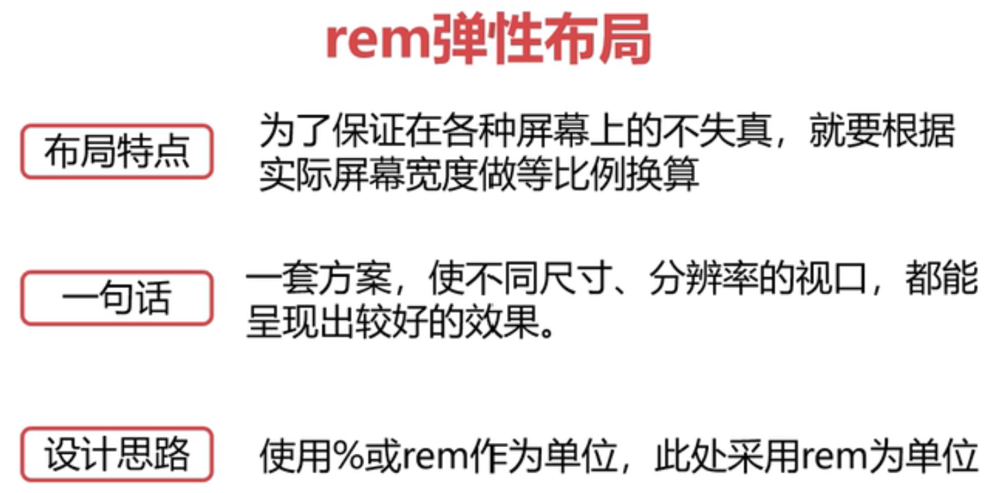


就是用rem做一个示例，不难

==固定的一般用rem，不然用百分比比较好==


