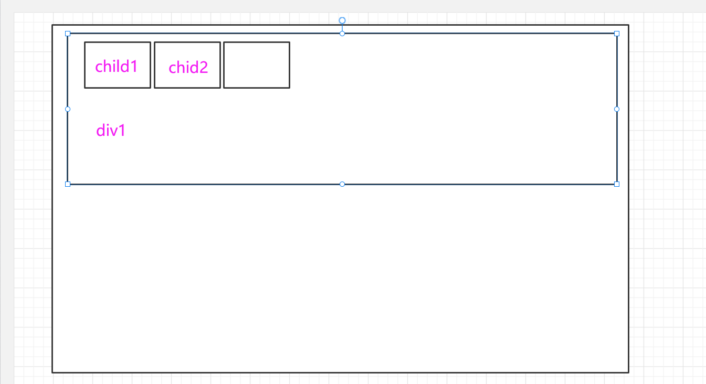
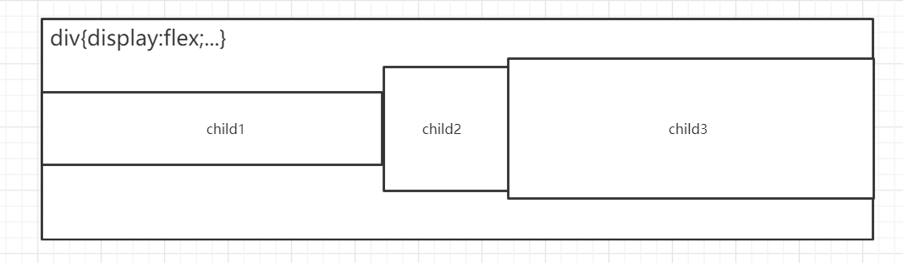
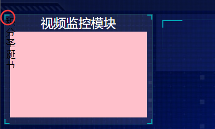
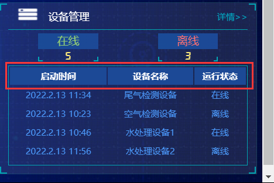
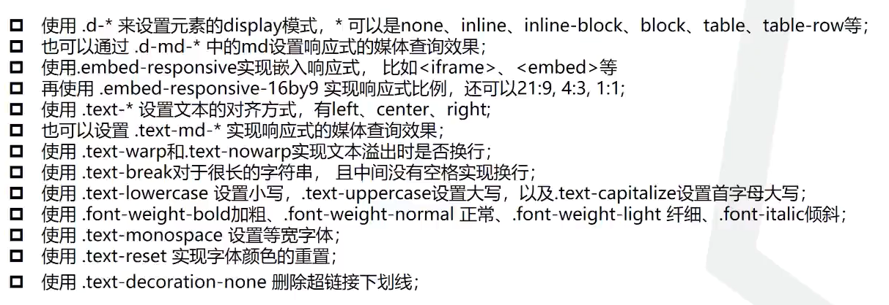

Echart数据可视化静态项目教程

# 1、html之道

## 1.1、html插件扩展

- 什么是less?
  - less的主要作用就是方便查看css代码的结构，因为它的结构可以写成和div嵌套一样的结构，这样就可以快速确定一个div元素对应的css样式了。
  - 插件：
  
- 什么是rem?
  - 我们已知px是固定值像素单位，em是相对于当前父级的字体大小定义的。而rem是根元素的字体大小定义的，相对于前两位，rem是比较好用和使用最多的单位。
  - 就是一个像素单位
  - 插件：
  - 可以通过这个插件设置：根rem，也就是是1rem是多少px
  - <font color="red">以rem为结尾的像素量可以根据图像的缩放而等比例缩放！(html代码中要flexible.js脚本)牛逼！</font>
  
  


## 1.2、html默认布局之道（根）

人事人事，没有人就没有事，为什么html的默认布局是这样的呢？因为最正常的想法就是一个网页的内容用一个一个的小框框划分起来，然后每一个小框框中写入不同的内容，对吧，**<font color='red'>所以页面的内容一定是基于一个有一个小框框的</font>**！

所以每一个标签元素都是一个小框框，至于为什么元素的名字不同，那是给人看的，告诉人这个框框里面应该放些什么东西!

**<font color='red'>那么默认的布局一定是一行一行的喽，（因为这是最自然的，最简单的布局了...）</font>**

如图：


**<font color='red'>至于如何定位每一个元素的位置，最直接的方法就是 相对于父框框 定位，就是这么自然...</font>**

还有一个问题，那就是每一个框框的长和宽怎么来确定呢？你想一下，如果每一个框框都需要设置它的width和height那人就真的累死了...**<font color='red'>所以默认一个框框的长和宽都是0px,然后它的大小由内容（文字、子框框）来确定就行了，这样我们只要设置最内部的框框的长和宽就行喽！</font>>**

在默认的布局模式下，**一个框框中填入文字后，它的默认宽度就是父框框的宽度，默认高就是字体的高度**


在上面的工作都完成后，还要细节化，最基础的细节化就是增加小间隔：<font color='red'>**这时候才用到margin、padding。**</font>


- 最基础的属性：、
  - 设置宽高：width，height
  - 设置位置：top，right，left，bottom
  - 设置margin
  - 设置padding
  - 设置border


## 1.3、简单的小问题

为什么这里right不起作用呢?


我们看一这个元素


阴影部分才是整个元素，他都已经占满了整个父元素的长度了，试问怎么移动到右边？


加上position后，这个元素就变成这样一个小框框了，就可以移动到右边了。

- **<font color='red'>属性：Position:adsolute，这涉及到布局的知识了。</font>**

- **<font color='red'>属性：Line-height:75，就是行高，就是75（看上面）同时文字一定是居中 的...</font>**


## 1.4、flex改变默认布局

默认布局毕竟是最简单的，所以一定会出现更复杂的布局模式。

flex布局就是其中一种常用的布局：就是把div1父框框中的布局模式改成如下的形式



- 在一个元素中写入：<font color='red'>**display:flex 就可以使得该元素中的默认布局模式为flex**</font>

代码：

```less
.div1 {
    display: flex;
    .child { 
        flex:1;   //指上面三个元素的宽都占1份，所以这样写的话，三个子元素的宽度都是一样的
    }
```

如果想要让这三个子元素宽所占的份数不一样，可以指定任意子元素的份数：

```less
.div1 {
    display: flex;
    .child { 
        flex:3;   
    }
    .child:nth-child(2) {  //指定第二个child的宽所占的份数是5，那么它的真实宽度就是 div1的宽度*5/11;
        flex:5
    }
```

### 1.4.1、display属性值参考

https://www.w3school.com.cn/cssref/pr_class_display.asp

要点：

| 值      | 描述                                                         |
| :------ | :----------------------------------------------------------- |
| none    | 此元素不会被显示。                                           |
| block   | 此元素将显示为块级元素，此元素前后会带有<font color='red'>换行符</font>。（块级元素的默认宽度就是父宽） |
| inline  | 默认。此元素会被显示为内联元素，元素前后没有换行符。         |
| inherit | 规定应该从父元素继承 display 属性的值。                      |

### 1.4.2、flex布局配套属性

#### part1、align-items属性;

w3cschool:https://www.w3school.com.cn/cssref/pr_align-items.asp

**==一个小框框的内部布局模式是flex，才能应用这个属性。==**

```css
div {
  display: flex;
  align-items: center;
}
```

就是让所有的子元素呈现如下的效果。**<font color='red'>（flex布局内的竖直居中）</font>**




##### part1.1、属性值参考：

w3cshool代码测试：https://www.w3school.com.cn/tiy/t.asp?f=cssref_align-items


| 值         | 描述                                                         |
| :--------- | :----------------------------------------------------------- |
| stretch    | 默认。项目被拉伸以适合容器。**（竖直方向上的）**             |
| center     | 项目位于容器的中央。**（竖直方向上的）**                     |
| flex-start | 项目位于容器的开头。**（竖直方向上的）**                     |
| flex-end   | 项目位于容器的末端。**（竖直方向上的）**                     |
| baseline   | 项目被定位到容器的基线。                                     |
| initial    | 将此属性设置为其默认值。参阅 [initial](https://www.w3school.com.cn/cssref/css_initial.asp)。 |
| inherit    | 从其父元素继承此属性。参阅 [inherit](https://www.w3school.com.cn/cssref/css_inherit.asp)。 |


#### part2、justify-content属性：

w3cshool:https://www.w3school.com.cn/cssref/pr_justify-content.asp

**==一个小框框的内部布局模式是flex，才能应用这个属性。==**

```css
div {
  display: flex;
  justify-content: center;
}
```

就是让flex布局内的子元素呈现如下的效果：**<font color='red'>（flex布局内的所有子元素集中在一起，然后再居中）</font>**


##### part2.1、属性值参考：

代码测试：https://www.w3school.com.cn/tiy/t.asp?f=cssref_justify-content_1

| 值            | 描述                                                         |
| :------------ | :----------------------------------------------------------- |
| flex-start    | 默认值。项目位于容器的开头。**（水平方向上的）**             |
| flex-end      | 项目位于容器的结尾。**（水平方向上的）**                     |
| center        | 项目位于容器中央。**（水平方向上的）**                       |
| space-between | 项目在行与行之间留有间隔。**（水平方向上的）**               |
| space-around  | 项目在行之前、行之间和行之后留有空间。**（水平方向上的）**   |
| initial       | 将此属性设置为其默认值。参阅 [initial](https://www.w3school.com.cn/cssref/css_initial.asp)。 |
| inherit       | 从其父元素继承此属性。参阅 [inherit](https://www.w3school.com.cn/cssref/css_inherit.asp)。 |

#### part3、flex-direction属性;

https://www.w3school.com.cn/cssref/pr_flex-direction.asp

```css
div {
  display: flex;
  flex-direction: row-reverse; 
}
```


##### part3.1、属性值参考

代码测试：https://www.w3school.com.cn/tiy/t.asp?f=cssref_flex-direction

| 值             | 描述                                                         |
| :------------- | :----------------------------------------------------------- |
| row            | 默认值。作为一行，水平地显示弹性项目。                       |
| row-reverse    | 等同行，但方向相反。                                         |
| column         | 作为列，垂直地显示弹性项目。                                 |
| column-reverse | 等同列，但方向相反。                                         |
| initial        | 将此属性设置为其默认值。参阅 [initial](https://www.w3school.com.cn/cssref/css_initial.asp)。 |
| inherit        | 从其父元素继承此属性。参阅 [inherit](https://www.w3school.com.cn/cssref/css_inherit.asp)。 |


#### part4：应用技巧

flex的居正中心：

```css
.div1 {
    align-items:center;
    justify-content:center;
}
```


## 1.5、子绝父相

如图：


- 就是如果一个父元素的有padding，然后默认的子元素布局就会是这样的，现在我想把这个子元素移动到如下图所示的位置该怎么办呢？


- 很简单，只要把子元素的定位模式改成绝对定位就行了，但同时父元素的定位模式一定要改成相对定位，不然子元素的定位锚点就会变成body了...


代码：

```less
.div {
    position:relative;  //父相对
    .child {
        position:absolute;  //子绝对
        top:0rem;
        left:0rem;
        width:75px;
        height:65px;
    }
}
```


### 1.5.1、position属性

#### part1：属性值参考

w3cshool属性参考：https://www.w3school.com.cn/cssref/pr_class_position.asp

| 值       | 描述                                                         |
| :------- | :----------------------------------------------------------- |
| absolute | 生成绝对定位的元素，**<font color='red'>相对第一个父元素进行绝对定位。</font>**元素的位置通过 "left", "top", "right" 以及 "bottom" 属性进行规定。 |
| fixed    | 生成绝对定位的元素，**<font color='red'>相对于浏览器窗口进行定位</font>**。元素的位置通过 "left", "top", "right" 以及 "bottom" 属性进行规定。 |
| relative | 生成相对定位的元素，**<font color='red'>相对于其正常位置（也就是默认布局位置）进行定位</font>**。因此，"left:20" 会向元素的 LEFT 位置添加 20 像素。 |
| static   | **默认值**。没有定位，元素出现在正常的流中（忽略 top, bottom, left, right 或者 z-index 声明）。 |
| inherit  | 规定应该从父元素继承 position 属性的值。                     |

#### part2：position使用

==**子绝父相详尽说明：https://www.jianshu.com/p/ee4909360904**====


##### part2.1：为什么有position属性

**==<font color='red'>因为我们知道文档流是有默认的布局位置的，而我们想要改变这些位置，那既然要改变一个框框的位置，就要说明这个框框要相对于谁来定位对吧，所以position属性就出现了，它规定了一个元素相对于谁来进行定位。</font>==**


##### part2.2：position属性值

- 1、position:static; 

  这是个默认的值，也就是不设置position属性的时候它的值就是static。

- 2、position:relative;

  **<font color='purple'>表示该框框基于默认文档流的位置进行定位，就是在原来默认的基础上，改变位置。</font>**

- 3、position:fixed;

  这表明当前框框相对于浏览器窗口进行定位，老实说基于浏览器窗口进行定位是最简单的，可是一个元素里面会嵌套很多的子元素呀，然后才会想到基于父框框的位置进行定位。

- 4、position:absolute;***（子绝父相）***

  **<font color='purple'>这个说明当前框框基于第一个postion值为relative的父框框进行定位，这也就是子绝父相的由来，为什么会这么绕呢？</font>**估计是设计源码的时候默认的文档流的父框框不能支持absolute定位，所以得先让它变为relative的，然后再relative的源码里面写上它可以支持子元素进行absolute...就是这么回事..

  **<font color='red'>如果没有父框框设置了position:relative那么框框就会相对于浏览器进行定位。</font>**


##### part2.3：top,left,right,bottom

**==<font color='red'>确定了框框相对于谁进行定位后，那总得有值设置框框具体的偏移像素是多少吧，所以这四个属性就出现了，也就是说这4个属性是服务与position属性的，所以一个框框连postion属性都没有设置，设置这4个属性又有什么用呢？</font>==**


### 1.5.2、定位示例：


- 源码：

  通常把一个个框框按一行排列都会想到 flex布局，不过像这种情况下面的源码就足以解决了，不用为文字添加div框框，浪费dom数的加载资源。

  ```html
  <div class="remember"><input type="checkbox" />记住我的登录信息</div>
  ```

- 如果我想把这个框框往下调整一点，该怎么办呢?
  - **<font color='red'>方法一：通常会想到，margin-top或者padding-top来挤挤，不过其实用定位就行了。</font>**
  - **<font color='red'>方法二：子绝父相，把框框的父元素设置为相对定位，然后把自己这个元素设置为绝对定位，然后使用top就行了</font>**
  - **<font color='red'>方法三：直接使用相对定位，即直接给框框加上 position:relative; 相对于其原本的正常位置进行定位，然后使用top就行了</font>**


### 1.5.3、父元素撑不开

#### part1：问题

**正常情况：**

```html
<body>
    <div>
        <div>你好呀</div>
    </div>
    
</body>
```

- 像上面的这段代码，内层的div就会把外层的div给撑开来。

  


**子绝父相：**


- **<font color='red'>因为子元素在子绝父相的时候是相对于父框框的位置进行定位的，所以它不会影响父框框的高度，也就不能撑开父框框了。这时候父框框的高度就要自己设置好</font>**

#### part2：产生原因

==这属于position定位带来的影响：因为默认的布局流中，父元素就是被子元素撑开的，所以不用设置父元素的height它也会有高度，而使用position定位后默认布局流就失效了，这个影响通过**<font color='red'>设置宽和高就能解决</font>**了！==


#### part3：解决办法

**这个问题的解决办法很简单：既然你撑不开，那我就自己来设置就行了（无咎）**


### 1.5.4、应用技巧

**子绝父相的居正中心定位技巧：**

```css
.div1 {
                //@?水平居中和垂直居中的写法
            top: 50%;
            left: 50%;
            transform: translate(-50%, -50%);
}

```

**默认布局流下的居中**

```css
margin-left:auto;
margin-right:auto;
```


## 1.6：伪元素，伪类


**<font color='red'>伪元素就是假的dom元素，再被浏览器解析的时候不会有dom结构出现，一般用来设置特殊样式</font>**



这是css中的伪元素，语法：

```css
selector::pseudo-element {  //selectot选择器可以是标签选择器，类选择器，id选择器还可以是后代选择器。。。
  property: value;
}
```

所以less语法中会有：**&::before {...}的写法，这里的&果然就是引用**

### 1.6.1、::before & ::after

作用：<font color='red'>**::before 伪元素可用于在元素内容之前插入一些内容。after正好相反**</font>

代码：

```less

div1 {
    &::before {
        content: ""  //使用该伪元素这个属性必须加上，不然伪元素不会有任何显示的...这里伪元素的内容是空字符串，其实也可以是其他字符的。
       	//其他属性就和其他的元素是一样的，设置一下绝对位置，边框就行了
        
    }
}

```


### 1.6.2、伪元素详解：

https://www.w3school.com.cn/css/css_pseudo_elements.asp

所有 CSS 伪元素

| 选择器                                                       | 例子            | 例子描述                                                     |
| :----------------------------------------------------------- | :-------------- | :----------------------------------------------------------- |
| [::after](https://www.w3school.com.cn/cssref/selector_after.asp) | p::after        | 在每个 <p> 元素之后插入内容。                                |
| [::before](https://www.w3school.com.cn/cssref/selector_before.asp) | p::before       | 在每个 <p> 元素之前插入内容。                                |
| [::first-letter](https://www.w3school.com.cn/cssref/selector_first-letter.asp) | p::first-letter | 选择每个 <p> 元素的首字母。**（只适用于块级元素，display:block）** |
| [::first-line](https://www.w3school.com.cn/cssref/selector_first-line.asp) | p::first-line   | 选择每个 <p> 元素的首行。**（只适用于块级元素，display:block）** |
| [::selection](https://www.w3school.com.cn/cssref/selector_selection.asp) | p::selection    | 选择用户选择的元素部分**（就是ctrl+a的那种选择）**。         |


### 1.6.3、伪类：

**==<font color='red'>伪类就是特殊状态下的元素：就比如说一个元素获取了焦点，被单击，鼠标悬浮其上。。。</font>==**

#### part1、a标签的伪类：

就是a标签的4种基础状态下的样式：**（并不说a标签只有这4种伪类！而且这4中也能应用于其他标签的！）**

```css
a:link {
  color: red; /*未被访问时候的样式*/
}

/* 已经被访问过时候的样式：只要被点击过一次，无论刷新多少次都是这样 */
a:visited {
  color: green;
}

/* 鼠标悬浮其上时候的样式 */
a:hover {
  color: hotpink;
}

/* 鼠标点击，但未弹起时候的状态 */
a:active {
  color: blue;
}
```

tips:<p><b>注释：</b>在 CSS 定义中，a:hover 必须位于 a:link 和 a:visited 之后才能生效。</p>

<p><b>注释：</b>在 CSS 定义中，a:active 必须位于 a:hover 之后才能生效。</p>

#### part2、所有的伪类参考：

w3cschool:https://www.w3school.com.cn/css/css_pseudo_classes.asp

| 选择器                                                       | 例子                                       | 例子描述                                                     |
| :----------------------------------------------------------- | :----------------------------------------- | :----------------------------------------------------------- |
| [:active](https://www.w3school.com.cn/cssref/selector_active.asp) | a:active                                   | 选择活动的链接。                                             |
| [:checked](https://www.w3school.com.cn/cssref/selector_checked.asp) | **<font color='red'>input:checked</font>** | 选择每个被选中的 <input> 元素。                              |
| [:disabled](https://www.w3school.com.cn/cssref/selector_disabled.asp) | input:disabled                             | 选择每个被禁用的 <input> 元素。                              |
| [:empty](https://www.w3school.com.cn/cssref/selector_empty.asp) | p:empty                                    | 选择没有子元素的每个 <p> 元素。                              |
| [:enabled](https://www.w3school.com.cn/cssref/selector_enabled.asp) | input:enabled                              | 选择每个已启用的 <input> 元素。                              |
| [:first-child](https://www.w3school.com.cn/cssref/selector_first-child.asp) | p:first-child                              | 选择作为其父的首个子元素的每个 <p> 元素。                    |
| [:first-of-type](https://www.w3school.com.cn/cssref/selector_first-of-type.asp) | p:first-of-type                            | 选择作为其父的首个 <p> 元素的每个 <p> 元素。                 |
| [:focus](https://www.w3school.com.cn/cssref/selector_focus.asp) | **<font color='red'>input:focus</font>**   | 选择获得焦点的 <input> 元素。                                |
| [:hover](https://www.w3school.com.cn/cssref/selector_hover.asp) | **<font color='red'>a:hover</font>**       | 选择鼠标悬停其上的链接。                                     |
| [:in-range](https://www.w3school.com.cn/cssref/selector_in-range.asp) | input:in-range                             | 选择具有指定范围内的值的 <input> 元素。                      |
| [:invalid](https://www.w3school.com.cn/cssref/selector_invalid.asp) | input:invalid                              | 选择所有具有无效值的 <input> 元素。                          |
| [:lang(*language*)](https://www.w3school.com.cn/cssref/selector_lang.asp) | p:lang(it)                                 | 选择每个 lang 属性值以 "it" 开头的 <p> 元素。                |
| [:last-child](https://www.w3school.com.cn/cssref/selector_last-child.asp) | p:last-child                               | 选择作为其父的最后一个子元素的每个 <p> 元素。                |
| [:last-of-type](https://www.w3school.com.cn/cssref/selector_last-of-type.asp) | p:last-of-type                             | 选择作为其父的最后一个 <p> 元素的每个 <p> 元素。             |
| [:link](https://www.w3school.com.cn/cssref/selector_link.asp) | a:link                                     | 选择所有未被访问的链接。                                     |
| [:not(*selector*)](https://www.w3school.com.cn/cssref/selector_not.asp) | :not(p)                                    | 选择每个非 <p> 元素的元素。                                  |
| [:nth-child(*n*)](https://www.w3school.com.cn/cssref/selector_nth-child.asp) | p:nth-child(2)                             | 选择作为其父的第二个子元素的每个 <p> 元素。                  |
| [:nth-last-child(*n*)](https://www.w3school.com.cn/cssref/selector_nth-last-child.asp) | p:nth-last-child(2)                        | 选择作为父的第二个子元素的每个<p>元素，从最后一个子元素计数。 |
| [:nth-last-of-type(*n*)](https://www.w3school.com.cn/cssref/selector_nth-last-of-type.asp) | p:nth-last-of-type(2)                      | 选择作为父的第二个<p>元素的每个<p>元素，从最后一个子元素计数 |
| [:nth-of-type(*n*)](https://www.w3school.com.cn/cssref/selector_nth-of-type.asp) | p:nth-of-type(2)                           | 选择作为其父的第二个 <p> 元素的每个 <p> 元素。               |
| [:only-of-type](https://www.w3school.com.cn/cssref/selector_only-of-type.asp) | p:only-of-type                             | 选择作为其父的唯一 <p> 元素的每个 <p> 元素。                 |
| [:only-child](https://www.w3school.com.cn/cssref/selector_only-child.asp) | p:only-child                               | 选择作为其父的唯一子元素的 <p> 元素。                        |
| [:optional](https://www.w3school.com.cn/cssref/selector_optional.asp) | input:optional                             | 选择不带 "required" 属性的 <input> 元素。                    |
| [:out-of-range](https://www.w3school.com.cn/cssref/selector_out-of-range.asp) | input:out-of-range                         | 选择值在指定范围之外的 <input> 元素。                        |
| [:read-only](https://www.w3school.com.cn/cssref/selector_read-only.asp) | input:read-only                            | 选择指定了 "readonly" 属性的 <input> 元素。                  |
| [:read-write](https://www.w3school.com.cn/cssref/selector_read-write.asp) | input:read-write                           | 选择不带 "readonly" 属性的 <input> 元素。                    |
| [:required](https://www.w3school.com.cn/cssref/selector_required.asp) | input:required                             | 选择指定了 "required" 属性的 <input> 元素。                  |
| [:root](https://www.w3school.com.cn/cssref/selector_root.asp) | root                                       | 选择元素的根元素。                                           |
| [:target](https://www.w3school.com.cn/cssref/selector_target.asp) | #news:target                               | 选择当前活动的 #news 元素**（单击包含该锚名称的 URL才能触发该样式）**。 |
| [:valid](https://www.w3school.com.cn/cssref/selector_valid.asp) | input:valid                                | 选择所有具有有效值的 <input> 元素。                          |
| [:visited](https://www.w3school.com.cn/cssref/selector_visited.asp) | a:visited                                  | 选择所有已访问的链接。                                       |


## 1.7、font相关

### 1.7.1、使用新的字体

在css文件中声明，然后就可以在font-famliy中使用了

- 声明字体：

  ```css
  /* 声明字体*/
  @font-face {
    font-family: electronicFont;
    src: url(../font/DS-DIGIT.TTF);
  }
  ```

### 1.7.2、调整文本的常用属性

- text-align:centrel;字体居中
- line-height:;设置字体高度（行高就是内容高度，所以不止可以设置字体的高度的，使用这个设置字体高度可以保证字体在竖直方向上是居中的。）
- font-weight:;字体加粗
- color:;设置字体的颜色


## 1.8、background相关

背景属性有很多的子属性，这些子属性通通可以直接写在 background:;中而不用单独拿出来写。

- **<font color='red'>背景图片就是把一张图片放到框框中，不过框框并不会被撑开，所以还要设置宽高这些，不然是看不到图片的</font>**

我们挑几个重要的讲一下：

- **background-size：****（规定背景图片的尺寸）**
  - 写法一：background-size: 50px 50px;
  - 写法二：background-size:100% 100%;
  - 写法三：background-size:cover;  //就是默认的大小，如果背景图片太大的话，会显示不完全的。
  - 写法四：background-size:contain;和写法二一样，也是最常用的写法。

- **background-position：（规定背景图片在框框中的位置）**

  - 表：

  - | 值        | 描述                                                         |
    | :-------- | :----------------------------------------------------------- |
    | top left  | **<font color='red'>如果您仅规定了一个关键词，那么第二个值将是"center"</font>**。默认值：0% 0%。 |
    | x% y%     | 第一个值是水平位置，第二个值是垂直位置。左上角是 0% 0%。右下角是 100% 100%。如果您仅规定了一个值，另一个值将是 50%。 |
    | xpos ypos | 第一个值是水平位置，第二个值是垂直位置。左上角是 0 0。单位是像素 (0px 0px) 或任何其他的 CSS 单位。如果您仅规定了一个值，另一个值将是50%。您可以混合使用 % 和 position 值。 |


- **background-origin：（规定背景图片应该相对于父框框的什么东西来定位[没啥用，默认定位就行了]）**

  - 

  - | 值          | 描述                                                         | 测试                                                         |
    | :---------- | :----------------------------------------------------------- | :----------------------------------------------------------- |
    | padding-box | 背景图像相对于内边距框来定位。                               | [测试](https://www.w3school.com.cn/tiy/c.asp?f=css_background-origin) |
    | border-box  | **背景图像相对于边框盒来定位。** **<font color='red'>（最常用）</font>** | [测试](https://www.w3school.com.cn/tiy/c.asp?f=css_background-origin&p=2) |
    | content-box | 背景图像相对于内容框来定位。                                 | [测试](https://www.w3school.com.cn/tiy/c.asp?f=css_background-origin&p=3) |

- 其他真的是累赘的...
- *[background-attachment](https://www.w3school.com.cn/cssref/pr_background-attachment.asp)*：这可以使得滚动的时候，背景不滚动。
- background-repeat: no-repeat; 一般都是这个。


## 1.9、javaScript脚本存放位置

- 脚本最好是写在\<body>元素的最后面，不然的话页面会先执行脚本，而主要的元素都没有加载好，容易出错的！


## 2.0、使用table的意外

### **意外一：**

- 使用table做表格数据时遇到下面的情况



- 表头的空隙始终无法除去...调试后才发现原来<font color='red'>**它有自带的样式**</font>


- 覆盖这个样式就行了


### **意外二：**

- 如果想要在tbody外面加上一个div套住它自己，在web页面调试的时候，你会发现这个div被移动到 table标签的外面去了...就尼玛的离谱，表格的隐藏东西太多了，处理起来很麻烦。


## 2.1、css过渡

**==来源：因为在元素状态改变（伪类）时对元素应用新的样式会导致显示很突兀，中间没有一个渐变的效果，所以才有了动画==**

**==<font color='red'>transition属性就是为了实现一个元素的样式属性改变时中间的过渡效果</font>==**

语法：transition: property duration timing-function delay;//参数一，选择要添加过渡效果的样式属性(可以选all所有)；参数二，过渡持续时间；参数三：是一个宏，指定动画效果是由快到慢 or 由慢到快 or 平稳过渡; 参数四，延时几秒启动动画效果

### 2.1.1、过渡生效条件

就是一个样式属性需要有**<font color='red'>初始的设置</font>** 和 **<font color='red'>结束设置</font>**

代码测试：https://www.w3school.com.cn/tiy/t.asp?f=eg_css3_transition

```html
<!DOCTYPE html>
<html>
<head>
<style> 
div
{
width:100px  /*1、初始设置width为100px*/
height:100px;
background:blue;
transition:width 2s;  /*3、设置过渡*/
}

div:hover
{
width:300px;  /*2、当把鼠标移动到该元素上的时候，width为300px，这就是结束设置*/
}
</style>
</head>
<body>

<div></div>

</body>
</html>

```

- **<font color='red'>如果width少了初始设置，或者终了设置，过渡动画都不会生效！</font>**

### 2.1.2、过渡曲线

| 值                             | 描述                                                         |
| :----------------------------- | :----------------------------------------------------------- |
| linear**（匀速）**             | 规定以相同速度开始至结束的过渡效果（等于 cubic-bezier(0,0,1,1)）。 |
| ease**（先慢变快，后快变慢）** | 规定慢速开始，然后变快，然后慢速结束的过渡效果（cubic-bezier(0.25,0.1,0.25,1)）。 |
| ease-in **（慢变快）**         | 规定以慢速开始的过渡效果（等于 cubic-bezier(0.42,0,1,1)）。  |
| ease-out**（快变慢）**         | 规定以慢速结束的过渡效果（等于 cubic-bezier(0,0,0.58,1)）。  |
| ease-in-out**（慢）**          | 规定以慢速开始和结束的过渡效果（等于 cubic-bezier(0.42,0,0.58,1)）。 |
| cubic-bezier(*n*,*n*,*n*,*n*)  | 在 cubic-bezier 函数中定义自己的值。可能的值是 0 至 1 之间的数值。 |

### 2.1.3、应用技巧（用）

**Vue中常使用的过渡实现方式:**

```html
<div :class="isChange?'main sub':'main'">
	<!--内容-->
</div>

```

```css
.main {
	width:100px;
    transition:all .2s ease-out;
}
.sub {
	width:200px;
}
```

**<font color='red'>这样当isChange变化时，元素的样式也就会跟着变化了从而实现过渡效果</font>**


### 2.1.4、过渡局限性

**<font color='green'>就比如说一个元素要从opacity:0到opacity:1 ，那么transition属性不会生效。。。一个元素从display:none到display:static也不会生效...</font>**

## 2.2、css选择器

所有的选择器参考：https://www.w3school.com.cn/cssref/css_selectors.asp

### 2.2.1、常用选择器语法

**以下是常用的css选择器**

| 选择器                                                       | 例子          | 例子描述                                            |
| :----------------------------------------------------------- | :------------ | :-------------------------------------------------- |
| [.*class*](https://www.w3school.com.cn/cssref/selector_class.asp) | .intro        | 选择 class="intro" 的所有元素。                     |
| .*class1*.*class2*                                           | .name1.name2  | 选择 class 属性中同时有 name1 和 name2 的所有元素。 |
| .*class1* .*class2*                                          | .name1 .name2 | 选择作为类名 name1 元素后代的所有类名 name2 元素。  |
| [#*id*](https://www.w3school.com.cn/cssref/selector_id.asp)  | #firstname    | 选择 id="firstname" 的元素。                        |
| [*](https://www.w3school.com.cn/cssref/selector_all.asp)     | *             | 选择所有元素。                                      |
| [*element*](https://www.w3school.com.cn/cssref/selector_element.asp) | p             | 选择所有 <p> 元素。                                 |
| [*element*.*class*](https://www.w3school.com.cn/cssref/selector_element_class.asp) | p.intro       | 选择 class="intro" 的所有 <p> 元素。                |
| [*element*,*element*](https://www.w3school.com.cn/cssref/selector_element_comma.asp) | div, p        | 选择所有 <div> 元素和所有 <p> 元素。                |
| [*element* *element*](https://www.w3school.com.cn/cssref/selector_element_element.asp) | div p         | 选择 <div> 元素内的所有 <p> 元素。                  |
| [*element*>*element*](https://www.w3school.com.cn/cssref/selector_element_gt.asp) | div > p       | 选择父元素是 <div> 的所有 <p> 元素。                |
| [*element*+*element*](https://www.w3school.com.cn/cssref/selector_element_plus.asp) | div + p       | 选择紧跟 <div> 元素的首个 <p> 元素。                |
| [*element1*~*element2*](https://www.w3school.com.cn/cssref/selector_gen_sibling.asp) | p ~ ul        | 选择前面有 <p> 元素的每个 <ul> 元素。               |


### 2.2.2、选择器优先级

最好的讲解：https://www.bilibili.com/video/BV1Fg4y1874w/?spm_id_from=333.788.recommend_more_video.-1

<div style="font-size:20px;color:red;text-align:center;background:#ffffff00;">有如下的一段dom结构：</div>


<p style="color:red;font-size:20px;text-align:center">项目2的样式如下：</p>


<div style="font-size:20px;color:red;text-align:center;border-bottom:2px solid black">请问项目二是最终是绿色还是红色？</div>

#### part1：优先级规定


<div style="font-size:18px;background:LightGrey">
    <div style="color:red">行内样式的优先级是最高的，不过可能会被!important标记覆盖掉</div>
    <div style="color:blue">然后是id选择器</div>
    <div style="color:brown">然后是类、属性和伪类选择器，它们的优先级相同</div>
    <div style="color:green">然后是标签和伪元素选择器，它们的优先级也相同</div>
</div>


#### part2：优先级计算方法

<h4 style="color:red">我们可以用一组向量来代表一个样式的优先级高低</h4>


<div style="color:red;font-size:20px;">(0,0,1,0)和(0,0,1,1)相比较，两者最左边相同，所以要比较总值，所以后面的样式优先级比较高；（0,1,0,0）和（0,0,1,3）相比因为前一个的最左边的值大于后边所以前面的样式优先级高</div>


#### part3：示例计算


**==<font color='red'>第一个样式有1个id选择器，1个伪类选择器，1个类选择器和一个标签选择器，那么计算可得权重为：（0121），第二个样式有1个id选择器，1个类选择器和1个标签选择器，计算可得权重为：（0111），所以项目二会变成绿色</font>==**


**回到开始的问题：**


**==<font color='red'>样式一的权重为（0121），样式二的权重为（0121）所以两者权重相等，又因为样式二在样式一的后面，所以最终item2的颜色是绿色的</font>==**


**骚操作：**

==**如果想要让样式一生效，只要在.menu后面不带空格的再添加一次.menu就行了，巨TM骚**==

#### part4：要点小结

**<font color='red'>牢记优先级规定，综合考虑!import、权重、定义顺序即可</font>**


# html的关键字：<font color='red'>布局，大小，定位，子绝父相</font>

- 小框框要怎么放--》布局

  默认的布局流，display:flex布局（当然还有其他的布局方式。。。）

- 小框框大小怎么设置--》大小

  width，height，可以是写死的，也可以是rem跟随窗口改变的，还可以是相对于父框框的百分比

- 小框框放在什么位置--》定位

  position:relative; position:absolute; 相对定位、绝对定位，相对定位是指相对于正常文档流进行定位，绝对定位是相对与父框框的内部进行定位。


## 2.3、网页加载过渡

参考教程：https://www.bilibili.com/video/BV1at411G7Gu?from=search&seid=9285956438980348139&spm_id_from=333.337.0.0


# 2、ECharts教程

## 2.1、基础使用

- 其实就是 对象代码，很简单的，也是固定不变的；

```html
    <script>
        var myDom = document.querySelector(".box");  //.box框框一定要有初始的长和宽的，不然图表放不进去的
        console.log(myDom)

        //第一步创建echarts对象；
        var myChart = echarts.init(myDom);
        //第二步设置配置；
        var myOption = {
            title: {
                text: 'ECharts 入门示例'
            },
            tooltip: {},
            xAxis: {
                data: ['衬衫', '羊毛衫', '雪纺衫', '裤子', '高跟鞋', '袜子']
            },
            yAxis: {},
            series: [
                {
                name: '销量',
                type: 'bar',
                data: [5, 20, 36, 10, 10, 20]
                }
            ]
        };
            
        //第三部使用echarts
        myChart.setOption(myOption);
    </script>
```


## 2.2、配置教程

### 2.2.1、柱状图配置介绍

```less
//配置项
    var option = {

        color: ["#2f89cf"],
        wdith:"100%",  
        height:"80%",
        grid: {
            //只能控制左右自由缩放，不能控制上下自由缩放，
            left: "10%",  //这个定位居然会改变图片的大小的，我草
            top: "6%",
            right: "10%",

        },

        xAxis: {
            type: 'category',  //x轴上是类别
            data: ['周一', '周二', '周三', '周四', '周五', '周六', '周日']
        },
        yAxis: {
            type: 'value',//y轴上是数字
            
            axisLabel: {
                color:"rgb(255,255,255,.6)",
                f    
                    
                }
                
                
                
                
        },
        series: [
            {
                data: [120, 
                    {
                        value:200,
                        itemStyle:{
                            color: '#a90000'
                        }
                    }, 150, 80, 70, 110, 130],
                type: 'bar',
                showBackground: true,
                backgroundStyle: {
                    color: 'rgba(180, 180, 180, 0.2)'
                }
            }
        ]
    };
```


- **<font color='red'>图表的大小可以由option中的width和height来配置，grid中的top...会改变左上角的锚点的位置，如果width和height没有配置，那么也会改变图表的大小！</font>**


- 每一个立即执行函数中，

  window.addEventListener('onresize',function(){

  ​    myChart.resize();  **<font color='red'>//图表对象名称都要一致，叫mychart，不然的话放大缩小永远只有一个图表能适配，其他的都适配不了！</font>**

    });


柱状图配置高级框架：

- javascript中的立即执行函数格式：(function() {...})();  //函数中的脚本会在浏览器解析完dom后执行，这样写的好处主要是因为可以充分使用局部变量，**<font color='red'>避免命名冲突的问题</font>**

```javascript

//@考勤图v1.0
(function () {
    var myChart = echarts.init(document.querySelector(".chart_kaoqing"));  //@1多个立即执行函数中的图表对象都命名为myChart，使用放大缩小的代码时才不会导致只有一个图表变化了...至于原因我也不清楚//

    //配置项
    var option = {

        color: ["#2f89cf"],  //@2这个颜色是全局配置，用来配置series中每一个数据对象的颜色...所以它也是数组,因为可以有很多个数据对象。
        width: "85%",  //@3这个用来配置图表相对于容器框框的绝对大小
        height: "80%",
        grid: {

            top: "7%",  //@4使用top和left可以控制图表左上角锚点相对于容器框框的位置，如果@3没有配置，那么同时配置top,left,right,bottom四项属性可以改变容器的大小的

        },


        tooltip: {  //@5就是鼠标放到图表上的时候出现的特效
            trigger: "axis",  //鼠标只要放到坐标轴上就会触发
            axisPointer: {
                type: 'shadow'  //特效的类型是个影子
            }

        },

        //@6x轴相关设置
        xAxis: {
            //*1x轴的数据类型
            type: 'category',
            data: ['周一', '周二', '周三', '周四', '周五', '周六', '周日'],

            //*2刻度相关设置：axisTick
            axisTick: {
                show: false // 去除刻度线
            },
            //*3刻度标签相关设置：axisLabel
            axisLabel: {
                color: 'rgb(255,255,255,.6)' // 文本颜色
            },
            //*4刻度线相关的设置
            axisLine: {
                show: false // 去除轴线
            },


        },
        yAxis: {
            //y轴的数据类型
            type: 'value',

            show: true,  //@它决定的是整个y轴的显示
            //刻度标签的相关样式
            axisLabel: {
                color: "rgb(255,255,255,.6)",
                fontsize: "12"
            },

            //y轴线的样式
            axisLine: {
                show: true,  //@@*这个才是y轴的线
                lineStyle: {
                    color: "rgb(255,255,255,.6)",
                    width: "0"
                },

            },

            //@7 y轴分割线（就是垂直与y轴的直线的样式）
            splitLine: {
                show: true,
                //分割线的样式对象
                lineStyle: {
                    color: "#012f4a",
                    width: "1"
                },

            }

        },
        
        //@8数据对象
        series: [

            {
                data: [120,
                    {
                        name: "考勤人数",
                        value: 200,
                        itemStyle: {
                            color: '#2abe3d'
                        }
                    }, 150, 80, 70, 110, 130],
                type: 'bar',  //*1数据形状类型：柱状图

                barWidth: "50%",
                showBackground: false,
                backgroundStyle: {
                    color: '#012f4a'
                },
                //*2柱子的样式修改
                itemStyle: {
                    barBorderRadius: 5  //修改柱子的角为圆角

                }
            }
        ]
    };


    myChart.setOption(option);
    //@6当浏览器改变大小的时候，图表也跟着改变大小
    //window.onresize是一个事件
    window.addEventListener('onresize', function () {
        myChart.resize();
    });


})();


```


### 2.2.2、折线图配置介绍

```javascript
(function () {
    var myChart = echarts.init(document.querySelector('.chart_kongqi'));

    option = {
        color: ['#79C3DF','#EE6666','#FAC858'],
        tooltip: {
            trigger: 'axis'
        },
        //@1图例：就是说明每一条折线是什么
        legend: {
            data: ['PM10', 'AQI', 'PM2.5'],  //@2这个要和series对象中的data对象的name属性对应。
            textStyle: {
                color: '#4c9bfd' // 图例文字颜色
            },
            right: "0%"  //图例的位置调整

        },
        grid: {
            top: '20%',
            left: '3%',
            right: '4%',
            bottom: '3%',
            show: true,// 显示边框
            borderColor: '#012f4a',// 边框颜色
            containLabel: true // 包含刻度文字在内

        },
        toolbox: {
        },
        xAxis: {
            type: 'category',
            boundaryGap: false,  //
            data: ['周一', '周二', '周三', '周四', '周五', '周六', '周日'],
            //刻度相关设置：axisTick
            axisTick: {
                show: false // 去除刻度线
            },
            //刻度标签相关设置：axisLabel
            axisLabel: {
                color: '#4c9bfd' // 文本颜色
            },
            axisLine: {
                show: false // 去除轴线
            },
        },
        yAxis: {
            type: 'value',
            axisTick: {
                show: false // 去除刻度线
            },
            axisLabel: {
                color: '#4c9bfd' // 文本颜色
            },
            axisLine: {
                show: false // 去除轴线
            },
            splitLine: {
                lineStyle: {
                    color: '#012f4a' // 分割线颜色
                }
            }
        },
        series: [
            {
                name: 'PM10',
                type: 'line',
                smooth: true,  //@3是否圆滑显示
                data: [120, 132, 101, 134, 90, 230, 210]
            },
            {
                name: 'AQI',
                type: 'line',
                smooth: true,  //是否圆滑显示
                data: [220, 182, 191, 234, 290, 330, 310]
            },
            {
                name: 'PM2.5',
                type: 'line',
                //stack: 'total',  这个东西会导致数据的叠加，哈哈
                smooth: true,  //是否圆滑显示
                data: [150, 232, 201, 154, 190, 330, 410]
            },
        ]
    };


    myChart.setOption(option);
    //window.onresize是一个事件
    window.addEventListener('onresize', function () {
        myChart.resize();
    });

})();
```

有了上面的基础再去看 其他的图标的结构就会简单很多，更复杂的样式参考：https://echarts.apache.org/examples/zh/index.html

## 2.3、图表随窗口大小变化而变化

```less
    //window.onresize是一个事件
    window.addEventListener('onresize', function () {
        myChart.resize();
    });
```

- 之前一直是用onresize事件来对应myChart.resize();的结果发现只有窗口重新加载一遍后图表的大小才会调整的，这就很烦了，调试的时候窗口大小改变了，但没有重新加载，所以图表就会溢出来...

- 使用resize事件对应myChart.resize()就行了**<font color='red'>当窗口发生像素变化，就会触发该事件</font>**

  ```less
      //window.resize是一个事件
      window.addEventListener('resize', function () {
          myChart.resize();
      });
  ```


## 2.4、详细教程

最好的echarts教程：https://www.bilibili.com/video/BV1Uz4y1S7kr?p=32


### 2.4.1、基本图表配置说明


**<font color='blue'>这样把配置和图表放在一起的方式真的很直观，首先xAxis轴就是x轴，type:'category'表示x轴的类型是类目轴，data就是有哪些类目，图中有三大类目，小明，小红和小王三大类目；yAxis就是y轴，类型是数值型，所以不用写data属性，数值型的data值会从series中的data属性中读取到的；series是指呈现在x轴和y轴二维平面上的那张真正的图，这张图的类型是bar，也就是柱状图类型，数据对应x轴的三个类目；</font>**

#### part1：柱状图

##### **<font color='red'>1.1：最基本的柱状图配置</font>**

```js
 var myChart = echarts.init(document.querySelector('div'));

//准备的数据都是数组。
        var xData = ['小明','小红','小王','小李','大白'];
        var yData = [89,54,57,89,94];
        var option = {
            xAxis:{
                type:'category',
                data:xData
            },
            yAxis:{
                type:'value'
            },
            series:[
                {
                    name:'语文',
                    type:'bar',
                    data:yData
                }
            ]

        }
        myChart.setOption(option);
```

##### **<font color='red'>1.2：最大值，最小值配置</font>**


**效果：**


##### **1.3：平均值的配置**

**<font color='purple'>平均值的配置和最大值最小值的配置差不多的，不过因为是平均值，所以肯定在图表上是以一条线来显示的，所以配置项的名称是markLine捏。</font>**

```js
 series:[
                {
                    name:'语文',
                    type:'bar',
                    markPoint:{
                        data:[{
                            type:'max',
                            name:'最大值'
                        },{
                            type:'min',
                            name:'最小值'
                        }]
                    },
                    //平均值的配置
                    markLine:{
                        data:[{
                            type:'average',
                            name:'平均值'
                        }]
                    },
                    data:yData
                }
            ]
```

**效果：**


##### 1.4：显示数值

**<font color='purple'>我们发现这个每一个柱子上没有显示数值，可以设置label属性设置他们的数值</font>**


**show：显示柱状图上的数值，然后旋转45度，摆放位置是insideTop。**

**效果：**


##### 1.5、柱子宽度，横向柱状图


**横向柱状图：**

只要把x轴的配置和y轴的配置进行对调就行了捏哈哈


效果：


#### part2：通用配置（在option根节点下配置）

**<font color='purple'>所谓的通用配置就是所有的图表都能使用的配置，就是说像柱状图中的很多的配置项属性，其他的图表里面是配置不了的，相反也是一样的，所以这个通用的配置就相当的重要了。</font>**

##### part2.1：title相关配置

title的文字样式，边框，和位置的配置

```js
title:{
                //标题内容
                text:'语文成绩',
                //文字的样式：更多请查看官方文档
                textStyle:{
                    color:'blue'
                },
                //标题的边框样式
                borderWidth:3,
                borderColor:'red',
                borderRadius:5,
                //通过top，left，right，bottom，设置位置
                top:5,
                left:200
            },
```

**效果：**


##### part2.2：tooltip相关配置

**<font color='red'>提示框组件，用于配置鼠标点击，或者鼠标滑过时候的提示框</font>**

- 触发类型：trigger->就两个值一个是item，一个是axis
- 触发时机：triggerOn->就两个值：mouseover(默认)，一个是click
- 格式化：formatter

**<font color='green'>tirgger：</font>**


**<font color='blue'>如果是item的话，一定要鼠标移动到这个柱子上才有效果，如果是axis的话，那就是鼠标在二维平面上就有效果了。</font>**


**<font color='green'>triggerOn</font>**


**<font color='green'>formatter</font>**

**<font color='blue'>它是用来自定义弹出的提示框的内容的，支持字符串模板和回调函数。</font>**

使用模板：


效果：


使用回调函数：


在控制台查看输出：


所以可以返回name属性和value属性，比字符串模板更加灵活。


效果：


##### part2.3：toolBox相关配置

**<font color='red'>toolbox的功能十分强大：有导出图片，数据视图，动态类型切换，数据区域缩放，重置五个工具</font>**


**<font color='green'>导出图片：</font>**


**没错就是这么的简单，只要配置feature.saveAsImage就行了捏。**


**<font color='green'>数据视图</font>**

```js
toolbox:{
                feature:{
                    saveAsImage:{},  //开启导出图片的功能
                    dataView:{}  //开启数据视图的功能
                }
            },
```


**<font color='green'>重置数据</font>**：就是数据被数据视图改变后，还可以重置数据

```js
 toolbox:{
                feature:{
                    saveAsImage:{},  //开启导出图片的功能
                    dataView:{},  //开启数据视图的功能
                    restore:{}  //开启重置的功能
                }
            },
```


**<font color='green'>区域缩放</font>**

```js
 toolbox:{
                feature:{
                    saveAsImage:{},  //开启导出图片的功能
                    dataView:{},  //开启数据视图的功能
                    restore:{},  //开启重置的功能
                    dataZoom:{}  //区域缩放的功能
                }
            },
```


**<font color='green'>图表类型切换</font>**

```js
toolbox:{
                feature:{
                    saveAsImage:{},  //开启导出图片的功能
                    magicType:{
                        type:['bar','line']
                    }
                }
            },
```


**<font color='blue'>点击就可以切换图表的样式了捏。</font>**


##### part2.4：legend相关配置

**<font color='red'>legend的主要作用就是对系列进行筛选</font>**

首先我们可以给series也添加上数学成绩：

```js
           series:[
                {
                    name:'语文',
                    type:'bar',
                    label:{
                        show:true,
                    },
                    barWidth:'25%',
                    data:yData1
                },
                {
                    name:'数学',
                    type:'bar',
                    label:{
                        show:true,
                    },
                    barWidth:'25%',
                    data:yData2

                }

            ]
```

效果：


```js
          legend:{
                data:['语文','数学']
            },
```

**<font color='red'>通过series中一个系列的name和legend.data数组的字符关联起来就行了，</font>**


#### part3：折线图

##### part3.1：折线图的基本实现

```js
var myChart = echarts.init(document.querySelector('div'));
        let xData = ['1月','2月','3月','4月','5月','6月','7月','8月','9月','10月','11月','12月'];
        let yData = [1400,2880,3000,900,1420,7000,7400,9000,9000,10000,12000,400];

        var option = {
            xAxis:{
                type:'category',
                data:xData
            },
            yAxis:{
                type:'value'
            },
            series:[{
                name:'康师傅销量',
                type:'line',
                data:yData
            }]


        }

        myChart.setOption(option);
```

##### part3.2：最大值最小值，标注区间

最大值，最小值，平均值和原来的是一模一样的，标注区间用markArea


效果：


##### part3.3线条风格

- **<font color='green'>smooth平滑的风格</font>**


- **<font color='green'>lineStyle改变线条样式：</font>**


效果：


- **<font color='green'>填充areaStyle：</font>**


效果：


- **<font color='green'>紧挨边缘</font>**

```js
xAxis:{
                type:'category',
                data:xData,
                boundaryGap:false, //设置紧贴边缘
            },
```


- **<font color='green'>设置y轴不从0开始</font>**

**<font color='purple'>因为如果数据之间相差很少，就比如 3000,3001,3005...这样的话，如果从0开始，折线图的效果就不会明显了。所以要设置不从0开始。</font>**

```js
            yAxis:{
                type:'value',
                //设置y轴的值不从0开始
                scale:true
            },
```

- **<font color='green'>堆叠图</font>**

**<font color='red'>就是一张图表的数值是堆叠在另一张图表上面的，而不是都以0为参考的。</font>**


效果：


#### part4：散点图

可以帮助我们推断出变量之间的相关性。比如身高和体重的关系。

数据：是一个二维数组-> var dataAxis **=** [[1.65,50],[1.64,49],[1.71,53],[1.81,75],[1.55,45]]


##### part4.1：气泡效果

**<font color='green'>散点大小</font>**

散点大小的设置：使用回调函数就可以指定某一些散点的大小比较大了。


效果：


**<font color='green'>散点颜色</font>**

```js
 itemStyle:{
                        //设置散点的颜色
                        // color:'green'

                        //支持回调函数
                        color:function(arg){
                            var height = arg.data[0];
                            var weight = arg.data[1];
                            //肥胖人群的点应该是要大一点的。
                            var bim = weight/(height^2); 
                            console.log(bim);
                            if( bim > 25){
                                return 'red';
                            }
                            return 'green';

                        }
                    }
```

效果：


**<font color='green'>使用涟漪动画</font>**

把类型改一下就行了捏。


效果：


**<font color='green'>控制涟漪动画的范围</font>**


效果：


**<font color='green'>控制动画产生的时机</font>**

控制动画在鼠标悬浮在散点上的时候才生效


#### part5：直角坐标系的相关配置

##### part5.1：网格grid

grid是用来控制直角坐标系的布局和大小的

显示grid，可以控制位置，和大小。


**配置坐标轴：axis**


##### part5.3：dataZoom（这是一个数组）

- dataZoom用于区域缩放，对数据范围进行过滤，x轴和y轴都可以拥有。
- dataZoom是数组，意味着可以配置多个区域缩放器。


**<font color='green'>type：类型</font>**

- slider：滑块
- inside：内置，依靠鼠标滚轮或者双指缩放。


效果：


**<font color='green'>同时配置x轴和y轴</font>**


- xAxisIndex:0表示第0个x轴，因为可能会有很多条x轴，不过一般都是二维图，一个x轴，一个y轴，所以一般都写0就可以了。


**<font color='green'>设置初始的缩放情况</font>**


- 为百分比制。


#### part6：饼图

数据准备：

饼图的基本实现：

```js
<script>
        var myChart = echarts.init(document.querySelector('div'));

        //饼状图的数据类型都是这样的。
        var pieData = [{name:'淘宝',value:11500},{name:'京东',value:7455},{name:'唯品会',value:8573},{name:'一号店',value:9410},{name:'聚美优',value:21500}]
        var option = {
            series:[
                {
                    type:'pie',
                    data:pieData
                }

            ]
        }
        myChart.setOption(option);
    </script>

```


效果：


##### part6.1：饼图的常见效果

**<font color='green'>显示数值</font>**


- 使用label标签的formatter标签就行了。

**<font color='green'>圆环的设置</font>**

- 主要就是通过设置radisu的内半径和外半径实现的。

```js
series:[
                {
                    type:'pie',
                    data:pieData,
                    label:{
                        show:true,
                        formatter:function(arg){
                            return arg.name+'品台：'+arg.value+'\n' + arg.percent + '%';
                        }

                    },
                    // radius:20  //设置饼状图的半径为20px,写死的
                    // radius:'20%',  //这个饼状图的半径是取容器的高度和宽度中的较小的一个值，然后取其一半的百分之20的捏
                    radius:['50%','75%']  //第一个是內圆的半径，第二个是外圆的半径。

                }
            ]
```

效果：


**<font color='green'>南丁格尔图</font>**


效果：


- 老实说挺丑的。


**<font color='green'>添加选中特效</font>**


#### part7：雷达图

基本实现：


基本实现的代码：

```javascript
var myChart = echarts.init(document.querySelector('div'));
        var dimData = [
            {name:'易用性',max:100},
            {name:'功能',max:100},
            {name:'拍照',max:100},
            {name:'跑分',max:100},
            {name:'续航',max:100},
        ];
        var option = {
            //配置雷达图
            radar:{
                indicator:dimData
            },
            series:[
                {
                    type:'radar',
                    data:[
                        {
                            name:'华为手机1',
                            value:[78,54,47,63,67]
                        },
                        {
                            name:'中信手机1',
                            value:[58,57,74,95,45]
                        }
                    ]
                }

            ]
        }


        myChart.setOption(option);
```


# 3、jquery简单使用

## 3.1、引入jquery.min.js文件


- 引入的位置只能是这里，不然jquery语法不会tnnd生效，真是垃圾到爆了...


## 3.2、jquery中获取元素的js对象

- 我们知道在原来的js代码中，要获取一个元素的js对象需要var obj = document.getElementById('...')，这种代码很长，而且不便于寻找没有id的元素，所以在jquery中使用 $(element)来获取元素的js对象，具体的语法有很多，查一下就知道了。

## 3.3、jquery立即执行函数

```javascript
$(function() {
    要执行的代码...
    
    //可以在这里面定义新的函数，不过这个函数不会立即执行，而是需要 调用 才执行。
});
```

- **<font color='red'>匿名函数的好处就是把 函数的定义和调用 放在一起了，写起代码来就不需要函数的名字了更方便</font>**


- 使用table时，不可能将tbody部分调整margin...真的很烦！


```less
            .d {
                height: 1.5625rem;
                margin-top: 5px;
                border: 1px solid #02a6b5;
                overflow: hidden;

                //数据标题样式
                .data_title {
                    height: .3rem;
                    display: flex;
                    color: white;
                    text-align: center;
                    font-size: .2rem;
                    font-weight: bold;
                    background-color: #1C4996;

                    div {
                        flex: 4;
                        line-height: 1.45;
                    }

                    div:nth-child(1) {
                        flex: 6;
                        line-height: 1.45;
                    }

                    div:nth-child(2) {
                        flex: 5;
                        line-height: 1.45;
                    }

                    div:nth-child(6) {
                        flex: 3;
                        line-height: 1.45;
                    }


                }

                .data_content {
                    overflow: hidden;
                }


                table {
                    width: 100%;
                    color: white;
                    text-align: center;
                    font-size: .1875rem;
                    border-spacing: 0;

                    tbody {
                        margin-top: -0.375rem;
                        color: #4C9BFD;
                    }

                    tr {
                        line-height: 2;
                    }
                }


            }
```


# jquery的关键字：对象，函数


7、vue3.0插槽的使用

https://www.bilibili.com/video/BV1qS4y1X7mf?p=3


8、通过组件中的方法改变css样式的属性值：


9、新属性：

cursor: pointer;  /*就是鼠标指针放在该框框上会变成一个手指的形状 */

caret-color: rgba(0,0,0,0);  /*设置聚焦时候光标变为透明，这样就不会出现一闪一闪的效果了 */ 

```css
text-shadow:0 0 10px #0132D5,
            0 0 20px #0132D5,
            0 0 30px #0132D5,
            0 0 50px #0132d5;
```


10、sessionStorage和localStorage的不同之处。

https://www.cnblogs.com/yanduanduan/p/6876774.html


== 与 =的不同之处：
https://blog.csdn.net/shengongbao114/article/details/84326960


# 4、BootStrap

## 4.1、简介

- 最受欢迎的前端框架
- 使用了sass，less这两种css预处理器
- bootstrap是基于jquery的，所以要先下载jquery才行。

官网下载bt4

https://v4.bootcss.com/

教程：https://www.bilibili.com/video/BV1j34y1q7g3?from=search&seid=9053312083858321907&spm_id_from=333.337.0.0

**这套教程采用的是bootstrap4**

bootsrap中的栅栏是最常用到的，要学精

### 4.1.2、文件目录

css\


- 只要在项目开发过程中引入boorstrap.css就行了
- bootstrap.min.css是压缩的版本
- bootstrap.css.map是一个样式的索引，可以快速定位样式的位置
- 我们可以自己修改.bootstrap.css中的内容，生成想要的样式

js\


- bootstrap.bundle.js中包含了下拉菜单这些东西的样式，所以一般用这个,
- 当然在引用前还需要下载jquery3版本：

\<script src="https://ajax.aspnetcdn.com/ajax/jquery/jquery-3.4.1.min.js">\</script>

### 4.1.3、Demo1.html

```html
<!DOCTYPE html>
<html lang="en">
<head>
    <meta charset="UTF-8">
    <meta http-equiv="X-UA-Compatible" content="IE=edge">
    <!-- 移动设备优先的配置 content中的参数：宽度默认设备宽度，缩放比例为1，也就是100%，识别手机设备-->
    <meta name="viewport" content="width=device-width, initial-scale=1.0, shrink-to-fig=no">

    <!-- 引入bootstrap -->
    <link rel="stylesheet" href="bootstrap.css">
    <title>安装和测试</title>
</head>
<body>
    
    <h2>Demo1</h2>
    <!-- 先引入jquery3.4.1，再引入bootsrap.bundle.js -->
    <script src="https://ajax.aspnetcdn.com/ajax/jquery/jquery-3.4.1.min.js"></script>
    <script src="bootsctap.bundle.js"></script>
</body>
</html>
```


## 4.2、栅格系统（重要）

### 4.2.1、栅格基底代码

**<font color='red'>语法：container --> row --> col-sm</font>**

```html
    <div class="container">
        <div class="row">
            <div class="col-sm">第一列</div>
            <div class="col-sm">第二列</div>
            <div class="col-sm">第三列</div>
        </div>
    </div>
```

效果：虚线样式是为了方便展示


**占满屏幕宽度：** **<font color='red'>语法：container-fluid --> row --> col-sm</font>**

```html
    <div class="container-fluid">
        <div class="row">
            <div class="col-sm">第一列</div>
            <div class="col-sm">第二列</div>
            <div class="col-sm">第三列</div>
        </div>
    </div>
```

效果：


### 4.2.2、自定义列宽

**<font color='red'>语法：container --> row --> col-sm-4</font>**,

**<font color='red'>默认一行有12份，可以通过col-sm-份数 指定某一列所占的份数，如果不足12则会空出</font>**

```html
    <div class="container-fluid">
        <div class="row">
            <div class="col-sm-2">第一列</div>
            <div class="col-sm-5">第二列</div>
            <div class="col-sm-3">第三列</div>
        </div>
    </div>
```

**空出效果：**


**<font color='red'>如果超出12份，则会换行</font>**

```html
    <div class="container-fluid">
        <div class="row">
            <div class="col-sm-6">第一列</div>
            <div class="col-sm-5">第二列</div>
            <div class="col-sm-3">第三列</div>
        </div>
    </div>
```

**换行效果：**


### 4.2.3、栅格等级


**<font color='red'>我们指定当屏幕为超小屏幕时，比例为642，当屏幕尺寸大于小屏幕（576px）时，列比例为246;</font>**

```html
    <div class="container-fluid">
        <div class="row">
            <div class="col-6 col-sm-2" style="border: 1px dashed black;">第一列</div>
            <div class="col-4 col-sm-4" style="border: 1px dashed black;">第二列</div>
            <div class="col-2 col-sm-6" style="border: 1px dashed black;">第三列</div>
        </div>
    </div>
```

效果：手机屏幕


大屏


#### 4.2.3.1、切割换行

```html
    <div class="container-fluid">
        <div class="row">
            <div class="col-sm">第一列</div>
            <div class="col-sm">第二列</div>
            <div class="w-100"></div>  <!--在第二列和第三列直接换行切割-->
            <div class="col-sm">第三列</div>
            <div class="col-sm">第三列</div>
        </div>
    </div>
```


**<font color='red'>我们发现换行后，每一列的份数由3份变成了6份，如果想要指定某一列在切割换行后份数不变，那就写死它的份数就行了。</font>**

```html
    <div class="container-fluid">
        <div class="row">
            <div class="col-sm-3">第一列</div>
            <div class="col-sm">第二列</div>
            <div class="w-100"></div>
            <div class="col-sm">第三列</div>
            <div class="col-sm">第三列</div>
        </div>
    </div>
```

换行效果：


### 4.2.4、不同屏幕做自适应

- 所谓的自适应就是设备屏幕大小改变时候，网页的布局内容也会自动进行调整罢了

#### 4.2.4.1、实现自适应的思路

1、要么在pc端上一行显示的内容，在手机端用两行显示

2、要么单独为移动端做一个页面

3、要么把像侧边栏一样的不太重要的部分隐藏掉

4、要么写两份样式，手机端上一份，pc端上一份

#### 4.2.4.2、不同屏幕隐藏实现


- 说起隐藏，我们可以相到display:none，opacity:0，v-show="false"，v-if="false"

**<font color='red'>在所有类型的设备上都隐藏p标签，不过dom结构是不会消失的</font>**

```html
  <p class="d-none">这是一段文字</p>

```

**<font color='red'>在所有类型的设备上都隐藏p标签，但当屏幕尺寸>=576px（width）时就显示【相当于在xs上隐藏】</font>**

```html
  <p class="d-none d-sm-block">这是一段文字</p>

```

原理：


- 如果一个p标签的类是d-md-none,那么md，lg，xl都不能显示了，xs和sm才可以显示，d-block显示的作用域也和d-none是一样的

**好像还有点偏差，直接看表格就好了**


### 4.2.5、对齐与排列

**==本质是基于flex布局的，懂flex布局会轻松很多==**


**<font color='red'>竖直居中（align-items-center）</font>**

```html


    <div class="container-fluid">
        <div class="row align-items-center">
            <div class="col-sm" style="background-color: red;">第一列</div>
            <div class="col-sm" style="background-color:purple">第二列</div>
            <div class="col-sm" style="background-color: blue;">第三列</div>
        </div>
    </div>
```

效果：


**<font color='red'>单个项目竖直靠后（align-self-end）</font>**

```html
    <div class="container-fluid">
        <div class="row align-items-center">
            <div class="col-sm" style="background-color: red;">第一列</div>
            <div class="col-sm align-self-end" style="background-color:purple">第二列</div>
            <div class="col-sm" style="background-color: blue;">第三列</div>
        </div>
    </div>
```


**<font color='red'>所有项目水平居中</font>**

```html
    <div class="container-fluid">
        <div class="row justify-content-center">
            <div class="col-sm-1" style="background-color: red;">第一列</div>
            <div class="col-sm-1" style="background-color:purple">第二列</div>
            <div class="col-sm-1" style="background-color: blue;">第三列</div>
        </div>
    </div>
```


通过order-N指定项目排列顺序，不常用

使用order-first，order-last设置某一项在最左边或者最右边很常用

**<font color='red'>使用offset-N，N为12分之一可设置偏移量。</font>**

```html
    <div class="container-fluid">
        <div class="row justify-content-center">
            <div class="col-sm-4 " style="background-color: red;">第一列</div>
            <div class="col-sm-3 offset-1" style="background-color:purple">第二列</div>
            <div class="col-sm-4" style="background-color: blue;">第三列</div>
        </div>
    </div>

```

效果：


**剩下的两个也很简单。**


#### 小结：栅格系统优势

**可以不用调整px了，之前无论是flex布局还是子绝父相都有一个问题就是要取调整px值，那真的挺烦的**


## 4.3、内容排版

### 4.3.1、标题类

```html
    <!-- h1类 -->
    <div class="h1">hello</div>

    <!-- 副标题 -->
    <div class="h1">hello<small class="text-muted">洛天依</small></div>

    <!-- 超大标题：display-1~6 -->
    <div class="display-2">哈哈</div>

```


### 4.3.2、文本类

```txt
.lead强调文本
<mark>或.mark标记文本
<del>删除文本
<addr title="提示">  给文本添加提示
.blockquote-footer设置备注
```


### 4.3.3、列表类

#### 4.3.3.1、ul

**<font color='red'>.list-unstyled去除原来的样式</font>**

```html
    <ul class="list-unstyled">
        <li>香草魏梦莹</li>
        <li>香草徐婕如</li>
        <li>香草许倩雯</li>
        <li>香草吴梦圆</li>
    </ul>
```

**<font color='red'>.list-inline和.list-inline-item来设置一行展示</font>**

```html
   <ul class="list-inline">
        <li class="list-inline-item">章子唯</li>
        <li class="list-inline-item">贺源峰</li>
        <li class="list-inline-item">贺老六</li>
        <li class="list-inline-item">李宇涵</li>
    </ul>
```

#### 4.3.3.2、dl

**<font color='red'>可以实现dt，dd的水平展示，使用.text-truncate可以把溢出的内容省略掉</font>**

```html
    <div class="container">
        <dl class="row">
            <dt class="col-sm-3">计算机</dt>
            <dd class="col-sm-9">在工作中学习，在学习中工作</dd>

            <dt class="col-sm-3">计算机</dt>
            <dd class="col-sm-9 text-truncate">在工作中学习，在学习中工作在工作中学习，在学习中工作在工作中学习，在学习中工作在工作中学习，在学习中工作
                在工作中学习，在学习中工作在工作中学习，在学习中工作在工作中学习，在学习中工作在工作中学习，在学习中工作
                在工作中学习，在学习中工作在工作中学习，在学习中工作在工作中学习，在学习中工作在工作中学习，在学习中工作
            </dd>

            <dt class="col-sm-3">计算机</dt>
            <dd class="col-sm-9">在工作中学习，在学习中工作</dd>
        </dl>
    </div>

```

效果：


### 4.3.4、代码与图文（重点）

- 代码部分就看文档吧

#### 4.3.4.1、图文


1、图片响应式：**<font color='red'>实现图片响应式：给图片加一个.img-fluid样式或设置其max-width:100%;height:auto;即可</font>**

```html
    
```

2、图片相框：**<font color='blue'>.img-thumbnail（上面的是错的）给图片加一个框框，.float-left和.float-right设置图片的左右浮动</font>**

```html
    
    
```


**图片居中（和原来不同的是，这个图片是img标签而不是div的背景图了！）**

3、图片居中：**<font color='blue'>img是内联默认的，所以先设置为区块，然后通过margin 左右auto或.mx-auto实现居中</font>**

```html

```


4、响应式图片切换：**<font color='blue'>使用\<picture>标签实现在手机端放小图，而在pc端就会自动响应式的放大图</font>**

```html
    <picture>
        <source srcset="头像1.jpg" media="(max-width:600px)">
        
    </picture>
```

当宽度大于600px时候才显示img图片。


5、图文组合：

```html

    <figure class="figure">
        
        <figcaption class="figure-caption text-center">
            章子唯
        </figcaption>
    </figure>

```

效果：


### 4.3.5、表格样式（重要）

基类.**table（<font color='red'>任何其他表格样式都必须加上这个tble类才能生效</font>）**,而且这个表格是响应式的

```html
    <table class="table">
        <thead>
            <tr>
                <th>ID</th>
                <th>姓名</th>
                <th>性别</th>
                <th>年龄</th>
                <th>EMAIL</th>
            </tr>
        </thead>
        <tbody>
            <tr>
                <td>1</td>
                <td>魏梦莹</td>
                <td>女</td>
                <td>22</td>
                <td>null</td>
            </tr>
            <tr>
                <td>1</td>
                <td>魏梦莹</td>
                <td>女</td>
                <td>22</td>
                <td>null</td>
            </tr>
            <tr>
                <td>1</td>
                <td>魏梦莹</td>
                <td>女</td>
                <td>22</td>
                <td>null</td>
            </tr>
            <tr>
                <td>1</td>
                <td>魏梦莹</td>
                <td>女</td>
                <td>22</td>
                <td>null</td>
            </tr>
            <tr>
                <td>1</td>
                <td>魏梦莹</td>
                <td>女</td>
                <td>22</td>
                <td>null</td>
            </tr>
        </tbody>
    </table>
```

效果：


**1、设置颜色**

```html
    <table class="table table-dark">
        ...
```


**2、表头颜色设置**


**3、斑马纹**

**<font color='red'>在表头添加table-striped类</font>**

```html
 <table class="table table-striped">
      ...
    </table>
```

**4、边框**

```html
 <table class="table table-bordered">
      ...
    </table>
```

**5、悬停效果**

```html
 <table class="table table-hover">
      ...
    </table>
```

**6、其他**

.table-sm主要就是缩小行高的（放到table标签中）

.table-success作用在某一行或列上，就会变成绿色（放到行或列[td]上）

.table-responsive实现当某一行溢出的时候，给整个表格底部滚动条（放在table标签上）[手机里用的比较多]


### 4.3.6、颜色和边框

- bt中基本的颜色

```html
<span class="text-primary">魏梦莹</span>
    <span class="text-secondary">魏梦莹</span>
    <span class="text-success">魏梦莹</span>
    <span class="text-danger">魏梦莹</span>
    <span class="text-warning">魏梦莹</span>
    <span class="text-info">魏梦莹</span>
    <span class="text-dark">魏梦莹</span>
    <span class="text-muted">魏梦莹</span>
    <span class="text-white bg-dark">魏梦莹</span>
```

- .text-*设置文本颜色
- .bg-*设置背景颜色，比如.bg-success，可以使用.bg-transparent设置透明度


## 4.4、boorstrap公共样式


==**<font color='red'>其实公共样式就是css样的class化，相当于是对css的一个封装，可以看看，没有必要去记忆的</font>**==


### 4.4.1、公共样式一

#### part1、关闭按钮

这里的&times是一个实体

```html
<button><span>&times</span></button>
```

效果：


添加close类

```html
    <button class="close"><span>&times</span></button>
```

效果：


#### part2、浮动效果

```html
    <div class="bg-primary float-left">许洁</div>
    <div class="bg-primary float-right">许洁</div>
```

不过浮动效果会带来一个影响，

```html
    <div class="bg-primary float-left">许洁</div>
    <div class="bg-primary float-right">许洁</div>


    <div class="bg-primary">章子唯</div>
```

影响：


而正常来说呢，章子唯这个div应该会出现在许洁的下面的，**<font color='red'>这就是浮动导致元素漂浮在文档流上，从而使得下面的dom没有往下挤</font>**

清除浮动效果：

```html
    <div class="clearfix">
        <div class="bg-primary float-left">许洁</div>
        <div class="bg-primary float-right">许洁</div>
    </div>

    <div class="bg-primary ">章子唯</div>
```

**<font color='red'>把浮动的元素包裹起来，用clearfix类清除浮动带来的文档流影响即可</font>**


##### part2.1、响应式浮动

float-*-left：float-md-left、float-sm-right等

#### part3、隐藏元素

使用.text-hide，不过dom结构还是存在的

#### part4、bt滚动条

- overflow-auto
- overflow-hidden
- 和overflow样式属性一样的

#### part5、隐藏元素内容

- visible和iinvisible显示或隐藏元素内容，但是dom位置还是留着的。

#### part6、对齐

```html
        <table class="table table-dark bordered" style="height: 100px;">
            <tr>
                <td class="align-baseline">基准线</td>
                <td class="align-text-top">文本顶部</td>
                <td class="align-top">顶部</td>
                <td class="align-middle">垂直居中</td>
                <td class="align-bottom">底部</td>
                <td class="align-text-bottom">文本底部</td>
            </tr>
        </table>
```

效果：


### 4.4.2、公共样式二：


### 4.4.3、公共样式三：




## 4.5、bt组件一

### 4.5.1、警告框

#### part1：警告框样式

**<font color='red'>语法：alert + alter-*（颜色）</font>**

```html
<div class="alert alert-danger" style="width: 20%;">登录失败！</div>
```


**<font color='red'>语法：alert-link：给a标签设置搭配警告框的样式;</font>**

```html
    <div class="alert alert-success" style="width: 20%;">
        <a href="https://www.baidu.com" class="alert-link">你好百度</a>
    </div>
```

效果：


**<font color='red'>语法：alert-heading：给alert提示框设置匹配的标头</font>**

```html
    <div class="alert alert-success" style="width: 20%;">
        <h4 class="alert-heading">熔智教育</h4>
        <hr>  <!--这就是一条下划线-->
        <a href="https://www.baidu.com" class="alert-link">你好百度</a>
    </div>
```

效果：


#### part2：关闭警告框

##### 1、点击x可以关闭警告框

**<font color='red'>语法：只要在button按钮上加上data-dismiss="alert"就行了</font>**

```html

    <div class="alert alert-success">
        你好呀你确定要关闭吗
        <button type="button" class="close" data-dismiss="alert">&times;</button>
    </div>

```

当然js文件不要引入出错！！！

##### 2、淡入淡出的效果

**<font color='red'>语法：在alert样式下面再加上 fade 和 show就行了，非常简单</font>**

```html

    <div class="alert alert-success fade show">
        你好呀你确定要关闭吗
        <button type="button" class="close" data-dismiss="alert">&times;</button>
    </div>
```

**==<font color='blue'>小结：alert alert-* ，alert-link，alert-heading，data-dismiss="alert"，fade show</font>==**


### 4.5.2、徽章和面包屑导航

#### part1：徽章

**<font color='red'>语法：badge + badeg-*颜色</font>**

```html
    <h2>章子唯 <span class="badge badge-primary">道士</span></h2>
```

##### 2、椭圆形状的徽章

**<font color='red'>语法：加上badge-pill类就行了</font>**

```html
    <h2>章子唯 <span class="badge badge-primary badge-pill">道士</span></h2>
```


##### 3、鼠标悬浮的交换色

**<font color='red'>语法：把span换成a就行了</font>**

```html
    <h2>章子唯 <a class="badge badge-primary badge-pill">道士</a></h2>
```

#### part2：导航栏

**<font color='red'>语法，给ul或ol加上breadcrumb类就行了</font>**

```html
    <nav>
        <ol class="breadcrumb">
            <li ><a href="">章子唯</a></li>
            <li><a href="">许洁</a></li>
            <li><a href="">洛天依</a></li>
        </ol>
    </nav>
```

效果：


**再加上导航分割线：**

```html

    <nav>
        <ol class="breadcrumb">
            <li class="breadcrumb-item"><a href="">章子唯</a></li>
            <li class="breadcrumb-item"><a href="">许洁</a></li>
            <li class="breadcrumb-item"><a href="">洛天依</a></li>
        </ol>
    </nav>
```

效果：


**==<font color='blue'>小结：badge  badeg-*，badge-pill，breadcrumb，breadcrumb-item</font>==**


### 4.5.3、按钮

#### part1：按钮

**<font color='red'>语法：btn + btn-*</font>** 

```html
<button type="button" class="btn btn-success">Success</button>
```

**btn 还可以在a和input标签下使用**

##### 2、按钮轮廓

**<font color='red'>语法：btn + btn-outline-*</font>**

```html
<button type="button" class="btn btn-outline-success">Success</button>
```

效果：


##### 3、按钮尺寸

**<font color='red'>语法：btn-lg，btn-sm</font>**

```html
<button type="button" class="btn btn-outline-success btn-sm">Success</button>
```

**4、一个按钮占一行（手机端）**

语法：btn-block

```html
<button type="button" class="btn btn-outline-success btn-block">Success</button>
```


##### 5、禁用按钮

加一个disabled样式

```html
<button type="button" class="btn btn-success disabled">Success</button>
```


就是变灰一点，不过还是可以点击的。如果想要真正禁用，直接加一个disabled属性就行了。

```html
    <button type="button" class="btn btn-success" disabled>Success</button>
```


#### part2：按钮组

```html
    <div class="btn-group" data-toggle="buttons">
        <label class="btn btn-success">
            <input type="checkbox" checked>java
        </label>
        <label class="btn btn-success">
            <input type="checkbox">python
        </label>
        <label class="btn btn-success">
            <input type="checkbox">php
        </label>
        <label class="btn btn-success">
            <input type="checkbox">c++
        </label>
    </div>
```

**==<font color='red'>就是在4个label外面套上一个btn-group类，然后添加data-toggle属性为buttons就行了</font>==**


**==<font color='red'>要想把这些按钮垂直摆放使用brn-group-vertical就行了</font>==**

```html
    <div class="btn-group-vertical" data-toggle="buttons">
        <label class="btn btn-secondary">
            <input type="checkbox" checked>java
        </label>
        <label class="btn btn-secondary">
            <input type="checkbox">python
        </label>
        <label class="btn btn-secondary">
            <input type="checkbox">php
        </label>
        <label class="btn btn-secondary">
            <input type="checkbox">c++
        </label>
    </div>
```


**==<font color='blue'>小结：btn + btn-\*， btn-outline-\*，btn-lg，btn-sm，btn-block，disabled，btn-group，data-toggle="buttons"，btn-group-vertical</font>==**

### 4.5.4、卡片

#### part1

**<font color='red'>语法：card，card-title，card-body</font>**

- **卡片分卡片体和卡片头**

```html
    <div class="card" style="width:50%;margin: 0px auto;">
        <div class="card-body">
            <div class="card-title">
                洛天依
            </div>
            你好
        </div>
    </div>

```


#### part2：卡片头

**<font color='red'>在card下用card-header配合list-group蛮好看的。</font>**

```html
    <div class="card" style="width:50%;margin: 0px auto;">
        <div class="card-header">
            我无恒也，持之以恒
        </div>
        <ul class="list-group">
            <li class="list-group-item">许洁</li>
            <li class="list-group-item">徐婕如</li>
            <li class="list-group-item">许倩雯</li>
        </ul>
    </div>
```


#### part3：卡片类辅助

**<font color='purple'>使用card-link为添加在卡片中的链接添加样式，使得链接的样式更加的符合卡片。</font>**

**card-img**


#### part4：选项卡

**<font color='red'>主要就是使用了nav nav-tabs card-heard-tabs以及nav-item和nav-link</font>**

```html
    <div class="card" style="width:50%;margin: 0px auto;">
        <div class="card-header">
        <ul class="nav nav-tabs card-header-tabs">
            <li class="nav-item"><a href="#" class="nav-link active">许洁</a>
                </li>
            <li class="nav-item"><a href="" class="nav-link">徐婕如</a></li>
            <li class="nav-item"><a href="" class="nav-link">吴梦圆</a></li>
        </ul>

        </div>

        <div class="card-body">
            这个卡片的主体
        </div>

```


- **切换成按钮式的选项卡捏：**

```html
<div class="card" style="width:50%;margin: 0px auto;">
        <div class="card-header">
        <ul class="nav nav-pills card-header-pills">
            <li class="nav-item"><a href="#" class="nav-link active">许洁</a>
                </li>
            <li class="nav-item"><a href="" class="nav-link">徐婕如</a></li>
            <li class="nav-item"><a href="" class="nav-link">吴梦圆</a></li>
        </ul>

        </div>

        <div class="card-body">
            这个卡片的主体
        </div>

    </div>
```

- **<font color='blue'>就是把tabs改成pills就行了：nav-pills，card-header-pills</font>**


- **给卡片的头部加上图片：在头部的dom中填入img类为：card-img**


```html

    <div class="card" style="width:50%;margin: 0px auto;">
        <div class="card-header">
            
        </div>

        <div class="card-body">
            这个卡片的主体
        </div>

```

效果：


- **实现文字浮动与卡片图片上方的效果：使用card-img-overlay类**

```html

    <div class="card text-center bg-info" style="width:50%;margin: 0px auto;"><!--文字居中，背景为蓝色-->
        <div class="card-header">
            
        </div>

        <div class="card-img-overlay">
            章子唯大帅哥
        </div>

    </div>
```


- 


### 4.5.5、列表组

- **list-group，list-group-item，active就是选中状态，默认是蓝色的捏**

```html
    
    <ul class="list-group">
        <li class="list-group-item active ">许洁</li>
        <li class="list-group-item ">郑陆雯</li>
        <li class="list-group-item ">魏梦莹</li>
        <li class="list-group-item ">徐婕如</li>
        <li class="list-group-item ">邵颖菲</li>
    </ul>

```

- **div也可以使用列表组的样式，而且还可使用list-group-item-action让每一项有:hover的效果**

```html

    <div class="list-group">
        <a class="list-group-item active list-group-item-action">许洁</li>
        <a class="list-group-item list-group-item-action">郑陆雯</li>
        <a class="list-group-item list-group-item-action">魏梦莹</li>
        <a class="list-group-item list-group-item-action">徐婕如</li>
        <a class="list-group-item list-group-item-action">邵颖菲</li>
    </div>


```

- **去除边框线使用list-group-flush就行了**

```html
    <div class="list-group list-group-flush" style="width: 75%;margin:10px auto;">
        <a class="list-group-item active list-group-item-action">许洁</li>
        <a class="list-group-item list-group-item-action">郑陆雯</li>
        <a class="list-group-item list-group-item-action">魏梦莹</li>
        <a class="list-group-item list-group-item-action">徐婕如</li>
        <a class="list-group-item list-group-item-action">邵颖菲</li>
    </div>

```


- **水平摆放：list-group-horizontal就行了，在后面再加一个sm就可以做成响应式的了**

```html
    <div class="list-group list-group-flush list-group-horizontal" style="width: 75%;margin:10px auto;">
        <a class="list-group-item active list-group-item-action">许洁</a>
        <a class="list-group-item list-group-item-action">郑陆雯</a>
        <a class="list-group-item list-group-item-action">魏梦莹</a>
        <a class="list-group-item list-group-item-action">徐婕如</a>
        <a class="list-group-item list-group-item-action">邵颖菲</a>
    </div>

```


### 4.5.6、小结

- **<font color='purple'>本质上很多组件就是一个一个的框框而已对吧，有很多个同类型的框框，所以有很多*-group这样的写法，然后又因为一个组里面一般有很多项，所以就有有了\*-group-item的写法</font>**
- **<font color='purple'>基本上所有的bt组件都是支持弹性布局的，所以在bt组件中可以随意使用弹性布局的那些类</font>**

### 4.5.7、导航和选项卡

- **nav，nav-link ，active，disabled**

```html

    <ul class="nav justify-content-center">
        <li class="">
            <a href="javascript:;" class="nav-link">首页</a>
        </li>
        <li>
            <a href="javascript:;" class="nav-link">选项一</a>
        </li>
        <li>
            <a href="javascript:;" class="nav-link">选项二</a>
        </li>
        <li>
            <a href="javascript:;" class="nav-link">选项三</a>
        </li>
    </ul>
```


- **垂直显示，也是用到了flex布局的，flex-column**

```html
    <ul class="nav flex-column">
        <li class="">
            <a href="javascript:;" class="nav-link">首页</a>
        </li>
        <li>
            <a href="javascript:;" class="nav-link">选项一</a>
        </li>
        <li>
            <a href="javascript:;" class="nav-link">选项二</a>
        </li>
        <li>
            <a href="javascript:;" class="nav-link">选项三</a>
        </li>
    </ul>
```


- **<font color='purple'>我现在才知道，原来导航栏的专用div是nav标签，给我整不会了，服了</font>**

```html
    <nav class="nav nav-pills nav-fill">
        <a href="javascript:;" class="nav-link nav-item active">首页</a>
        <a href="javascript:;" class="nav-link nav-item">首页</a>
        <a href="javascript:;" class="nav-link nav-item">首页</a>
        <a href="javascript:;" class="nav-link nav-item">首页</a>
        <a href="javascript:;" class="nav-link nav-item">首页</a>
    </nav>

```

- **nav-pills设置圆形的按钮，nav-fill导航栏占满一行**


- **改成标签的形式：nav-tabs**

```html
    <nav class="nav nav-tabs">
        <a href="javascript:;" class="nav-link nav-item active">首页</a>
        <a href="javascript:;" class="nav-link nav-item">首页</a>
        <a href="javascript:;" class="nav-link nav-item">首页</a>
        <a href="javascript:;" class="nav-link nav-item">首页</a>
        <a href="javascript:;" class="nav-link nav-item">首页</a>
    </nav>

```


#### part1：选项卡切换页面内容（%*%）

```html
       <!-- 导航： -->
    <nav class="nav nav-tabs">
        <a href="#one" data-toggle="tab" class="nav-item nav-link active">首页</a>
        <a href="#two" data-toggle="tab" class="nav-item nav-link">许洁</a>
        <a href="#three" data-toggle="tab" class="nav-item nav-link">魏梦莹</a>
    </nav>
    <!-- 内容 -->
    <div>
        <div id="one" class="tab-pane fade show active">内容一一一一一一</div>
        <div id="two" class="tab-pane fade">内二二二二二二</div>
        <div id="three" class="tab-pane fade">三三三三三</div>
    </div>

```

- **通过id绑定一个链接对应要展示的一个div内容，然后通过data-toggle="tab"，以及tab-pane来实现js的动效，fade show实现隐藏和展示**


### 4.5.8、分页和进度条

#### part1：分页

- **最大的类：paginatioin，page-item，page-link**

```html
    <ul class="pagination">
        <li class="page-item">
            <a href="" class="page-link">上一页</a>
        </li>
        <li class="page-item">
            <a href="" class="page-link">1</a>
        </li>
        <li class="page-item">
            <a href="" class="page-link">2</a>
        </li>
        <li class="page-item">
            <a href="" class="page-link">3</a>
        </li>
        <li class="page-item">
            <a href="" class="page-link">下一页</a>
        </li>
    </ul>
```


- **分页位置调整：justify-content-center/start/end**

```html
    <ul class="pagination justify-conent-center/start/end">
        <li class="page-item">
            <a href="" class="page-link">上一页</a>
        </li>
        <li class="page-item">
            <a href="" class="page-link">1</a>
        </li>
        <li class="page-item">
            <a href="" class="page-link">2</a>
        </li>
        <li class="page-item">
            <a href="" class="page-link">3</a>
        </li>
        <li class="page-item">
            <a href="" class="page-link">下一页</a>
        </li>
    </ul>
```

#### part2：进度条

- **通过progress，progress-bar，来设置进度条，宽和高都可以通过css原样式进行设置，然后可以通过bg-*设置进度条的颜色**

```html

    <div class="progress">
        <div class="progress-bar bg-danger" style="width: 33%;"></div>

    </div>
```


- **条纹的设置**

**设置progress-bar-striped**

```html
    <div class="progress">
        <div class="progress-bar bg-danger progress-bar-striped" style="width: 33%;"></div>
    </div>
```


- **让条纹动起来**

**设置progress-bar-animated**

```html

    <div class="progress">
        <div class="progress-bar bg-danger progress-bar-striped progress-bar-animated" style="width: 33%;">			</div>
    </div>
```


### 4.5.9、巨幕和旋转加载

#### part1:巨幕

- **巨幕本身就是做广告用的。就是一个jumbotron类，其他没有什么的**

```html
    <div class="jumbotron">
        <h1 class="display-4">这是一个巨幕</h1>
    </div>
```


#### part2:旋转加载

- **就是spinner-border类，然后可以通过，text-*来改变颜色**

```html
   <div class="spinner-border">

    </div>
```


- **闪光小球特效**
- **使用spinner-grow类然后使用text-*改变颜色就行了**

```html
    <div class="spinner-grow text-danger">

    </div>
```


## 4.6、bt组件二

### 4.6.1、轮播图

- **使用三层div嵌套图片，再使用carousel类，carousel-inner类和carousel-item类包装起来，最后使用data-ride="carousel"实现每隔5秒中轮播一次。**

```html
    <div class="carousel" data-ride="carousel">
        <div class="carousel-inner">
            <div class="carousel-item active">
                
            </div>
            <div class="carousel-item">
                
            </div>
            <div class="carousel-item">
                
            </div>
        </div>
    </div>
```

- **设置轮播图的切换时间，通过jquery可以设置**

```html

    <div class="carousel " data-ride="carousel">
        <div class="carousel-inner">
            <div class="carousel-item active">
                
            </div>
            <div class="carousel-item">
                
            </div>
            <div class="carousel-item">
                
            </div>
        </div>
    </div>

    <script src="https://ajax.aspnetcdn.com/ajax/jquery/jquery-3.4.1.min.js"></script>
    <script src="bootstrap.bundle.js"></script>
    <script>
        $('.carousel').carousel({
            interval: 1500  //通过js设置切换的时间。
        })
    </script>
```

- **这时候图片是切换的效果，如果想要滑动的效果可以直接再加一个类（slide：滑动）就行了**

```html
    <div class="carousel slide" data-ride="carousel">
        <div class="carousel-inner">
            <div class="carousel-item active">
                
            </div>
            <div class="carousel-item">
                
            </div>
            <div class="carousel-item">
                
            </div>
        </div>
    </div>

    <script src="https://ajax.aspnetcdn.com/ajax/jquery/jquery-3.4.1.min.js"></script>
    <script src="bootstrap.bundle.js"></script>
    <script>
        $('.carousel').carousel({
            interval: 1500  //通过js设置切换的时间。
        })

    </script>
```

- **实现左右图标按钮切换图片的滑动效果**

```html
    <div class="carousel slide" data-ride="carousel" id="carousel-id">
        <div class="carousel-inner">
            <div class="carousel-item active">
                
            </div>
            <div class="carousel-item">
                
            </div>
            <div class="carousel-item">
                
            </div>
        </div>

        <button class="carousel-control-prev" type="button" data-target="#carousel-id" data-slide="prev" style="color:red;">
            <span class="carousel-control-prev-icon" aria-hidden="true" ></span>
            <span class="sr-only">Previous</span>
        </button>
        <button class="carousel-control-next" type="button" data-target="#carousel-id" data-slide="next" style="color:red;">
            <span class="carousel-control-next-icon" aria-hidden="true"></span>
            <span class="sr-only">Next</span>
        </button>

    </div>

```

- **<font color='red'>就是在第一层div里面嵌套两个button，然后样式按照上面写的就行，cv会吧。然后再通过data-target属性取指定最外层的div的id就行了。</font>**


- **实现指定图片的切换**

```html
    <div class="carousel slide" data-ride="carousel" id="carousel-id">

        <ol class="carousel-indicators">
            <li data-target="#carousel-id" data-slide-to="0" class="active"></li>
            <li data-target="#carousel-id" data-slide-to="1"></li>
            <li data-target="#carousel-id" data-slide-to="2"></li>
        </ol>

        <div class="carousel-inner">
            <div class="carousel-item active">
                
            </div>
            <div class="carousel-item">
                
            </div>
            <div class="carousel-item">
                
            </div>
        </div>


    </div>

```

- **<font color='red'>就是ol>li那些东西指定的，主要的还是和上一个是一样的，都是data-target要指定对的div就行了。</font>**

### 4.6.2、折叠菜单

#### part1：一个按钮控制一个内容主体

- **<font color='red'>要实现折叠菜单，首先得先把内容的id确定下来，然后使用其他的标签绑定href="#id"，实现内容的绑定效果，再使用data-toggle="collapse"实现数据的折叠效果。默认情况下，折叠的内容主题是展开的，可以默认给内容主题添加class="collapse"来解决这个问题。</font>**

```html
    <p>
        <a class="btn btn-primary" href="#one" data-toggle="collapse">
            按钮一
        </a>
        <button class="btn btn-primary" href="#one" data-toggle="collapse">
            按钮二
        </button>
    </p>
    <div id="one">
        <div class="card card-body">
            这是一个内容主题
        </div>
    </div>

```

#### part2：一个按钮控制多个内容主体

- **<font color='red'>这个很简单的因为都是一个按钮绑定一个主体dom嘛，只要一个按钮绑定多个主体dom就行了，实现就是按钮三的data-target=".collapse"绑定了所有的折叠元素，</font>**

```html
    <p>
        <a class="btn btn-primary" data-toggle="collapse" href="#one">按钮一</a>
        <button class="btn btn-primary" type="button" data-toggle="collapse" data-target="#two">按钮二</button>
        <button class="btn btn-primary" type="button" data-toggle="collapse" data-target=".collapse">按钮三</button>
    </p>
    <div class="row">
        <div class="col">
            <div class="collapse" id="one">
                <div class="card card-body">
                    Some placeholder content for the first collapse component of this multi-collapse example. This panel
                    is hidden by default but revealed when the user activates the relevant trigger.
                </div>
            </div>
        </div>
        <div class="col">
            <div class="collapse" id="two">
                <div class="card card-body">
                    Some placeholder content for the second collapse component of this multi-collapse example. This
                    panel is hidden by default but revealed when the user activates the relevant trigger.
                </div>
            </div>
        </div>
    </div>
```


#### part3：实现手风琴的导航栏

```html
    <div class="accordion" id="accordionExample">
        <div class="card">
            <div class="card-header" id="headingOne">
                <h2 class="mb-0">
                    <button class="btn btn-link btn-block text-left" type="button" data-toggle="collapse" data-target="#collapseOne">
                        项目一
                    </button>
                </h2>
            </div>
            <div id="collapseOne" class="collapse show" data-parent="#accordionExample">
                <div class="card-body">
                    内容一
                </div>
            </div>
        </div>
        <div class="card">
            <div class="card-header" id="headingTwo">
                <h2 class="mb-0">
                    <button class="btn btn-link btn-block text-left collapsed" type="button" data-toggle="collapse"
                        data-target="#collapseTwo">
                        项目二
                    </button>
                </h2>
            </div>
            <div id="collapseTwo" class="collapse" data-parent="#accordionExample">
                <div class="card-body">
                    内容二
                </div>
            </div>
        </div>
        <div class="card">
            <div class="card-header" id="headingThree">
                <h2 class="mb-0">
                    <button class="btn btn-link btn-block text-left collapsed" type="button" data-toggle="collapse"
                        data-target="#collapseThree">
                        项目三
                    </button>
                </h2>
            </div>
            <div id="collapseThree" class="collapse" data-parent="#accordionExample">
                <div class="card-body">
                    内容三
                </div>
            </div>
        </div>
    </div>
```

- 看起来太过于复杂了，我画了张图，可以比较方便的看到整个dom的结构：


### 4.6.3、下拉菜单

- **dropdown、dropdown-toggle、data-toggle="dropdown"、dropdown-menu、dropdown-item**


代码：

```html
   <div class="dropdown">

        <button class="btn btn-sm btn-primary dropdown-toggle" data-toggle="dropdown">章子唯的情人们</button>

        <div class="dropdown-menu">
            <a href="#" class="dropdown-item">许洁</a>
            <a href="#" class="dropdown-item">徐婕如</a>
            <a href="#" class="dropdown-item">魏梦莹</a>
            <a href="#" class="dropdown-item">郑陆雯</a>
        </div>

    </div>
```


- **就是感觉文字和图标靠得太近了，想分开一点。**


- **默认active，分割线，禁用...**


- **其他还有像对齐方式什么的，参考手册就行了。**


### 4.6.4、导航条

基本的代码就是这样的了：

```html
    <nav class="navbar">
        <span>LOGO</span>
        <ul class="navbar-nav">
            <li class="nav-item"><a href="" class="nav-link">菜单00</a></li>
            <li class="nav-item"><a href="" class="nav-link">菜单一</a></li>
            <li class="nav-item"><a href="" class="nav-link">菜单二</a></li>
            <li class="nav-item"><a href="" class="nav-link">菜单三</a></li>
            <li class="nav-item"><a href="" class="nav-link">菜单四</a></li>
        </ul>
    </nav>
```


### 4.6.5、input输入框

不知道为什么，之前的课堂上老师忽略了这个组件，好像官网上也没有特别强调，不过现在我把他单独提取出来了，其实就是

- form-control 这个类用一下，就挺好看的了。

```html
<input type="text" class="form-control myInput" v-model="searchArg.name">
```


## 4.7、需求思路

- **<font color='purple'>其实学了一点bootstrap框架后，发现几乎所有的功能都能通过bootstrap提供的组件、样式、特效来实现的，所以直接去用就行；想要实现自己的想法要稍微熟悉一下bootstrap的语法，基本上是一个组件对应一个封装好的样式类：nav ， dropdown，等，然后每一个组件都有配套的很多其他的样式，比如nav-group ,等；最后还有js特效的实现，一般要通过data-toggle来实现一些动效，其他没有什么的，查手册就行了。</font>**


# 5、高德地图API

基本上注册了高德的用户以后就可以创建一个新的用例的，反正创建一个地图的用例就行了。

看一下示例的教程：

选择这个选项:


然后有教程示例，好好看看教程


## 5.1、bug

```html
<!doctype html>
<html>
<head>
    <meta charset="utf-8">
    <meta http-equiv="X-UA-Compatible" content="IE=edge">
    <meta name="viewport" content="initial-scale=1.0, user-scalable=no, width=device-width">
    <link rel="stylesheet" href="https://a.amap.com/jsapi_demos/static/demo-center/css/demo-center.css" />
    <title>地图显示</title>
    <style>
        html,
        body,
        #container {
          width: 100%;
          height: 100%;
        }
    </style>
</head>
<body>
<div id="container"></div>
<!-- 加载地图JSAPI脚本 -->

<script src="https://webapi.amap.com/maps?v=2.0&key=56c2974c4afe2151f154da7bb35df852"></script>

<script>
    var map = new AMap.Map('container', {
        viewMode: '2D', // 默认使用 2D 模式，如果希望使用带有俯仰角的 3D 模式，请设置 viewMode: '3D',
        zoom:11, //初始化地图层级
        center: [116.397428, 39.90923] //初始化地图中心点
    });
</script>
</body>
</html>
```

但是出现了Bug...


这个我还真不知道是什么错误...??


## 5.2、vue3 set up函数了解

https://blog.csdn.net/m0_46613429/article/details/121775122


