# Element UI学习与开发

教程：https://www.bilibili.com/video/BV1QU4y1E7qo/?spm_id_from=333.788.recommend_more_video.0&vd_source=365d13057e58bb6a007cdd5275785229


yarn相对于npm的有点介绍：

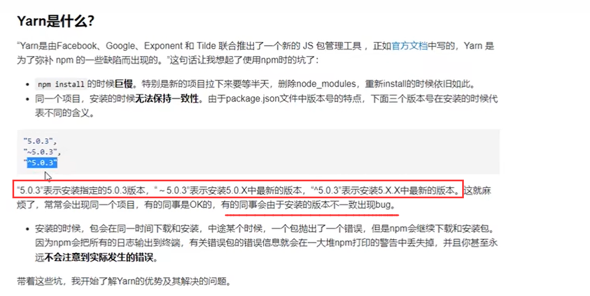

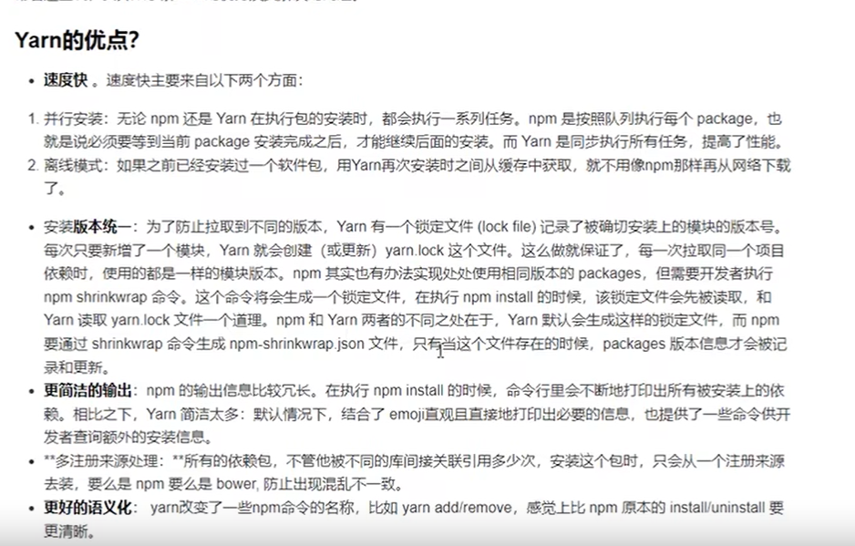

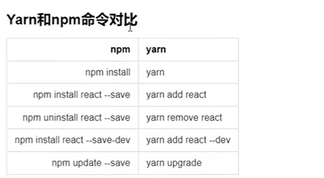


# 组件封装与组件库搭建

教程：https://www.bilibili.com/video/BV1nJ411V75n?p=3&vd_source=365d13057e58bb6a007cdd5275785229

样式参考：https://www.npmjs.com/package/heima-ui

# 1、Button组件封装

```vue
<template>
    <div class="my-button">黑马组件</div>
</template>
<script>
    export default {
        name: 'MyButton'
    }
</script>
<style lang="scss">

</style>
```

**==在vue3中注册全局组件的方法：具体看官网文档就行==**

```js
import { createApp, VueElement } from 'vue'
import App from './App.vue'
import router from './router'
import store from './store'
/** 全局注册组件 */
import MyButton from './components/Button'
const app = createApp(App)
app.component(MyButton.name, MyButton)

app.use(store).use(router).mount('#app')
```

**<font color='deepred'>在vue3中，不再直接使用Vue.component来注册组件了，而是使用createApp创建的实例对象的component方法来注册组件，参数一是组件的名字，可以直接指定一个字符串，参数二是要注册到全局的组件了。</font>**

```vue
<template>
  <div id="nav">
    <my-button></my-button>
  </div>
</template>

<style>
</style>
```

**==<font color='red'>组件注册到全局后，在任何地方都可以随意的调用了。</font>==**

```css
.my-button {
    /**行内块，这个应该要好好看看 */
    display: inline-block;
    line-height: 1;
    white-space: nowrap;
    cursor: pointer;
    background-color: #fff;
    border: 1px solid #dedfe6;
    color: #606266;

    -webkit-appearance: none;
    text-align: center;
    box-sizing: border-box;
    outline: none;
    margin: 0;

    transition: .1s;
    font-weight: 500;
    /**禁止元素中的文字被选中：就是不会选中和光标 */
    -moz-user-select: none;
    -webkit-user-select: none;
    padding: 12px 20px;
    font-size: 14px;
    border-radius: 4px;
}

.my-button:hover,.my-button:focus {
    color: #409eff;
    border-color: #c6e2ff;
    background-color: #ecf5ff;
}
```

## 1.1、支持button的type属性

展示：
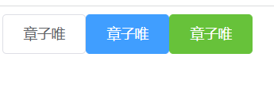

使用:
```html
    <my-button type="primary">章子唯</my-button>
    <my-button type="success">章子唯</my-button>
```


封装：

```vue
<template>
    <div class="my-button" :class="[`my-button--${type}`]">
        <span>
            <slot></slot>
        </span>
    </div>
</template>
<script>
    export default {
        name: 'MyButton',
        props: {
            type: {
                type: String,
                default: 'default'
            }
        }

    }
</script>
```

**<font color='deepred'>知识点1：可以写class和:class同时存在，然后可以使用模板字符串和数组</font>**

样式如下：

```css
.my-button--primary {
     color: #fff;
    background-color: #409eff;
    border-color: #409eff;
}
.my-button--primary:hover,.my-button--primary:focus {
     color: #fff;
    background-color: #66b1ff;
    border-color: #66b1ff;
}

.my-button--success{
     color: #fff;
    background-color: #67c23a; border-color: #67c23a;
}
.my-button--success:hover,.my-button--success:focus {
     color: #fff;
    background-color: #67c23a; border-color: #67c23a;
}
```

## 1.2、圆形、镂空的支持

- **镂空和圆形的实现**

- plain和circle

```vue
<template>
    <div class="my-button" :class="[`my-button--${type}`, {
        'is-plain': plain,
        'is-circle': circle
    }]">
        <span>
            <slot></slot>
        </span>
    </div>
</template>
<script>
    export default {
        name: 'MyButton',
        props: {
            type: {
                type: String,
                default: 'default'
            },
            plain: {
                type: Boolean,
                default: false
            },
            circle: {
                type: Boolean,
                default: false
            },
        }

    }
</script>
```

**<font color='deepred'>知识点：就是:class中可以传一个对象，对象的键名是类名，键值是一个boolean，如果是true那么该类就会被启用，否则就不会被启用！！！</font>**

样式：
```css
.my-button--primary.is-plain {
  color: #409eff;
  background: #ecf5ff;
  border-color: #b3d8ff;
}
.my-button--primary.is-plain:hover, .my-button--primary.is-plain:focus {
    background: #409eff;
    border-color: #409eff;
    color: #fff;
}

.my-button--success.is-plain {
  color: #67c23a;
  background: #f0f9eb;
  border-color: #c2e7b0;
}

.my-button--success.is-plain:hover, .my-button--success.is-plain:focus {
    background: #67c23a;
    border-color: #67c23a;
    color: #fff;
}
```


使用：
```html
    <my-button :plain="true" type="primary">章子唯</my-button>
    <my-button plain type="success">章子唯</my-button>
```

**<font color='deepred'>知识点：有两种使用方式，一个是绑定传值，还有一个就是直接写上这个属性，然后传给子组件的就是true了</font>**

镂空效果：
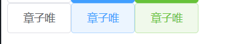


- round属性也是一样的

```css
.my-button.is-circle {
  border-radius: 50%;
  padding: 12px;
}
```

## 1.3、字体图标与click事件

- 字体文件，我就不多说了，在css基础中有详细提及过

文件参考：
```css
@font-face {
  font-family: 'icomoon';
  src:  url('fonts/icomoon.eot?kq9lb0');
  src:  url('fonts/icomoon.eot?kq9lb0#iefix') format('embedded-opentype'),
    url('fonts/icomoon.ttf?kq9lb0') format('truetype'),
    url('fonts/icomoon.woff?kq9lb0') format('woff'),
    url('fonts/icomoon.svg?kq9lb0#icomoon') format('svg');
  font-weight: normal;
  font-style: normal;
  font-display: block;
}

[class^="my-icon-"], [class*="my-icon-"] {
  /* use !important to prevent issues with browser extensions that change fonts */
  font-family: 'icomoon' !important;
  speak: never;
  font-style: normal;
  font-weight: normal;
  font-variant: normal;
  text-transform: none;
  line-height: 1;

  /* Better Font Rendering =========== */
  -webkit-font-smoothing: antialiased;
  -moz-osx-font-smoothing: grayscale;
}

.my-icon-folder:before {
  content: "\e92f";
}
.my-icon-folder-open:before {
  content: "\e930";
}
.my-icon-folder-plus:before {
  content: "\e931";
}
.my-icon-folder-minus:before {
  content: "\e932";
}
.my-icon-folder-download:before {
  content: "\e933";
}
.my-icon-folder-upload:before {
  content: "\e934";
}

```

使用：

1、首先还是要全局注册我们的字体图标样式
main.js

```js
import { createApp, VueElement } from 'vue'
import App from './App.vue'
import router from './router'
import store from './store'
/** 全局注册组件 */
import MyButton from './components/Button'
// 全局进行引入字体图标样式文件
import './assets/style.css'
const app = createApp(App)
app.component(MyButton.name, MyButton)

app.use(store).use(router).mount('#app')
```

2、直接把类名拿来即可

```vue
<template>
    <div class="my-button" :class="[`my-button--${type}`, {
        'is-plain': plain,
        'is-round': round
    }]">

        <!-- 字体图标部分 -->
        <i class="my-icon-folder"></i>

        <!-- 文本内容部分 -->
        <span>
            <slot></slot>
        </span>
    </div>
</template>
```

把它属性化：

```vue
<template>
    <div class="my-button" :class="[`my-button--${type}`, {
        'is-plain': plain,
        'is-round': round
    }]">

        <!-- 字体图标部分 -->
        <i :class="[`my-icon-${icon}`]" v-if="icon"></i>

        <!-- 文本内容部分 -->
        <span>
            <slot></slot>
        </span>
    </div>
</template>
<script>
    export default {
        name: 'MyButton',
        props: {
            type: {
                type: String,
                default: 'default'
            },
            plain: {
                type: Boolean,
                default: false
            },
            round: {
                type: Boolean,
                default: false
            },
            icon: {
                type: String,
                default: ''
            }
        }

    }
</script>
```

使用：

```html
    <div id="nav">
    <my-button round icon="folder-open"></my-button>
    <my-button round icon="folder-plus" type="primary"></my-button>
    <my-button round icon="folder-minus" type="success"></my-button>
  </div>
```

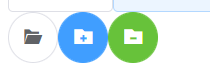

### 1.3.1、优化

如果既有文字又有图标，样式就会小崩掉

```html
    <my-button plain icon="folder">章子唯</my-button>
    <my-button plain icon="folder" type="primary">章子唯</my-button>
    <my-button plain icon="folder" type="success">章子唯</my-button>
```

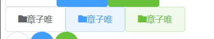

添加一个样式：
```css
.my-button [class*='my-icon-']+span {
    margin-left: 8px;
}
```

**<font color='deepred'>知识点：属性选择器和相邻弟弟选择器</font>**

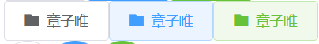

**<font color='red'>问题：当没有文字内容的时候，就会变成这样：</font>**

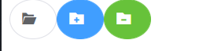

**<font color='deepred'>知识点：vue2可以通过this.$slots拿到所有的插槽</font>**

```js
        created() {
            console.log(this.$slots)
        }
```

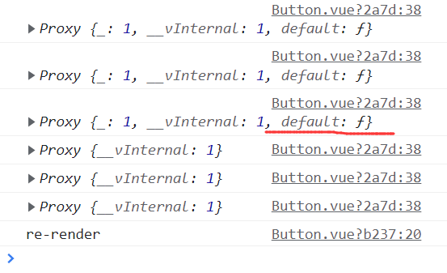

只要组件的开始标签和结束标签之间有内容，default就存在了

```html
        <!-- 文本内容部分 -->
        <span v-if="$slots.default">
            <slot></slot>
        </span>
```

**<font color='deepred'>知识点：通过$slots.default判断是否有插槽</font>**

### 1.3.2、点击事件

直接在组价上绑定一个事件就行了
```html
    <my-button round icon="folder-open" @click="openFolder"></my-button>
```

## 1.4、按钮禁用

```html
    <div class="my-button" :class="[`my-button--${type}`, {
        'is-plain': plain,
        'is-round': round,
        'is-disabled': disabled
    }]"
    :disabled="disabled"
    >
```

**<font color='deepred'>知识点：原生的div，button元素都有disabled的功能所在的！！！</font>**

样式：

```css
.my-button.is-disabled, 
.my-button.is-disabled:focus, .my-button.is-disabled:hover { color: #c0c4cc; cursor: not-allowed; background-image: none; background-color: #fff; border-color: #ebeef5; } 
```

**<font color='deepred'>知识点：cursor为not-allowed时候，鼠标放上去会变成禁止的图片的</font>**


## 1.5、封装源码

```vue
<template>
    <div class="my-button" :class="[`my-button--${type}`, {
        'is-plain': plain,
        'is-round': round,
        'is-disabled': disabled
    }]"
    :disabled="disabled"
    >

        <!-- 字体图标部分 -->
        <i :class="[`my-icon-${icon}`]" v-if="icon"></i>

        <!-- 文本内容部分 -->
        <span v-if="$slots.default">
            <slot></slot>
        </span>
    </div>
</template>
<script>
    export default {
        name: 'MyButton',
        props: {
            type: {
                type: String,
                default: 'default'
            },
            plain: {
                type: Boolean,
                default: false
            },
            round: {
                type: Boolean,
                default: false
            },
            icon: {
                type: String,
                default: ''
            },
            // 禁用按钮的方法
            disabled: {
                type: Boolean,
                default: false
            }

        },
        created() {
            console.log(this.$slots)
        },
        methods: {
            handleClick() {
                this.$emit('click')
            }
        }
    }
</script>
<style scoped>
.my-button {
    /**行内块，这个应该要好好看看 */
    display: inline-block;
    line-height: 1;
    white-space: nowrap;
    cursor: pointer;
    background-color: #fff;
    border: 1px solid #dedfe6;
    color: #606266;

    -webkit-appearance: none;
    text-align: center;
    box-sizing: border-box;
    outline: none;
    margin: 0;

    transition: .1s;
    font-weight: 500;
    /**禁止元素中的文字被选中：就是不会选中和光标 */
    -moz-user-select: none;
    -webkit-user-select: none;
    padding: 12px 20px;
    font-size: 14px;
    border-radius: 4px;
}

.my-button:hover,.my-button:focus {
    color: #409eff;
    border-color: #c6e2ff;
    background-color: #ecf5ff;
}


.my-button--primary {
     color: #fff;
    background-color: #409eff;
    border-color: #409eff;
}
.my-button--primary:hover,.my-button--primary:focus {
     color: #fff;
    background-color: #66b1ff;
    border-color: #66b1ff;
}

.my-button--success{
     color: #fff;
    background-color: #67c23a; border-color: #67c23a;
}
.my-button--success:hover,.my-button--success:focus {
     color: #fff;
    background-color: #67c23a; border-color: #67c23a;
}

/**镂空的样式设计 */
.my-button.is-plain:hover,.my-button.is-plain:focus {
    background: #fff;
    border-color: #409eff;
    color: #409eff;
}

.my-button--primary.is-plain {
  color: #409eff;
  background: #ecf5ff;
  border-color: #b3d8ff;
}
.my-button--primary.is-plain:hover, .my-button--primary.is-plain:focus {
    background: #409eff;
    border-color: #409eff;
    color: #fff;
}

.my-button--success.is-plain {
  color: #67c23a;
  background: #f0f9eb;
  border-color: #c2e7b0;
}

.my-button--success.is-plain:hover, .my-button--success.is-plain:focus {
    background: #67c23a;
    border-color: #67c23a;
    color: #fff;
}
.my-button.is-round {
  border-radius: 50%;
  padding: 12px;
}

.my-button [class*='my-icon-']+span {
    margin-left: 8px;
}

.my-button.is-disabled, 
.my-button.is-disabled:focus, .my-button.is-disabled:hover { color: #c0c4cc; cursor: not-allowed; background-image: none; background-color: #fff; border-color: #ebeef5; } 
</style>

```


# 2、dialog组件封装

涉及的知识点：

- vue组件动画
- sync的修饰符

- 具名插槽

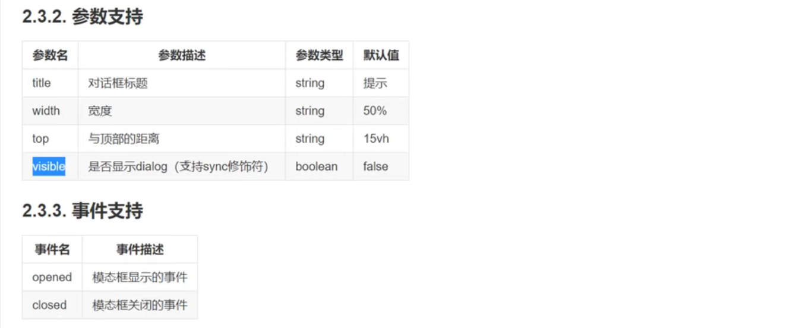


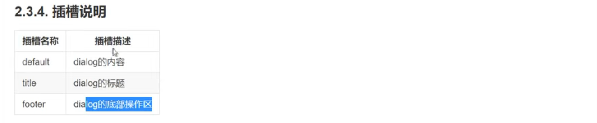


## 2.1、第一节

对话框的基本结构：就是上中下三部分，然后就是背后的遮罩层

```vue
<template>
<!-- 对话框遮罩层 -->
<div class="my-dialog__wrapper">
    <!-- 中间的真正的对话框部分 -->
    <div class="my-dialog">
        <div class="my-dialog__header">
            <div class="my-dialog__header-title">这个一个对话框</div>
            <button>
                <i class="my-dialog__header-close" ></i>
            </button>
        </div>
        <div class="my-dialog__body">
            <span>世界你好！！！</span>
        </div>
        <div class="my-dialog__footer">
            <my-button>取消</my-button>
            <my-button type="primary">确认</my-button>
        </div>
    </div>
</div>
</template>

```

基本样式如下：

```css
.my-dialog__wrapper {
    position: fixed;
    top: 0;
    right: 0;
    bottom: 0;
    left: 0;
    overflow: auto;
    margin: 0;
    z-index: 2001;
    background-color: rgba(0, 0, 0, .5);
}

.my-dialog__wrapper .my-dialog {
    position: relative;
    margin: 15vh auto 50px;
    background: #fff;
    border-radius: 2px;
    box-shadow: 0 1px 3px rgba(0, 0, 0, .3);
    box-sizing: border-box;
    width: 30%;
}

.my-dialog__header {
    padding: 20px 20px 10px;
}

.my-dialog__header .my-dialog__header-title {
    line-height: 24px;
    font-size: 18px;
    color: #303133;
}

.my-dialog__header-close {
    position: absolute;
    top: 20px;
    right: 20px;
    padding: 0;
    background: transparent;
    border: none;
    outline: none;
    cursor: pointer;
    font-size: 16px;
}


.my-dialog__body {
    padding: 30px 20px;
    color: #606266;
    font-size: 14px;
    word-break: break-all;
}

.my-dialog__footer {
    padding: 10px 20px 20px;
    text-align: right;
    box-sizing: border-box;
}

.my-button:first-child {
    margin-right: 20px;
}
```

**<font color='deepred'>知识点1：遮罩层的样式写法</font>**

**<font color='deepred'>知识点2：maring也可以使用vh的高度!!!</font>**

**<font color='deepred'>知识点3：换行的样式：</font>**参考：https://www.runoob.com/cssref/css3-pr-word-break.html

​    **word-break: break-all;  //只允许在单词内部进行换行**

## 2.2、标题插槽

```vue
<template>
    <!-- 对话框遮罩层 -->
    <div class="my-dialog__wrapper">
        <!-- 中间的真正的对话框部分 -->
        <div class="my-dialog">
            <div class="my-dialog__header">
                <div class="my-dialog__header-title">{{title}}</div>
                <i class="my-icon-cross my-dialog__header-close"></i>
            </div>
            <div class="my-dialog__body">
                <span>世界你好！！！</span>
            </div>
            <div class="my-dialog__footer">
                <my-button>取消</my-button>
                <my-button type="primary">确认</my-button>
            </div>
        </div>
    </div>
</template>
<script>
export default {
    name: 'MyDialog',
    props: {
        title: {
            type: String,
            default: '默认标题'
        }
    }
}
</script>
```

使用：
```html
  <my-dialog title="温馨提示"></my-dialog>
```


**<font color='red'>问题：我不想标题只是一串文本？可以用插槽进行封装！</font>**

```html
            <div class="my-dialog__header">
                <slot name="title">
                    <div class="my-dialog__header-title">{{title}}</div>
                </slot>
                <i class="my-icon-cross my-dialog__header-close"></i>
            </div>
```

**<font color='deepred'>知识点：用slot把div包裹起来，如果没有传插槽，自然显示里面的div的内容，如果传了插槽就会覆盖掉div的，够骚气的！</font>**

使用：
```html
  <my-dialog>
    <template v-slot:title> <!--指定使用title这个插槽！-->
      <h3>许洁</h3>
    </template>
  </my-dialog>

```


## 2.3、控制dialog的位置和大小

- 接受width和top两个属性

```vue

<template>
    <!-- 对话框遮罩层 -->
    <div class="my-dialog__wrapper">
        <!-- 中间的真正的对话框部分 -->
        <div class="my-dialog" :style="{width:width,marginTop:top}">
            <div class="my-dialog__header">
                <slot name="title">
                    <div class="my-dialog__header-title">{{title}}</div>
                </slot>
                <i class="my-icon-cross my-dialog__header-close"></i>
            </div>
            <div class="my-dialog__body">
                <span>世界你好！！！</span>
            </div>
            <div class="my-dialog__footer">
                <my-button>取消</my-button>
                <my-button type="primary">确认</my-button>
            </div>
        </div>
    </div>
</template>
<script>
export default {
    name: 'MyDialog',
    props: {
        title: {
            type: String,
            default: '默认标题'
        },
        width: {
            type: String,
            default: '50%'
        },
        top: {
            type: String,
            default: '200px'
        }
    }
}
</script>
```

**<font color='deepred'>知识点：绑定style对象的方法，有-的属性使用驼峰命名法</font>**

看看原来的style对象的写法：\<div style="width:20%;height:40px;">Nihao\</div>

现在使用对象绑定就行了：  \<div class="my-dialog" :style="{width:width,marginTop:top}">

使用：
```html
  <my-dialog width="30%" top="200px">
    <template v-slot:title>
      <h3>许洁</h3>
    </template>
  </my-dialog>
```

**<font color='red'>优化：把内容和footer都进行插槽话就行了</font>**

```vue
<template>
    <!-- 对话框遮罩层 -->
    <div class="my-dialog__wrapper">
        <!-- 中间的真正的对话框部分 -->
        <div class="my-dialog" :style="{width:width,marginTop:top}">
            <div class="my-dialog__header">
                <slot name="title">
                    <div class="my-dialog__header-title">{{title}}</div>
                </slot>
                <i class="my-icon-cross my-dialog__header-close"></i>
            </div>
            <div class="my-dialog__body">
                <!-- 内容里面放一个默认的插槽就行了 -->
                <slot></slot>
            </div>
            <div class="my-dialog__footer">
                <slot name="footer"></slot>
            </div>
        </div>
    </div>
</template>
```

使用：
```html
  <my-dialog width="30%" top="200px">
    <template v-slot:title>
      <h3>许洁</h3>
    </template>
    <ul>
      <li>1</li>
      <li>2</li>
      <li>3</li>
    </ul>
    <template v-slot:footer>
      <my-button type="primary">取消</my-button>
      <my-button type="success">确认</my-button>
    </template>
  </my-dialog>
```

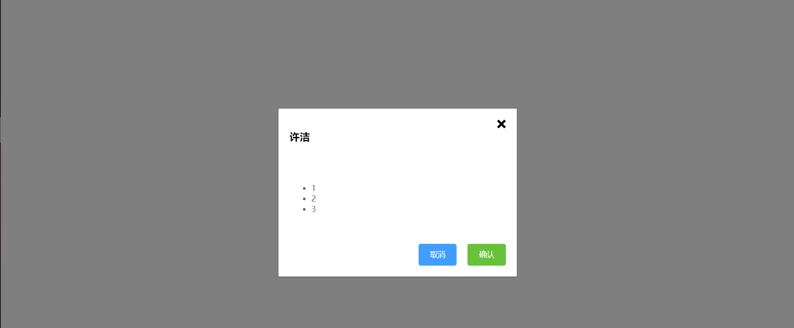


## 2.4、对话框的显示和隐藏

```vue
<template>
    <!-- 对话框遮罩层 -->
    <div class="my-dialog__wrapper" v-show="visible">
        <!-- 中间的真正的对话框部分 -->
        <div class="my-dialog" :style="{ width, marginTop: top }">
            <div class="my-dialog__header">
                <slot name="title">
                    <div class="my-dialog__header-title">{{ title }}</div>
                </slot>
                <i class="my-icon-cross my-dialog__header-close"></i>
            </div>
            <div class="my-dialog__body">
                <!-- 内容里面放一个默认的插槽就行了 -->
                <slot></slot>
            </div>
            <div class="my-dialog__footer">
                <slot name="footer">
                    <my-button type="primary">确认</my-button>
                    <my-button>取消</my-button>
                </slot>
            </div>
        </div>
    </div>
</template>
<script>
export default {
    name: 'MyDialog',
    props: {
        title: {
            type: String,
            default: '默认标题'
        },
        width: {
            type: String,
            default: '50%'
        },
        top: {
            type: String,
            default: '200px'
        },
        visible: {
            type: Boolean,
            default: false 
        }
    }
}
</script>
```

就是增加一个显示隐藏的属性而已。。。很简单

**<font color='red'>问题：对话框的关闭可不止一处哦</font>**

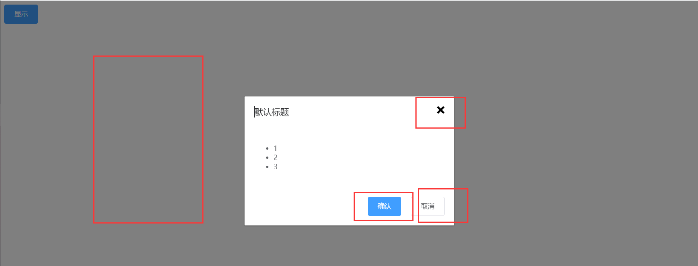

关闭对话框：
```vue
<template>
    <!-- 对话框遮罩层 -->
    <div class="my-dialog__wrapper" v-show="visible" @click.self="handleClose">
        <!-- 中间的真正的对话框部分 -->
        <div class="my-dialog" :style="{ width, marginTop: top }">
            <div class="my-dialog__header">
                <slot name="title">
                    <div class="my-dialog__header-title">{{ title }}</div>
                </slot>
                <i class="my-icon-cross my-dialog__header-close" @click="handleClose"></i>
            </div>
            <div class="my-dialog__body">
                <!-- 内容里面放一个默认的插槽就行了 -->
                <slot></slot>
            </div>
            <div class="my-dialog__footer">
                <slot name="footer">
                    <my-button type="primary" @click="handleSure">确认</my-button>
                    <my-button @click="handleCancle">取消</my-button>
                </slot>
            </div>
        </div>
    </div>
</template>
<script>
export default {
    name: 'MyDialog',
    props: {
        title: {
            type: String,
            default: '默认标题'
        },
        width: {
            type: String,
            default: '50%'
        },
        top: {
            type: String,
            default: '200px'
        },
        visible: {
            type: Boolean,
            default: false 
        }
    },
    methods: {
        handleClose () {
            this.$emit('dialog_close',false)
        },
        handleSure() {
            this.$emit('dialog_close',false)
        },
        handleCancle() {
            this.$emit('dialog_close',false)
        }
    }
}
</script>
```

**<font color='deepred'>知识点1：自定义事件子传父数据</font>**

**<font color='deepred'>知识点2：@click.self事件，使得点击事件只会在自己身上触发，而不会在子元素上触发</font>**

```html
    <div class="my-dialog__wrapper" v-show="visible" @click.self="handleClose">
```

***如果把黑幕层的.self去掉的话，那么点击到框框的时候也会触发关闭事件的！！！***

使用：
```vue
<div id="nav">
  <my-button type="primary" @click="visible = true">显示</my-button>
  <my-dialog width="30%" top="200px" :visible="visible" @dialog_close="visible = false">
    <ul>
      <li>1</li>
      <li>2</li>
      <li>3</li>
    </ul>
  </my-dialog>
</div>
```


## 2.5、.sync修饰符

**<font color='red'>.sync修饰符的作用是干啥的呢？？</font>**

看下面的例子
子组件：

```vue
<template>
<div v-if="visible">demo --- {{money}}</div>
<button @click="changeMoney">修改金额</button>
</template>
<script>
export default {
    name: 'Sync',
    props: {
        visible: {
            type: Boolean,
            default: false
        },
        money: {
            type: Number,
            default: 10
        }
    },
    methods: {
        changeMoney () {
            this.$emit('update:money', 300)
        }
    }
}

</script>
<style>

</style>
```

父组件：
```vue
  <sync :visible="visible" :money="money" @update:money="changeMoney"></sync>
```

**<font color='deepred'>知识点1：这里为什么要把自定义事件用update:monye这样奇怪的方式命名呢？虽然和普通的自定义事件没有什么差别，但是这样写就可以简化成下面的这一种写法了捏。。。</font>**

```vue
  <sync :visible="visible" :money.sync="money"></sync>
```

**<font color='deepred'>知识点2：vue3中.sync的写法被改成了v-model的写法：</font>**

```vue
  <Demo v-model:money="money"></Demo>
```


## 2.6、实现过渡动画

- vue过度动画的复习

```vue
  <transition name="zzw">
    <div v-show="visible">我是章子维</div>
  </transition>
```

样式：

```css
.zzw-enter-from,.zzw-leave-to {
  opacity: 0;
}

.zzw-enter-active,.zzw-leave-active {
  transition: all 1s;
}
.zzw-enter-to,.zzw-leave-from{
  opacity: 1;
}

```

**<font color='deepred'>知识点：用transition包裹起来的div可以有这六个样式类，然后name可以决定这样样式类名的前缀</font>**


**方法二：用css动画进行实现**

```css
.zzw-enter-active {
  animation: toggle .5s;
}

.zzw-leave-active {
  animation: toggle .5s reverse;
}

@keyframes toggle {
  0% {
    opacity: 0;
  }
  100% {
    opacity: 1;
  }
}
```

**<font color='deepred'>知识点：css动画，先用@keyfromes定义一定动画，然后再使用animation使用动画就行了</font>**


实现对话框动画的代码如下
```vue
    <transition name="dialog-toggle">
        <div class="my-dialog__wrapper" v-show="visible" @click.self="handleClose">
            <!-- 中间的真正的对话框部分 -->
            <div class="my-dialog" :style="{ width, marginTop: top }">
                <div class="my-dialog__header">
                    <slot name="title">
                        <div class="my-dialog__header-title">{{ title }}</div>
                    </slot>
                    <i class="my-icon-cross my-dialog__header-close" @click="handleClose"></i>
                </div>
                <div class="my-dialog__body">
                    <!-- 内容里面放一个默认的插槽就行了 -->
                    <slot></slot>
                </div>
                <div class="my-dialog__footer">
                    <slot name="footer">
                        <my-button type="primary" @click="handleSure">确认</my-button>
                        <my-button @click="handleCancle">取消</my-button>
                    </slot>
                </div>
            </div>
        </div>
    </transition>
```

样式：
```css
.dialog-toggle-enter-active {
    animation: toggle .4s;
}
.dialog-toggle-leave-active {
    animation: toggle .4s reverse;
}


@keyframes toggle {
    0% {
        opacity: 0;
        transform: translateY(-20px);
    }
    100% {
        opacity: 1;
        transform: translateY(0px);
    }
}
```

**<font color='deepred'>知识点：因为y轴向下才是证方向，所以-20px -> 0px才是往下掉</font>**

## 2.7、涉及到的深度选择器

sytle标签中的scoped就是给元素加上一个唯一的随机属性

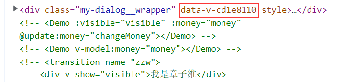


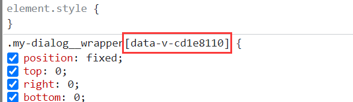


**<font color='deepred'>知识点1：scpoed会给当前模板中的所有元素【包括子元素】添加一个随机属性，然后使用属性选择器保证样式的作用域</font>**

**<font color='deepred'>知识点2：正因为如此，所以你在element ui想要直接修改样式会无效，因为它的样式添加了一个属性选择器，这时候你就用到了样式穿透了</font>**

**知识点3：不同预处理使用的样式穿透不同**

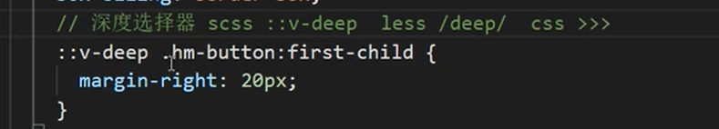


# 3、input组件封装

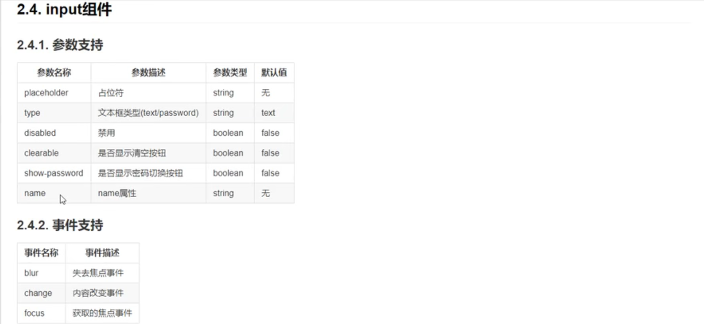


实现了placeholder，type，disabled的封装

```vue
<template>
    <div class="my-input">
        <input class="my-input__inner" :class="[{ 'is-disabled': disabled }]" :placeholder="placeholder" :type="type"
            :name="name" :disabled="disabled">
    </div>
</template>
<script>
export default {
    name: 'MyInput',
    props: {
        placeholder: {
            type: String,
            default: ''
        },
        type: {
            type: String,
            default: ''
        },
        name: {
            type: String,
            default: ''
        },
        disabled: {
            type: Boolean,
            default: false
        }
    }
}
</script>
<style>
.my-input {
    width: 100%;
    position: relative;
    font-size: 14px;
    display: inline-block;
}

.my-input__inner {
    -webkit-appearance: none;
    background-color: #fff;
    background-image: none;
    border-radius: 4px;
    border: 1px solid #dcdfe6;
    box-sizing: border-box;
    color: #606266;
    display: inline-block;
    font-size: inherit;
    height: 40px;
    line-height: 40px;
    outline: none;
    padding: 0 15px;
    transition: border-color .2s cubic-bezier(.645, .045, .355, 1);
    width: 100%;
}

.my-input__inner:focus {
    outline: none;
    border-color: #409eff;
}

.my-input .my-input__inner.is-disabled {
      background-color: #f5f7fa;
      border-color: #e4e7ed;
      color: #c0c4cc;
      cursor: not-allowed;
}

</style>
```


## 3.1、实现v-model

要在自己封装的input组件中实现表单双向绑定，就要理解v-model的原理

**<font color='red'>其实v-model是一个语法糖，它等价于：</font>**

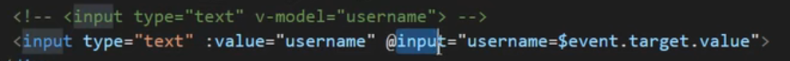

**<font color='deepred'>知识点：通过input事件（或change事件），然后获取到事件对象中的value，然后重新赋值给username</font>**


**vue2中的实现：**

```vue
<template>
    <div class="my-input">
        <input class="my-input__inner" 
        :class="[{ 'is-disabled': disabled }]" 
        :placeholder="placeholder" 
        :type="type"
        :name="name" 
        :disabled="disabled"
        :value="value"
        @input="fn"
        >
    </div>
</template>
<script>
export default {
    name: 'MyInput',
    props: {
        placeholder: {
            type: String,
            default: ''
        },
        type: {
            type: String,
            default: ''
        },
        name: {
            type: String,
            default: ''
        },
        disabled: {
            type: Boolean,
            default: false
        },
        value: {
            type: String,
            default: ''
        }
    },
    methods: {
        fn (e) {
            // const ev = e || this.$event
            this.$emit('input', e.target.value)  //给父组件传递input事件
        }
    }
}
</script>
<style>
.my-input {
    width: 100%;
    position: relative;
    font-size: 14px;
    display: inline-block;
}

.my-input__inner {
    -webkit-appearance: none;
    background-color: #fff;
    background-image: none;
    border-radius: 4px;
    border: 1px solid #dcdfe6;
    box-sizing: border-box;
    color: #606266;
    display: inline-block;
    font-size: inherit;
    height: 40px;
    line-height: 40px;
    outline: none;
    padding: 0 15px;
    transition: border-color .2s cubic-bezier(.645, .045, .355, 1);
    width: 100%;
}

.my-input__inner:focus {
    outline: none;
    border-color: #409eff;
}

.my-input .my-input__inner.is-disabled {
      background-color: #f5f7fa;
      border-color: #e4e7ed;
      color: #c0c4cc;
      cursor: not-allowed;
}

</style>
```

使用：

```vue
        <my-input placeholder="请输入用户名" name="zzw" type="text" v-model="username"></my-input>
```

**<font color='red'>问题：在vue3中，v-model已经不支持这种写法了...而且v-model的实现原理也有所变化了</font>**


**vue3中的实现**

只要做下面的一点修改就行了


```vue
        fn (e) {
            // const ev = e || this.$event
            this.$emit('my_input', e.target.value)
        }
```


使用：

```vue
        <my-input placeholder="请输入用户名" name="zzw" type="text" :value="username" @my_input="handleSync"></my-input>
```

**==<font color='red'>注意：vue3中不允许组件注册@input事件，会报错！</font>==**

## 3.2、input框清空&密码框显示

- 添加clearble属性和show-password属性

### 3.2.1、输入框清空

```vue
<template>
    <div class="my-input" :class="[{'my-input--suffix': showSuffix}]">
        <input class="my-input__inner" 
        :class="[{ 'is-disabled': disabled }]" 
        :placeholder="placeholder" 
        :type="type"
        :name="name" 
        :disabled="disabled"
        :value="value"
        @input="fn"
        >

        <span class="my-input__suffix" v-if="showSuffix">
            <i class="my-icon-cross" v-if="clearble && value" @click="clear"></i>
            <i class="my-icon-eye" v-if="showPassword"></i>
        </span>
    </div>


</template>
<script>
export default {
    name: 'MyInput',
    props: {
        placeholder: {
            type: String,
            default: ''
        },
        type: {
            type: String,
            default: ''
        },
        name: {
            type: String,
            default: ''
        },
        disabled: {
            type: Boolean,
            default: false
        },
        value: {
            type: String,
            default: ''
        },
        clearble: {
            type: Boolean,
            default: false
        },
        showPassword: {
            type: Boolean,
            default: false
        }
    },
    computed: {
        showSuffix () {
            return this.clearble || this.showPassword
        }
    },
    methods: {
        fn (e) {
            // const ev = e || this.$event
            this.$emit('my_input', e.target.value)
        },
        clear () {
            this.$emit('my_input','')
        }
    }
}
</script>
<style>
.my-input {
    width: 100%;
    position: relative;
    font-size: 14px;
    display: inline-block;
}

.my-input__inner {
    -webkit-appearance: none;
    background-color: #fff;
    background-image: none;
    border-radius: 4px;
    border: 1px solid #dcdfe6;
    box-sizing: border-box;
    color: #606266;
    display: inline-block;
    font-size: inherit;
    height: 40px;
    line-height: 40px;
    outline: none;
    padding: 0 15px;
    transition: border-color .2s cubic-bezier(.645, .045, .355, 1);
    width: 100%;
}

.my-input__inner:focus {
    outline: none;
    border-color: #409eff;
}

.my-input .my-input__inner.is-disabled {
      background-color: #f5f7fa;
      border-color: #e4e7ed;
      color: #c0c4cc;
      cursor: not-allowed;
}

.my-input--suffix .my-input__inner {
    padding-right: 30px;
}
.my-input--suffix .my-input__suffix {
    position: absolute;
    height: 100%;
    right: 10px;
    top: 0;
    line-height: 40px;
    text-align: center;
    color: #c0c4cc;
    transition: all .3s;
    z-index: 900;
 }
 .my-input--suffix .my-input__suffix i {
    color: #c0c4cc;
    font-size: 14px;
    cursor: pointer;
    transition: color .2s cubic-bezier(.645,.045,.355,1);
}


</style>
```

==计算属性的妙用==

**<font color='red'>这里的话主要是一些技巧方面的妙用！如果传递了clearable或者是showPassword的话，那么整个span标签就存在，并且在div大框框中启用my-input--suffix类，不然的话，整个span就不存在并且div中的my-input--suffix类也不使用。</font>**

### 3.2.2、隐藏显示密码

```vue
<template>
    <div class="my-input" :class="[{'my-input--suffix': showSuffix}]">
        <input class="my-input__inner" 
        :class="[{ 'is-disabled': disabled }]" 
        :placeholder="placeholder" 
        :type="showPassword? (_showPassword? 'input': 'password') : type"
        :name="name" 
        :disabled="disabled"
        :value="value"
        @input="fn"
        >

        <span class="my-input__suffix" v-if="showSuffix">
            <i class="my-icon-cross" v-if="clearble && value" @click="clear"></i>
            <i class="my-icon-eye"  :class="{'my-icon-eye-show': _showPassword }"   v-if="showPassword" @click="showPassFun"></i>
        </span>
    </div>


</template>
<script>
export default {
    name: 'MyInput',
    data () {
        return {
            _showPassword: false
        }
    },
    props: {
        placeholder: {
            type: String,
            default: ''
        },
        type: {
            type: String,
            default: ''
        },
        name: {
            type: String,
            default: ''
        },
        disabled: {
            type: Boolean,
            default: false
        },
        value: {
            type: String,
            default: ''
        },
        clearble: {
            type: Boolean,
            default: false
        },
        showPassword: {
            type: Boolean,
            default: false
        }
    },
    computed: {
        showSuffix () {
            return this.clearble || this.showPassword
        }
    },
    methods: {
        fn (e) {
            // const ev = e || this.$event
            this.$emit('my_input', e.target.value)
        },
        clear () {
            this.$emit('my_input','')
        },
        showPassFun () {
            this._showPassword = !this._showPassword
        }
    }
}
</script>
<style>
.my-input {
    width: 100%;
    position: relative;
    font-size: 14px;
    display: inline-block;
}

.my-input__inner {
    -webkit-appearance: none;
    background-color: #fff;
    background-image: none;
    border-radius: 4px;
    border: 1px solid #dcdfe6;
    box-sizing: border-box;
    color: #606266;
    display: inline-block;
    font-size: inherit;
    height: 40px;
    line-height: 40px;
    outline: none;
    padding: 0 15px;
    transition: border-color .2s cubic-bezier(.645, .045, .355, 1);
    width: 100%;
}

.my-input__inner:focus {
    outline: none;
    border-color: #409eff;
}

.my-input .my-input__inner.is-disabled {
      background-color: #f5f7fa;
      border-color: #e4e7ed;
      color: #c0c4cc;
      cursor: not-allowed;
}

.my-input--suffix .my-input__inner {
    padding-right: 30px;
}
.my-input--suffix .my-input__suffix {
    position: absolute;
    height: 100%;
    right: 10px;
    top: 0;
    line-height: 40px;
    text-align: center;
    color: #c0c4cc;
    transition: all .3s;
    z-index: 900;
 }
 .my-input--suffix .my-input__suffix i {
    color: #c0c4cc;
    font-size: 14px;
    cursor: pointer;
    transition: color .2s cubic-bezier(.645,.045,.355,1);
}


 .my-input--suffix .my-input__suffix i.my-icon-eye-show {
    color: blue;
 }

</style>
```

**思路分析：他牛逼在什么地方呢，就是你看他要改变显示隐藏其实就是改变input框的type属性，但是input框的type属性是外面传进来的啊，总不能又自定义一个事件让父组件去改吧，如果是这样，那这个使用这个组件不就太JB麻烦了吗？而且密封性也不高啊。。。这里牛逼的操作在于用**

​        **:type="showPassword? (_showPassword? 'input': 'password') : type"**

**这样子就可以用自己组将内部的变量控制了，太骚了！！！**


# 小结一：

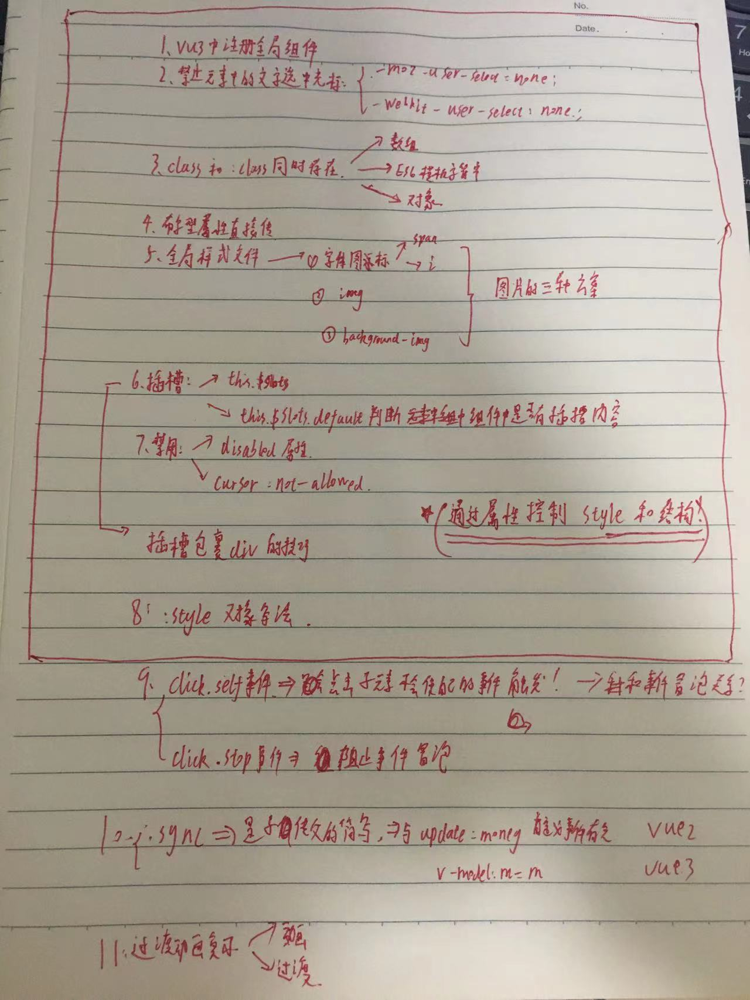


