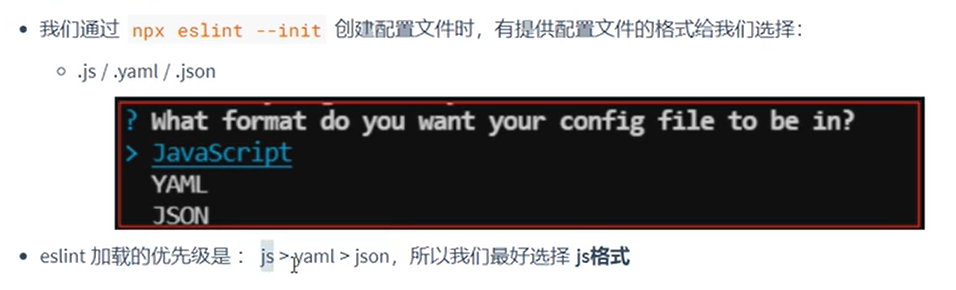
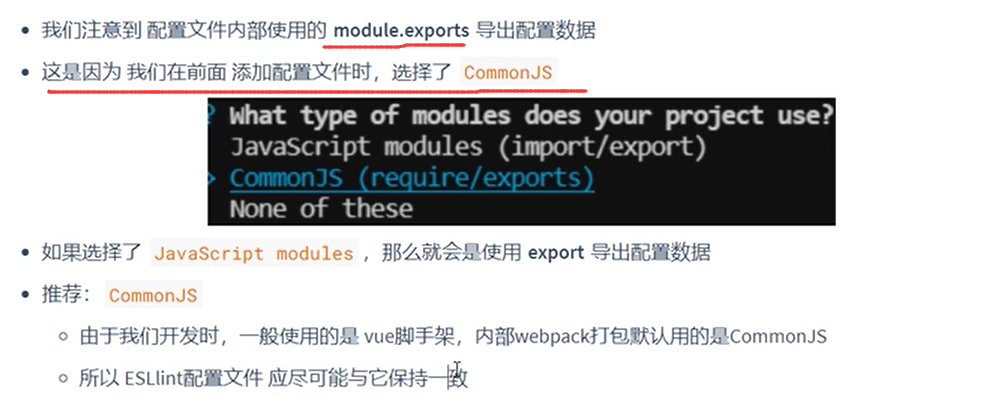
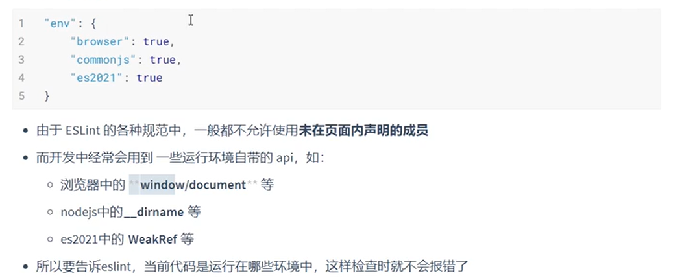
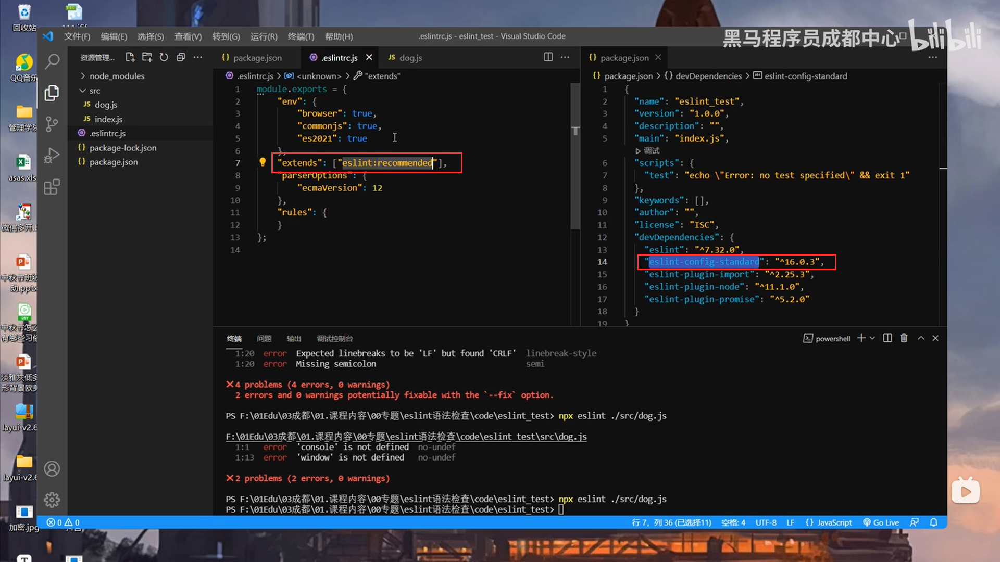

# Eslint&Stylelint

## Eslint

### 1、安装与包结构

### 2、eslint配置文件

- eslint的配置文件就是用来配置使用哪些eslint的规则的，因为它内置了288多个规则，然后甚至还可以自定义规则来使用很叼！
- 如何创建配置文件呢？
  - 
  - **使用npx eslint --init就行了。**
  - 执行以后会让你选择一系列的选项，然后要注意的是，eslint只能检查js的代码规范，所以会有一个选项问你你的项目是什么类型的，你选了项目的框架类型后，就会自动安装这些框架对应的拓展 检查脚本。

- 配置文件浏览：

### 3、执行eslint语法检查

- 执行npx eslint ./文件路径   //这个./当前路径是相对于eslinttc.js配置文件而言的。。
- 
- 结果：

### 4、配置文件常用节点

#### 4.1、.eslintrc.js格式

- 选择javascirpt作为文件的格式。

- **为什么在创建配置文件的时候使用.js文件呢，因为eslint有一个加载的优先级顺序。**

#### 4.2、使用CommonJs的导出格式

- 使用CommonJs的导出方式。

#### 4.3、env节点

- **就是说，像window/document这些全局变量，使用的话可能会在eslint中报错，因为他们没有被声明，所以使用env告诉eslint现在的项目是运行在browser环境中的，window这样的全局变量，你别给我报错！**

#### 4.4、eslint集成规则

- **在extends节点中，我们可以配置使用哪一套eslint集成规则；如果值是 standard，那么就使用依赖中的eslint-config-standard规则；还有eslint:recommended，eslint推荐规则；也可以使用eslint:all 所有规则**。
- 

