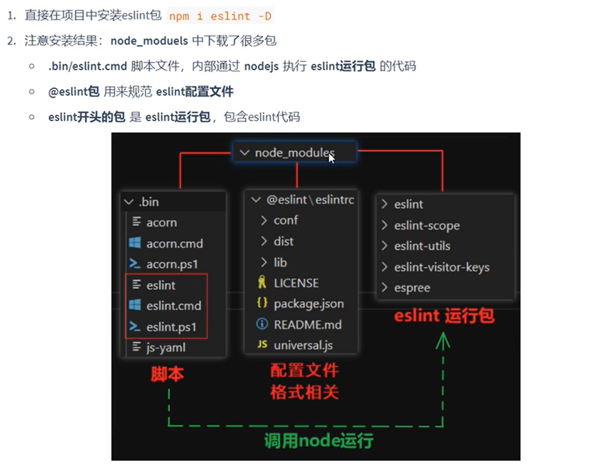
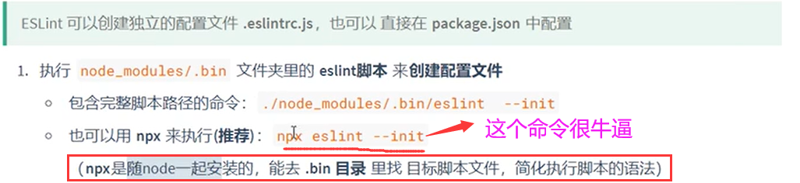
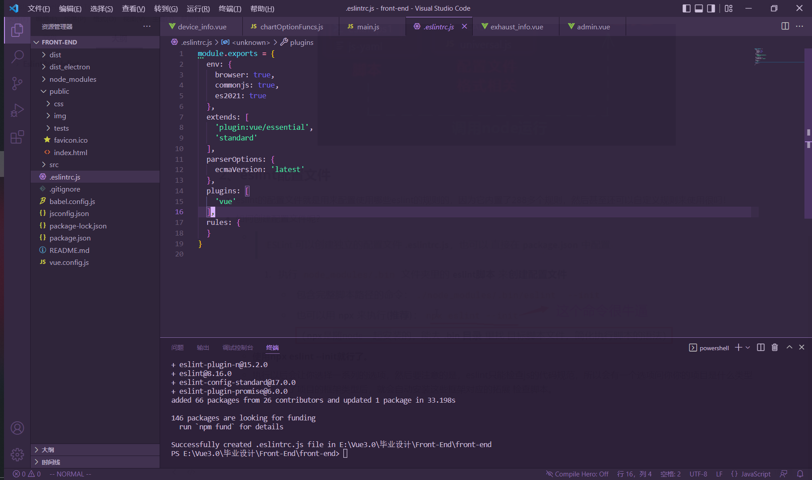
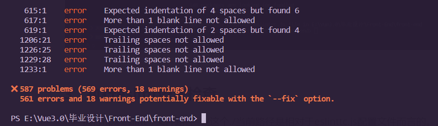

# Eslint&Stylelint

## Eslint

### 1、安装与包结构

### 2、eslint配置文件

- eslint的配置文件就是用来配置使用哪些eslint的规则的，因为它内置了288多个规则，然后甚至还可以自定义规则来使用很叼！
- 如何创建配置文件呢？
  - 
  - **使用npx eslint --init就行了。**
  - 执行以后会让你选择一系列的选项，然后要注意的是，eslint只能检查js的代码规范，所以会有一个选项问你你的项目是什么类型的，你选了项目的框架类型后，就会自动安装这些框架对应的拓展 检查脚本。

- 配置文件浏览：

### 3、执行eslint语法检查

- 执行npx eslint ./文件路径   //这个./当前路径是相对于eslinttc.js配置文件而言的。。
- 
- 结果：

