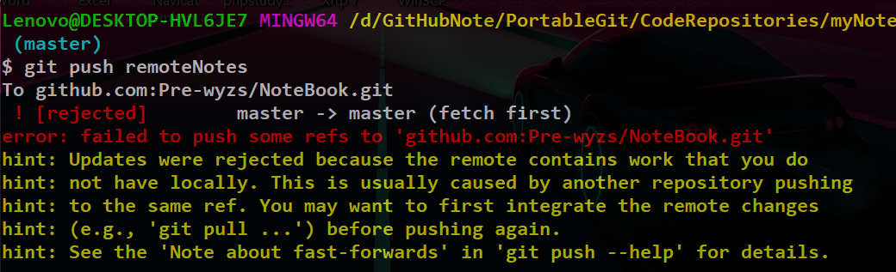

# Git版本管理

# 0、命令官方文档

**想要知道一个git命令最详细的用法可以参考官方文档：**

在bash shell下键入**git 命令名 --help**即可在浏览器打开文档了。

# 1、Git项目管理工具

**==说明：主要就是为了贯彻落实不忘根本的总体大方向，把我所写过的项目都用版本管理工具管理起来，然后一步步的改进，修复项目bug已达到成为项目高手的一个基础目标。==**

**本来是想用svn的但是svn的小bug太多了，所以直接改用git的分支管理了。。。**

教程：https://www.bilibili.com/video/BV1Mt411L7Zx?p=19

打开bash命令行：

- 你会发现可以在windows中使用linux命令了，**其实这个就是一个微型的linux虚拟机。**

# 2、常用Git命令

- 配置git账户名和密码
  - git config --global user.name ''  #配置用户名
  - git config --global user.email ''  #配置邮箱
  - git config user.name  #查看配置的用户名
  - git config user.emael  #查看配置的用户邮箱
- 建立本地git仓库
  - git init  #把当前目录重构为一个git仓库，成功后该目录会出现一个.git的隐藏文件

# 3、git三区分布

- 工作区就是自己的git仓库目录
- 暂存区和版本区都是看不到的。。。

- git add xxx  #将工作文件添加到暂存区
- git add *  #将工作区所有文件添加到暂存区
- git status  #查看缓存区中的文件
- git commit -m '提交信息'  #把缓存区中的文件添加到版本区捏。。。

# 4、git差异对比

对比工作区和暂存区中的文件内容

- git diff 

对比暂存区与版本区中的文件内容

- git diff --cached

对比工作区和版本区中文件内容的不同

- git diff master

# 5、查看版本与版本回退

- git log  #查看每次提交的详细情况
- git reflog  #查看每次提交的精简情况

**==HEAD就是当前的指针所指向的版本，前面的就是版本号，是一串唯一的hash值，回退版本也很简单只要把这个HEAD指针指向先前的版本就行了。==**

版本回退：

# 6、版本分支

***新创建一个分支：**

- git checkout -b 分支名称  #该命令会新建一个分支然后自动切换到该分支下

***查看当前分支：**

- git branch  #查看当前仓库的所有分支；

***切换到指定分支：**

- git checkout 目标分支名

**==对于分支系统，仓库中工作区的文件内容默认都是主分支的内容；如果在控制台切换分支的话，那么在文件夹管理器中的仓库工作区的文件内容就是另一个分支的内容了。。。==**

**==禁止在一个空的枝干中创建新的分支！不然的话会导致严重的报错！==**

**合并分支**

- git merage dev  #在master分支下执行该分支就可以将dev分支与master分支合并了

**分支的合并在真正的开发过程中几乎是没有权利做的，因为一旦合并就会出现上百个冲突，这些冲突的解决一般就是研发组的组长来做的，你没有什么权利去合并分支；啥是冲突呢？就是同一个文件同一行的内容不一样，合并的时候，不知道该听谁的。。。**

**删除分支**

- git branch -d dev  

**差异比对**

# 7、本地仓库同步GitHub

先在github上创建一个新的仓库，然后使用一些命令将仓库和和本地的仓库同步起来。

- **这就是教你怎么创建一个新的仓库然后提交到github上的。**

- 该命令告诉本地仓库你应该关联到哪一个远程的仓库。。。
- origin 代表https://...这一串远程地址的别名

**==把本地仓库的内容同步到GitHub上去：==**

- git push -u origin master  

# 8、分支同步

- git push origin 分支名

# 9、进阶操作

## 9.1、删除仓库

- **直接在github上删除一个仓库的操作**

步骤：https://www.csdn.net/tags/MtTaQgysNTAwNjYtYmxvZwO0O0OO0O0O.html

## 9.2、远程仓库设置

使用git remote add 别名 url/ssh 可以添加https/ssh远程仓库的地址

- **本质上https和ssh是一样的都是远程传输协议，只不过ssh要在本地生成秘钥，然后拷贝到github上，在本地和github上通过秘钥对比一致后再进行传输。【不受仓库作用域制约】**

- **如果别名设置错了想删除**
  - **git remote remove 别名**  **//不会对仓库有任何影响的**

- **查看所有远程仓库别名**
  - **git remote** 

### 9.2.1、bug【远程提交失败】

- 解决：具体的原因不清楚，使用强制提交就完事了
  - **git push -u origin master -f**
- 原因：可能是因为我提交上去的东西，然后我改名了或者删除了，他就有疑问了。。。
- **原因，原来黄色的警告是连在一起的。。。就是说远程仓库中的有的文件在本地仓库中并没有！！！**

- **解决思路：这是因为在工作区的内容没有能重新覆盖版本区，导致版本区和远程冲突了。。。要先同步攻工作区和版本区的内容先！！！**

### 9.2.2、bug【彻底解决】

- 首先git diff命令才是查看 工作区和 暂存区内容不同的，而不是git diff --cached!!!搞得我以为工作区和暂存区是一致的。。。
- 使用git status发现工作区和暂存区中改变。。。
- **使用git rm把在工作区的文件同步暂存区的删除（请注意不要使用提示的git store命令！那是放弃工作区做出的修改！！！）【补充：git rm就是不仅会删除暂存区中的文件，还会连带删除真正在磁盘上的工作区的文件！所以如果你先在工作区删除了目标文件，然后再用git rm 目标文件名它就会提示找不到该文件了！还有注意删除文件夹的时候要加上-r递归删除】**

- 然后再使用git commit到版本库，版本库就和工作区完全一样了！！！，然后再push就可以了！！

**彻底解决：只要工作区和暂存区完全同步就行了，当工作区删除文件时，暂存区应该手动git rm同步！！**

## 9.3、删除文件

如何删除文件内，先点击进入一个文件，然后点击小垃圾桶

- 然后commit就行了

- 注意这个commit只会在进行修改或者删除操作的时候会出现。！

## 9.4、vue项目更新提示

- **这个是没有问题的，就是在更新的暂存区的时候不需要把dist和node_modules中的内容更新的！所以千万不要用add的时候用-f!不然就会把所有的内容都更新了，那就很。。。**

