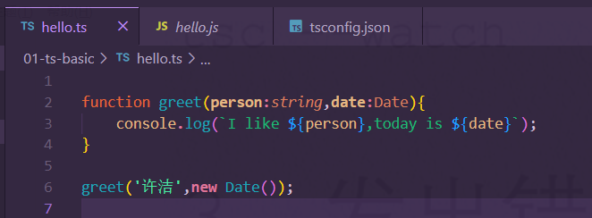

# TypeScript&Vue3教程

js基础教程网址：https://www.w3school.com.cn/js/js_string_methods.asp

教程：https://www.bilibili.com/video/BV1H44y157gq?from=search&seid=1042592919884496342&spm_id_from=333.337.0.0

# 1、介绍

## 1.1、问题发现

- TypeScript是javaScript的静态类型检查器，运行在javaScript之前，能够确保我们类型的正确
- 问题：
  - 
  - 对于fn这个函数来说，x一定得是具有flip对象的一个的函数，而javascript的坏处就是你不知道传入的x对象是否真的有filp()这个函数了。。。只有运行一下才知道。

## 1.2、演练场

https://typescript-play.js.org/

## 1.3、安装使用

- 全局安装npm install typescript  -g

### 1.3.1、编译ts脚本

#### part1：PowerShell执行策略失败

- 使用tsc命令编译脚本，然后报错了。。。。


- 使用Get-ExecutionPolicy后发现执行等级为Restricted，参照官方文档：


- 解决参照官网https://docs.microsoft.com/zh-cn/powershell/module/microsoft.powershell.security/set-executionpolicy?view=powershell-7.2改变执行策略等级即可：


- 执行这行命令就行了：**Set-ExecutionPolicy -ExecutionPolicy RemoteSigned -Scope CurrentUser**

#### part2：编译执行


- **<font color='purple'>使用<font color='red'>tsc hello.ts</font>编译生成hello.js文件，然后使用<font color='red'>node hello.js</font>就可以执行文件中的内容了。</font>**


虽然编译后确实能成功运行，不过出现了一个错误：


### 1.3.2、优化编译


- **<font color='purple'>前面我们发现成功编译js后在ts文件中，报了一个函数重复的错误，使用tsc --init命令就可以解决了。然后又发现ts提示这个参数类型为any，这时在配置文件中把这个"strict":true注释掉就行了。</font>**

- **<font color='purple'>每次修改ts后都要重新用命令生成js就很烦，使用tsc --watch命令进行自动编译，开启后修改ts文件 js也会进行自动的编译的</font>**

- **<font color='purple'>当ts文件有错误的时候，也是可以被编译成js文件的。。。这并不是我们想要发生事件，所以使用tsc -noEmitOnError hello.ts保证该ts文件如果有错误时，是无法更新提交的。【注意得先把原来已经生成的js文件删除掉!】</font>**

### 1.3.3、显示类型



- 不过在编译成js文件后倒不会显示。。。

### 1.3.4、兼容编译

因为上面使用到了ES6的模板字符串，而有些浏览器是不支持ES6语法的，所以得兼容啊。

该配置文件中的这个就行了：


- 你可以改成es5的对吧，也可以改成es3的都行。

### 1.3.5、严格模式


知识储备：

- null和undefine的区别：https://blog.csdn.net/qq_44552416/article/details/123186262
- null就是一个内存小块中，存放的值是**0X000000**；undefine就是内存小块中的值是原先的，没有被修改过的**垃圾数据**

# 2、语法基础

## 2.1、数据类型

- **<font color='purple'>基元数据类型：string、number、boolean</font>**
- **<font color='purple'>修改配置文件的输入和输出：不过不能直接用tsc编译.ts文件的不然这个配置没有用，用tsc --watch就行了。</font>**


## 2.2、数组&any

- 定义数组：


- 定义一个any类型：


- 不过把any去掉的话,ts就能自动判断它的类型了，然后就会报错

  

## 2.3、类型


### 2.3.1、函数类型注释不常用

### 2.3.2、上下文类型


- 在ts中因为names是一个字符串数组了，对吧，所以使用forEach函数中的s就被推断为一个字符串类型的变量了。很正常

### 2.3.3、箭头函数和普通函数的区别

**<font color='red'>箭头函数没有构造函数，普通函数是有构造函数的；箭头函数一个普通函数的表达式罢了；</font>**

### 2.3.4、ts函数参数

- ts中函数参数确定类型


#### part1：可选参数 以及 其调用方法


**==<font color='deeppink'>也就是说对于一个可选参数，在调用前，最好使用第二种调用方式</font>==**


### 2.3.5、多类型

- 这里id就可以传数字或者是字符串了。


- 类型判断使用

  

### 2.3.6、想办法把上述中的参数提取到外面【老套路了】

#### part1:类型别名->和c语言的typedef一个东西

- 微软就是把c++的那一套搬到js上去了，老实说没有什么创新的。

**<font color='purple'>定义新类型的方法：</font>**

- 


### 


### 2.3.7、*接口

- 接口也是一种类型：瞧瞧他像不像c++类内


#### part1:接口继承

- 接口的特性在TS中都有实现了，比如继承。。。


#### part2:type拓展（和上面的本质上一样）


### 2.3.8、类型断言

就是某种情况下ts对返回的值的类型并不清楚，这个时候可以使用类型断言了。


- **==<font color='deeppink'>类型断言由ts编译器删除，不会影响代码的具体行为。</font>==**


### 2.3.9、特定字符串类型（枚举）

- 很简单的，就是说 像'hello'，'许洁'，'你好'这样的字符串也是一种类型，这就叫做特定字符串类型了。**<font color='purple'>就是那个字符串的值已经定下来了嘛，所以叫特定字符串类型嘛，多简单哈哈</font>**


- **<font color='red'>此时的x就是一个'hello'类型的字符串，并且它的值也只能是hello了</font>**

- 

#### part1:特定数字类型


- 这个三元运算符就比较长了。

#### part2:特定布尔类型


#### part3:固定值传参的方法


### 2.3.10、null和undefined类型


### 2.3.11、两个新类型


## 2.4、类型缩小

### 2.4.1 typeof 类型守卫

- **<font color='red'>简单的说就是如果一个形参是 联合类型的，那么在函数的第一步一定是判断这个传进来的参数是什么类型的，然后进行操作，这就是类型守卫</font>**


**==<font color='deeppink'>每次都去用typof类型守卫的话，代码看起来就很丑，所以就有了真值缩小，等值缩小下面的一系列类型缩小方案了！</font>==**


### 2.4.2、真值缩小

- **就是转成bool值好在If分支里面做判断而已。。。**


### 2.4.3、等值缩小

```
function test(x: string | number, y: string | boolean) {
    /**
     * 就是说，判断它们两个的值相等的话，那么这两个的类型一定是相同的，类型都不相同
     * 哪里来的相等呢？所以当它们的值相等的时候，就说明它们都是string类型的
     * 所以没事
     */
    if (x === y) {
        x.toUpperCase();
        y.toLowerCase();
    }

}
```

**==<font color='deeppink'>就是说，如果x 和 y全等的话，说明x和y都是string类型的，自然就都可以调用string的方法喽</font>==**


### 2.4.4、in操作符类型缩小

- *in 运算符是js用来确定某一个对象是否具有某种名称的属性的。*

```ts
// 1、定义一个鸟类型，它是一个对象，里面有一个叫fly的方法，该方法返回值类型为string
type Bird = {fly: () => string}

// 2、定义一个狗类型，它是一个对象，里面有一个叫run的方法，返回值类型为void类型
interface Dog {
    run: () => void
}

function animalFun(animal: Bird | Dog) {
    // 说明它是Bird类型的
    if('fly' in animal) {
        console.log('这是一只小鸟');
        console.log(animal.fly());
    } else {
        console.log('这是一只小狗');
        animal.run();
    }
}
```

**==<font color='deeppink'>就是说，如果animal中有fly属性，说明是Bird类型，就是这么简单嘛</font>==**


### 2.4.5、instanceof缩小


==好像，这个自定义类型不归instanceof来管。。。这就很无语了==


***==<font color='deeppink'>这样子就没有事情了。。。看来instanceof只能适用于极少数的情况</font>==***


### 2.4.6、分配缩小


**==<font color='deeppink'>简单来说就是 因为执行了第一行代码，所以ts就推断常量x的类型是string | number对吧，然后再给x赋值的时候就可以给它赋值为number类型和string类型的变量了。</font>==**


# VUE3

# 1、优化介绍

## 1.1、vue3.0六大优势


## 1.2、优势原因


具体优化的代码实现参考：https://www.bilibili.com/video/BV14k4y117LL?p=2

和https://www.bilibili.com/video/BV14k4y117LL?p=3两个章节。

## 1.3、安装

### 1.3.1、Vite方式

- Vite 是vue作者意图取代webpack的一款打包工具，真的牛逼！


- npm install -g create-vite-app
- create-vite-app 项目名
- 进入项目目录使用npm install安装依赖，然后使用npm run dev运行项目

