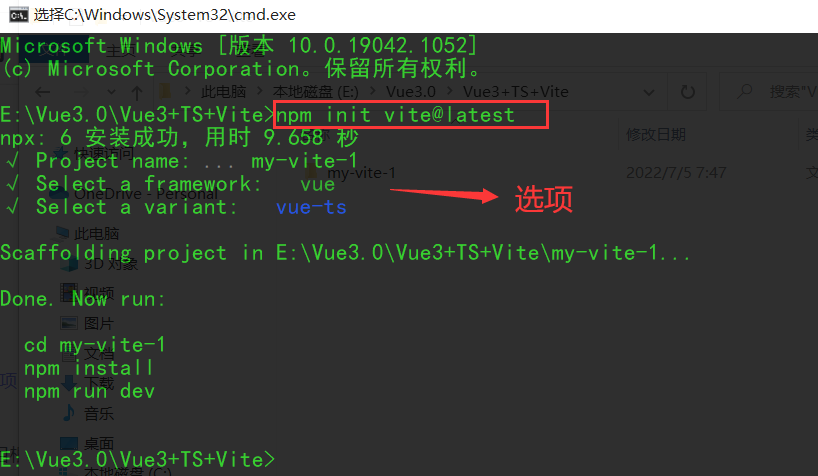

# Vue3 + vite + Ts + pinia


# 1、环境搭建

```bash
npm init vite@latest
```

**==<font color='purple'>在指定的目录下使用这行命令，就能快速的创建一个vite项目了，这个vite应该是我用过的最快的项目构建工具了！</font>==**



## 1.1、三个调试命令

```json

  "scripts": {
    "dev": "vite",
    "build": "vue-tsc --noEmit && vite build",
    "preview": "vite preview"
  },
```

- *命令一：启动开发服务器*
- *命令二：为生产环境打包*
- *命令三：本地预览给生产环境打的包*

## 1.2、vite优势

- 真的很快，要比vue-cli快很多很多！


