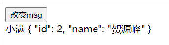
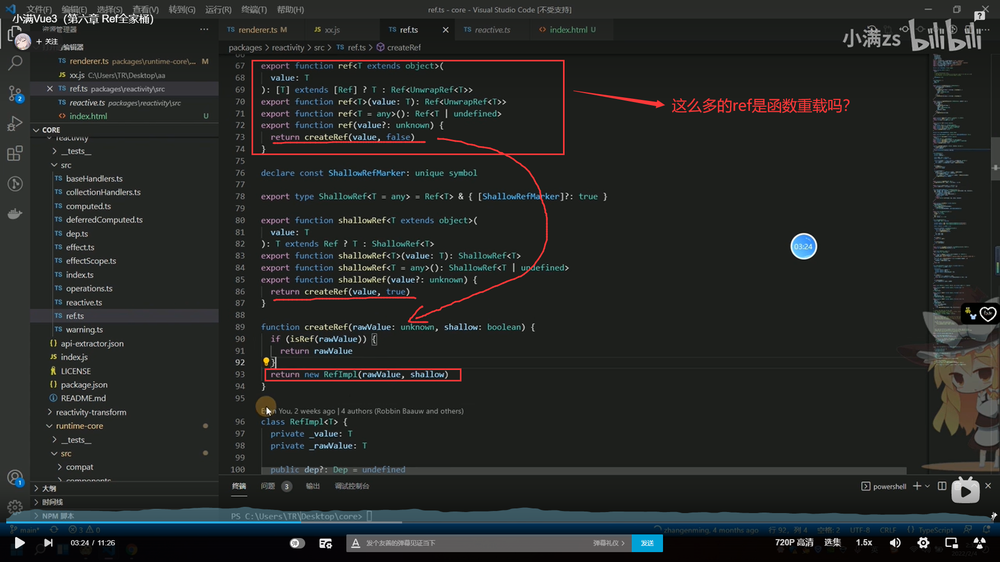

# Vue3 + vite + Ts + pinia

教程：https://www.bilibili.com/video/BV1dS4y1y7vd?p=4&spm_id_from=333.788.header_right.history_list.click


# 1、环境搭建

```bash
npm init vite@latest
```

**==<font color='purple'>在指定的目录下使用这行命令，就能快速的创建一个vite项目了，这个vite应该是我用过的最快的项目构建工具了！</font>==**


## 1.1、三个调试命令

```json

  "scripts": {
    "dev": "vite",
    "build": "vue-tsc --noEmit && vite build",
    "preview": "vite preview"
  },
```

- *命令一：启动开发服务器*
- *命令二：为生产环境打包*
- *命令三：本地预览给生产环境打的包*

## 1.2、vite优势

- 真的很快，要比vue-cli快很多很多！


# 2、NVM、NRM

## 2.1、NVM

- NVM全称就是node.js version management，也就是node的版本管理工具，可以通过这个工具来切换和安装不同版本的node.js
- windows版本下载：https://github.com/coreybutler/nvm-windows/releases

**步骤一：下载安装包**


**步骤二：运行安装程序**


**步骤三：配置镜像（不配置镜像的话，根本没办法下载nodejs的..）**


配置内容如下

```bash
node_mirror: https://npm.taobao.org/mirrors/node/
npm_mirror: https://npm.taobao.org/mirrors/npm/
```

步骤四：使用nvm --help查看命令帮助，然后下载想要的nodejs版本即可。

**<font color='purple'>nvm切换Node环境的原理：就是把所有版本的nodejs安装包都下载到一个文件夹里面，然后再使用bash切换环境变量中的node路径就行了。</font>**

### 2.1.1、nvm use乱码问题

**<font color='purple'>出现乱码是因为cmd的权限不够，使用管理员权限打开cmd然后再nvm use 版本号就行了捏！</font>**


## 2.2、NRM

**介绍：nrm是npm源管理器，允许你在多个npm下载源直接快速切换使用。**

- 下载安装

```bash
npm install nrm -g
```


- 查看所有的源：-》

```bash
nrm ls
```


- 指定源：-》

```bash
nrm use taobao
```

## 2.3、认识目录和SFC

- 下面来讲解一下vite项目文件目录结构


- public目录：
  - public目录存放不需要编译的文件，比如图片和js文件
- src/assets目录：
  - 存放可以被编译的静态文件，存放在这里的图片会被编译   
- 可以在main.ts文件中存放公共API的
- **<font color='purple'>index.html，这个比较重要的，因为它是vite项目的入口文件，像webpack、rollup这些他们的入口文件都是main.js而不是html</font>**

- **<font color='violet'>tsconfig.json：ts的配置文件</font>**

```json
{
  "compilerOptions": {
    "target": "esnext",
    "useDefineForClassFields": true,
    "module": "esnext",
    "moduleResolution": "node",
      /** 严格模式这些东西...*/
    "strict": true,
    "jsx": "preserve",
    "sourceMap": true,
    "resolveJsonModule": true,
    "isolatedModules": true,
    "esModuleInterop": true,
    "lib": ["esnext", "dom"],
    "skipLibCheck": true
  },
  "include": ["src/**/*.ts", "src/**/*.d.ts", "src/**/*.tsx", "src/**/*.vue"],
  "references": [{ "path": "./tsconfig.node.json" }]
}
```

- **<font color='violet'>vite.config.js vite的配置文件</font>**

```json
import { defineConfig } from 'vite'
import vue from '@vitejs/plugin-vue'

// https://vitejs.dev/config/
export default defineConfig({
    // 使用vue()插件来编译vue项目
  plugins: [vue()]
})
```

## 2.4、npm run dev启动vite项目原理

首先在vite的源码下，它的json配置中，配置了在bin目录下有一个vitejs文件


**==<font color='blue'>然后在 npm run dev的时候，会去.bin目录下找到vite脚本并运行，如下：</font>==**


**==<font color='purple'>我们可以看到.cmd脚本中有执行vite.js的命令了，所以当脚本运行的时候，vite项目就启动了！</font>==**


## 2.5、vue3配套插件

- 在vue2中有一款插件，就是vetur这个东西，这个插件可以帮助写vue代码的时候给一些提示，不过vue3中这个插件就没有用了。。。
- vue3中使用的是volar插件来进行vue代码的提示。（注意在使用两个插件中的一个的时候请禁用另一个插件）


安装这两个插件后，还会出现两个小功能


==右边的是预览preview功能，左边的是分块功能，就是可以把逻辑代码和template分开这样子==


## 2.6、模板语法 & vue指令

### 2.6.1、ts定义变量的时候报错


**原因：**

*Typescript将没有导入/导出的文件视为旧脚本文件。这样的文件不是模块，它们的任何定义都已合并到全局名称空间中。 isolatedModules禁止此类文件。*
*将任何导入或导出添加到文件都使其成为一个模块，并且错误消失。*
*export {}也是一种方便的方法，可以在不导入任何内容的情况下使文件成为模块。*

**解决：**

*找到tsconfig.json的配置文件：*
*isolatedModules字段改为false*


***==还有就是定义函数的时候也会报错的，原因是因为vetur这个插件不适用于vue3，把这个插件禁用，然后换成vue3的那个插件就行了==***


### 2.6.2、基础指令

- v-text
- v-html
- v-show：改变display: none而已
- v-if：会注释整个dom的vue3中

- **<font color='deeppink'>v-if、v-else-if、v-else</font>**

```vue
<template>
  <div v-if="msg === 'A'">
    A
  </div>
  <div v-else-if="msg === 'B'">
    B
  </div>
  <div v-else-if="msg === 'C'">
    C
  </div>
  <div v-else-if="msg === 'D'">
    D
  </div>
  <div v-else>
    E
  </div>
</template>

<script setup lang="ts">

  const msg: string = 'H'
  const isShow: boolean = true;

</script>

<style>
</style>

```

- v-bind：就是冒号
- v-on：就是@符号


#### part1、事件冒泡

```vue
  <div @click="parent" class="p">
    <div @click="child" class="c"></div>
  </div>
</template>

<script setup lang="ts">

  const msg: string = "H";

  const isShow: boolean = true;

  const parent = () => {
    console.log("我是父级");
  };

  const child = () => {
    console.log("我是自己");
  };
```


**==红色大框框是父组件，蓝色的框框是子组件，如果点击红色的部分，是不会触发事件冒泡的；点击蓝色的框框就会触发事件冒泡，而且是子盒子先打印，父盒子后打印==**

- 点击红色部分


- 点击蓝色部分


阻止事件冒泡的方法：

```vue
  <div @click="parent" class="p">
    <div @click.stop="child" class="c"></div>
  </div>
```

**==<font color='deepred'>注意：事件冒泡的真正意思是说，子盒子的事件会影响父盒子的事件，为了让子盒子的事件不影响父盒子的事件，就用@click.stop来停止事件冒泡！</font>==**

#### part2、阻止表单提交

```vue
  <form action="/">
    <button type="submit" @click.prevent="handleSubmit">提交</button>
  </form>
```

**==<font color='deepred'>使用.prevent之后，表单就不会提交了，就不会刷新页面了（当然handleSubmit函数还是会执行的）</font>==**

- **<font color='red'>像这样类似的用法还有很多，可以试着玩一下</font>**


#### part3：绑定类/样式

- 绑定样式style

```vue
<template>
  <div :style="sytle">

  </div>

</template>

<script setup lang="ts">

const sytle = {
  height: '200px',
  width: '200px',
  backgroundColor: 'red'
}

</script>
```


- 绑定类

*绑定多个样式：*

```vue
<template>
  <div :class="['a','b']">

  </div>

</template>

<script setup lang="ts">
</script>

<style>
.a{
  width: 200px;
  height: 200px;
}
.b{
  background-color: purple;
}
</style>
```

- ***如果a样式和b样式有冲突的话，b样式会把a样式的冲突覆盖掉的，因为b样式定义在a样式之后***

*条件绑定*

```vue
  <div :class="[flag? 'a':'b']">
  许洁
  </div>
```

*对象绑定*

```vue
<template>
  <div :class="cls">
  许洁
  </div>
</template>

<script setup lang="ts">
type Cls = {
  a: boolean,
  b: boolean
}

const cls: Cls = {
  a:true,
  b:true
}
</script>

<style>
.a {
  color: red;
}
    
.b {
  border: 1px solid purple
}
</style>
```

## 2.7、vue核心虚拟dom和diff算法

- tm的没有听懂...
- 主要就是讲解 数组的响应式变化是怎么实现的吧，tm的


# 3、Ref全家桶

- ***<font color='red'>ref就是把一个值可以变为一个响应式对象的一个函数</font>***

```vue
<template>
  <div>
    <button @click="changeMsg">改变msg</button>
    <div>{{ msg }}</div>
  </div>
</template>
<script setup lang="ts">
import { ref, Ref } from 'vue'

const msg: Ref<string> = ref('小满');

const changeMsg = () => {
  msg.value = 'changed';
  console.log(msg);
}

</script>
```

**==<font color='deeppink'>注意，这里我们用的是ts的语法写的，所以不给msg加上类型说明就会出错的，这里大写的Ref就表示响应式数据的类型的，哈哈，当然你也可以这样写：</font>==**

```js
const msg = ref<string>('小满');
```

- ***<font color='red'>判断是否是响应式数据</font>***

```js
const msg = ref<string>('小满');
let msg2: number = 1;

const changeMsg = () => {
  msg.value = 'changed';
  console.log(isRef(msg));
  console.log(isRef(msg2));
}
```

**==<font color='deeppink'>上面是true，下面是false</font>==**


- ***<font color='red'>浅Ref：shallowRef，创建一个跟踪自身.value的变化的ref，但是不会改变其属性值。</font>***

```js
const msg3: Ref<any> = shallowRef({
  id: 1,
  name: 'zzw'
});


const changeMsg = () => {
  msg3.value.name = '许洁';
}
```

**==<font color='deeppink'>这样子做是没有用的，因为浅ref只能改变.value不能改变对象中属性的值。。。可以这样写</font>==**

```js
const msg3: Ref<any> = shallowRef({
  id: 1,
  name: 'zzw'
});


const changeMsg = () => {
  msg3.value = {
    id: 2,
    name: '许洁'
  };
}
```

**==<font color='deeppink'>就是说，如果一个对象中的属性不是响应式的，就可以用shallowRef来创建该对象的响应式对象，可以节省性能</font>==**


- ***<font color='red'>triggerRef：强制把值更新到dom上去</font>***

**<font color='deepred'>triggerRef可以和shallowRef进行配合，可以完成msg3属性的更新</font>**

```js
const msg3: Ref<any> = shallowRef({
  id: 1,
  name: 'zzw'
});

const changeMsg = () => {
  msg3.value.id = 2;
  triggerRef(msg3);
}
```


- ***<font color='red'>customRef：自动定义Ref函数，这是一个工厂函数，要求我们返回一个对象，并且实现get和set方法</font>***

```js
/** 这就是自定义Ref的标准写法*/
function MyRef<T>(value: T) {
  return customRef((track, trigger) => {
    return {
      get() {
        track();
        return value;
      },
      set(newVlue: T) {
        console.log('set trigger');
          /** 可以在这里进行一些特殊操作的**/
        value = newVlue;
        trigger();
      }
    }
  });
}

const msg4: Ref<any> = MyRef({
  id: 2,
  name: '贺源峰'
});

const changeMsg = () => {
  msg4.value = {
    id:3,
    name:'许洁'
  }
```


## 3.1、小结

**<font color='red'>ref然后是判断isRef，然后是变种shallowRef和triggerRef，然后是自定义的Ref</font>**

**<font color='red'>重点在于引用类型的响应性，使用shallow和trigger配合使用会很好。</font>**


## 3.2、小bug：更新ref后会把shallowRef也给一并更新掉...

```vue
<template>
  <div>
    <button @click="changeMsg">改变msg</button>
    <div>{{msg}} {{ msg4 }}</div>
  </div>
</template>
<script setup lang="ts">
import { ref, Ref, isRef, shallowRef, triggerRef, customRef } from 'vue

const msg: Ref<string> = ref('小满');
const msg4: Ref<any> = MyRef({
  id: 2,
  name: '贺源峰'
});

const changeMsg = () => {
  msg.value = 'xiaoman';
  msg4.value.name = '许洁';
}

</script>
<style>
</style>

```



- **<font color='deeppink'>点击按钮后，小满当然会改变为xiaoman，然后发现 贺源峰也改变成了 许洁？？</font>**


**==<font color='deepred'>这是因为，ref函数的执行在底层源码级别也会执行triggerRef()函数的，所以ref的改变就导致了对象属性值的改变了。</font>==**


## 3.3、ref源码简介



**<font color='deepred'>就是执行ref()函数后会执行createRef()函数，这个函数先判断传进来的是不是ref对象，如果是就直接返回，如果不是就新创建一个RefImpl对象。</font>**


**<font color='deepred'>在类的构造方法中，因为传进来的shallow是false对吧，所以会调用toReactive(value)的方法，我们看看这个方法里面干了些什么</font>**


**<font color='deepred'>判断传进来的是不是数组/对象这样的复杂类型数据，如果是的话就执行reactive()函数。不是的话直接返回value</font>**


**==最后，我们看到get 和 set value方法，这就是为什么要加上.value的原因了，哈哈==**


# 4、Reactive全家桶

**reactive函数可以接收 [] 和 {}这些复杂类型的数据**

```js
const Obj = reactive({
  name: '洛天依',
  age: 18
});

const change = () => {
  Obj.name = '许洁';
}
```

**<font color='deepred'>可以直接改变reactive代理对象的属性，而不需要像ref那样子加上.value了</font>**


**数组赋值注意点**

```js
let arr = reactive<number[]>([1,2,3]);

/** 异步的数组赋值*/
setTimeout(() => {
  let fromBackEnd = [4,5,6];
  arr = fromBackEnd;
},2000);
```

**<font color='deepred'>这样子直接赋值的话，会破坏数组的响应性的！</font>**


- ***解决方案一：使用push + 解构***

```js
let arr = reactive<number[]>([1,2,3]);

/** 异步的数组赋值*/
setTimeout(() => {
  let fromBackEnd = [4,5,6];
  arr.push(...fromBackEnd);
},1000);
```

**==这样子就没有问题了==**

- ***解决方案二：数组外边再套一个对象***

```js
/**定义一种数据类型 */
type O = {
  list: Array<number>
}

let arr = reactive<O>({list:[]});

/** 异步的数组赋值*/
setTimeout(() => {
  let fromBackEnd = [4,5,6];
  arr.list = fromBackEnd;
},1000);
```


## 4.1、readonly

- **拷贝一份proxy对象，然后变为只读**


这样它就会报错了。。。


## 4.2、shallowReactive


**==<font color='deepred'>shallowReactive只会改变最外层的对象属性，不会改变深层对象的属性的，这里这样写是因为深层次也被改变了，原因是因为dom刚刚挂载的时候，会改变的，而当dom挂载完成的时候，再去@click change1和change2的话，change2就不会生效了捏，哈哈</font>==**


教程：https://www.bilibili.com/video/BV1dS4y1y7vd?p=13&vd_source=365d13057e58bb6a007cdd5275785229

## 4.3、toRef，toRefs，toRow

- toRef

```vue
<template> <!-- <div>{{arr}}</div> -->

  <div>{{ state }}</div>
  <button @click="change">改变数据</button>

</template>
<script setup lang="ts">
import { reactive, toRef, toRefs } from 'vue'

const Obj = {
  bar: 1,
  foo: 'hello world!'
}

const state = toRef(Obj, 'bar');

const change = () => {
  state.value ++ ;
  console.log('----原始对象',Obj);
  console.log('state',state);
}
```

==state是bar的响应式代理对象，state.value改变后，Obj原始对象也改了，但是{{state}}视图不会有变化？所以有什么用呢？？？==

==当Obj是reactive的时候，上面的做法才会更新视图==


**==<font color='deepred'>toRefs就是在对象解构的时候，给对象套上防止它解构后，属性失去响应性</font>==**

```js
import { reactive, toRef, toRefs } from 'vue'

const Obj = reactive({
  bar: 1,
  foo: 'hello world!'
})

const { bar, foo } = toRefs(Obj);

const change = () => {
  bar.value ++;
  foo.value = '香草魏梦莹';
}
```

- 这样子直接在template中展示的时候直接展示{{bar}}和{{foo}}就都是响应式的了，嘻嘻


- ***toRow就是把响应式对象又变回非响应式对象了***


