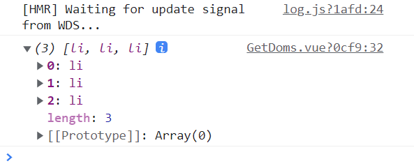
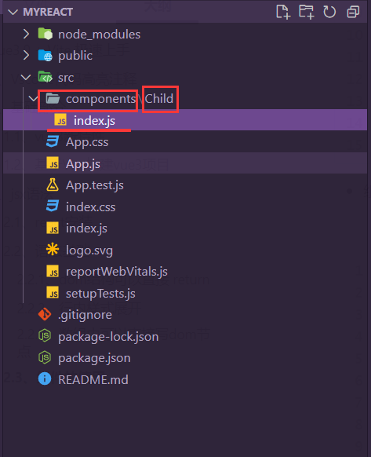

# Vue3.0 + Vite 极速上手

vite官方文档：https://vitejs.bootcss.com/guide/features.html#vue

# 1、基础部分

## 1.1、vue3新特性

### 1.1.1、v-for获取ref dom对象数组的变化

案例：

#### **vue2获取v-for的doms**

```vue
<template>
    <div>
        <ul>
            <li v-for="(item) in data" :key="item.id" ref="person">{{item.name}}</li>
        </ul>
    </div>
</template>
<script>

export default {
  name: 'GetDoms',
  data () {
    return {
      data: [
        {
          id: 1,
          name: 'zzw'
        },
        {
          id: 2,
          name: 'xujie'
        },
        {
          id: 3,
          name: 'hyf'
        }
      ]
    }
  },
  methods: {
    getPerson () {
      console.log(this.$refs.person)
    }
  },
  mounted () {
    this.getPerson()
  }
}
</script>
<style scoped>

</style>

```

**输出：**



==虽然这样也能获取，但是会出现bug不太容易修改！==


#### vue3获取v-for的doms

```vue
<template>
    <div>
        <ul>
            <li v-for="(item) in data" :key="item.id" :ref="person">{{item.name}}</li>
        </ul>
    </div>
</template>
<script>

export default {
  name: 'GetDoms',
  data () {
    return {
      data: [
        {
          id: 1,
          name: 'zzw'
        },
        {
          id: 2,
          name: 'xujie'
        },
        {
          id: 3,
          name: 'hyf'
        }
      ],
      persons: []
    }
  },
  methods: {
    person (el) {
        this.persons.push(el)
    },
    getPerson () {
        console.log(this.persons);
    }
  },
  mounted () {
    this.getPerson();
  }
}
</script>
<style scoped>

</style>
```

**==<font color='red'>原理：vue3在这个方面做了很大的改善，并且这些改进不是向下兼容的！它把ref绑定了一个methods中的函数，然后参数就是每一项的dom，可以把这些dom push到一个数组中，然后就可以任意使用这些dom了</font>==**


### 1.1.2、$children的新变化

**<font color='red'>在vue3.0中，把$children属性去除了，如果想要获取到子组件对象，从而访问子组件的方法和属性，可以在使用子组件的时候添加一个 ref; 然后使用this.$refs.ref名称就可以获取到子组件的对象了</font>**

```vue
<template>
    <div>
        <Child ref="child" msg="你好章子唯"/>
    </div>
</template>
<script>
import Child from './Child.vue'

export default {
    name: 'Father',
    components: {
        Child
    },
    mounted () {
        console.log(this.$refs.child);
    }
}
</script>
<style scoped>

</style>
```

输出：


**==<font color='red'>如果使用this.$refs就可以获取到所有的ref dom对象了</font>==**

```vue
<template>
    <div>
        <Child ref="child" msg="你好章子唯"/>
        <div ref="wmy">魏梦莺</div>
    </div>
</template>
<script>
import Child from './Child.vue'

export default {
    name: 'Father',
    components: {
        Child
    },
    mounted () {
        console.log(this.$refs);
    }
}
</script>
```

输出：


### 1.1.3、vue3.0插槽新变化

- 在vue3中，移除了slot 和 slot-scope两个属性，直接使用 v-slot就行了。


### 1.1.4、响应式系统的更新

**<font color='red'>在vue2中，通过定位数组下标，从而改变数组中某一项的值是不行的。可以说是一个很严重的Bug了</font>**

```vue
<template>
    <div>
        <ul>
            <li v-for="(v,k) in men" :key="k">{{v}}</li>
        </ul>
        <button @click="changeItem">改变数组</button>
    </div>
</template>
<script>

export default {
  name: 'Test',
  data () {
    return {
      men: [
        { id: 1, name: '路飞-v2' },
        { id: 2, name: '鸣人-v2' }
      ]
    }
  },
  methods: {
    changeItem () {
      this.men[1] = { id: 2, name: '许洁-v2' }
    }
  }
}
</script>

```

在vue3中就可以了：


点击后是可以的：


具体的原理比较复杂，目前的我反正是看不懂的：参考

https://www.bilibili.com/video/BV1yK4y1M7Fz?p=5&vd_source=365d13057e58bb6a007cdd5275785229


### 1.1.5、Compesition API

```vue
<template>
    <div>
        <div>{{nu}}</div>
        <button @click="addNu(3)">增加一个数</button>
        <div>{{person.name}}</div>
        <button @click="setPersonName('ty')">改变人的姓名</button>
    </div>
</template>
<script>
import { defineComponent, ref, reactive } from 'vue'

export default defineComponent({
    setup() {
        //ref是用来维护响应式的普通变量的，很少会用到一般开发中都是使用reactive的
        const nu = ref(2)

        //reactive是用来维护响应式的对象，数组的
        const person = reactive({
            id: 1,
            name: 'zzw',
            sex: 1,
            age: 23
        })

        const setPersonName = (setName) => {
            person.name = setName;
        }

        const addNu = (nu1) => {
            nu.value = nu.value + nu1;
        }

        return {
            nu,
            person,
            setPersonName,
            addNu
        }

    },
    mounted () {
        console.log('你好')
    }
})

</script>
<style scoped>

</style>
```

**==<font color='red'>使用reactive函数来维护 对象响应变化；注意在setup函数中定义新的函数，不能使用 setName () {...}这样的方式，不然会报错的，要么使用原生js的 function来定义，要么使用箭头函数来定义；</font>==**

**==<font color='blue'>注意：数组的响应变化使用的ref！比如 const arr = ref([]); 然后使用arr.value来正常访问和使用数组就行了！</font>==**

### 1.1.6、setUp级别的生命周期函数

- setUp函数在组件被创建之前就执行了。。。


所以在setUp函数中是访问不到this的

```vue
<template>
    <div>
        <div>{{nu}}</div>
        <button @click="addNu(3)">增加一个数</button>
        <div>{{person.name}}</div>
        <button @click="setPersonName('ty')">改变人的姓名</button>
    </div>
</template>
<script>
import { defineComponent, ref, reactive } from 'vue'

export default defineComponent({
    setup() {
        console.log(this)

        //ref是用来维护响应式的普通变量的，很少会用到一般开发中都是使用reactive的
        const nu = ref(2)

        //reactive是用来维护响应式的对象，数组的
        const person = reactive({
            id: 1,
            name: 'zzw',
            sex: 1,
            age: 23
        })

        const setPersonName = (setName) => {
            person.name = setName;
        }

        const addNu = (nu1) => {
            nu.value = nu.value + nu1;
        }

        return {
            nu,
            person,
            setPersonName,
            addNu
        }

    },
    created () {
        console.log('--created--',this)
    },
    mounted () {
        console.log('--mounted--',this)
    }
})

</script>
<style scoped>

</style>

```

打印结果：


**==<font color='red'>那访问不到this怎么能在mounted，created这些钩子中调用方法，完成对组件数据的初始化和特殊操作呢？在设计setUp的时候他们也考虑到了这个问题，很简单，在setUp中有对应于vue对象创建阶段钩子函数的方法的：</font>==**


**又因为这些方法不都是定义在setUp中的吗，直接调用就行了，需要注意的是setUp钩子函数需要引入使用！**

```vue
<template>
    <div>
        <div>{{nu}}</div>
        <button @click="addNu(3)">增加一个数</button>
        <div ref="fook">{{person.name}}</div>
        <button @click="setPersonName('ty')">改变人的姓名</button>
    </div>
</template>
<script>
import { defineComponent, ref, reactive, onMounted } from 'vue'

export default defineComponent({
    setup() {
        onMounted (() => {
            //把这个数据想象为就是从后端获取到的
            const name =  '许洁';

            console.log('--setUp onMounted--',setPersonName(name));
        }) 

        //ref是用来维护响应式的普通变量的，很少会用到一般开发中都是使用reactive的
        const nu = ref(2)

        //reactive是用来维护响应式的对象，数组的
        const person = reactive({
            id: 1,
            name: 'zzw',
            sex: 1,
            age: 23
        })

        const setPersonName = (setName) => {
            person.name = setName;
        }

        const addNu = (nu1) => {
            nu.value = nu.value + nu1;
        }

        return {
            nu,
            person,
            setPersonName,
            addNu
        }

    },
    created () {
        console.log('--created--',this)
    },
    mounted () {
        console.log('--mounted--',this)
    }
})

</script>
<style scoped>

</style>

```


## 1.2、基于Vite构建vue3项目

vite官网：https://vitejs.cn/guide/#scaffolding-your-first-vite-project


- webpack打包的过程：


- **<font color='red'>就是传统webpack vue-cli都是经过先经过 编译，然后打包到内存（虽然在磁盘上看不到打包好的代码，但是内存中有！），然后才能进行运行和展示，这就会导致一个问题，你修改一个文件，整个项目就会被重新编译一遍，所以很耗费资源。</font>**

- 再来聊聊为什么需要打包，因为打包现在很多的js代码都是用ES7 ES8的语法的写的，而很多的浏览器根本就不支持这些语法，所以得使用打包工具把代码转成es5的，然后就是文件太分散了，需要打包。


vite原理：


**<font color='red'>就是先启动开发服务器，然后也不用打包，只是服务器请求哪一块内容，就编译那一块的内容执行就完事了，节省了编译和打包的时间。</font>**

- vite在开发环境下，压根就不打包。。。


# 2、jsx语法（三小时快速入门版）

https://www.bilibili.com/video/BV1XV411d7SE?p=8&vd_source=365d13057e58bb6a007cdd5275785229


项目路径：E:\Vue3.0\课程代码\myreact> 


## 2.1、react安装

```bash
npm install create-react-app -g

#创建项目
create-react-app myreact
```


## 2.2、语法基础

### 2.2.1、dom结构可以直接 return

- 就是普通的变量类型如下：
  - let a =1;
  - let b = false;
  - let c = [1,2,3]
  - let d = {
  - a: true
  - b: 'zzw'
  - }
- ***<font color='purple'>现在又多了一种变量类型-></font>***
  - let f = \<div>zzw\</div>

```react
import './App.css';

function App() {
  return (
    <div className='App'>
      hello {2 + 3}
    </div>
  );
}

export default App;

```

**==<font color='red'>return 后面跟上一个()，括号里面只能有一个根元素，然后可以在{}中执行js的语法，类名的关键字是className，不是class了</font>==**

### 2.2.2、行内样式展开

- **<font color='red'>1、行内样式可以直接展开</font>**

```react
import './App.css';

function App() {
  let style = { "font-family":"Italy", "color":"blue", "background-color":"black" };

  return (
    <div className='App' style={style}>
      hello {2 + 3}
    </div>
  );
}

export default App;

```


2、注释使用 /**/写的

### 2.2.3、数组中可以直接写dom节点

**<font color='red'>3、数组中可以直接写div节点</font>**

```react
import './App.css';

function App() {
  let style = { "font-family":"Italy", "color":"blue", "background-color":"black" };

  const arr = [
    <div>许洁</div>,
    <div>李宇涵</div>,
    <div>贺源峰</div>,
  ];

  return (
    <div className='App' style={style}>
      hello {2 + 3}
      //渲染数组中的节点：{}然后直接把这个节点放过来就好了    
      {arr}
    </div>
  );
}

export default App;

```


## 2.3、组件

- 可以这么说，一个React应用就是构建在React组件上的

### 2.3.1、组件定义与使用

- 组件的定义
  - **<font color='red'>导入React和Component类</font>**
  - **<font color='red'>导出Child类继承自 Component</font>**
  - **<font color='purple'>使用render渲染函数导出dom节点</font>**

```react

//note:导入React和Component类
import React, { Component } from "react"

//note:继承Component类导出 Child
export default class Child extends Component {
    render() {
        return (
        <div className="child">
            组件内容
        </div>
        );
    }
}

```

- 组件的使用
  - 导入，然后使用html标签进行使用

```react
import './App.css';
import Child from './components/Child';

function App() {
  return (
    <div>
      <div className='App'>
        <Child></Child>
      </div>
    </div>

  );
}

export default App;
```

- 组件文件的组织结构




### 2.3.2、组件类型

在react中有两种组件的类型，

- 函数式组件和类式组件

#### 1、函数式组件

```react
import './App.css';
import Child from './components/Child';

function App() {
  return (
    <div>
      <div className='App'>
        <Child></Child>
        <FuncComp></FuncComp>
      </div>
    </div>

  );
}

export default App;


function FuncComp () {
  return (
    <div>
      zzw yyds
    </div>
  );
}

```

- **<font color='purple'>*编写一个函数，然后返回值是一个dom节点就行了，注意这里 因为这个文件是一个 \*.js文件，所以这个函数能直接定义在外边*</font>**


### 2.3.3、类组件插槽

- ***插槽定义***

```react
import React, { Component } from "react"

//note:继承Component类导出 Child
export default class Child extends Component {
//构造器函数在render函数的外部
    constructor(props){
        super(props);
    }

    render() {
        return (
        <div className="child">
            组件内容
            {this.props.children}
        </div>
        );
    }
}

```

**<font color='red'>首先constructor函数是类的构造器函数，可以接受外部传进来的props属性，然后使用 {}语法this.porps.children就可以获取到组件起始标签和结束标签中的内容了</font>**

- ***插槽使用***

```react
import './App.css';
import Child from './components/Child';

function App() {
  return (
    <div>
      <div className='App'>
        <Child>
            <!--直接在标签内部写内容就行了-->
          <div style={{ height: `${100}px;`, width: `${100}px;`}}>xujie</div>
        </Child>
      </div>
    </div>

  );
}

export default App;
```


### 2.3.4、函数组件插槽

```react
import './App.css';
// import Child from './components/Child';

function App() {
  return (
    <div>
      <div className='App'>
        {/* <Child>
          <div style={{ height: `${100}px;`, width: `${100}px;`}}>xujie</div>
        </Child> */}
        <FuncComp>
          <p>zzw xihuan xujei </p>
        </FuncComp>
      </div>
    </div>

  );
}

export default App;

const FuncComp = ({children}) => {
  return (
    <div>
      这是函数组件
      {children}
    </div>
  );
}
```

**<font color='red'>就是通过 {} 解构childer对象，然后放到{}里面就行了</font>**


### 2.3.5、state与props（类组件）

**state:**

**在react组件中定义自己的data数据就使用state对象**

```react

import React, { Component } from "react"

export default class Child extends Component {
    constructor(props) {
        super(props);
        //初始化我们的数据=>构造函数里面有this是很平常的对吧
        this.state = { id: 1,name: 'zzw',age: 18 }
    }


    render() {
        return (
            <div className="child">
                <br />
                <button>
                    {/* 数据的使用 */}
                    {this.state.id}
                    {this.state.name}
                    {this.state.age}
                </button>
            </div>
        );
    }
}


```

**==这里的state定义组件数据的方式和vue2中的data简直是一模一样的。。。然后数据的使用方面和vue2比还是差了一点，得使用this.state来对数据进行访问==**


**props**

组件属性：

```react
      <div className='App'>
        <Child title="你好">
        </Child>
        {/* <FuncComp>
          <p>zzw xihuan xujei </p>
        </FuncComp> */}
      </div>
    </div>
```


- 通过props来获取到传过来的属性值

```react

import React, { Component } from "react"

export default class Child extends Component {
    constructor(props) {
        super(props);
        //初始化我们的数据=>构造函数里面有this是很平常的对吧
        this.state = { id: 1,name: 'zzw',age: 18 }
    }


    render() {
        return (
            <div className="child">
                <br />
                <button>
                    {/* 数据的使用 */}
                    {this.state.id}
                    {this.state.name}
                    {this.state.age}
                    {/* 组件属性的使用 */}
                    {this.props.title}
                </button>
            </div>
        );
    }
}
```

- props默认值的定义

```react
    render() {
        return (
            <div className="child">
                <br />
                <button>
                    {/* 数据的使用 */}
                    {this.state.id}
                    {this.state.name}
                    {this.state.age}
                    {/* 组件属性的使用 */}
                    {this.props.title}
                    {/*默认属性的使用*/}
                    {this.props.content}
                </button>
            </div>
        );
    }
}
//和class Child是同一个层级的。
Child.defaultProps = {
    content: '天道酬勤，勤能补拙，熟能生巧'
}

```


### 2.3.6、事件处理

React事件处理和原生的js事件处理是差不多的

```html
//原生事件处理
<button onclick="handleClick();"></button>
```

React事件处理

```react
<button onClick={handleClick}></button>
```

- ***<font color='red'>首先C要大写，事件名采用驼峰命名</font>***

- ***<font color='red'>处理函数应该使用{}包裹</font>***

- ==注意：在调用方法的时候不要直接执行，而是写一个方法名称，所以不要加上()==


示例：

```react
import React, { Component } from "react"

export default class Child extends Component {
    constructor(props) {
        super(props);
        //初始化我们的数据=>构造函数里面有this是很平常的对吧
        this.state = { id: 1,name: 'zzw',age: 18 }
    }

    //定义一个事件处理函数
    handleClick(num) {
        alert(num);
    }


    render() {
        return (
            <div className="child">
                <br />
                <button onClick={this.handleClick}>
                    {/* 数据的使用 */}
                    {this.state.id}
                    {this.state.name}
                    {this.state.age}
                    {/* 组件属性的使用 */}
                    {this.props.title}
                    {this.props.content}
                </button>
            </div>
        );
    }
}

Child.defaultProps = {
    content: '天道酬勤，勤能补拙，熟能生巧'
}
```

**==<font color='red'>这个时候你一定有一个疑问，就是如果不能加()，那么参数应该怎么传递呢？？？</font>==**

### 2.3.7、事件参数

**==<font color='red'>因为我们可以通过 this.props 以及 this.state来获取到所有的内外部数据，所以没有什么太大的必要从()传参数进来了的。</font>==**

```react

    //定义一个事件处理函数
    handleClick() {
        alert(this.state.id);
        console.log(this.props.title);

    }
```

然后就报错了。。。


**==<font color='red'>这里是因为每一个函数都有自己默认的this指向的，所以会报错；解决方案很简单，就是使用显示绑定把Child的this绑定到handleClick函数上</font>==**

```react

import React, { Component } from "react"

export default class Child extends Component {
    constructor(props) {
        super(props);
        //初始化我们的数据=>构造函数里面有this是很平常的对吧
        this.state = { id: 1,name: 'zzw',age: 18 }
    }

    //定义一个事件处理函数
    handleClick() {
        alert(this.state.id);
        console.log(this.props.title);

    }


    render() {
        return (
            <div className="child">
                <br />
                {/*显示绑定this指针*/}
                <button onClick={this.handleClick.bind(this)}>

                    {this.state.id}
                    {this.state.name}
                    {this.state.age}

                    {this.props.title}
                    {this.props.content}
                </button>
            </div>
        );
    }
}

Child.defaultProps = {
    content: '天道酬勤，勤能补拙，熟能生巧'
}

```

**==<font color='red'>从这里我们可以看出来，就是constructor函数和render函数都是自动绑定的Chlid的this指向的，而其他自定义的函数是需要通过显示绑定才行</font>==**

==我们也可以从显绑中传递参数，但没有什么必要==

```react

import React, { Component } from "react"

export default class Child extends Component {
    constructor(props) {
        super(props);
        //初始化我们的数据=>构造函数里面有this是很平常的对吧
        this.state = { id: 1,name: 'zzw',age: 18 }
    }

    //定义一个事件处理函数
    handleClick(num) {
        //获取参数
        let newNum = this.state.id + num; 
        console.log(newNum);

        //修改响应式数据
        this.setState({id:newNum});


        alert(this.state.id);
        console.log(this.props.title);

    }


    render() {
        return (
            <div className="child">
                <br />
                <button onClick={this.handleClick.bind(this,2)}>
                    {/* 数据的使用 */}
                    {this.state.id}
                    {this.state.name}
                    {this.state.age}
                    {/* 组件属性的使用 */}
                    {this.props.title}
                    {this.props.content}
                </button>
            </div>
        );
    }
}

Child.defaultProps = {
    content: '天道酬勤，勤能补拙，熟能生巧'
}
```

在onClikc中使用箭头函数。。。。

```react
```


### 2.3.8、条件渲染

**使用三目运算符或者&&（短路运算）**


### 2.3.9、列表渲染

```react
import './App.css';
import Child from './components/Child';

function App() {
  let arr = ['vue', 'react', 'anglar'];
  return (
    <div>
      <div className='App'>
        <Child title="你好">
        </Child>
        {/* <FuncComp> <p>zzw xihuan xujei </p> </FuncComp> */}
        {
          arr.map((item,index,arr) => {
            return (
              <div>
                {item}
              </div
            )
          })
        }

      </div>
    </div>

  );
}

export default App;
```

### 2.3.10、class动态绑定

```react

import React, { Component } from "react"
import './child.css'

export default class Child extends Component {
    constructor(props) {
        super(props);
        //初始化我们的数据=>构造函数里面有this是很平常的对吧
        this.state = { id: 1, name: 'zzw', age: 18, style: 'main' }
    }

    //定义一个事件处理函数
    handleClick(num) {
        //获取参数
        let newNum = this.state.id + num;
        console.log(newNum);

        //修改响应式数据
        this.setState({ id: newNum });

        alert(this.state.id);
        console.log(this.props.title);

    }

    //动态绑定的代码：
    changeStyle() {
        if (this.state.style === 'main') {
            // this.setState({});
            this.setState({style: ''});
        }else {
            this.setState({style: 'main'});
        }

    }


    render() {
        return (
            <div className={this.state.style}>
                <br />
                <button onClick={() => { this.handleClick(-2) }}>
                    {/* 数据的使用 */}
                    {this.state.id}
                    {this.state.name}
                    {this.state.age}
                    {/* 组件属性的使用 */}
                    {this.props.title}
                    {this.props.content}
                </button>

                <button onClick={() => { this.changeStyle() }}>
                    切换颜色
                </button>
            </div>
        );
    }
}
```

**==<font color='red'>本质就是使用{}语法，把className绑定了一个state属性，然后点击触发改变state属性的方法就可以了，太经典了。注意这里不能使用 this.state.style = '' 来改变它的值，因为这要会使得this.state.style的响应式取消。</font>==**


### 2.3.11、表单双向绑定

```react

import React,{ Component } from 'react'

export default class Input extends Component {
    constructor(props) {
        super(props);
        this.state = { id: 1 , value: ''};
    }

    changeIns (e) {
        this.setState({value: e.target.value});
    }

    render () {
        return (
            <div>
                <input type='text' value={this.state.value} onChange = {(e) => {this.changeIns(e)}}></input>
                {this.state.value}
            </div>
        )
    }

}

```

**==<font color='red'>道理就是 在表单内容发生一点点变化的时候（onChange事件）就调用函数处理把this.state.value重新赋值为 e.target.value（原生组件事件响应）</font>==**


### 2.3.12、使用回调函数把子组件数据传递给父组件

- **==<font color='purple'>回调函数的核心要义在于：使用子组件的属性去接收来自父组件的函数指针就行了，然后那个属性就是一个函数的指针。</font>==**

示例：

```react
import React,{ Component } from 'react'

export default class Input extends Component {
    constructor(props) {
        super(props);
        this.state = { id: 1 , value: ''};
    }

    changeIns (e) {
        this.setState({value: e.target.value});
    }

    //回调父组件方法
    callbcakFather () {
        this.props.father();
    }


    render () {
        return (
            <div>
                <input type='text' value={this.state.value} onChange = {(e) => {this.changeIns(e)}}></input>
                {this.state.value}
                {/* 通过方法回调父组件的函数 */}
                <button onClick={this.callbcakFather.bind(this)}>回调一</button>

                {/* 直接调用回调函数 */}
                <button onClick={this.props.father}>回调二</button>

                {/* 通过箭头函数来进行调用 */}
                <button onClick={() => {this.props.father()}}>回调三</button>

            </div>
        )
    }

}

```


