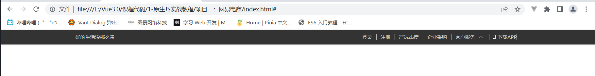
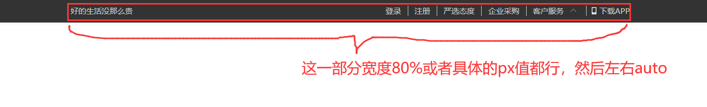
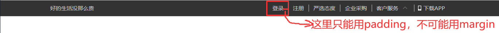
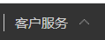
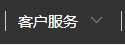

# 原生JS实战（系统性讲解一）

教程：https://www.bilibili.com/video/BV13f4y1s7Da?from=search&seid=17366251905760456780&spm_id_from=333.337.0.0&vd_source=365d13057e58bb6a007cdd5275785229


# 1、样式重置

```css
/** 公共样式 */
* {
    margin: 0;
    padding: 0;
    box-sizing: border-box;
}

body {
    /** 这些是该项目中的整体色调 */
    font-size: 14px;
    color: #333;
    font-family: "微软雅黑";
}

ul,ol {
    /** 把列表的原点给去掉 */
    list-style: none;
}

img {
    border: none; /** IE浏览器可能会有图片默认边框的效果啊，进行兼容性处理*/
    vertical-align: middle;  /** 这就是用来解决一堆img后面的莫名奇妙的空隙的！*/
}

a {
    text-decoration: none;
    color: #333;
}

a:hover {
    color: #b4a073;
}

input {
    vertical-align: middle;
    border: 1px solid #ccc;
}
label {
    vertical-align: middle;
}

table {
    /** 改变默认表格的边框样式*/
    border-collapse: collapse;
}


/**常用类*/
.center {
    width: 1090px;
    margin: 0 auto;
}
.left {
    float: left;
}
.right {
    float: right;
}
/** 清除浮动 */
.clearfix::after {
    content:'';
    clear: both;
    display: block;
}

/** 设置要放大缩小的图片，前面加一个标识类 ， 然后这个是初始的样式 */
.scaleImg img {
    transition: 1s ease-out;
    transform: scale(1);
}
.scaleImg:hover img {
    transform: scale(1.1);
}

/** 图片懒加载，只加载可视区域中的图片 */
/**
图片懒加载就是先放上一张背景图片，
然后在滚动到视窗的时候，再把图片的src用js赋值上去就行了
*/
.original {
    background: #f4f4f4 url() center no-repeat;
}

```

**<font color='deepred'>这里其实很有门道，1、img的vertical-align: middle;可以解决，img的外框底部缝隙的问题；2、然后是通过border-collapse: collapse;改变table表格的边框样式；3、公共类样式的抽离的思想，也很经典。</font>**


# 2、页面头结构与样式

## 2.1、第一节

**<font color='red'>头部样式design</font>**

```html
        <!-- 页面头一 -->
        <div class="head">
            <!-- 居中并且父级要清除浮动的 -->
            <div class="center clearfix">
                <div class="left">
                    好的生活没那么贵
                </div>
                <div class="right">
                    <ul>
                        <li><a href="#">登录</a></li>
                        <li><a href="#">注册</a></li>
                        <li><a href="#">严选态度</a></li>
                        <li><a href="#">企业采购</a></li>
                        <li><a href="#" class="customer">客户服务</a></li>
                        <li><a href="#" class="download">下载APP</a></li>
                    </ul>
                </div>
            </div>
        </div>
```




### part1、布局设计



**<font color='deepred'>这个设计也可以用在flex布局上面的，用一个大框框把左右两个小框框套起来，然后调整大框框的width值和margin左右的值来实现其布局，真是很精妙的，相比于在最外面用flex，然后用左右两个框框用margin撑开，这种结构就显得很有整体性，将来要调的时候，只要调一调width和左右margin就行了，非常方便!</font>**

### part2、竖线距离设计




### part3、图片文字排版设计



**<font color='deepred'>左边的向上小图标怎么给它加上去呢？如果使用左右flex布局，然后右边用img标签的话，一定会调整img的margin从而实现文字和图片竖着对齐的，但是很麻烦的！它的设计思路就是用padding-right把右边扩张开来，然后用背景图片的position来调整移动位置就行了，确实相当方便，没有用到多余的框框，和margin的调整了，这才是最优方案啊！</font>**

### part4、箭头上下切换设计



**==<font color='deeppink'>这个老经典了，只要在hover的时候换一张背景图片就行了。</font>==**
