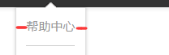
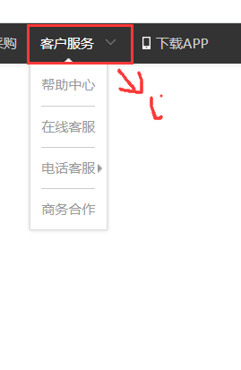
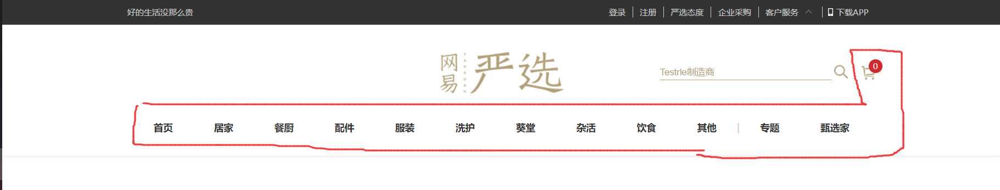
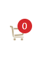
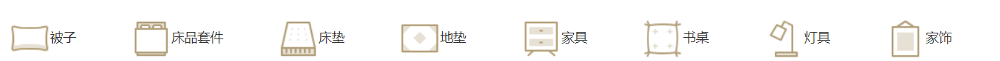

# 原生JS实战（系统性讲解一）

教程：https://www.bilibili.com/video/BV13f4y1s7Da?from=search&seid=17366251905760456780&spm_id_from=333.337.0.0&vd_source=365d13057e58bb6a007cdd5275785229


# 1、样式重置

```css
/** 公共样式 */
* {
    margin: 0;
    padding: 0;
    box-sizing: border-box;
}

body {
    /** 这些是该项目中的整体色调 */
    font-size: 14px;
    color: #333;
    font-family: "微软雅黑";
}

ul,ol {
    /** 把列表的原点给去掉 */
    list-style: none;
}

img {
    border: none; /** IE浏览器可能会有图片默认边框的效果啊，进行兼容性处理*/
    vertical-align: middle;  /** 这就是用来解决一堆img后面的莫名奇妙的空隙的！*/
}

a {
    text-decoration: none;
    color: #333;
}

a:hover {
    color: #b4a073;
}

input {
    vertical-align: middle;
    border: 1px solid #ccc;
}
label {
    vertical-align: middle;
}

table {
    /** 改变默认表格的边框样式*/
    border-collapse: collapse;
}


/**常用类*/
.center {
    width: 1090px;
    margin: 0 auto;
}
.left {
    float: left;
}
.right {
    float: right;
}
/** 清除浮动 */
.clearfix::after {
    content:'';
    clear: both;
    display: block;
}

/** 设置要放大缩小的图片，前面加一个标识类 ， 然后这个是初始的样式 */
.scaleImg img {
    transition: 1s ease-out;
    transform: scale(1);
}
.scaleImg:hover img {
    transform: scale(1.1);
}

/** 图片懒加载，只加载可视区域中的图片 */
/**
图片懒加载就是先放上一张背景图片，
然后在滚动到视窗的时候，再把图片的src用js赋值上去就行了
*/
.original {
    background: #f4f4f4 url() center no-repeat;
}

```

**<font color='deepred'>这里其实很有门道，1、img的vertical-align: middle;可以解决，img的外框底部缝隙的问题；2、然后是通过border-collapse: collapse;改变table表格的边框样式；3、公共类样式的抽离的思想，也很经典。</font>**

## 要点总结：

### part1：消除列表圆点

这个东西很常见，但是我经常忘记，这回就好好的记下来，以备忘记！

```css
ul,ol {
    /** 把列表的原点给去掉 */
    list-style: none;
}
```

### part2：消除图片边框以及底部空白

```css
img {
    border: none; /** IE浏览器可能会有图片默认边框的效果啊，进行兼容性处理*/
    vertical-align: middle;  /** 这就是用来解决一堆img后面的莫名奇妙的空隙的！*/
}
```

### part3：消除a标签下划线

```css
a {
    text-decoration: none;
    color: #333;
}
```

### part4：input框公共样式

```css
input {
    vertical-align: middle;
    border: none;
    outline: none;
}
```

**<font color='deepred'>把默认的边框去掉，到时候可以自己决定想要加什么样的边框；然后把outline去掉，点击的时候就不会弹出大的黑色框框了，哈哈</font>**

### part5：清除表格的默认边框

```css
table {
    /** 改变默认表格的边框样式*/
    border-collapse: collapse;
}
```

### part6：常用类

#### 1、图片放大特效

**<font color='deeppink'>有一种特效，就是鼠标hover到图片上的时候，图片就会自动放大了一点，这个我们可以把它做成常用类，如下所示</font>**

```css
/** 设置要放大缩小的图片，前面加一个标识类 ， 然后这个是初始的样式 */
.scaleImg img {
    transition: 1s ease-out;
    transform: scale(1);
}
.scaleImg:hover img {
    transform: scale(1.1);
}
```

#### 2、图片懒加载

**<font color='deeppink'>当图片有很多的时候，没有必要一次性把所有的图片都加载到页面上，那样很消耗带宽，当滚动到视口的时候再把图片的src赋值上去就行了</font>**

```css
/** 图片懒加载，只加载可视区域中的图片 */
/**
图片懒加载就是先放上一张背景图片，然后在滚动到视窗的时候，再把图片的src用js赋值上去就行了
*/
.original {
    background: #f4f4f4 url(../img/original.png) center no-repeat;
}
```


# 2、页面头结构与样式

## 2.1、第一节

**<font color='red'>头部样式design</font>**

```html
        <!-- 页面头一 -->
        <div class="head">
            <!-- 居中并且父级要清除浮动的 -->
            <div class="center clearfix">
                <div class="left">
                    好的生活没那么贵
                </div>
                <div class="right">
                    <ul>
                        <li><a href="#">登录</a></li>
                        <li><a href="#">注册</a></li>
                        <li><a href="#">严选态度</a></li>
                        <li><a href="#">企业采购</a></li>
                        <li><a href="#" class="customer">客户服务</a></li>
                        <li><a href="#" class="download">下载APP</a></li>
                    </ul>
                </div>
            </div>
        </div>
```


### part1、布局设计


**<font color='deepred'>这个设计也可以用在flex布局上面的，用一个大框框把左右两个小框框套起来，然后调整大框框的width值和margin左右的值来实现其布局，真是很精妙的，相比于在最外面用flex，然后用左右两个框框用margin撑开，这种结构就显得很有整体性，将来要调的时候，只要调一调width和左右margin就行了，非常方便!</font>**

### part2、竖线距离设计


- margin
- padding

**其实就是遇到空格的唯一处理办法嘛...**


### part3、图片文字排版设计


**<font color='deepred'>左边的向上小图标怎么给它加上去呢？如果使用左右flex布局，然后右边用img标签的话，一定会调整img的margin从而实现文字和图片竖着对齐的，但是很麻烦的！它的设计思路就是用padding-right把右边扩张开来，然后用背景图片的position来调整移动位置就行了，确实相当方便，没有用到多余的框框，和margin的调整了，这才是最优方案啊！</font>**

### part4、箭头上下切换设计


**==<font color='deeppink'>这个老经典了，只要在hover的时候换一张背景图片就行了。</font>==**


### part5、发光边框

**<font color='red'>发光边框这个老经典了，也被公猪坑过，其实很简单的，发光的关键点在于box-shadow，嘻嘻</font>**

```css
border: 1px solid #ccc;
box-shadow: 0 0 3px #999;
```


### part6、底部边框短横线



**<font color='red'>a标签（display:inline-block），左右margin一下就行了</font>**


### part7、挤出去形成下拉列表框




**<font color='red'>下拉列表框是被a标签挤出去的</font>**

```html
                        <li>
                            <a href="#" class="customer">客户服务</a>
                            <ul>
                                <li><a href="">帮助中心</a></li>
                                <li><a href="">在线客服</a></li>
                                <li class="phone">
                                    <a href="">电话客服
                                        <div>
                                            <p>400-09-163</p>
                                            <p>9:00-22:00</p>
                                        </div>
                                    </a>
                                </li>
                                <li><a href="">商务合作</a></li>
                            </ul>
                        </li>
```


### part8、显隐用display:none来显示


tips：

1、postion:absolute和relative需要设置宽高

2、display:inlile-block后行内标签才可以设置宽高

### part9、框框宽和高的设定

- **<font color='red'>用font-size和line-height去撑开整个元素，而不是固定宽高后再对font-size和line-height调整！</font>**
- **<font color='red'>用img撑开来</font>**

**==总的原则就是内撑外==**

## 2.2、第二节（固定式导航结构）

**==<font color='red'>这一张主要要讲的是吸顶导航这个神奇的导航样式</font>==**



这一部分的结构主要如下：

```html
        <nav class="nav">
            <div class="center clearfix">
                <a href="#" class="logo"></a>
                <div class="navBar">
                    <ul>
                        <li><a href="#" class="active">首页</a></li>
                        <li><a href="#">居家</a></li>
                        <li><a href="#">餐厨</a></li>
                        <li><a href="#">配件</a></li>
                        <li><a href="#">服装</a></li>
                        <li><a href="#">洗护</a></li>
                        <li><a href="#">葵堂</a></li>
                        <li><a href="#">杂活</a></li>
                        <li><a href="#">饮食</a></li>
                        <li><a href="#">其他</a></li>
                        <li class="seprate">|</li>
                        <li><a href="#">专题</a> </li>
                        <li><a href="#">甄选家</a> </li>
                    </ul>
                </div>
                <!-- 购物车 -->
                <div class="cartWrap">
                    <!-- 左上角数字部分 -->
                    <i>0</i>
                    <div class="cart">
                        <div class="list">
                            <ul>
                                <li>
                                    <a href=""></a>
                                    <div class="productInfo">
                                        <p><a href="">领尖扣商务免烫衬衫</a></p>
                                        <p>白色 Lx 1</p>
                                    </div>
                                    <div class="price">$230.89</div>
                                    <div class="close">X</div>
                                </li>
                                <li>
                                    <a href=""></a>
                                    <div class="productInfo">
                                        <p><a href="">领尖扣商务免烫衬衫</a></p>
                                        <p>白色 Lx 1</p>
                                    </div>
                                    <div class="price">$230.89</div>
                                    <div class="close">X</div>
                                </li>
                                <li>
                                    <a href=""></a>
                                    <div class="productInfo">
                                        <p><a href="">领尖扣商务免烫衬衫</a></p>
                                        <p>白色 Lx 1</p>
                                    </div>
                                    <div class="price">$230.89</div>
                                    <div class="close">X</div>
                                </li>
                                <li>
                                    <a href=""></a>
                                    <div class="productInfo">
                                        <p><a href="">领尖扣商务免烫衬衫</a></p>
                                        <p>白色 Lx 1</p>
                                    </div>
                                    <div class="price">$230.89</div>
                                    <div class="close">X</div>
                                </li>
                                <li>
                                    <a href=""></a>
                                    <div class="productInfo">
                                        <p><a href="">领尖扣商务免烫衬衫</a></p>
                                        <p>白色 Lx 1</p>
                                    </div>
                                    <div class="price">$230.89</div>
                                    <div class="close">X</div>
                                </li>
                            </ul>
                            <!-- *重要：自定义滚动条 -->
                            <div class="scrollBar">
                                <span class="topBtn"></span>
                                <div class="scrollWrapper">
                                    <div class="scroll">
                                    </div>
                                </div>
                                <span class="bottomBtn"></span>
                            </div>
                        </div>
                        <div class="total">
                            商品合计:<span>$751.00</span><a href="">去购物车结算</a>
                        </div>
                    </div>
                </div>
                <div class="login">
                    <a href="">登录</a>
                    <a href="">注册</a>
                </div>
            </div>
            
            ......
```


**<font color='deepred'>还是经典的 div > div.center的模式，最左边的a标签中是一张图片，不过因为这个图片在导航吸顶的时候才会显示，所以得先display:none，然后是ul>li列表，这个列表横向排列的方式很JB骚！他是通过display: inile-block进行横向排列的，我去</font>**

**<font color='red'>横向布局的三种方法：</font>**

- display: flex
- float: left
- display: inile-block

**<font color='deeppink'>心得：个人以为，当你看到ui图的时候，应该要先规划好结构，然后再根据结构去写样式，有什么样的结构就有什么样的样式，这是一个不变的先后顺序吧，如果你反过来，根据样式去调整结构的话，那就必然会出现一个现象，就是冗余的结构！</font>**

**<font color='blue'>样式表</font>**（部分）

```css
navBar {
    /** 外级font-sieze:0px然后内部级别font-size:14px这样做，元素的间隔就完全消失了...*/
    font-size: 0px;
    text-align: center;
}

.navBar li {
    display: inline-block; /*直接按照行来排列了，太tm的骚了! */
    height: 50px;
    font-size: 14px;
    padding: 0px 30px;
}

.navBar li a {
    font-weight: bold;
    padding-bottom: 5px;
}

.navBar li.seprate {
    padding: 0px 0px;
    color: #ccc;
}

.navBar li a:hover {
    border-bottom: 3px solid #b4a073;
}
```

- ***这里又涉及到一个小技巧，就是li标签是有间距的，通过外级的font-size: 0px然后设置li中字体的大小，才能把这个莫名奇妙的间距给无掉，这也是ul li 的特殊性吧...***


### part1：竖线设置

```css
                        <li class="seprate">|</li>
```

**<font color='deeppink'>我们一般通过设置border来设置竖线，但是这样做有一个问题，就是竖线的长度和盒模型的边长是绑定的，这就导致想要调整border的长度很麻烦。。。所以就有了上面的方法，直接自己设置一个竖线，然后通过font-size来调整长度就行了，嘻嘻</font>**


### part2：购物车样式



它的结构如下：

```html
                <!-- 购物车 -->
                <div class="cartWrap">
                    <!-- 左上角数字部分 -->
                    <i>0</i>
                    <div class="cart">
                        <div class="list">
                            <ul>
                                <li>
                                    <a href=""></a>
                                    <div class="productInfo">
                                        <p><a href="">领尖扣商务免烫衬衫</a></p>
                                        <p>白色 Lx 1</p>
                                    </div>
                                    <div class="price">$230.89</div>
                                    <div class="close">X</div>
                                </li>
                                <li>
                                    <a href=""></a>
                                    <div class="productInfo">
                                        <p><a href="">领尖扣商务免烫衬衫</a></p>
                                        <p>白色 Lx 1</p>
                                    </div>
                                    <div class="price">$230.89</div>
                                    <div class="close">X</div>
                                </li>
                                <li>
                                    <a href=""></a>
                                    <div class="productInfo">
                                        <p><a href="">领尖扣商务免烫衬衫</a></p>
                                        <p>白色 Lx 1</p>
                                    </div>
                                    <div class="price">$230.89</div>
                                    <div class="close">X</div>
                                </li>
                                <li>
                                    <a href=""></a>
                                    <div class="productInfo">
                                        <p><a href="">领尖扣商务免烫衬衫</a></p>
                                        <p>白色 Lx 1</p>
                                    </div>
                                    <div class="price">$230.89</div>
                                    <div class="close">X</div>
                                </li>
                                <li>
                                    <a href=""></a>
                                    <div class="productInfo">
                                        <p><a href="">领尖扣商务免烫衬衫</a></p>
                                        <p>白色 Lx 1</p>
                                    </div>
                                    <div class="price">$230.89</div>
                                    <div class="close">X</div>
                                </li>
                            </ul>
                            <!-- *重要：自定义滚动条 -->
                            <div class="scrollBar">
                                <span class="topBtn"></span>
                                <div class="scrollWrapper">
                                    <div class="scroll">
                                    </div>
                                </div>
                                <span class="bottomBtn"></span>
                            </div>
                        </div>
                        <div class="total">
                            商品合计:<span>$751.00</span><a href="">去购物车结算</a>
                        </div>
                    </div>
                </div>
```

**要点就是cartWrap设置背景图片，然后i标签定位上去就行了。**

### part3：换行



- 怎么把文字换到下一行？

```html
                    <li> <a href="">被子</a> </li>
```

**<font color='red'>这是它的结构，所以很简单，只要让img为display: block换行，文字就到下一行去了，哈哈</font>**


