# 开发思路与BUG合集

# 1、bug1

**==<font color='red'>问题描述：在methods中写好的函数在调用时候出bug：表示该函数不是一个函数....</font>==**


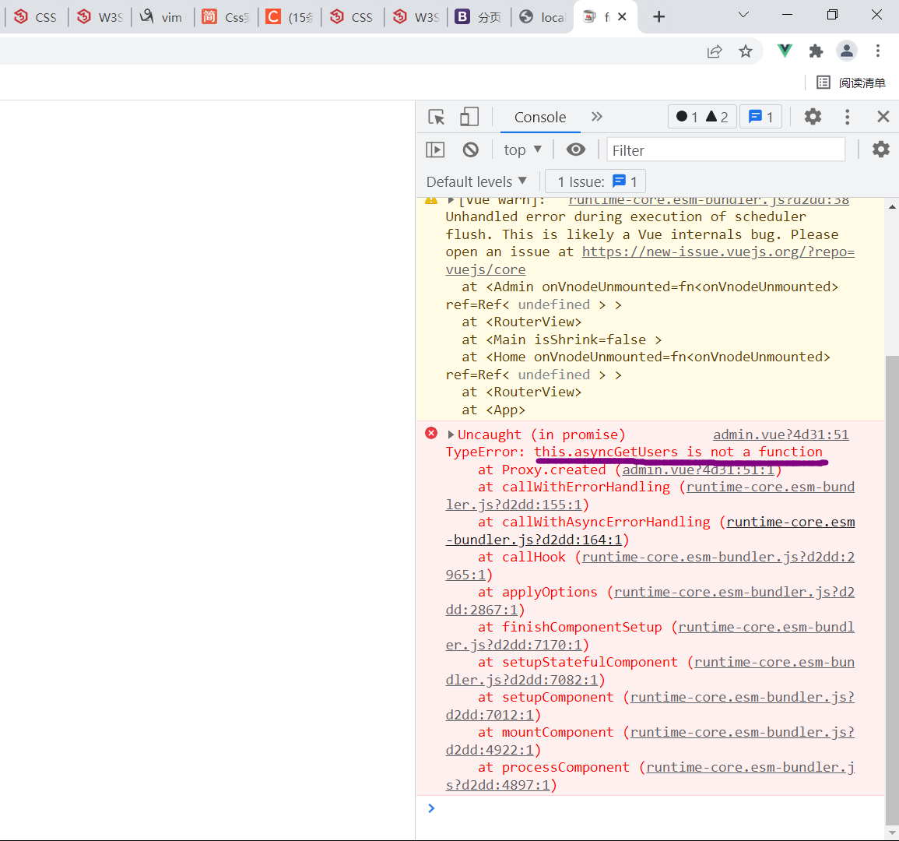

## 1.1、bug原因

**==在一个组件中定义了两个methods，所以,asyncGetUsers函数识别不到了...==**

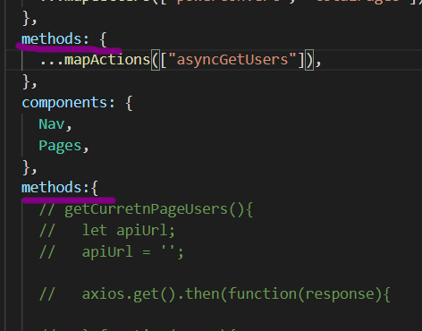


# 2、bug2

**==<font color='red'>问题描述：在axios中调用函数时表示：这个函数没有定义...</font>==**

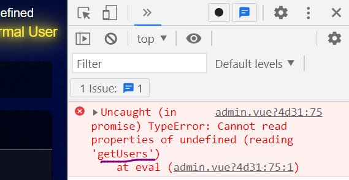

## 2.1、问题解决：

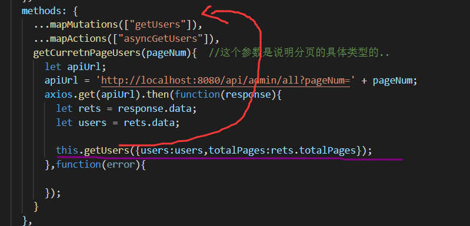

**==<font color='red'>在axios的回调函数中调用组件中的方法时候要注意：这时候this指的是axios而不是组件本身！！！操了</font>==**

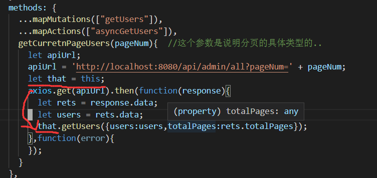

**外层添加一个that就行了**

# 3、需求思路（业务）

**==<font color='red'>想在这个地方显示当前的页码：</font>==**

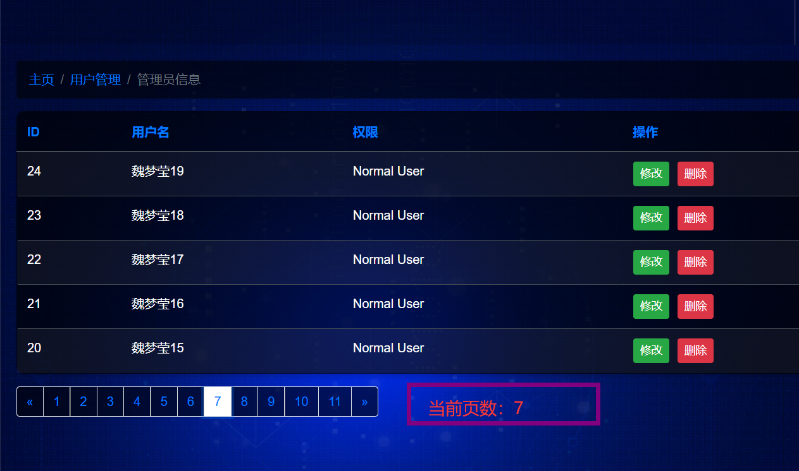


设计思路：

**==<font color='red'>点击具体页码的时候会触发 一个函数，在这个函数中我们可以拿到当前页码，然后就可以在组件里设置一个变量接收它，然后再把这个变量通过{{var}}显示到页面上就可以了</font>==**

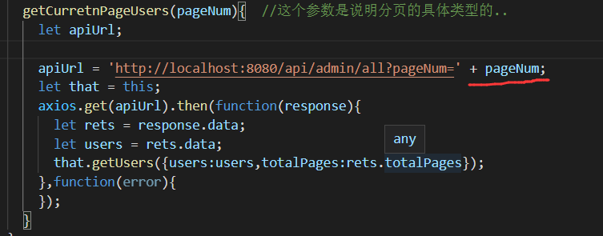


# 4、需求思路（业务）

**==<font color='red'>点击两边的按钮实现翻转到上一页和下一页的效果，并且不能超出范围，而且当前页数也会随之改变</font>==**

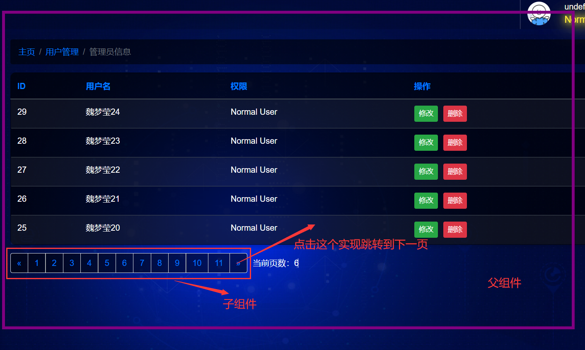


**因为我们在页码中已经用一个接口实现了获取后台数据的效果，所以我们可以同样的调用这个接口实现跳转上一页和下一页的功能，唯一不同的是页码需要+1或者-1后在作为参数传递给接口，并且不能超出范围；现在我们可以通过props传参把当前的页码传递给子组件，但是怎么实现它+1或-1呢？在传递的时候用三元表达式判断就行了**

**==关键==**

**<font color='red'>通过判断后再给子组件传递上一页或者下一页的数据就行了。</font>**

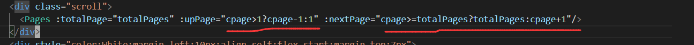


# 5、需求思路（业务）

**==完成单个查询和交叉查询...：失策了，我现在后端只做了单个的接口查询，完成没做交叉查询，这个很致命。。。<font color='red'>难怪先出图后写后端，果然先后不能乱啊</font>==**

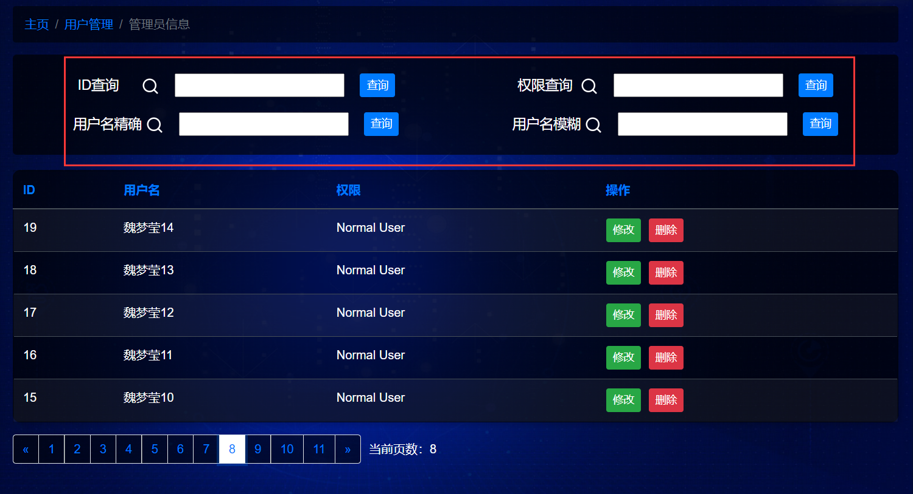


# 6、布局思路（flex布局）

flex布局位置可以被margin改变的原因：

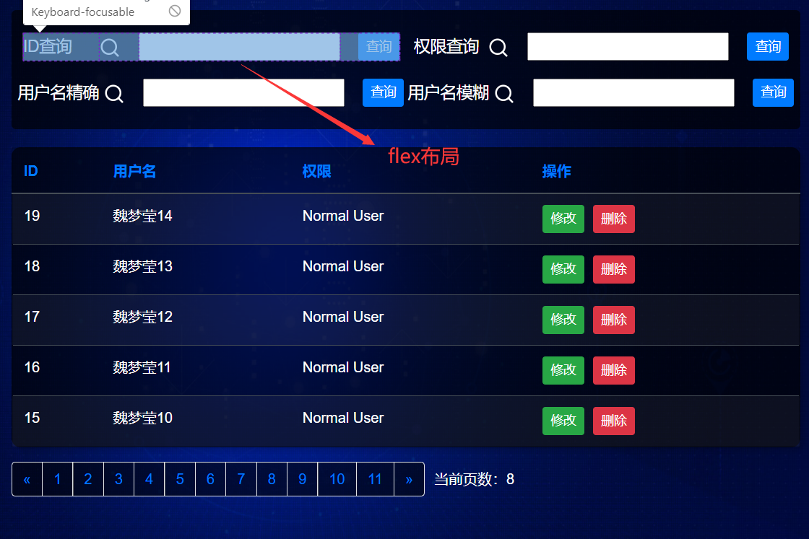


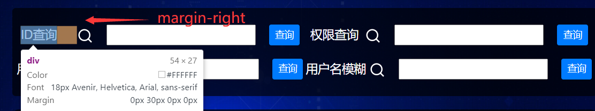


- **<font color='red'>就是整个的大框框是flex布局，然后使用justify-content:space-around;让每一个弹性盒子都居中有一定的空隙，为什么一个子项目加了margin-right:就能改变所有子项目的位置呢？因为当一个子项目添加了margin-right后，这部分也成了它的宽了，所以它的整体变宽了，所以所有的就都调整位置了。</font>**
- **<font color='blue'>可见flex布局和margin有天然的合作关系</font>**
- **在flex布局中 top，margin，left，right都是没有用的，这几个属性只是为了子绝父相和相对于默认文档流布局而生成的。**
- **==<font color='red'>在flex布局中 rem和px不能相互转化....如果使用rem作为像素单位的话，那只会变成flex布局默认的效果..</font>.==**
- **如果想让ID查询者几个字布局在中间的话也很简单，只要margin左右的值相同就行了，哈哈，和原来的margin:0px auto居中布局一个道理**


# 7、开发思路（语法）

**==<font color='red'>想在vue项目中使用axios</font>==**

在vue3中，全局注册axios好像行不通了，找到一个好像行的，但是测试过后还是失败了。

失败的那篇博文：https://www.cnblogs.com/semishigure/p/14705215.html  垃圾博文，草了

**<font color='red'>要想使用axios，只要单独引入然后使用就行了..</font>.**

示例：

```javascript
import { createStore } from 'vuex'
import axios from 'axios';  //1、直接导入

export default createStore({
  state: {
    users:[{name:'root',password:'toor'}

    ],
    totalPages_user:1
  },
  getters: {
    getUsers(state) {
      return state.users;  //返回所有用户的数组
    },

    //提供对外的权限转换后的结果接口
    powerConvert(state) {
      var convertUsers = state.users;
      for(var i = 0;i < convertUsers.length;i ++) {
        if(convertUsers[i].power === 0) {
          convertUsers[i].power = 'Super Root'
        }else if (convertUsers[i].power === 1) {
          convertUsers[i].power = 'Normal Root'
        }else {
          convertUsers[i].power = 'Normal User'
        }
      } 
      return convertUsers;
    },

    totalPages(state) {
      return state.totalPages_user;
    }

  },
  mutations: {
    getUsers(state,obj){  
      state.users = obj.users;
      state.totalPages_user = obj.totalPages;
    },
  },
  actions: {
    asyncGetUsers(context,apiUrl) {  
      //axios是异步的方法
      axios.get(apiUrl).then(function(response){  //2、直接调用axios就行了，组件中也是一样的
        //console.log(response.data);
        let rets = response.data;
        let users = rets.data;
        console.log(users);
        context.commit('getUsers',{users:users,totalPages:rets.totalPages});
      },function(error){
        if(error) {
          console.log(error);
        }
      });
    },


  },

  modules: {  //子模块

  }
})

```

# 8、开发思路（语法）

**==<font color='red'>想要在mutations的方法中对state中多个数据项进行更新</font>==**

**<font color='green'>//这里真是一个很大的坑我去！mutations中的所有方法，只能传一个外部的参数，如果有多个参数的话，就把它写成obj的形式！！！，不然这方法就根本执行不了！！！</font>**

```javascript
  mutations: {
    getUsers(state,obj){  
      state.users = obj.users;
      state.totalPages_user = obj.totalPages;
    },
  },
```

**==还有，当vuex中的方法被映射成组件自己的方法时候，用this.*来调用是很正常的...因为就算是组件自己的方法调用自己的方法也得用this.*啊！这不是常识吗？？？==**


# 9、开发思路（接口数据访问）

**==<font color='red'>需求描述：让vuex从后端接口中获得数据，然后vue组件再从vuex中获得数据</font>==**

- **<font color='purple'>首先vuex的配置文件中先引入axios，然后在异步方法中去调用axios从接口获取数据（因为axios本身就是异步的），然后再在把获取到的数据传递给同步方法，让同步方法改变vuex中的数据，这样第一步，让vuex从后端获取数据就完成了</font>**


- **<font color='purple'>我们要知道,vuex中的所有方法都不会自动的执行，所以需要调用执行，在第一步完成后，我们在vue目标组件中的created钩子函数中调用vuex的异步axios方法，然后，在vue组件中访问vuex中的变量，这样就能在vue组件完成挂载渲染页面前拿到从后台取得的数据了，渲染的时候就能出现从后台来的数据很方便</font>**
- **核心：created函数**

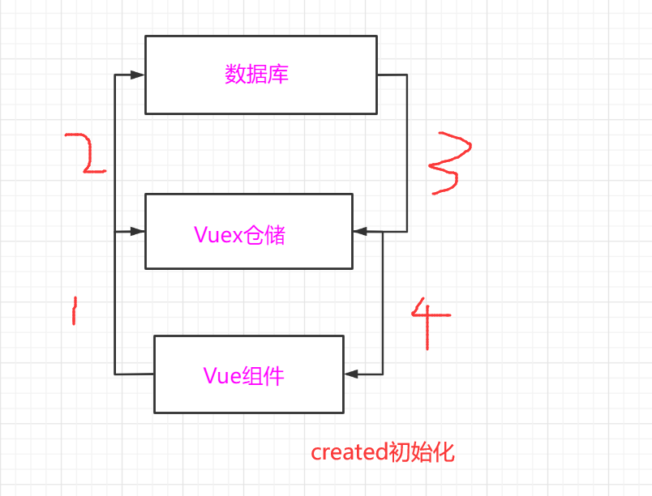

- **<font color='purple'>vue组件完成渲染后，和用户交互的过程中往往需要重新访问接口从后台拿到新的数据，这时候只要把axios引入到vue组件中，然后在自己的methods中定义一个方法，让这个方法去访问得到后端接口的数据，然后更新自己的变量就行了；不过这样做有一个问题就是，vue组件的数据源不一致了，这会产生很多的问题的！，所以在vue组件拿到后端数据后还是调用vuex同步方法去更新state中的数据就行了</font>**


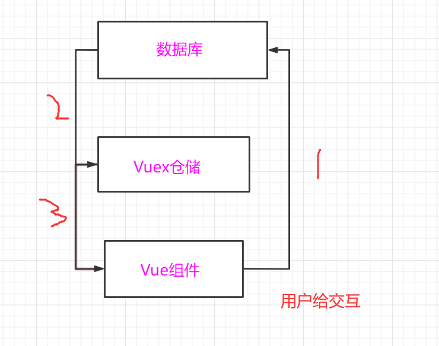


# 10、bug3（逻辑bug无报错）

**==<font color='red'>需求：在这里输入id来查询指定的一个用户</font>==**


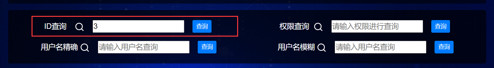


**==<font color='blue'>解决：很简单，点击查询的时候触发一个接口函数，该函数发送axios请求从后端获取到数据，至于如何把输入的Id作为参数传给该函数，很简单v-mode绑定自己的id变量，然后在接口函数中使用this.id就可以轻松访问到了...</font>==**


## 10.1、子Bug1

**==<font color='red'>注意：如果你要在console打印一个对象，请不要在前面加上一个字符串，这样会导致对象根本没办法打印出来！！！（搞得我还以为是数据传输出问题了，服了真的）</font>==**

### 10.1.2、示例：正常打印对象

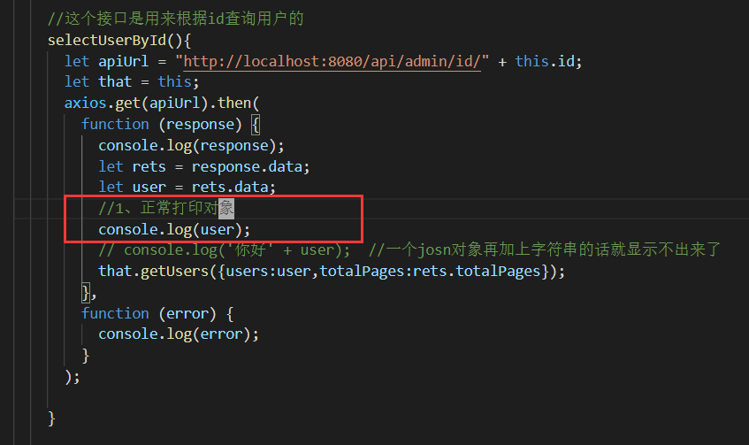

控制台输出：
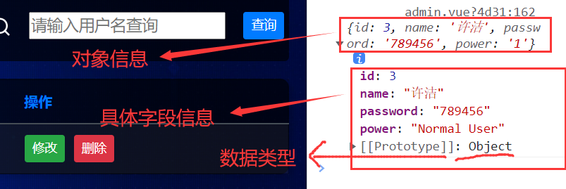


### 10.1.3、错误打印对象

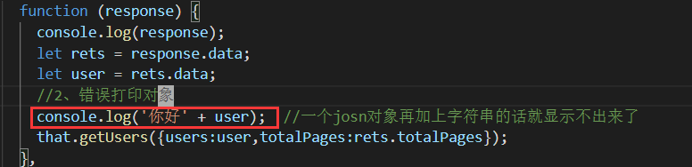

控制台：
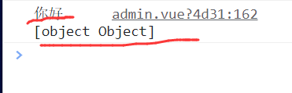

对象信息就出不来了，妈的真的服了...

### 10.1.4、打印的解决办法

用这个方法就可以了捏：

```js
console.log('setup',this);
```


​	


## 10.2、子bug2

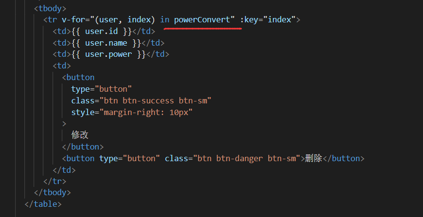

**==<font color='red'>这个bug和v-for的渲染机制有关，这里如果powerConvert是一个对象的话，你猜会怎么着？</font>==**

**<font color='purple'>如果powerConvert是一个这样的对象{id:2,name:'章子唯',power:2}，那么在v-for的眼中它就是一个数组，然后渲染三个tr了...所以一定要注意，把一个对象处理为数组，也就是两边加上[]就行了</font>**

处理：
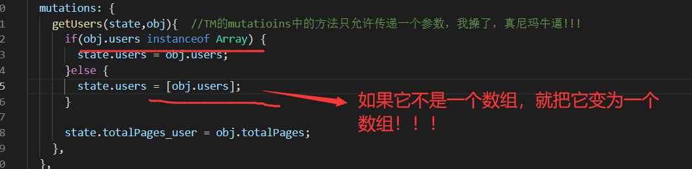


# 11、需求思路

**==<font color='red'>就是输入ID查询用户对吧</font>==**

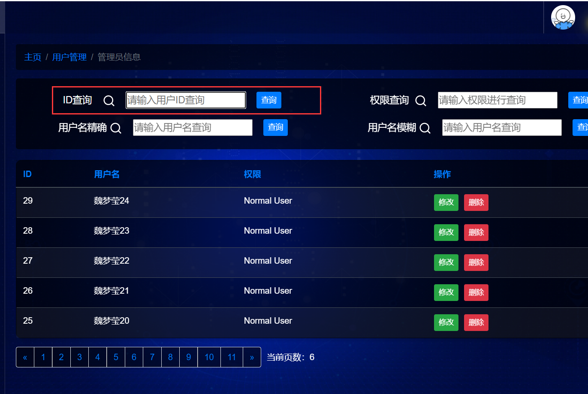


不能谋全局者不能谋一时，不能谋万世者不能谋一时！对于开发来说也是如此啊！如果我们重新写一个接口，在点击查询的时候触发这个接口然后从后端获取数据，更新state仓库虽然实现了功能，但有一些问题：

1、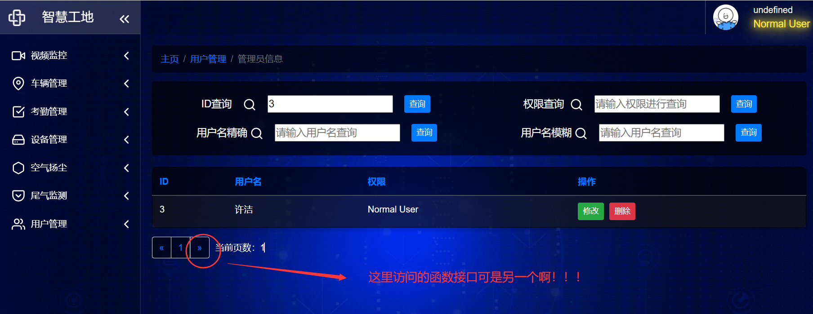

所以点击后就会出现原来的数据了。。。

2、解决：**==不要新写一个接口，还是调用原来的函数接口，只不过条件不一样了，然后改变axios访问的后端接口就行了==**

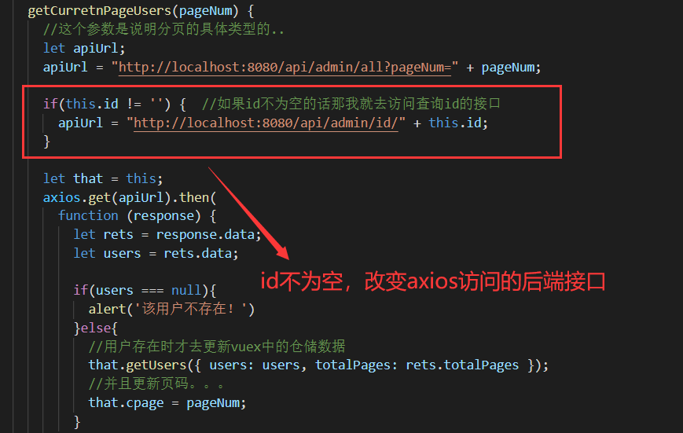

## 11.1、子问题

==如果查询的id不存在怎么办？？==

**<font color='purple'>解决：如果用户不存在，首先要给用户前端一个提示：这里用alert()就行了，然后，因为用户不存在，后端不会返回任何数据，这时候就没有必要去更新vuex库了，同时因为用户不存在了，页码也不用改变了。</font>**

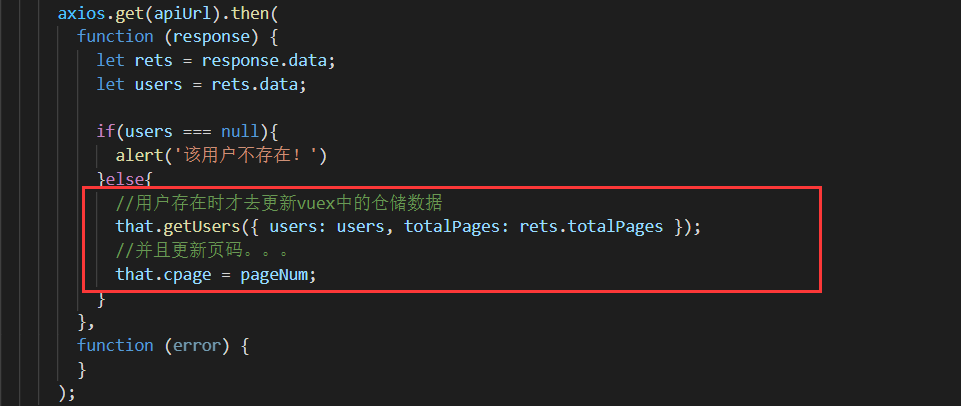


# 12、需求思路（交叉查询）

**==先把大局观列出来比较好==**

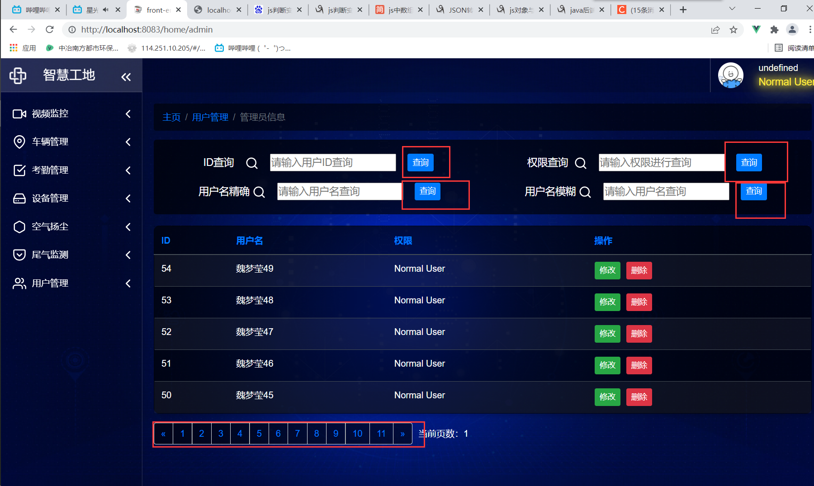

**==<font color='red'>情形一：</font>==**

**<font color='purple'>所有的查询框都是空的，点击上面的所有查询按钮，都只会返回第一页的页码和第一页的内容，点击下面的页码选择按钮可以跳转到指定的页码。</font>**

**==<font color='red'>情形二</font>==**

当有一个查询框不是空的时候又是一种大的子情况了

- **==<font color='red'>情形2.1</font>==**

当ID不为空的时候

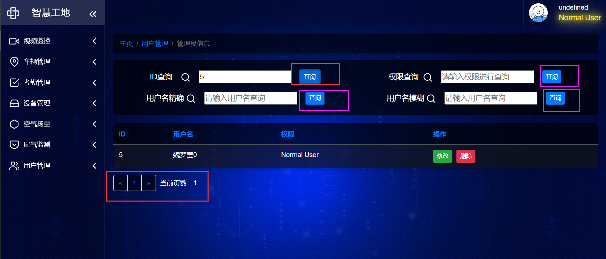

**<font color='purple'>当点击查询的时候自然获取到相关的数据，并且当前的页码框也必须如图所示，并且点击后页面的数据不会有任何的变化。当点击其他按钮的时候，连带着id的信息传递给后端的接口</font>**


- **==<font color='purple'>其实分析到这里基本的大局已经明了了，点击其中的一个查询按钮时候都要带上其他框框的内容取访问后端的接口，然后根据返回的结果来生成下面的页码框框，并且生成页码框框后 当前页数默认都是1；并且点击页码框的时候也要带上所有的查询条件的！！！；当没有返回数据的时候，提示用户没有返回数据，然后当前页面的数据和页码框以及页数都不产生任何的变化。</font>==**


## 12.2、后端接口设计

userMapper.xml

```xml
 <select id="generalSelectInterface" resultType="User" parameterType="map">
        select * from user
        <where>
            <if test="id != null">
                and id = #{id}
            </if>
            <if test="power != null">
                and power = #{power}
            </if>
            <if test="nameSure ! = null">
                and name = #{nameSure}
            </if>
            <if test="nameFuzzy != null">
                and name like '%'+#{nameFuzzy}+'%'
            </if>
        </where>
        order by id desc limit #{startIndex},#{pageSize}
    </select>
```

**<font color='purple'>这里有一个问题就是虽然它能获取到limit指定的那部分数据，但是每一次查询总的数据量就不知道了，这样就会导致分页的功能无法完成，所以一定是有一个接口返回一次查询后的总的数据量的。</font>**

bug1：

**==<font color='red'>这里有一个Bug,就是在mybatis中的模糊查询不能用这样的方式来写的，可以采用concat来拼接字符串，不可以采用||来拼接两个%%！！！我去血的教训啊，只能用concat!!!</font>==**

bug2：

**==<font color='red'>在if test的判断中，!=中不能有空格出现的！</font>==**


## 12.2、bug1

**<font color='red'>在url参数中传递power,namesure,namefuzzy为-1的时候，上面的判断没有执行。。。就尼玛的离谱...</font>**

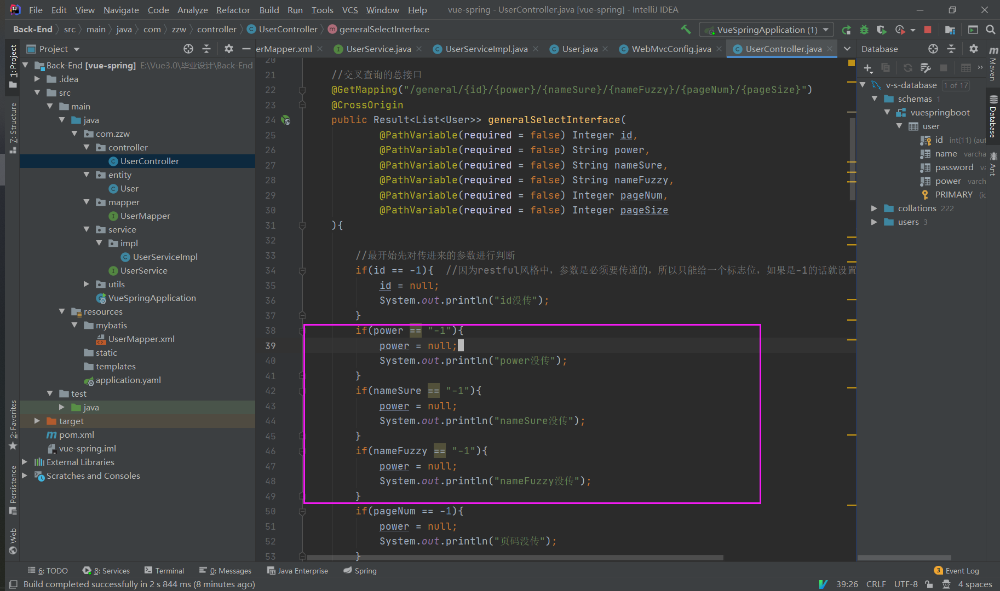

==可见在java中，字符串的比较不能直接用\=\= 的==

解决办法：使用compareTo函数判断比较即可

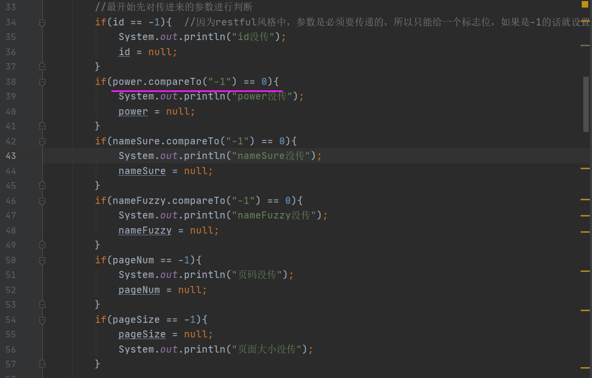


```html
http://localhost:8080/api/admin/general?id=&power=&nameSure=&nameFuzzy=&pageNum=&pageSize=
```


## 12.3、bug2（设计Bug无报错）

**<font color='purple'>因为在mybatis中拼接sql语句的时候，都是通过判断是不是null来确定是否拼接sql的,所以应该允许url接口中参数可以为空的才行呀...但是restful风格的写法中，路径参数必须要写，连写''或""这样的都不允许，这就很麻烦了，要解决这个问题，可以在路径中写上一些特殊的值，然后在controller中通过判断传进来的参数的值，来对参数进行null赋值，如果这样做的话，前端在传递接口参数的时候需要一层映射关系，当输入框中的值为空的时候，要把它映射为那个特殊值，再拼接到apiUrl上去才行，有点麻烦，不过也是可行的。</font>**

最简单的方法还是通过原来的值传参

**在原来的url风格中**

**http://localhost:8080/api/admin/general?id=&power=&nameSure=&nameFuzzy=&pageNum=&pageSize=**

**==<font color='red'>这样的一段url，如果参数id在java中是一个int类型的，那么这样的传参方式后，id的值就变成null了；如果power是String类型的，那么这样的传参方式将使得power的值变成 ""</font>==**


## 12.4、缺陷

**在后端没有对输入的数据进行判断，老实说这有一点致命的，这就会导致网站很不安全！！！...**


## 12.5、如何看一个函数？

**1看被谁调用的**

**2看什么时候被调用的**

**最后看里面 的具体代码，就能确定一件事：<font color='purple'>谁在什么时候做了什么事情</font>**


# 13、需求思路

==需求描述：实现用户登录的效果；==

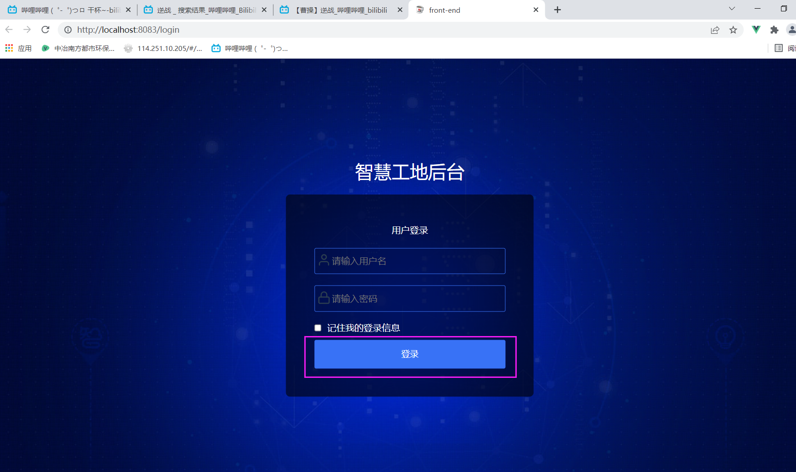

**<font color='purple'>点击登录后，一定会调用一个函数接口，然后调用axios连带用户名和密码访问后端的接口；后端有这样的一个接口，接受这两个参数，然后调用userMapper查找这个用户是否在数据库中存在，如果存在就返回给前端一个token，获取到token后再去跳转路由进入主页，然后别忘了在跳转前存储一下用户名，方便主页显示。（这里没有必要用到vuex，因为登录组件自己本身就能拿到返回的token了）</font>**


这里我规定一下后端的接口是：/api/login，请求的方式是post为了安全；


# 14、bug4

**==<font color='red'>bug描述：用这段代码去请求后端的接口报400...无效的请求???</font>==**

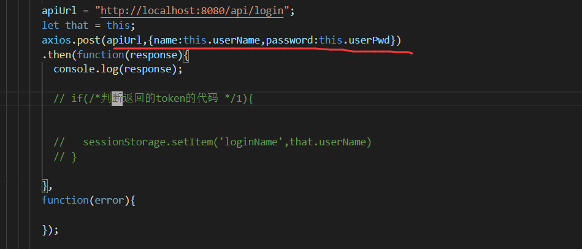

使用postman测试后端的端口发现后端已经正常工作了...

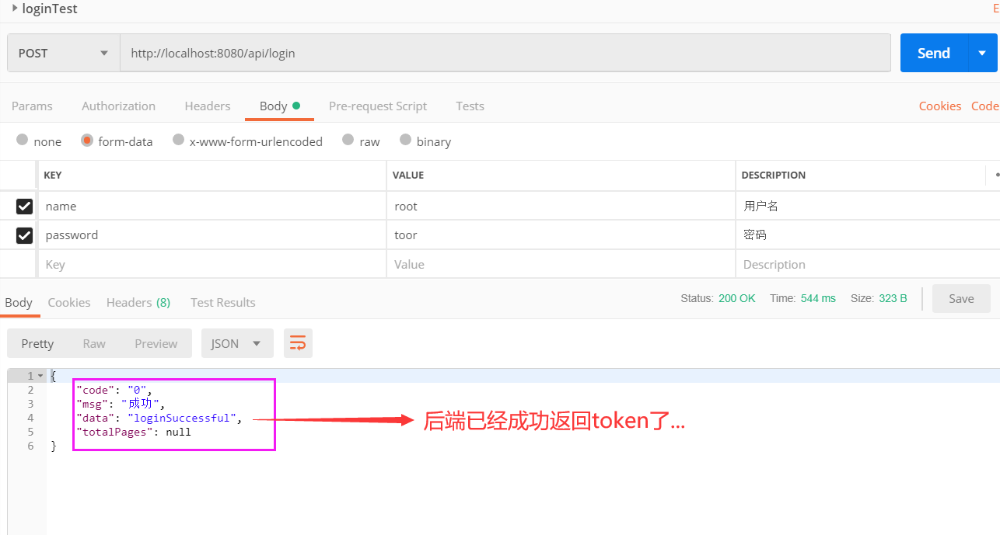

解决：了解了axios的post的两种传参方式就行了参考：https://www.bilibili.com/video/BV1Gk4y117CP?from=search&seid=16751696230498215511&spm_id_from=333.337.0.0

**<font color='purple'>原来是后端没有接受json串的能力，虽然可以直接把axios请求改成传递表单数据，但是我们也可以编写后台，让它有接受json数据串的能力。</font>**

- 学到在springBoot主进行绿色注释的方法：

  /** + o换行就行了

后端接受json串的方法：https://www.bilibili.com/video/BV11q4y1A7Kw?from=search&seid=8951071532682592715&spm_id_from=333.337.0.0

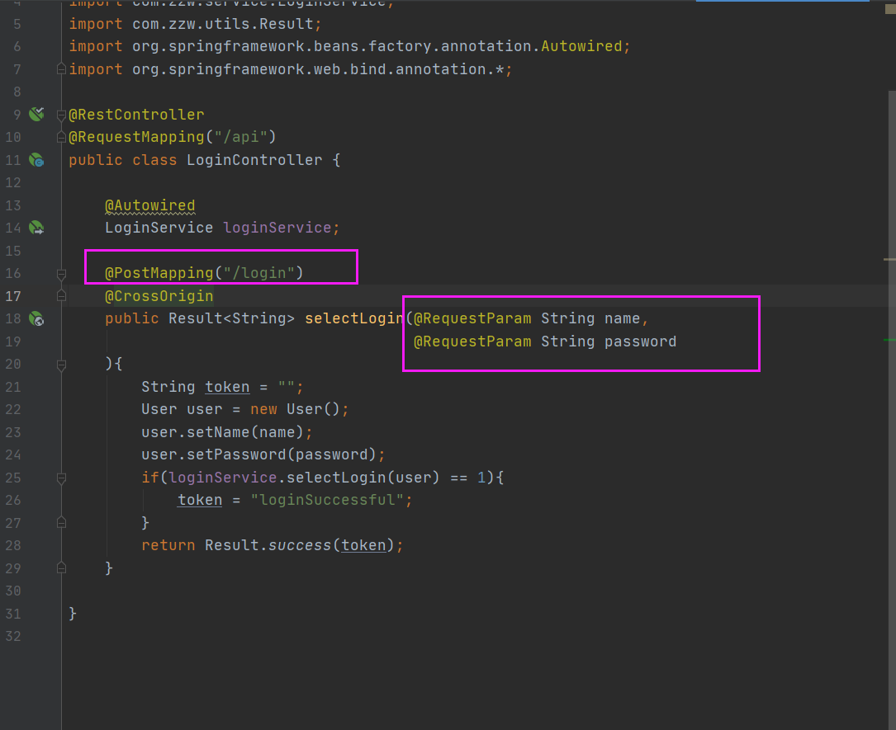

**==<font color='red'>像这种的后端post接口，前端只能通过form表单数据的提交方式，后端才能接受到：在postman中进行测试</font>==**

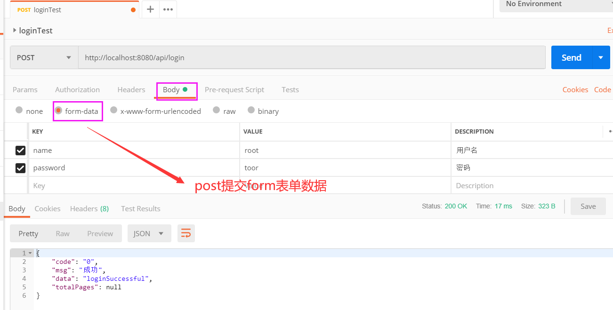

**==<font color='red'>后端要想接受json串，那就要把接受的参数进行封装，然后使用@RequestBody注解接受json串，再然后使用get方法就可以访问json串中的内容了</font>==**


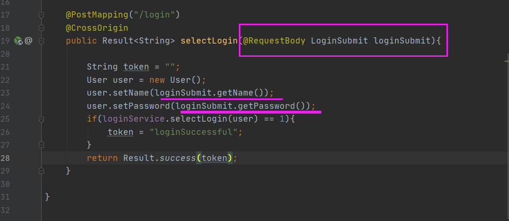

- postman测试一下


- 截图保存成图片的小技巧：选好截图后直接ctrl + s就可以了捏。

# 15、需求思路

**==需求描述：想让前后端的所有数据都用json串进行交互==**

- 初步的理解：

**<font color='purple'>这个其实老简单了，对于后端来说，它要返回给前端json数据很简单，只要在controller上面加上@RestController注解，然后所有的方法都返回一个java对象就行了，这样子它返回给前端就是一个json串了，前端要接受这个串也不需要什么方法质只要在axios的返回方法中用response参数接受就行了，然后当做一个对象处理;对于前端来说它要向后端发送json串的话，使用axios的post发送json串就行了，后端用@ResponseBody 一个java对象就可以了。</font>**


# 16、需求思路

需求描述：我这个人吧，能力不强，但是屁事情贼多，我想，既然前后端login传输的问题解决了是把，但是传输过程中的密码不是能被捕获到吗，这就导致非常不安全，**<font color='purple'>所以我想在前端传输密码前，先把它进行加密处理，然后再传递给后端数据，最后再在后端进行解密再传到数据库进行查询，哎这就很nice了。</font>**


实现加密的思路二：**<font color='purple'>其实你可以在前端进行一次md5加密，然后传输给后端，后端在进行一次md5加密，然后再存储到数据库中，这样就算数据库被注入攻破了，你的密码也不会泄漏出去的；不过这样做的话，比较适合有注册功能的后端，不然的话直接操作数据库去存储一个用户名和密码简直是噩梦。</font>**


## 16.1、bug（SpringBoot启动失败了...）

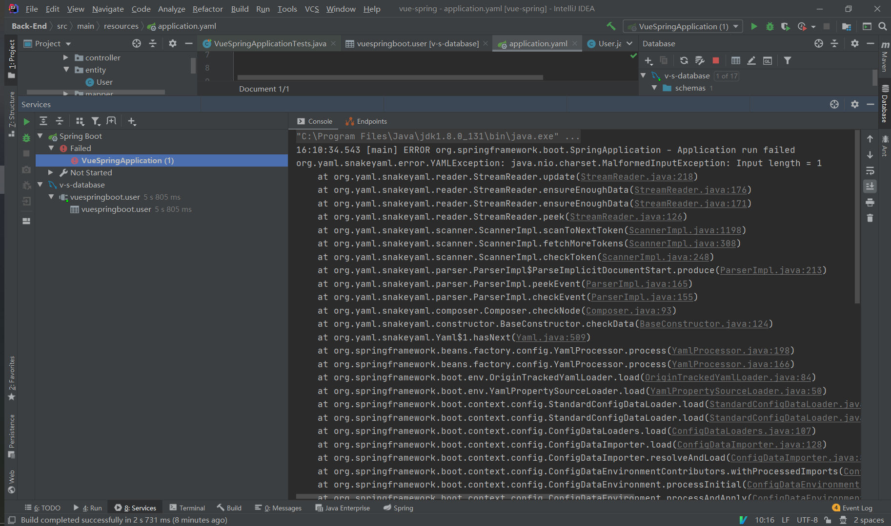


就是.yaml文件和scr文件中的编码格式不一致引起的。

解决：
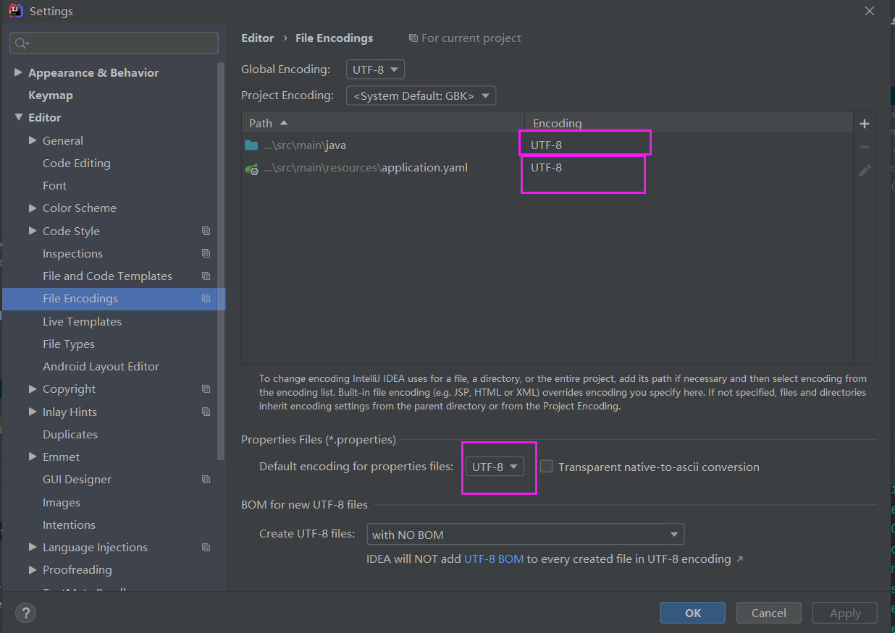

- 都改成UTF-8就行了。


## 16.2、bug Jwt报错

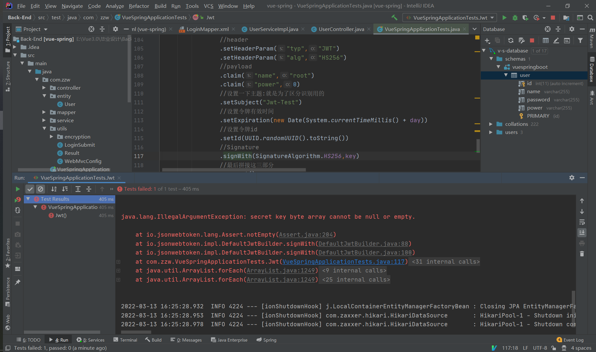


解决：因为我的key秘钥太JB短了，

```java
  private static final long day = 1000*60*60*24;
    private static final String key = "zzw@lty";  //1、刚开始我只是设置了key为zzw，只有三个长度太短了，所以就报错了！

    @Test
    public void Jwt(){
        //1、令牌生成器
        JwtBuilder jwtBuilder = Jwts.builder();

        String token = jwtBuilder
                //header
                .setHeaderParam("typ","JWT")
                .setHeaderParam("alg","HS256")
                //payload
                .claim("name","root")
                .claim("power",0)
                //设置一下主题:就是为了区分识别用的
                .setSubject("Jwt-Test")
                //设置令牌有效时间
                .setExpiration(new Date(System.currentTimeMillis() + day))
                //设置令牌id
                .setId(UUID.randomUUID().toString())
                //Signature
                .signWith(SignatureAlgorithm.HS256,key)
                //最后拼接这三部分
                .compact();

        System.out.println(token);  //测试输出token


    }
```


## 16.3、需求思路

**<font color='purple'>当把第一个需求完成的时候，突然发现问题还没有完全解决吧，因为就算登录成功了，也是需要进行权限管理的啊！所以就必须从后台同时返回查询到用户的权限给前端才行啊，然后前端把这份数据保存起来，每次进行操作的时候都都把权限的数据传给后端，如果权限允许才允许前端操作，不然就提示权限不够；写着写着突然发现原来这个想法就是token产生的源泉！之后我们可以用Jwt token的方式去解决这个问题了，哈哈。</font>**

- **<font color='purple'>再进一步去思考这个问题，就是说每一次用户的操作都需要用户自身的信息对吧，所以在不如在登录成功后把该用户的所有信息都返回给前端，然后前端对这些信息进行存储，然后在前端操作的时候再次带上这些信息给后端，然后后端根据传过来的用户信息进行相对应的操作罢了。</font>**

- **<font color='purple'>可是这样就又产生了一个问题，那就是传输的时候没加密啊，最多就是密码加了密了，其他的信息就很容易被拦截获取到的。。。这就很麻烦了呀，所以最好的解决办法就是把用户的所有信息都存放在token中进行加密然后前端只要存储token就行了，每次请求的时候都带上token给后端，让后端自己去解析判断这个用户的信息然后就万事都ok了。</font>**
- 在前端存储token的时候一定是用localStorage的，因为这样就算用户关闭了界面，但是它还会在本地保存token信息。

- **通过token来进行登录和注销的判断。**


### 16.3.1、用户登录业务整理

**<font color='purple'>首先前端要把用户名和密码传递给后端，密码得先用aes加密，然后后端接受到后要对密码进行解密处理，然后从数据库查询用户是否存在，并且把用户的所有其他字段信息都返回回来，然后把用户的信息，进行token加密生成一个token令牌，并且存储到User对象的token属性中，然后把整个user用json格式传回给前端，同时别忘了先把user的password字段设置为空值；前端接受到json数据后，可以取出有关的用户数据供组件展示，这样一个登陆验证的完整流程就实现了。</font>**


- **<font color='blue'>小知识：sessionStorage和localStorage都只能存储字符串，所以先用JSON.stringify()把要存储的对象转成字符串，再存储；然后getItem的时候，在用JSON.parse转成对象就行了。</font>**


# 17、需求思路

- **==<font color='red'>需求描述，想要看清大局，然后一步一步的落实才行。</font>==**

## 17.1、视频监控模块

点击-》视频监控-》实时监控后，应该能在main组件中路由到视频展示的组件：

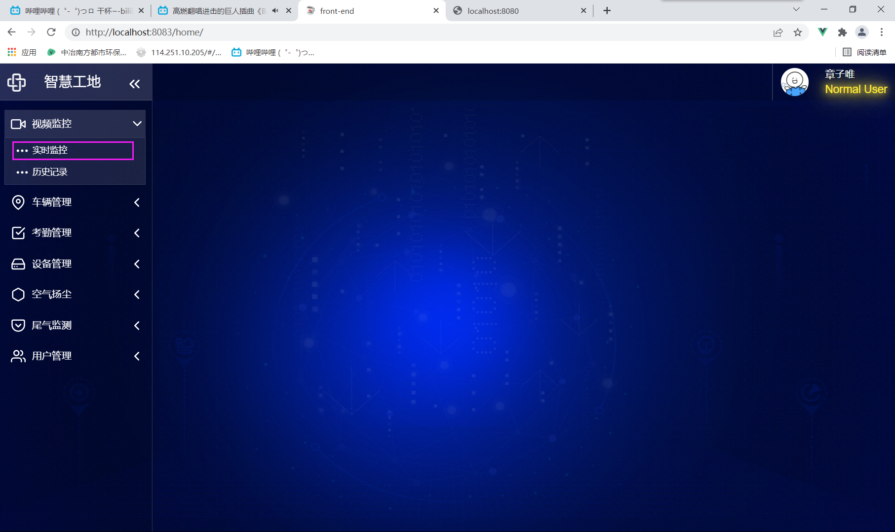

我希望在main组件中出现如下的效果：


<font color='purple'>**1：**首先是整个大屏展示3x3的点位监控，**2：**然后在底部有分页的页码条，点击页码条可以跳转到下一个页面看其余的点位视频（页码条不要求实现指定页面的跳转，因为总共也就2、3页的样子，不过上一页下一页以及显示当前是第几页的功能依然是要实现的），**3：**然后再在视频监控的左上角显示当前的位置名，**4：**最后点击一个视频后可以进行全屏的观看</font>

点击全屏观看后展示的效果应该如下图所示：

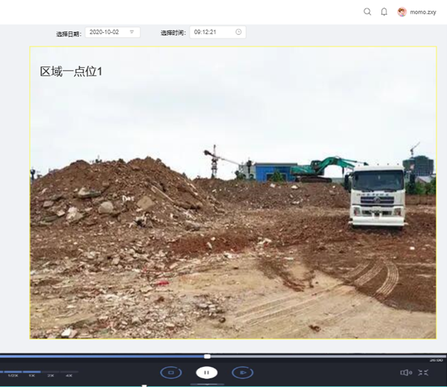

<font color='purple'>默认开启录制功能，每隔24个小时就保存一次录制好的视频内容存放到本地的一个文件夹下面，然后可以通过历史记录来访问：</font>


## 17.2、用户管理模块

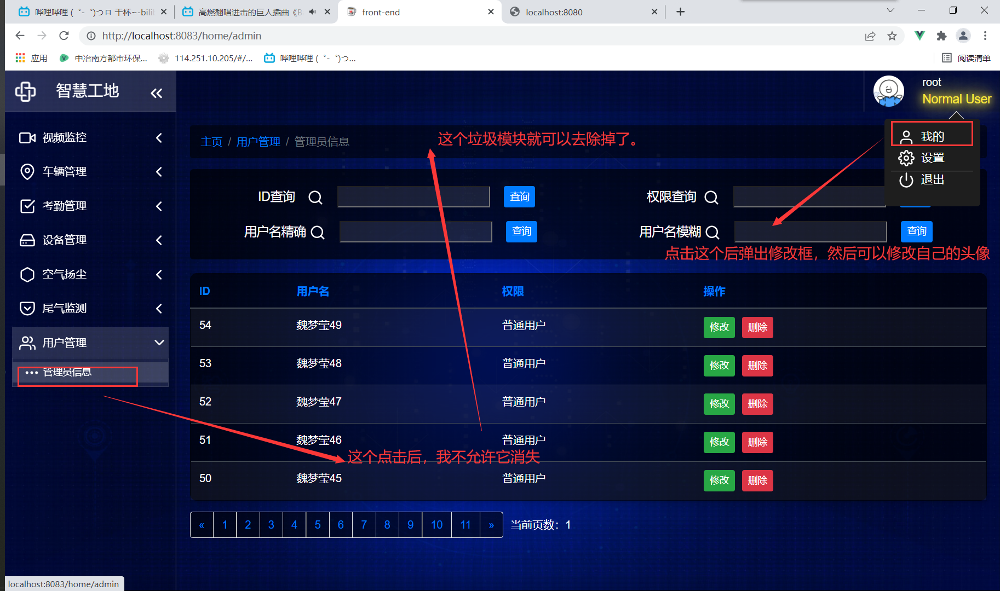

**<font color='purple'>点击管理员信息后，这个弹框就不要消失了；然后把面包蟹这个垃圾模块去除掉，然后点击我的弹出修改框（就是修改头像，用户名，密码）点击设置可以切换主题；超级管理可以对任意用户进行增删改，普通管理只能对非超级用户进行增删改普通用户只能对自己进行修改操作。。。</font>**

- 首先还是得先改页面，权限的操作之后再考虑把。


- 第一个要求：那要每次刷新前都要存储标志位才行。

<font color='purple'>在vue中，页面的效果很多都是由标志位控制的，比如我点击一下，某一个标志位的状态就改变了，然后组件的渲染也变了；当我点击a标签的时候页面会进行刷新，这标志位的值就会重置的，这就很烦了，所以可以在a标签点击的时候触发一个函数，该函数保存当前这些标志位到sesssionStorage中，然后页面被重新加载的时候在created函数中把这些标志位从sessionStorage中取出来赋值给自己的标志位变量就行了，哈哈真的天才捏。</font>

学到的东西：

1、sessionStorage如何存储bool值：https://www.jb51.net/article/214128.htm

2、数组和字符串的转换：https://www.cnblogs.com/windok/p/15599258.html

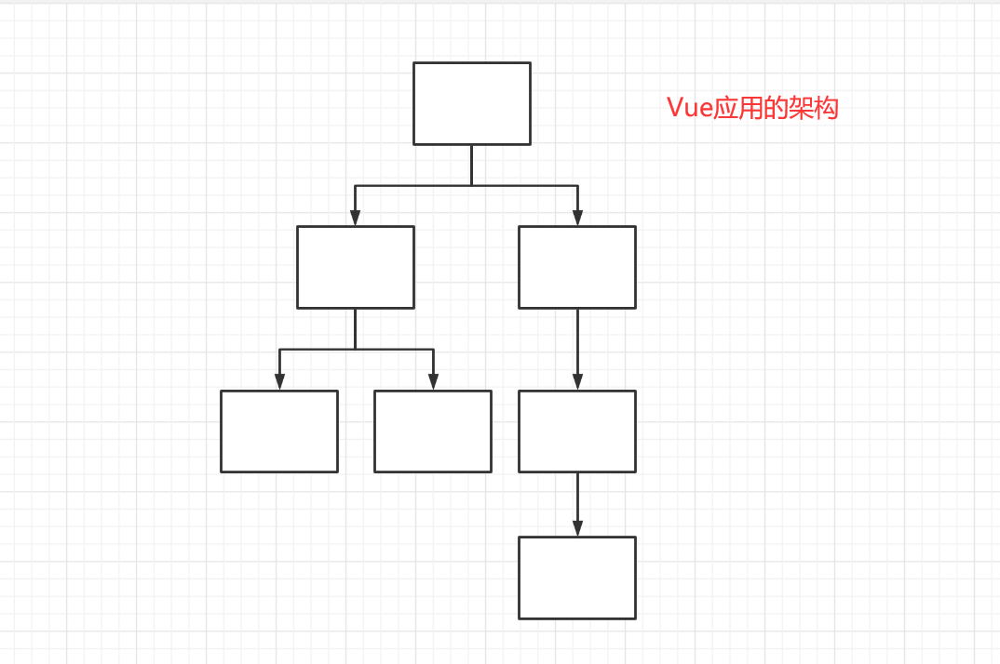

这个源头去思考问题，会比较好。


# 18、bug4

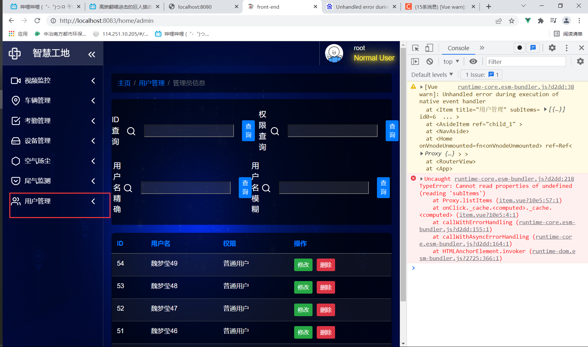

- 但是subItems明明有在Props中出现啊！！！
- **报错原因：箭头函数无法被识别：改成普通的函数就行了，服了什么错误都有，真的一坨屎山不要去改动他里面的代码，再在上面拉一坨走人就行了，艹**
  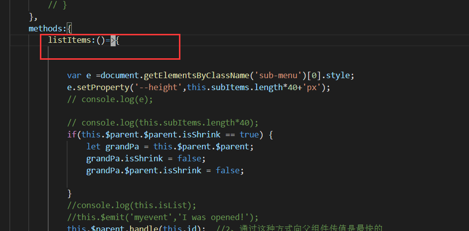


# 19、bug5

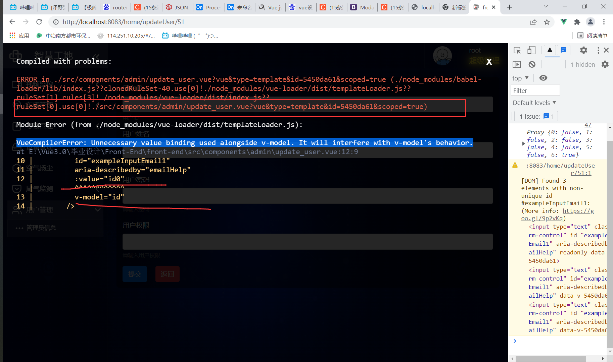

- 我把一个input框的value绑定了 props属性，然后还把v-model绑定了id变量，结果就报错了...什么情况？？？

**==<font color='red'>解决：因为v-model就是相当于v-bind:value = "变量或属性"，所以只要写一个就行了捏。</font>==**

# 20、bug6

一个组件如果是被路由的组件的，那么在它里面如果写上<router-link to="">想跳转其他组件的话，to后面不能有参数的！！！，不然整个都会报错的。。。就很离谱至于是为什么我也没有搞懂...就是单纯的很离谱的


## 20.1、子bug

**<font color='purple'>在vue中，我们就不要使用from表单了，因为它会刷新页面导致根本没有办法看到调试的结果，a标签可以用href="javascript:;"解决这个问题，一般在vue中都是点击提交按钮然后触发一个函数，对数据进行封装处理后调用axios请求，根据返回的结果进行下一步的操作的</font>**


## 20.2、bug

**==<font color='red'>描述：通过路由对象（是$route不是$router哦）访问路径参数出错</font>==**

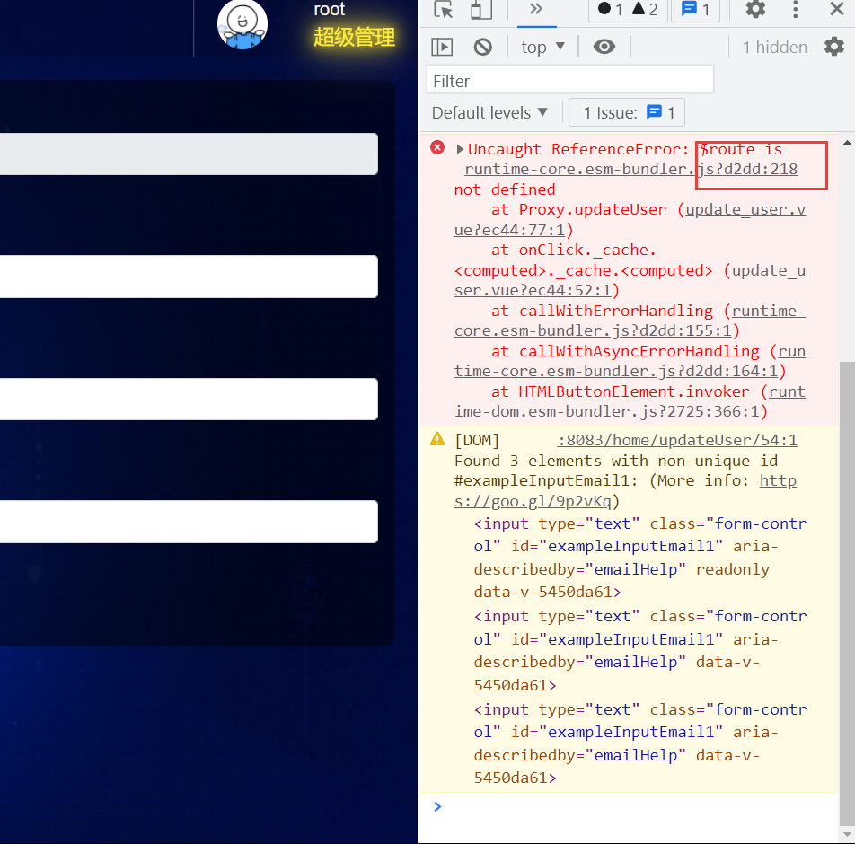


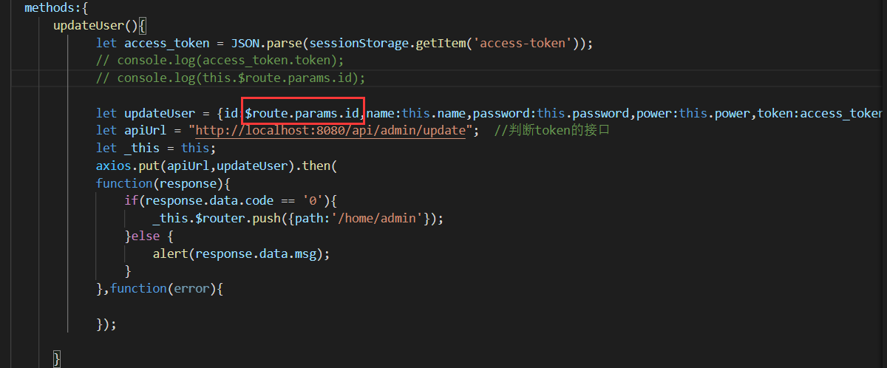

- 问题解决：

**<font color='purple'>一个被路由的组件，如果路由路径中有参数的话，那么它可以在\<template>中使用$route.params.参数名来获取到参数，但是在方法中要获取到这个路径参数的话，必须要在前面加上this.!!!也就是this.$route.params.参数名;才行！！！这个思路也适用于一个组件的数据和方法...</font>**


- 今天才意识到：$route和$router两者的区别。。。haha


## 20.3、bug

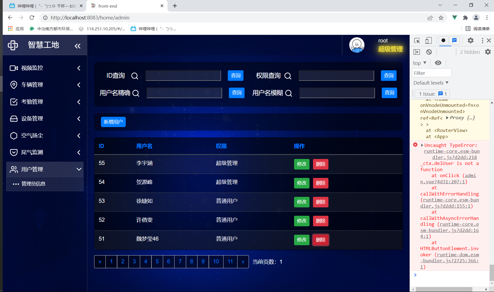

**解决：因为调用的时候函数名写错了捏....就离大谱**

## 20.4、bug（逻辑bug）

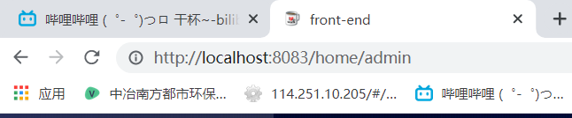


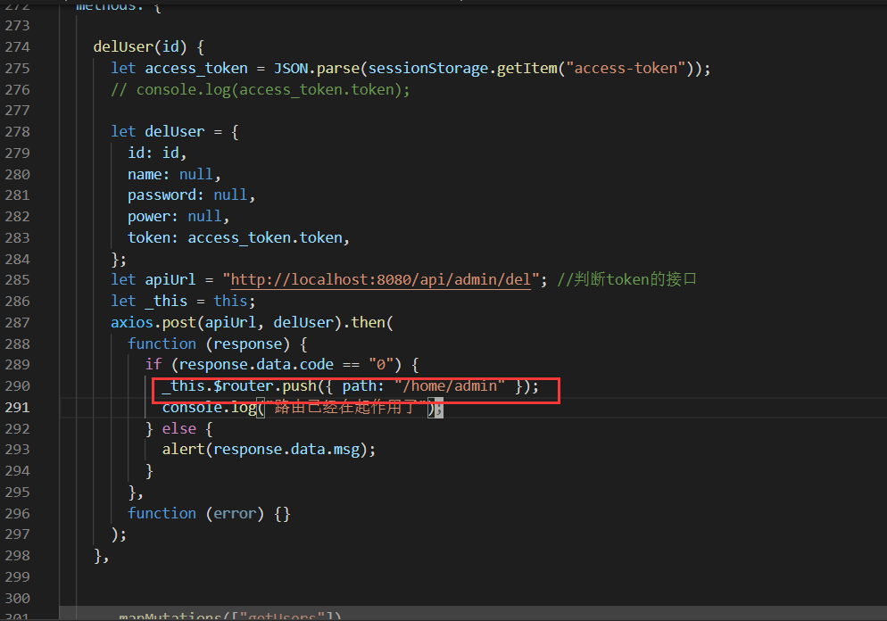


- **<font color='red'>如果一个组件它路由它自己，那页面就不会发生重新的加载了，这就导致数据更新的时候一时间看不出效果，要手动刷新才能显示出结果。</font>**


- **<font color='purple'>就算是重定向到自己，还是不会重新加载...这就很烦了。。。</font>**


**<font color='purple'>解决：主要有两种思路：1->把这段路由的代码直接改成：location.reload();重新加载整个页面，但是这样做的话相当于重新加载整个dom文档树，这就很麻烦了，效率太低了。2-》直接使用获取表格的异步代码，局部刷新表格就行了</font>**

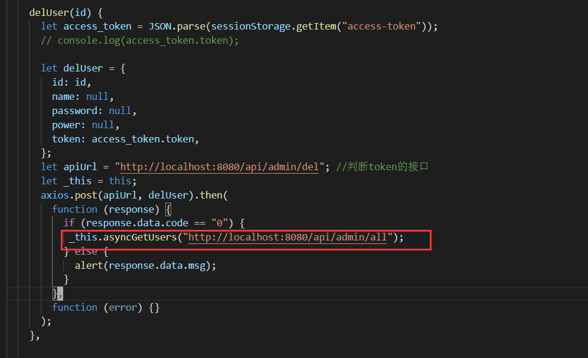

- **<font color='purple'>这里有个小问题，就是当删除了数据之后，就重新回到了第一页，可如果用户是在第4页删除的数据呢？所以这里重新向服务器发起请求的时候应该携带上之前页面状态的参数才对捏</font>**

- 解决：

  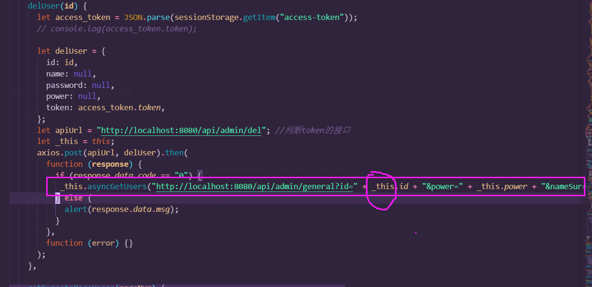


# 21、Overall view

- 大的方向一定是很简单的，如果很复杂那它就大不起来，很复杂的东西一定很小。

**<font color='purple'>从大局的角度上来说，一个项目要实现很多的功能，那就要编写很多的代码，那代码的行数可能有十万行甚至几十万行，难道要把这些代码都编写在一个文件中吗？所以必定要模块化划分文件便于于开发人员编写，然后通过编译器进行编译链接把这些模块文件连在一起再放到内存中给cpu执行吧，模块块化的开发方式在vue中的实现方式如下：</font>**

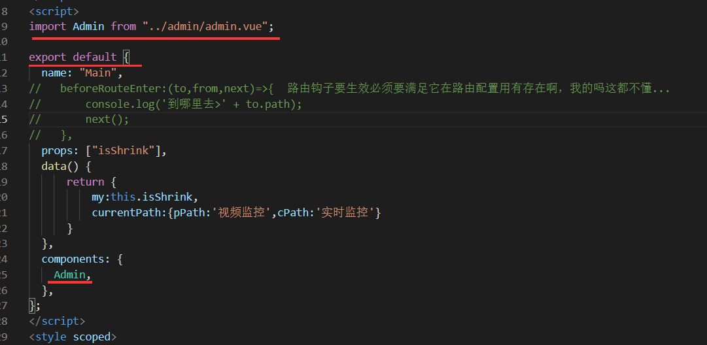

- **<font color='red'>导入一个对象，导出一个对象（{}在js中就是一个对象了）,注册导入的对象。在template中使用导入的对象。</font>**

**<font color='purple'>在java中的实现方式如下</font>**

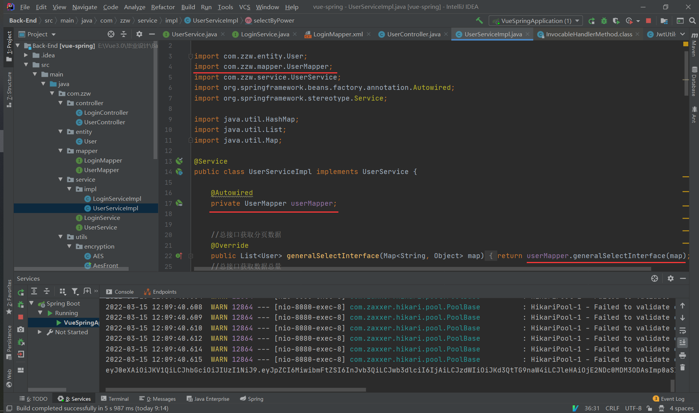

- **<font color="red">在java中就直接导入一个类，实例化一个对象或从srping中自动注入一个对象，然后调用该对象的方法</font>**

**<font color='purple'>所有的模块化思想本质都是复制粘贴就和c中的include一样。只不过具体实现有所不同罢了</font>**

**<font color='purple'>那什么又是对象化呢？因为我们知道一段程序就是cpu在处理一段代码，我们把这些代码整合起来就是一个函数，而计算机要做很多的事情所以就会有很多的函数，而同一个函数当它的数据变化时它的处理也会有所不同，所以我们把这些变量和函数整合在一起就形成了对象。</font>**

**<font color='purple'>在java中可以使用构造函数给自己的变量初始化数据，而在vue中，可以使用props属性定义变量来接受外部的参数，并且可以直接在\<template>中使用这些变量，也可以通过如下的方式给vue对象自己的变量初始化。</font>**

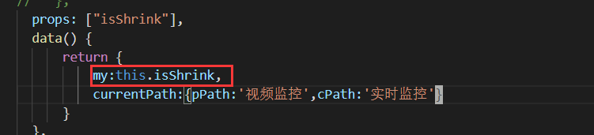

- **==注意初始化后my的值就不会随着isShrink的值改变而改变了，所以其实这东西对vue来说没有什么用的。==**


**<font color='blue'>在vue中有个很有趣的现象，就是在一个对象函数中调用自己的变量，props属性，函数都得加上this指针指明他们的位置，而在\<template>模板中调用自己的变量，props属性，函数就都不用加上this指针，说明在vue中对象内存的布局编排和c++以及java是很不一样的。</font>**


## 21.1、大局观

**<font color='#660099'>其实最大的大局观就是深刻的理解业务逻辑，从对业务逻辑的整体把握上去选择要使用的技术和实现方式以及代码的一个整体逻辑；业务逻辑才是根本的那个无；如果要加快开发的速度，那就要搭配上对技术的深刻理解和把握了，这个就是坤，乾坤一结合，万物就自然生长了捏。</font>**


## 21.2、bug

**404页面配置出错了...**

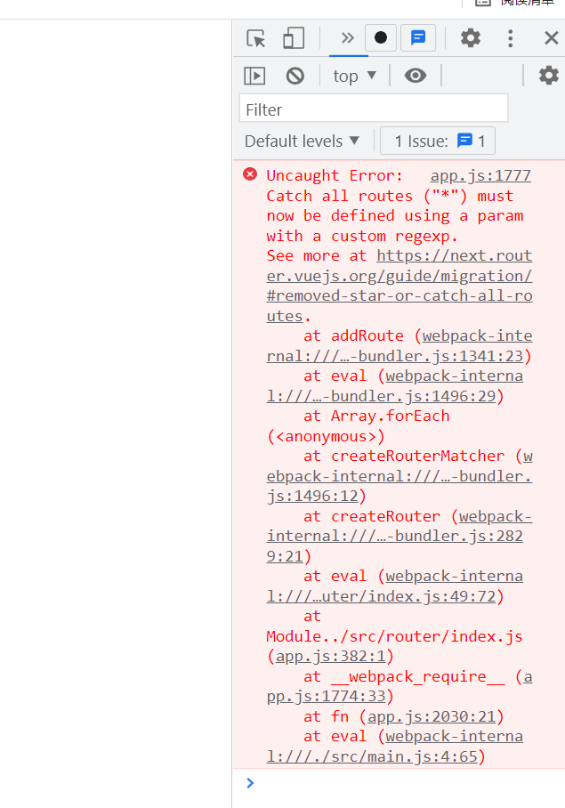


路由的配置如下：

```javascript
      {
            path:'*',
            name:'NotFound',
            component:Notfound
        }
```


**解决：vue3版的匹配全局的路由配置改掉了...**

https://blog.csdn.net/Dawnchen1/article/details/116742166

写成这样的配置就可以了

```javascript
  {
    path:'/:pathMatch(.*)',
    name:'NotFound',
    component:NotFound
  }
```


# 22、需求思路

**现在先把不需要图标的设备管理模块给搞好先，大致的页面应该如下图所示：**

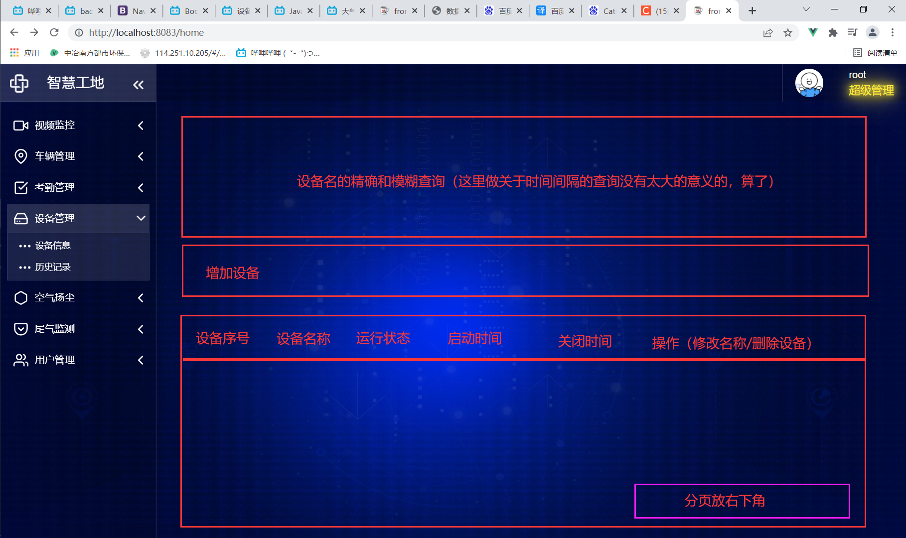

- **<font color='purple'>权限的控制我想由前端来实现，这样可以减少服务器的压力，传输效率可以提高，当然如果是为了安全，最好还是也把后端的权限控制写一下，设备信息页面大概就这么多，还有历史记录的页面。等下，差点忘了，在查询的时候还要添加上一个下拉列表，里面选项分别是查询所有，查询在线，查询离线</font>**

- 历史记录的页面大概如下：

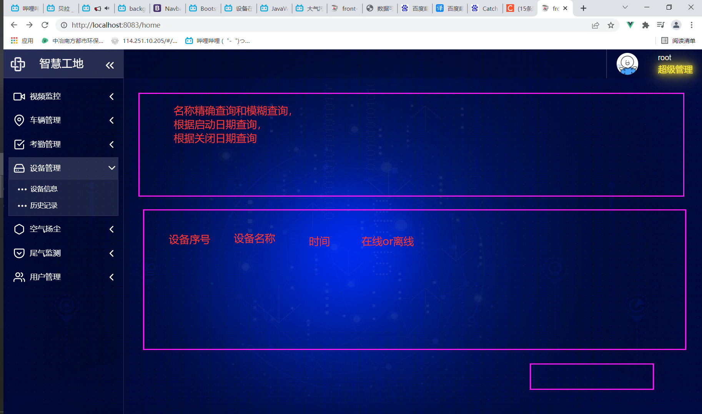

- **<font color='purple'>我这么设计这个界面的话，其实比较好的做法是什么，是只有一个日期查询输入框，然后再加上一个状态选择，要么在线，要么离线，要么全选，日期+状态就能知道这个设备在这个时间点是开启还是关闭了捏。</font>**


## 22.1、需求思路

**<font color='purple'>历史表和设备表中的deviceid真的要通过外键连在一起吗？？这样的话增删改不就可能会有很大的限制，而历史记录和设备添加的增删改查应该都是自由的才对。所以这里就不用去绑定外键了，不然会有点麻烦的。</font>**


## 22.2、bug

**bug描述，传递get的参数报空指针异常**

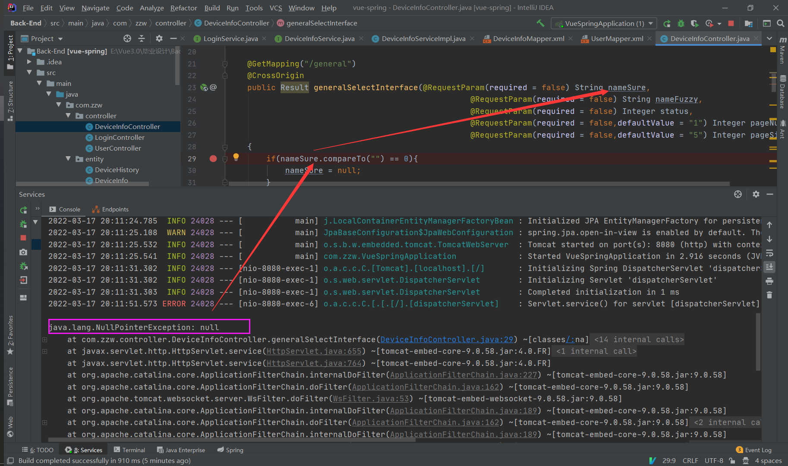

- **<font color='red'>解决：这是因为我在postman里面只传递了一个参数，其他的参数还没有传。（不过有默认值的就可以不用传了捏，哈哈!!）</font>**


- 这里所有的参数都得带上的，就算他们的值都为空。


## 22.3、需求思路

- **<font color='red'>如何在sql语句中查询指定时间间隔的记录呢？？？</font>**

```sql
SELECT * FROM k_student WHERE create_time  between '2019-07-25 00:00:33' and '2019-07-25 00:54:33'
```

使用between ... and ... 是最好的


- **我在mytabis中写的，查询时间间隔的写法**

- ```xml
      <select id="generalSelectInterface" parameterType="map" resultType="DeviceHistory">
          select * from device_history
              <where>
                  <if test="nameSure != null">
                      and name = #{nameSure}
                  </if>
                  <if test="nameFuzzy != null">
                      and name like concat('%',#{nameFuzzy},'%');
                  </if>
                  <if test="startDate != null">
                      and dateTime >= #{startDate}
                  </if>
                  <if test="endDate != null">
                      and #{endDate} >= dateTime
                  </if>
              </where>
      </select>
  ```

  **<font color='purple'>因为我发现，如果用between .. and ..的话，就必须保证startDate和endDate两个的输入都不为空了，不然mybatis拼接会出错（也许有解决的办法），所以还是用><来比较是最好的，不过在xml中不支持<号的，所以都用>来替代就行了</font>**

## 22.4、bug


- http://localhost:8080/api/deviceHistory/general?nameSure=水&nameFuzzy=水&startDate=&endDate=&status=&pageNum=&pageSize=
- 这样的一个请求报400了,我也不清楚为什么？？？

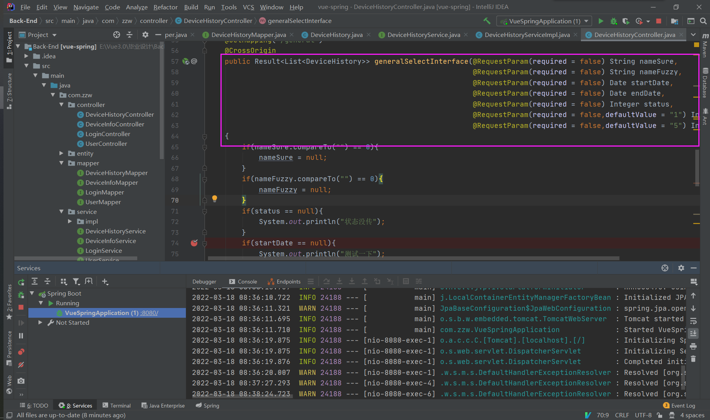

- **<font color='red'>解决：因为在请求参数中有Date类型的参数，所以就会报400坏的请求，我看看能不能在get请求中接受Date类型的参数。</font>**

- 解决的博客：https://blog.csdn.net/yxz8102/article/details/88220137

其实很简单，这样传就行了,

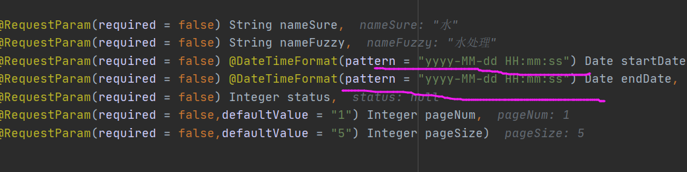

- **<font color='purple'>意思就是说，把传进来是这样形式的字符串当做一个Date接受起来就可以了，如果没有传时间的话，那么在java中startDate就是null，而不是""!</font>**


- **<font color='purple'>那么同样的问题，如何把从后端拿到的Date类型的数据转换成yyyy-MM-dd HH:mm:ss形式的字符串内？？其实很简单只要在实体类中加一个注解就行了，@JsonFormat(pattern = "yyyy-MM-dd HH:mm:ss")</font>**

```java
@Data
@NoArgsConstructor
@AllArgsConstructor
public class DeviceInfo {
    private Integer deviceId;
    private String name;
    private Integer status;
    @JsonFormat(pattern = "yyyy-MM-dd HH:mm:ss")
    private Date startTime;
    @JsonFormat(pattern = "yyyy-MM-dd HH:mm:ss")
    private Date closeTime;
    private String token;
}
```

- **<font color='red'>加上这注解的意思就是说如果以json格式发送(@RestController)该对象，Date会被转成"yy-MM-dd HH:mm:ss"类型的字符串</font>**


### 22.4.1、bugX（http接口传参分析）

#### part1：get接口传参分析

**<font color='blue'>示例：nameSure和nameFuzzy在后端都是String类型,status在后端是Integer类型</font>**

**情形一：啥都没传**

```html
http://localhost:8080/api/deviceInfo/general?nameSure=&nameFuzzy=&status=&pageNum=1
```

**后端接收情况**

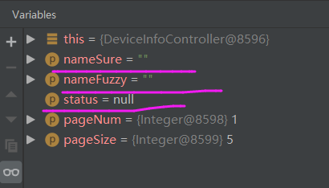

- String类型为""；Integer类型为null；


**情形二：传个空字符串**

```html
http://localhost:8080/api/deviceInfo/general?nameSure=''&nameFuzzy=''&status=''&pageNum=1
```

**后端接收情况**

- 400 bad request

因为Integer不能传''

修改一下

```html
http://localhost:8080/api/deviceInfo/general?nameSure=''&nameFuzzy=''&status=&pageNum=1
```

**后端接收情况**

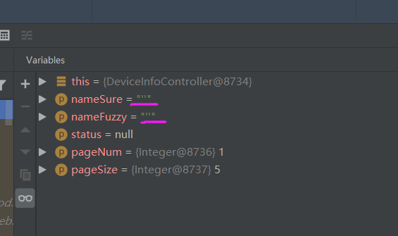


**情形三：含有日期**

```html
http://localhost:8080/api/deviceHistory/general?startDate=&endDate=&nameSure=&nameFuzzy=&status=
```

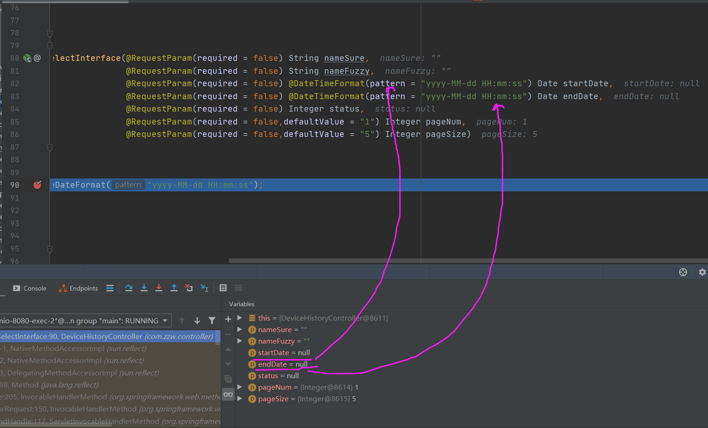


#### part2：需求分析

- **<font color='purple'>让后端的String类型的参数的值为null->在请求中什么都不用传，然后使用str.compareTo("")==0，如果是真，就str = null;就行了</font>**

- **<font color='purple'>让后端的Integer类型的参值为null->在请求中什么都不传就行了</font>**

- **<font color='purple'>让后端的Date类型的值为null -> 在请求中什么都不传就行了</font>**


## 22.5、bug（设计bug，无报错）

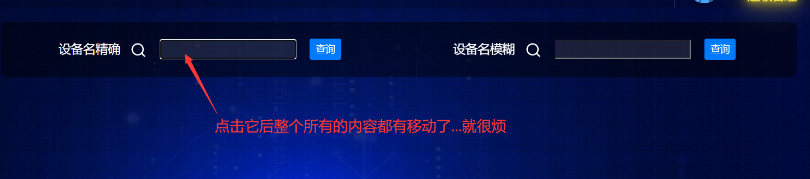

- **<font color='red'>bug原因</font>**

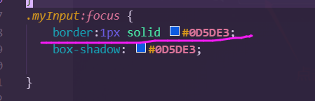


- **<font color='red'>这就导致点击的时候整个input框会变大一点，而整个的布局又是flex布局的，所以就会导致整体有移动，非常不好。只要把这段代码去除掉就行了。</font>**


## 22.6、日期控件

- https://blog.csdn.net/lianzhang861/article/details/80605128
- 使用html5的新日期控件挺好的，可以指定时间很不错的。

## 22.7、需求思路

- **<font color='purple'>如果想要改变bootstrap原有的样式，只要在写一个新的类，然后再class中添加它就行了。这个比该styles属性还好用。</font>**


## 22.8、需求思路

- **<font color='red'>我们知道在v-for的情况下，div中的class做了绑定，但是其实还是访问不到item.status的，怎么解决这个问题呢？</font>**

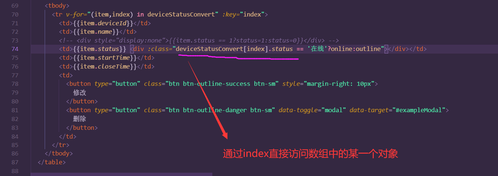

- **<font color='purple'>解决：很简单，直接使用index访问数组中的某一个对象就行了，哈哈</font>**

- **==2022年5月3日，这个待定，因为好像直接使用item是可以的==**


## 22.9、bug10（逻辑bug，无报错）

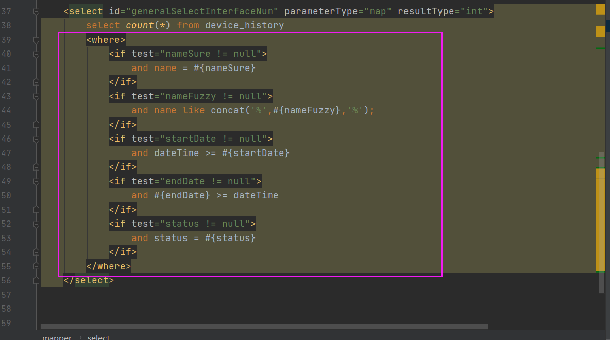

- **<font color='red'>请找出框框中有误的地方....因为把框框去掉后调用接口可以正常获取所有的数据，现在调用同样的接口获取的记录数为0...不知道为什么。</font>**


- **<font color='red'>解决：其实上面的地方并没有错误。。。错误在Controller层的这两段代码：</font>**

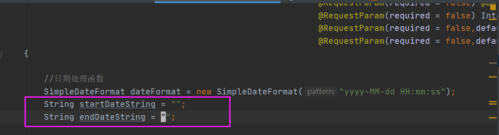

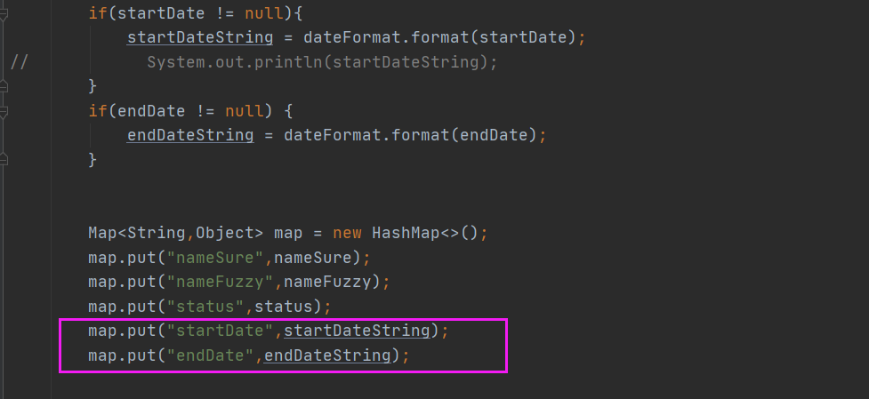

- **<font color='red'>也就是当startDate和endDate传进来的时候为空，但是在map中设置的时候"startDate"就是不null了，而是一段空的字符串""，"endDate"也一样的，所以mybatis中就会多加上没有用的日期比较查询条件，只要把第一段代码改成如下的代码就行了。</font>**


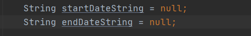


# 23、bug11

**<font color='red'>bug描述：莫名其妙的vuex中的属性和其他的函数就读取不出来了...</font>**


- **<font color='red'>解决：是因为webpack的语法错误了...</font>**

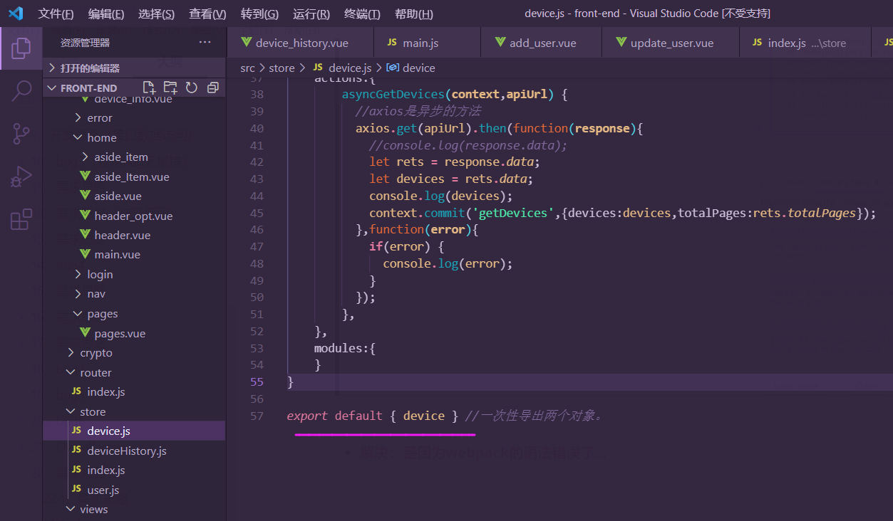

- **<font color='red'>导出模块的时候加上一个{}...</font>**

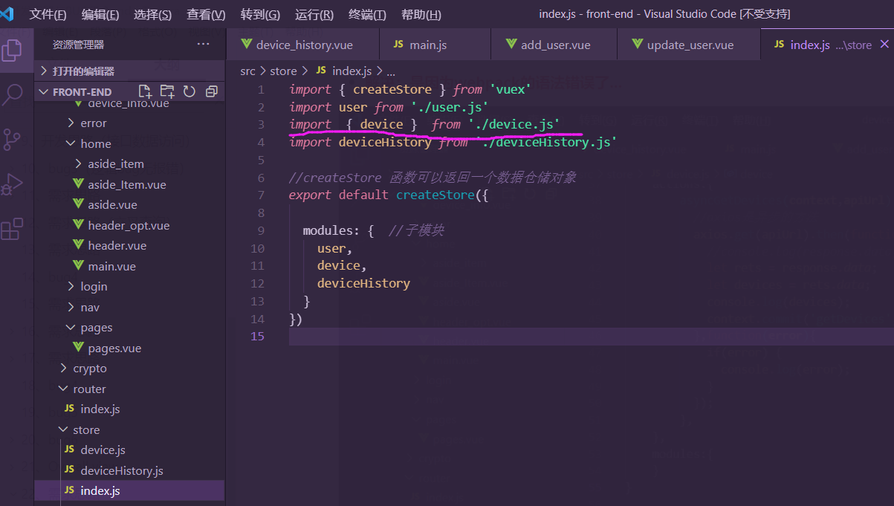

- **<font color='red'>导入模块的时候又加上了一个{}...就很离谱</font>**

- **<font color='blue'>只要把这两个{}都去除掉就行了</font>**


**<font color='red'>小结：为什么会报这样的错误呢？？因为我以为一个{}可以同时导出多个对象的...就你妈的离谱，我忘记了一个很重要的知识点就是，在js中一个{}就是一个对象啊,在对象里面放一个对象不是很离谱吗？？不应给是添加一个对象属性，然后再往里面放对象吗？</font>**


# 24、需求思路【\<select>元素】

**<font color='red'>需求描述：如何在vue中传递option选项的值捏？</font>**

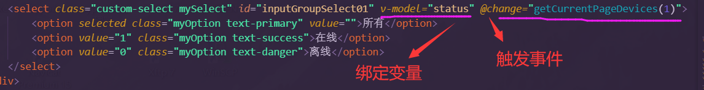

**<font color='purple'>在select标签中使用v-mode就可以把选项的value值和vue组件的变量进行一个绑定了，使用@change事件就可以触发响应的函数了，而不是@clikc事件</font>**

## 24.1、url中的特殊字符

- js的字符串处理函数：https://blog.csdn.net/snsHL9db69ccu1aIKl9r/article/details/119258128
- 最全面的处理函数 ：https://blog.csdn.net/frontend_frank/article/details/109759709
- url中的特殊字符处理：https://blog.csdn.net/u013991521/article/details/52442115

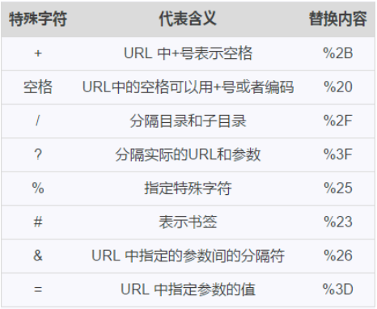

## 24.2、bug12（逻辑bug，无报错）

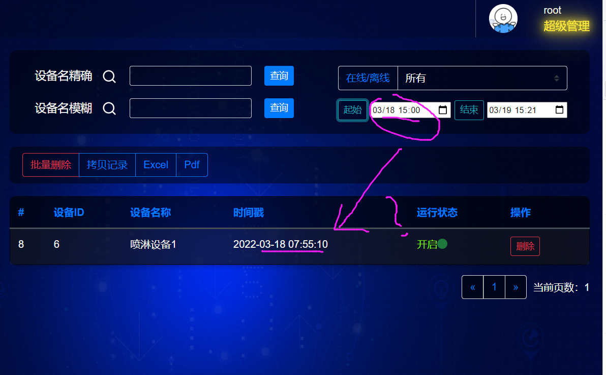

- **<font color='red'>我设置的起始日期是2022-3-18 15:00:00，也就是说时间戳要大于这个才行啊，为什么会出现这个东西呢？这个就很离谱了</font>**


然后我到数据库中查看一个下，发现这条记录的时间是


- **前端和后端的数据怎么会对不上呢？？？**


**<font color='purple'>解决：这个问题是时区的问题，就是服务器的时区和mysql数据库的时区不一致导致的，在application.yaml核心配置文件中，在链接数据库的时候带上serverTimezone=UTC这个问题就解决了捏</font>**


- **<font color='red'>在数据库属性中配置UTC没有用的，艹了，给我真不会了...这种Bug搞起来真的很耗费时间啊。</font>**

## 24.3、在vue中绑定复选框

```html
<div id="d5">
    <p>{{box5.toString()}}</p>
    <input type="checkbox" v-model="box5" value="red">
    <input type="checkbox" v-model="box5" value="黄">
    <input type="checkbox" v-model="box5" value="蓝">
</div>
<script>
    new Vue({
        el:'#d5',
        data:{
        box5:[]
    }
    })
</script>  
```

- **<font color='purple'>当复选框被选中时，value里面的值就会被添加到box5数组中的，同时checkbox的value值也可以绑定vue中的数据，比如vuex中的和data中的都可以绑定。这就和input框有很大的不同了，因为input框只能绑定一个value或者value捏。</font>**

## 24.5、实现复制内容的一个方法

```html
<body>

    <h5>JS 实现文本复制到剪切版</h5>
    输入内容：<input type="text" id="ipt" autocomplete="off">
    <button id="btn">一键复制</button>


    <script>
        const ipt = document.querySelector("#ipt");
        const btn = document.querySelector("#btn");

        btn.addEventListener("click",function(){
            copyToXipboard(ipt.value);
        });

        function copyToXipboard (str) {
            const el = document.createElement("textarea");
            el.value = str;
            //把这个dom添加到页面上
            document.body.appendChild(el);
            //选中这个el dom 
            el.select();
            //执行拷贝的命令
            document.execCommand("copy");
            //已经通过el复制到剪切板上了，移除这个dom就行了
            document.body.removeChild(el);
        }

    </script>

</body>
```

- **<font color='red'>主要就是通过textarea把内容复制到剪切板上，然后再删除掉textarea dom就行了。</font>**


## 24.6、实现excel导出的方法

- 主要这里使用了js-xlsx的库

参考文档：https://www.cnblogs.com/sunshine233/p/15480170.html

https://www.cnblogs.com/youryida/p/9275615.html

- 导入：npm install xlsx --save

然后再指定的组件中使用就行了

- import * as XLSX from 'xlsx'

- 调用这个方法：

- ```js
          //导出excel数据
          exportExcel(type, fn, dl) {
              var elt = document.getElementById('data-table');
              var wb = XLSX.utils.table_to_book(elt, {sheet:"Sheet JS"});
              return dl?XLSX.write(wb, {bookType:type, bookSST:true, type: 'base64'}):
              XLSX.writeFile(wb, fn || ('DeviceDatas.' + (type || 'xlsx')));
          }
        
  ```

# 25、需求分析【websocket双向通信】

**主要是要解决后端数据变化后，前端实时的展示，这个东西是整个项目的精髓所在。**

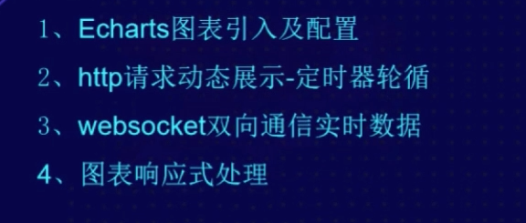


- 这个东西很有用的，尤其是websocket的双向通信。

## 25.1、需求分析

**<font color='purple'>基本上，我们需要一个模拟设备工作的程序，这个程序我是用网页端来实现应该是开发成本最低的了，</font>**


## 25.2、需求分析

**<font color='purple'>上一个需求已经基本做完了，现在想要实现通过webSocket的前端页面数据的实时更新，我现在的想法就是在vue created钩子函数调用从后端获取到数据的接口时就与后端建立一个websokect接口，然后写好监听事件的回调函数，在open回调中把自己这个连接的名字发送给后端，然后在后端的message回调函数中存储该名字和endPoint对象就行了</font>**


## 25.3、bug（logic:批量删除报错）

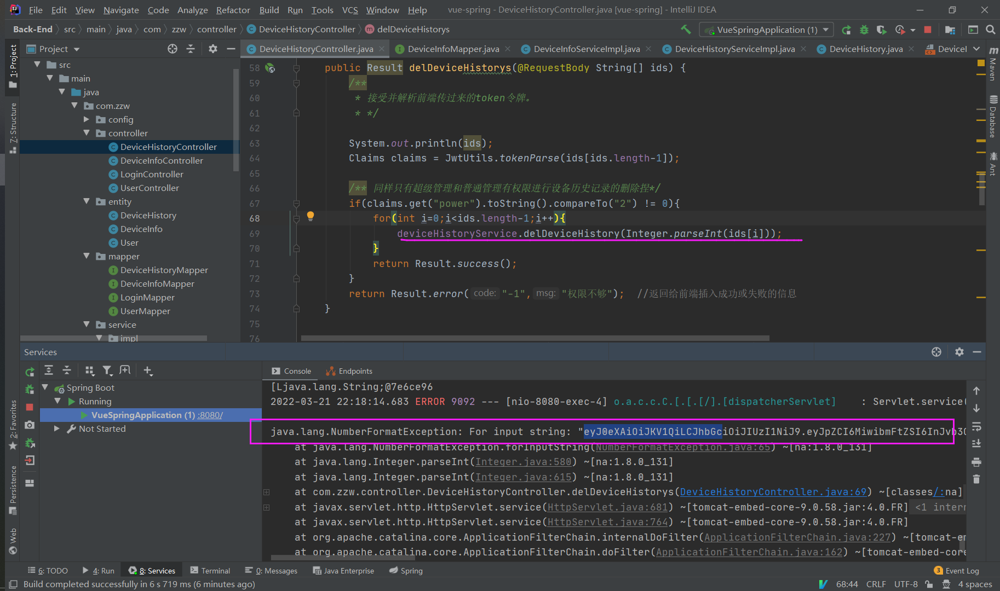


**<font color='red'>问题描述：就是删除一页的全部内容后，该页的内容会重新从数据库中获取的对吧，而重新获取到的内容再次选中删除后就报错了，就是上面的那个错，不知道为什么???</font>**

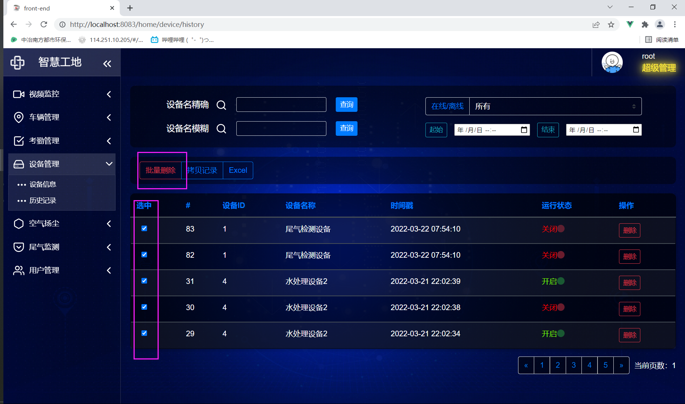


- **<font color='purple'>解决，是前端的问题</font>**

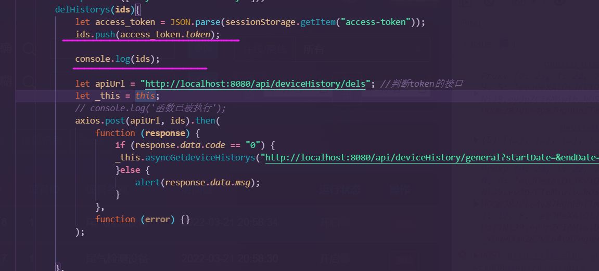

**<font color='purple'>前端每次发送的时候，ids都没有重新清空过，这就导致ids被发送到后端的时候，还携带上一次的数据和token信息（第二个框框），所以后端处理不了了就报错了。</font>**

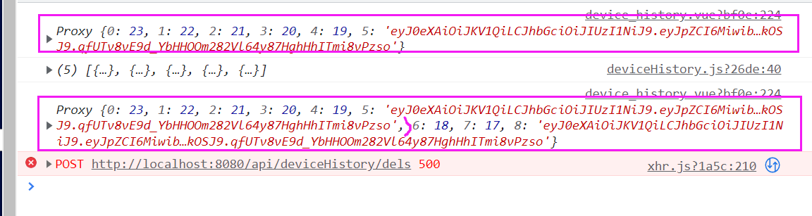

**<font color='purple'>只要每次发送批量删除的请求后，再次进行重置ids中的所有内容就行了</font>**

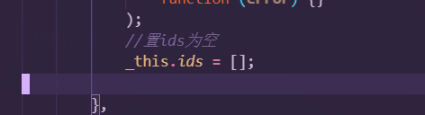


## 25.4、bug（logic:设备更新后,历史记录一次增加两条的逻辑错误）

原因：


**你这样写不就执行了两次增加吗？？？**


## 25.5、bug（websocket关闭报错）

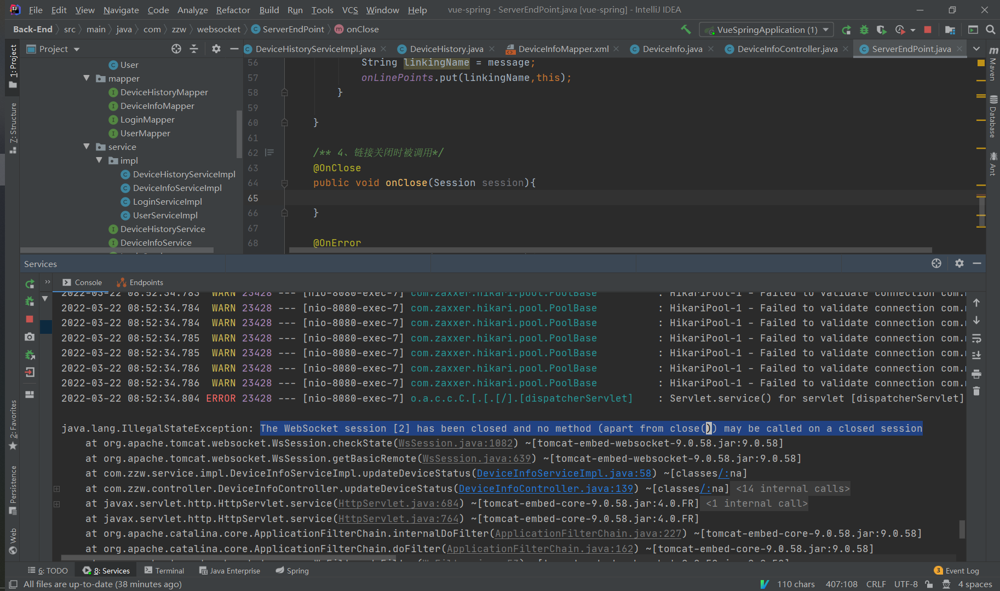

- **<font color='purple'>原因：这个是因为，客户端的WebSocket对象已经关闭了，而对应的服务端的endPoints对象还存在，这时候让服务端的endPoints对象去传数据给客户端的sokcet对象，服务端当然报找不到喽...</font>**


- **<font color='purple'>解决：当链接关闭的时候，服务器和客户端两端的socket对象都会执行close方法，对吧，在关闭链接的时候，在服务端把endPoint对象删除掉就行了，用remove方法.</font>**


# 26、需求思路【vue数据传递】

## 26.1、数据传递（vue组件）

数据传递的几种方式：

1、组件之间传参

2、路由传参

3、vuex传递数据

4、使用localStorage和SessioinStorage存取数据

5、从数据库拿数据


## 26.2、需求思路（JSON）

- **<font color='red'>JSON键一定要加“”，json的值可以有 数字，字符串，bool值，数组，对象，null</font>**

- ```json
  JSON.parse(text)  //json字符串转成javascript对象
  ```

- ```json
  JSON.stringify(value)  //javascript对象转成json串
  ```


# 27、需求分析【echart导入项目】

**<font color='purple'>对于图表的实时数据展示，从大局来看，还是得先熟悉Ecahrt图，尤其是柱状图和折线图的所有内容，基本上，所有的图表数据都可以由这两种图标解决的，这两种图表先学精吧。然后就是设备模拟的vue化，如果不vue化，又用原来的javascript的话，基本会更难的，最后是UI设计，一个图表（肯定得用折线图，因为雷达图解决不了时间的问题。。。也许可以但成本太高了...），然后指标超标的报警记录得用表格实现。</font>**


**<font color='purple'>因为vuex可以分模块的的，所以我有点想要尾气检测和扬尘检测获取数据的方式变为完全的websocket，就这么决定了，websocket和http的那种半混和老实讲有点烂，不是不可以把，不过像扬尘，尾气检测这种没隔一分钟就要被服务器发送数据的话，用http取主动发请求，断开请求真的很耗费资源，基本上需要实时的都用websocket，不需要实时的只用http会比较好吧。</font>**


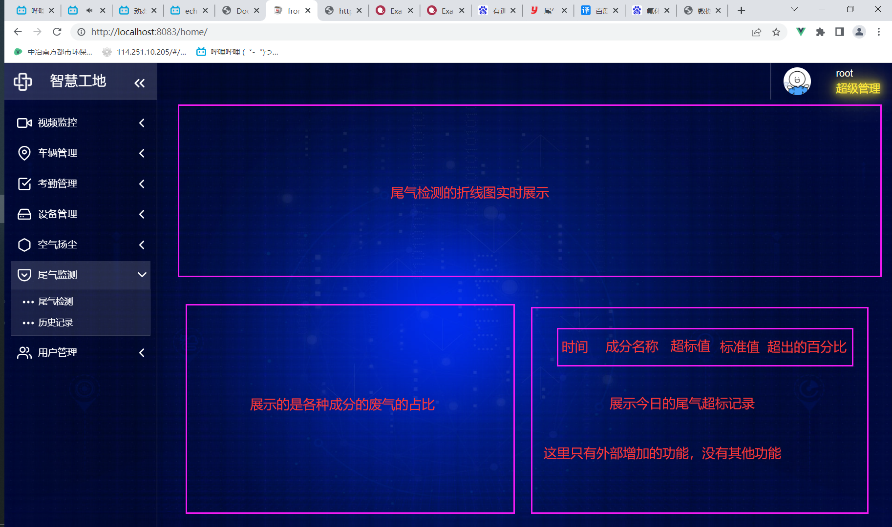

**历史记录这里要写一些什么捏？因为在尾气检测这里就可以查看所有历史的图表了，所以历史记录就和以前一样使用使用查找的那个模板就行了，也比较简单。**

基本上就是这样的：

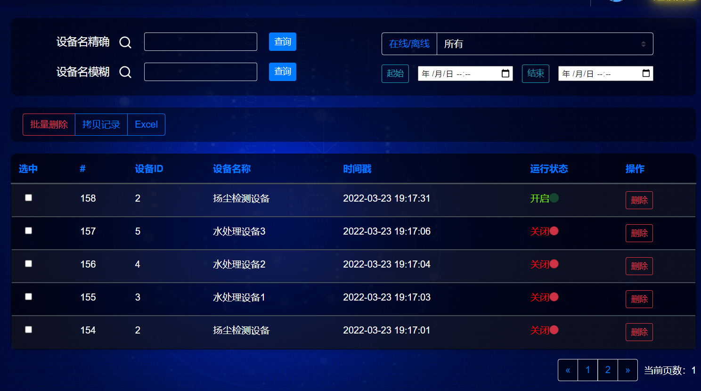

只不过是表的字段改一下，改成和实时检测表一样的就行了。


## 27.1、--save和--save-dev的区别

https://www.cnblogs.com/limitcode/p/7906447.html


## 27.2、需求分析

基本上就每一5分钟获取一次数据吧，改成频率可以调整的就行了，


## 27.3、vue中导入echart

```bash
npm install echarts --save
```

然后再组件中引入就行了。

```javascript

//导入echarts
import * as echarts from 'echarts'

```


**<font color='purple'>在mounted钩子函数中去进行图标的绘制，因为只有在mounted钩子函数中才能获取到页面上的dom元素的</font>**

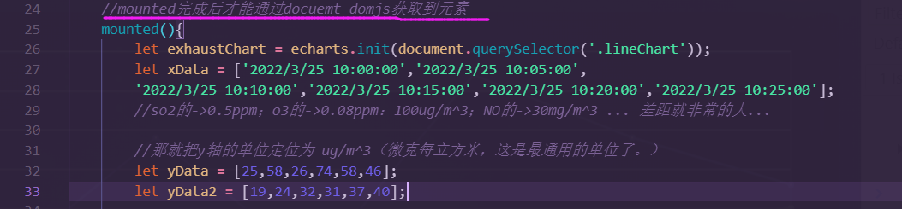


## 27.4、需求分析

**<font color='red'>需要实现网格的大小随着窗口的改变而改变。我们发现,F11和点击最大化最小化按钮的时候，窗口的大小不能发生改变的...就很离谱，一定要把这个问题给彻底解决掉！</font>**


# 28、bug未解决【echart图表缩放】

**<font color='purple'>那个啥，27.4的问题解决不掉了...</font>**

**<font color='purple'>我原以为F11后图表的大小没有重新绘制改变是因为window.onresize捕获不到F11...但其实是可以捕获到的，那为什么图表没有重新绘制成对应的比例内？因为获取的宽和高有莫名其妙的问题，</font>**

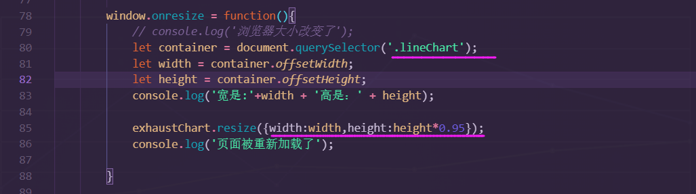

**<font color='purple'>按道理来说，在页面大小改变的时候，我去获取图表绑定div容器的宽和高，然后在resize的时候重新传递给exhasutChart对吧，那页面大小改变后图表的比例应该也是正确的呀</font>**

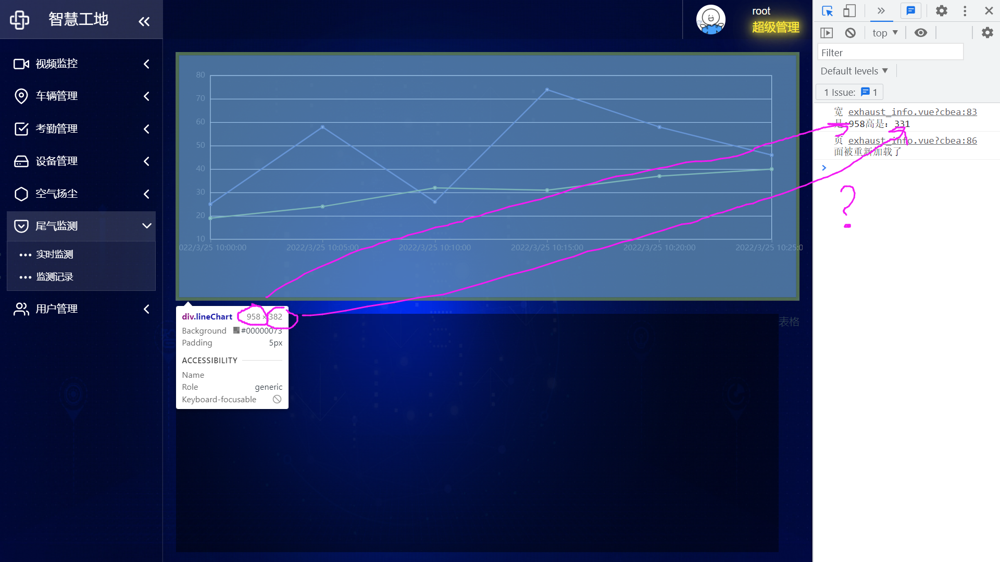

**<font color='purple'>可是当我F11的时候，发现获取到的div容器的宽度没问题（所以图表宽度是对应比例的），但是获取到的图表的高度有很大的问题？？？更本就不是一个值了？？这是为什么捏？</font>**


## 28.1、解决思路

**<font color='red'>退而求其次的解决办法</font>**

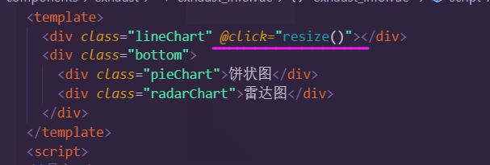

**<font color='purple'>添加一个函数，在这个函数里面resize一下吧，发现图表情况不对劲就手动再改一下就行了，因为window.resize对f11和窗口放大缩小的功能做得很不好，漏洞很大，所以只能手动一下了</font>**


# 29、需求思路【echart图表联动】


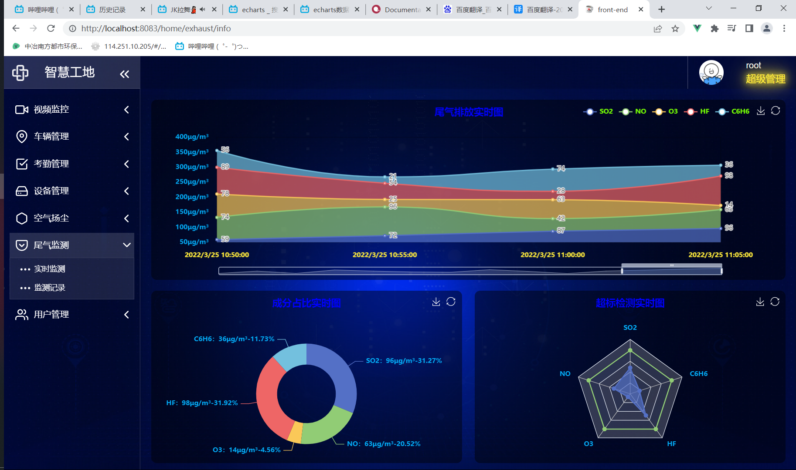


**<font color='purple'>感觉这幅图中的颜色太和蔼了一些，没有攻击型啊，尤其是SO2这样的对人体有伤害的排放物，它的颜色应该更具有标示性和攻击性，让人一看就怕的那种，我想要把这三幅图的所有的配色方案全部改成另外一套，具体的操作只要参照配置手册来就行了，主要是想让每一种排放物都有它自己的专属的颜色。</font>**


SO2：#FC7D02

NO：#AC3B2A

O3：#AA069F

HF：#FBDB0F

C6H6：#FD0100


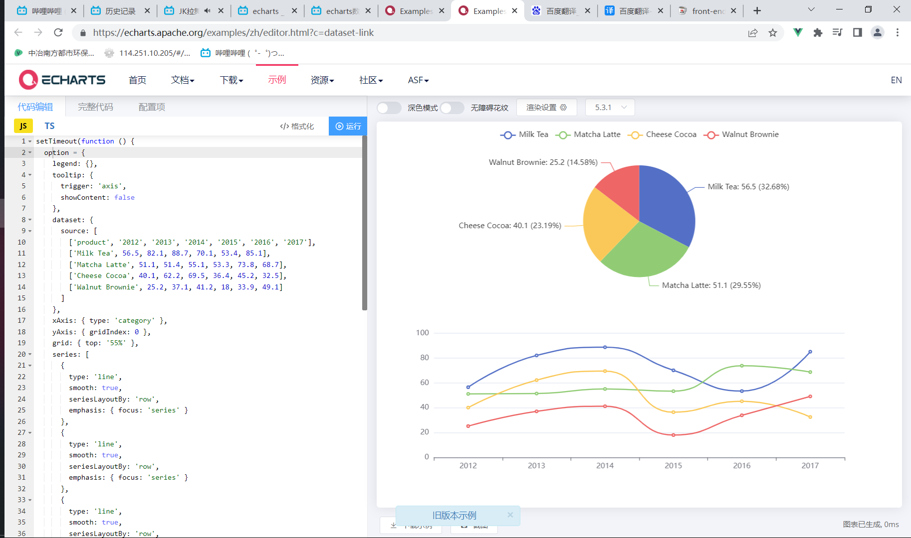


**<font color='purple'>数据的联动效果就做成这个样子就行了</font>**


## 29.1、需求思路（echart富文本）

**<font color='red'>需求描述：把legend的每一项的文本的颜色和每一项数据的颜色搭配起来，就是如下的效果</font>**

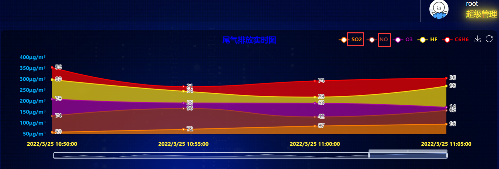


实现的思路，使用最屌的rich富文本：

参考文档一：https://blog.csdn.net/weixin_43798882/article/details/90697316


**<font color='purple'>我们要知道rich可以自定义文本的样式，然后使用'{自定义样式名|文本内容...}'就可以给指定的文本内容加上样式了，然后是formatter回调函数，每一个legend加载的时候该函数都会被调用一次，返回值就是legend的图例的文本，然后使用if...else if...判断每次加载的是哪一个文本，再给文本加上自定义的rich样式就能完成上面的任务了。</font>**

```js
legend:{
        type:'scroll',
        data:['SO2','NO','O3','HF','C6H6'],
        top:5,
        right:'5%',
        formatter:function(name){
            if(name == 'SO2'){
                // console.log('这是二氧化硫');
                return '{a|'+name+'}'
            }else if(name == 'NO'){
                return '{b|'+name+'}'
            }else if(name == 'O3'){
                return '{c|'+name+'}'
            }else if(name == 'HF'){
                return '{d|'+name+'}'
            }else{
                return '{e|'+name+'}'
            }
        },
        textStyle:{
            // color:'#76FF03',
            fontWeight:'bolder',
            //使用富文本的模式
            rich:{
                a:{
                    color:'#FC7D02',
                    fontWeight:'bolder',
                },
                b:{
                    color:'#AC3B2A',
                    fontWeight:'bolder',
                }, 
                c:{
                    color:'#AA069F',
                    fontWeight:'bolder',
                },
                d:{
                    color:'#FBDB0F',
                    fontWeight:'bolder',
                },
                e:{
                    color:'#FD0100',
                    fontWeight:'bolder',
                }
            }
        },
    },
```


## 29.2、需求思路（图表联动实现）

对于第二的需求的实现：核心就是用到了下面的函数：

```js
exhaustChart.on("updateAxisPointer", function (event) {
      const xAxisInfo = event.axesInfo[0];
      // console.log(xAxisInfo);
      if (xAxisInfo) {
        pieData[0].value = yDataObj.SO2[xAxisInfo.value];
        pieData[1].value = yDataObj.NO[xAxisInfo.value];
        pieData[2].value = yDataObj.O3[xAxisInfo.value];
        pieData[3].value = yDataObj.HF[xAxisInfo.value];
        pieData[4].value = yDataObj.C6H6[xAxisInfo.value];
        radarData[0] = yDataObj.SO2[xAxisInfo.value];
        radarData[1] = yDataObj.NO[xAxisInfo.value];
        radarData[2] = yDataObj.O3[xAxisInfo.value];
        radarData[3] = yDataObj.HF[xAxisInfo.value];
        radarData[4] = yDataObj.C6H6[xAxisInfo.value];


        option2 = partOptionFunc(pieData);
        percentChart.setOption(option2);

        option3 = radarOptionFunc(radarData);
        radarChart.setOption(option3);


      }
    });
```

**<font color='purple'>简单的说就是在鼠标滑过轴线的时候触发一个事件，叫做updateAxisPointer，然后这个事件绑定一个函数，在函数中我们改变饼形图和雷达图的配置项中的数据即可。</font>**


## 29.3、监测记录需求


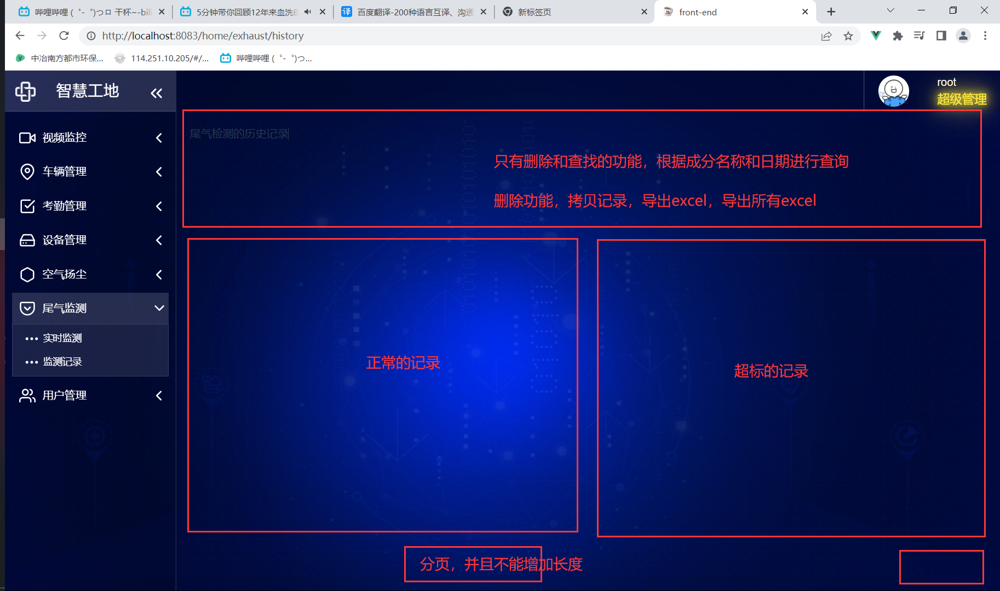


## 29.4、需求思路

**<font color='purple'>为什么最后还是放弃了全websocket的通信模式呢？因为之前的整个项目的架构都是搭建在http协议的基础之上的，要改的话，整个体系就会变得很混乱了，算啦，以后有机会再搞全websocket的把。</font>**


## 29.5、BUG（grammar:json键值错误）

**<font color='red'>传递的json数据为空？</font>**

postman

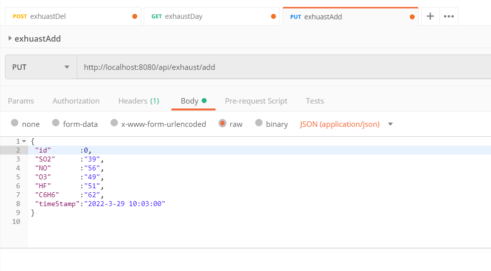

Controller层：
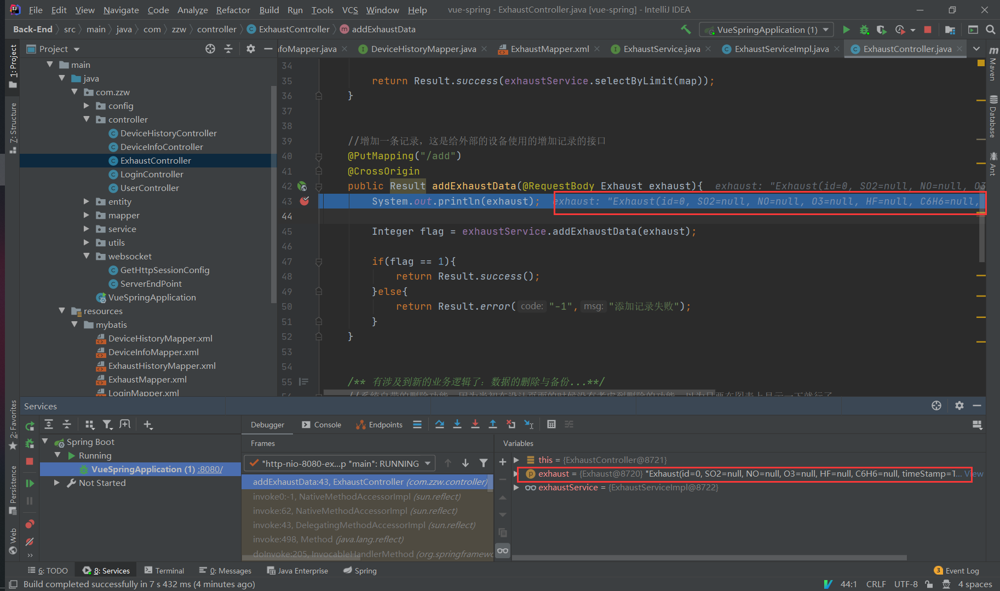


==为什么捏？？？==

**<font color='red'>因为属性名<font color='blue'>首字母</font>是大写的，所以就获取不到值了捏？？？这个就很尼玛离谱！</font>**

改成小写...

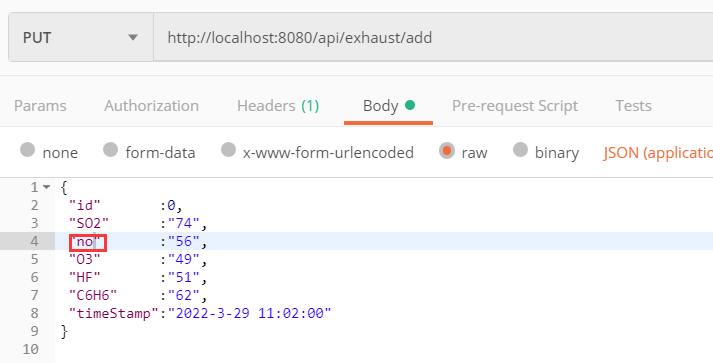

**<font color='red'>服务器中entity的大小写没有影响，主要就是传递的JSON数据的键，它的首字母必须小写捏</font>**


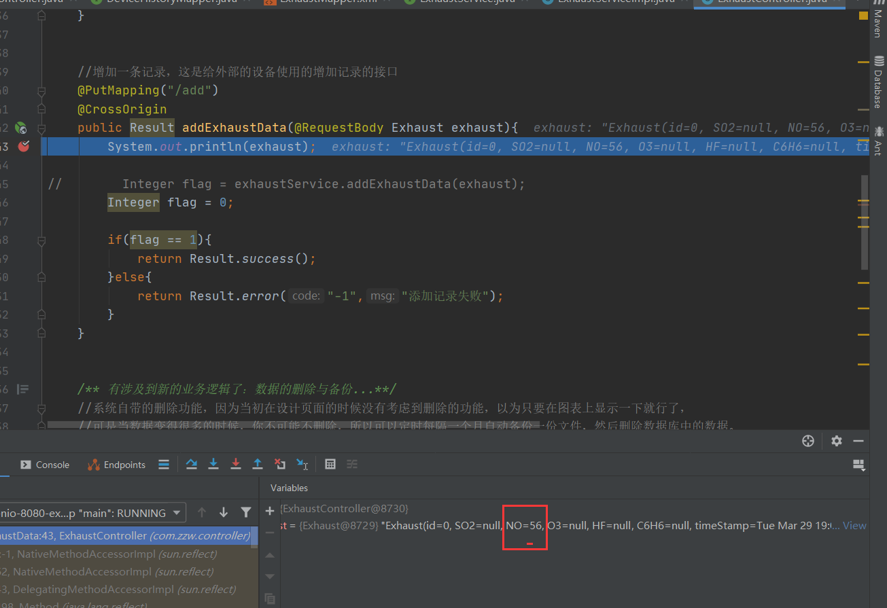


**<font color='blue'>子Bug：把苯环改成c6h6之后还是获取不到数据，要改成c6H6才行捏《</font>**

**<font color='purple'>小结：在传递json对象的时候，json键要满足以下两个要求才能被服务器正常获取到，一：首字母必须小写；二：数字后面的第一个字符必须大写！！！</font>**


## 29.6、需求思路（java获取一个月前时间）

https://www.cnblogs.com/yccmelody/p/8398290.html


## 29.7、Navicat Mysql 设置默认值


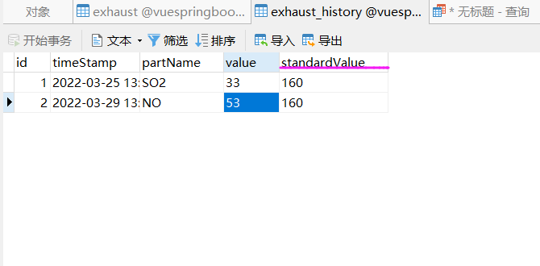

**<font color='red'>因为这个standardValue代表的是标准值，不用每次都从外边获取的，所以我就想设置它的默认值，这样每次增加里面的记录的时候然后就可以自动生成设置好的标准数值了捏</font>**

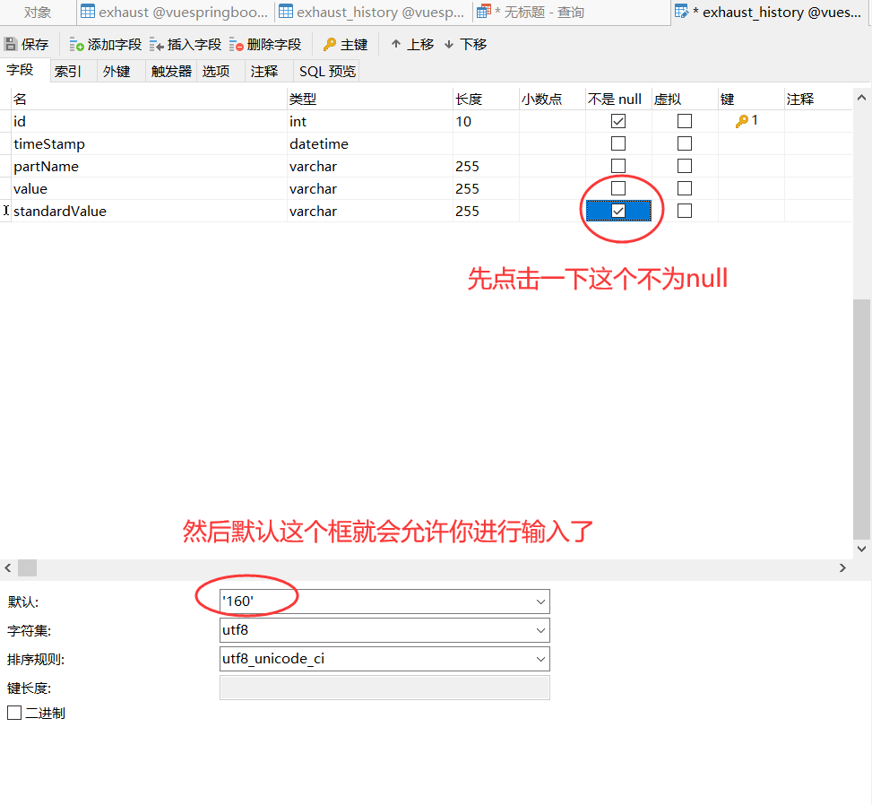

## 29.8、需求思路

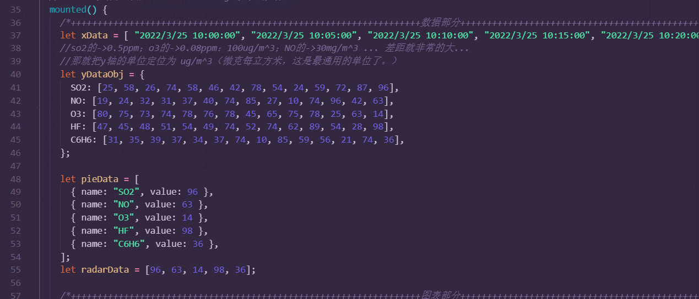

**<font color='purple'>把这部分数据放到vuex中的getters中，因为可以从数据库获取到exhausts的所有记录，然后再用vuex Getters把这些数据进行处理包装成上面的四个数据，然后再用map辅助函数拿到这些数据就行了</font>**


# 30、需求思路【vue-ref属性】

**==<font color='red'>如何在vue中拿到一个dom的对象，？？不用再使用document了，用下面的方法就好了</font>==**

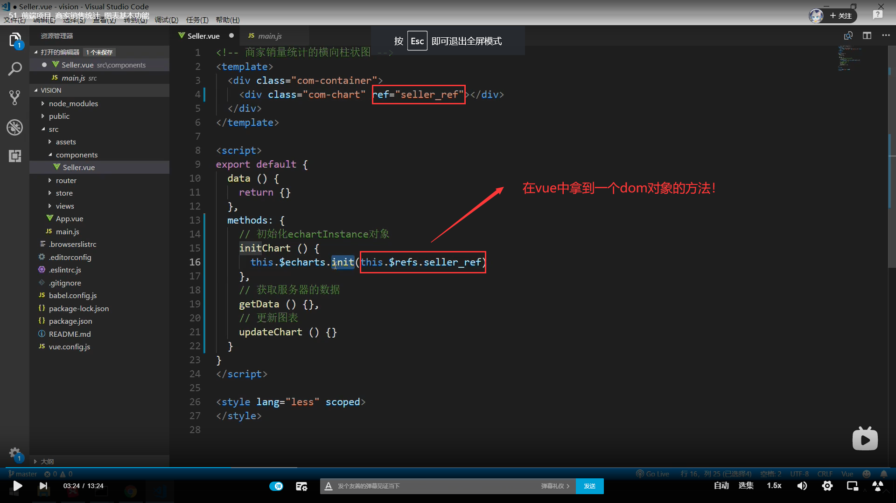

**<font color='purple'>只要给一个元素加上ref属性然后使用this.$ref.ref名称就行了，多美妙啊，我去</font>**


## 30.1、BUG（vue钩子修改data数据后,访问data数据没有任何改变1）


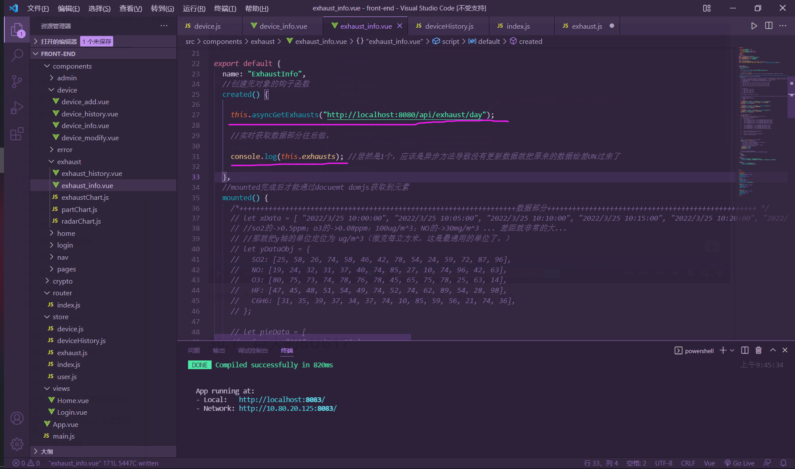

**<font color='purple'>在async中使用axios更新vuex仓库中的所有数据，但是，因为是异步的方法，所以this.exhausts还是只有原来的那一个...包括在mounted钩子函数中也是这样的，我原以为只是数据还没有获取到，等待一段时间就可以了，于是有了下面的代码，</font>**

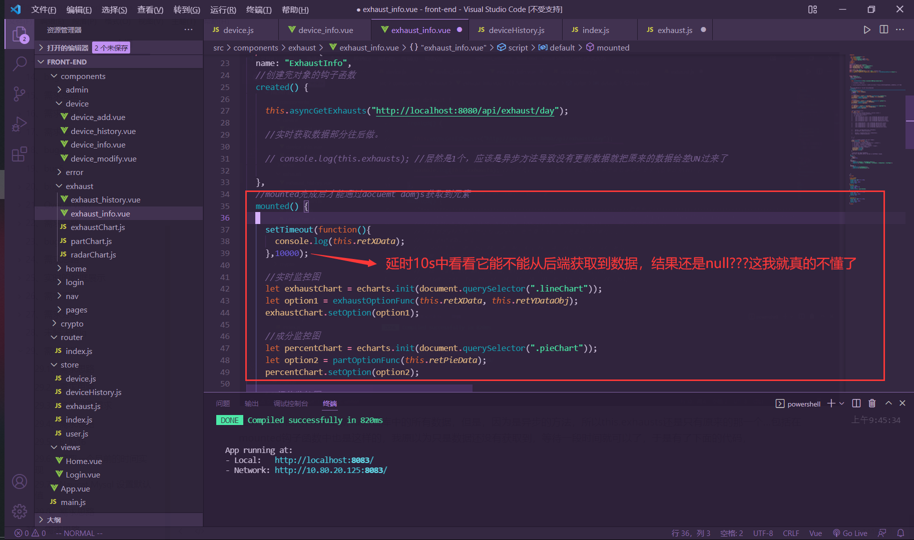

**==<font color='red'>这个挺诡异的，我也搞不懂是为什么，好像只有整个vue组件完全加载完成后，在template中使用vuex中的数据才是真正从后端获取到的，这个我真的不懂，为什么？？</font>==**


## 解决：换技术方案

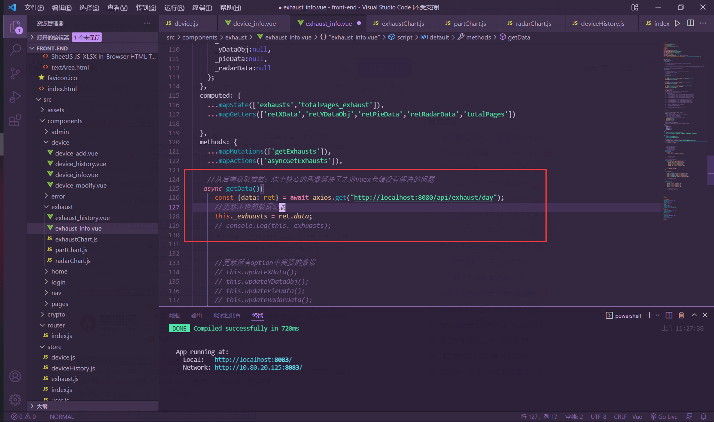

**<font color='red'>使用这个函数直接获取到后端返回的数据初始化给本地数据。</font>**


## 30.2、BUG（vue钩子修改data数据后,访问data数据没有任何改变2）


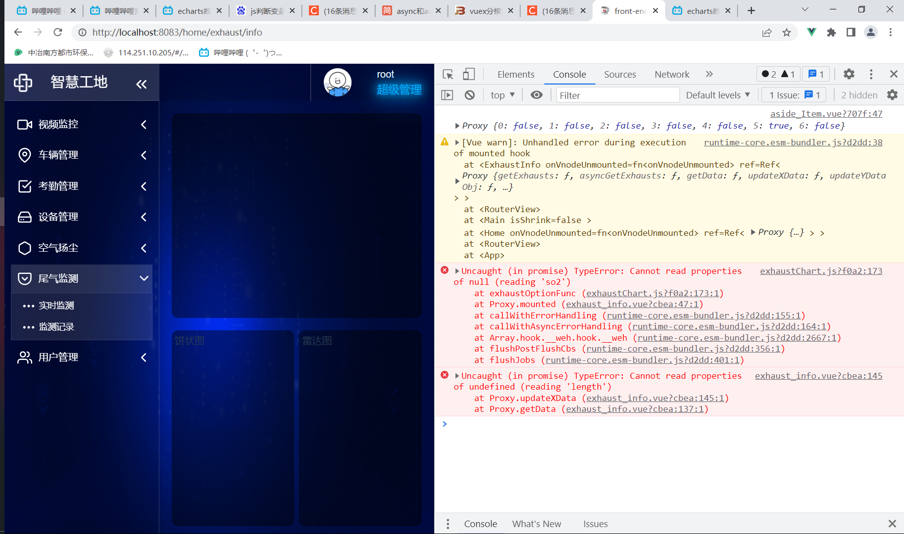


**<font color='red'>第二个bug的解决：</font>**

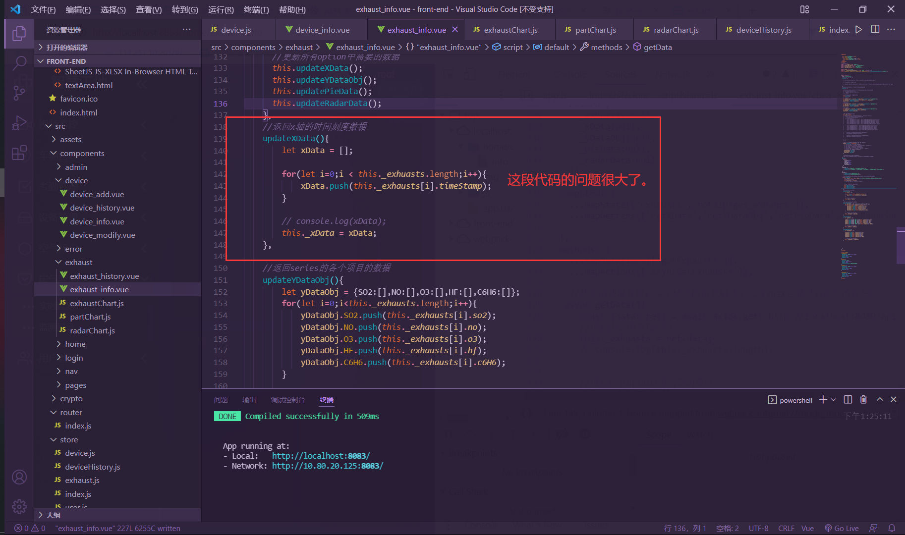


**==<font color='red'>不好意思，上面的纯属是瞎几乱讲了。。。原因是因为变量写错了，我把data中的变量定义成了_exhuasts，而在函数中写的都是_exhausts我去，我吐了</font>==**


## 30.3、BUG（vue钩子修改data数据后,访问data数据没有任何改变3）

**<font color='purple'>如果在一个vue component组件对象中，有一个方法A改变了变量a的值，那么在函数B中去访问变量a，a的值有没有被改变呢</font>**


**<font color='purple'>在getData函数中更新本地变量 thisD:\GitTool\同步笔记\_exhausts的值对吧，然后再mounted函数中执行这个函数，看看this._exhausts的值有没有改变。</font>**


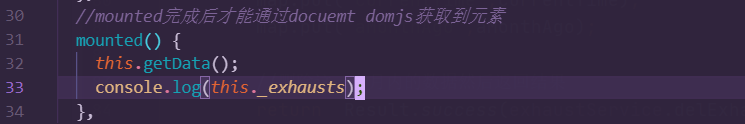

**<font color='red'>结果如下所示：就是获取不到...</font>**


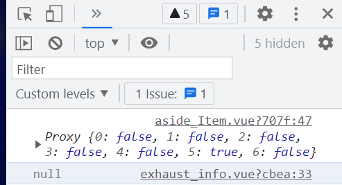


**==<font color='red'>进一步想一下，如果把console.log(this._exhausts)封装成一个函数的话，那么在函数A中改变变量的值，在函数B中是获取不到的...那什么时候可以获取到最新的值呢？有两种情况，一是在template模板中结合vue指令可以获取到最新的值，还有一种就是在改变变量的函数作用域内部可以获取到最新的值。比如如下所示：</font>==**

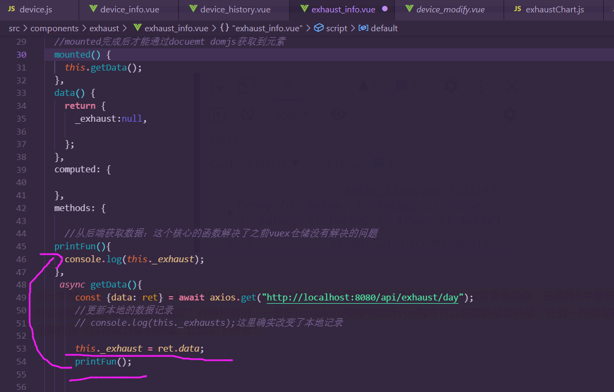


### 1.子问题：为什么之前没有出现这个问题？

1. 之前没有写过这种代码。。。
2. **<font color='red'>之前的代码都是从后端获取数据改变仓储数据（和本地变量没有区别）然后显示在template模板中，这时候模板中的这些数据都是最新的，然后还有一种情况就是在template模板中触发函数，在函数中获取到的数据也是最新的，就比如下面的例子。</font>**

准备一个test变量：
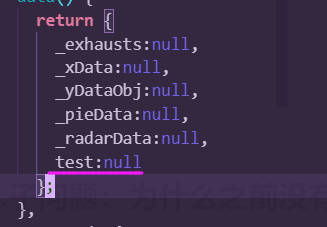

随便在一个函数中改变这个变量的值

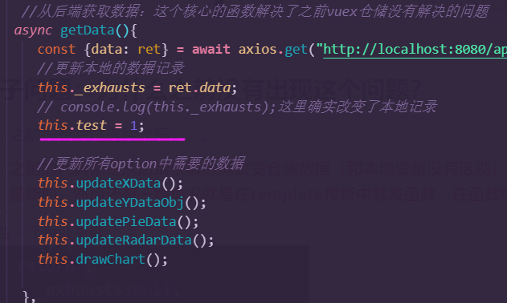

在钩子函数中调用该函数

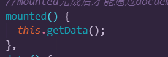

写一个testClickt打印this.test变量，并在template中使用click事件触发这个函数。


结果：获取到的数据是最新的。


3. **<font color='blue'>小结：在template模板中使用 vue指令（v-if，v-for，@，:，v-model）访问到的数据都是最新的。像v-if这些就是直接访问data和getters中的变量，而@就是触发methods中的方法，如果这个方法中有访问到变量的，也是获取到最新的值的。</font>**


### 2.总结：很重要

**<font color='purple'>在函数A中改变变量（data中的变量、vuex仓储变量）的值，在函数B中是获取不到的...那什么时候可以获取到最新的值呢？有两种情况，一是在template模板中结合vue指令可以获取到最新的值，还有一种就是在改变变量的函数作用域内部可以获取到最新的值。<font color='blue'>[这个规律和函数在哪里触发，什么时候触发没有关系的]</font></font>**


### 3、开启监听函数

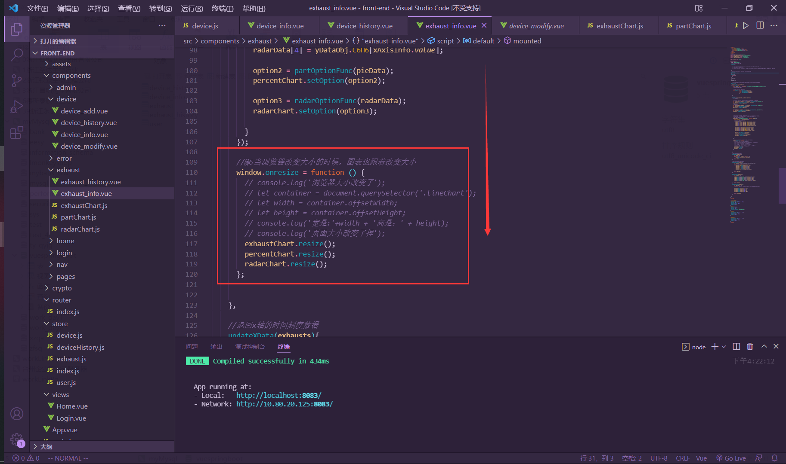

**==<font color='red'>我们都知道函数一般在 *钩子中被调用*或者在 *触发事件（模板中@click...）的时候被调用*，当然这两者没有任何区别只不过被调用的时机不同而已，现在又有一种新的方式，就是开启一个监听函数，就是函数执行到框框中的内容时，框框中的函数并不会被立即调用而是给一个事件赋值了一个函数，当这个事件触发的时候，该函数就会被执行了。</font>==**


# 31、BUG【css元素堆叠】

因为元素堆叠的问题，选取不到退出选项了。

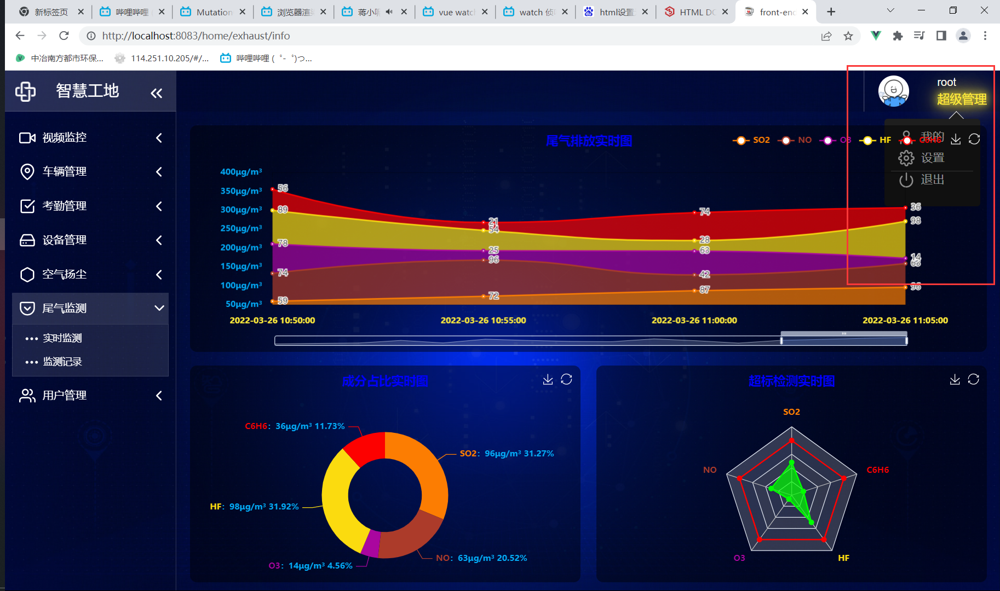

==解决：设置z-index就可以了==

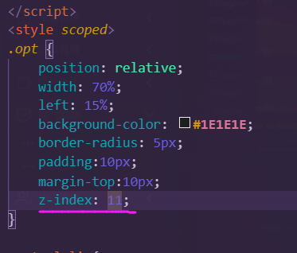


## 31.1、BUG（grammar:mybatis XML错误）

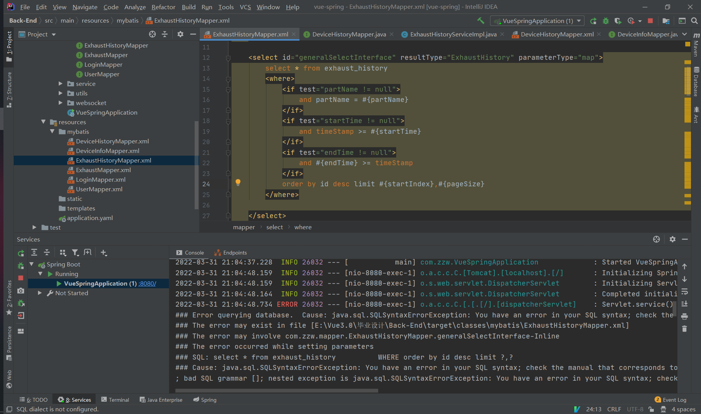

**==<font color='red'>order by语句必须要写在where标签的外边才行不然的话如果所有的都没有的就会变成错误提示里面的语句，多了一个where语句怎么查的出来。</font>==**


## 31.2、BUG（单词拼写错误）

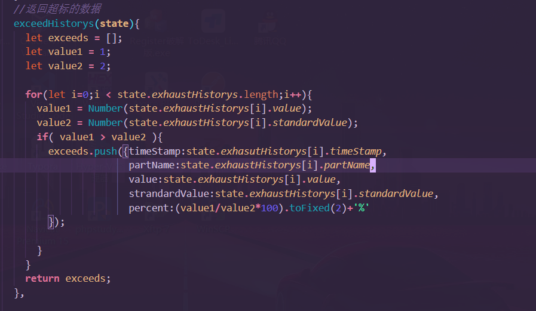


**==///???==**

解决：又拼写错了：是exhaust不是exhasut啊，这个单词好恶心。。。


## 31.3、需求思路（json转Excel）

**<font color='red'>需求描述：如何把所有的历史数据都导出呢？因为之前使用的插件是根据表格的id导出数据的，所以只能导出一部分数据，所以想到导出全部数据的话，我就自然的想到了json转excel，把从后端获取的数据接受为json串，然后把这个json串转成excel就行了，简单明了。</font>**

参考文档：
https://blog.csdn.net/ygy211715/article/details/89135416 （教你基本使用）

https://www.cnblogs.com/--cainiao/p/9999170.html  （教你如何import对象）

代码部分：

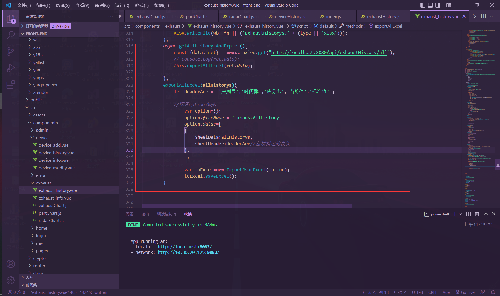


==**<font color='purple'>优势：时间不会报错！！！比原来的那个好很多！！！</font>**==


## 31.4、BUG22（logic:slice函数与splice函数区别）


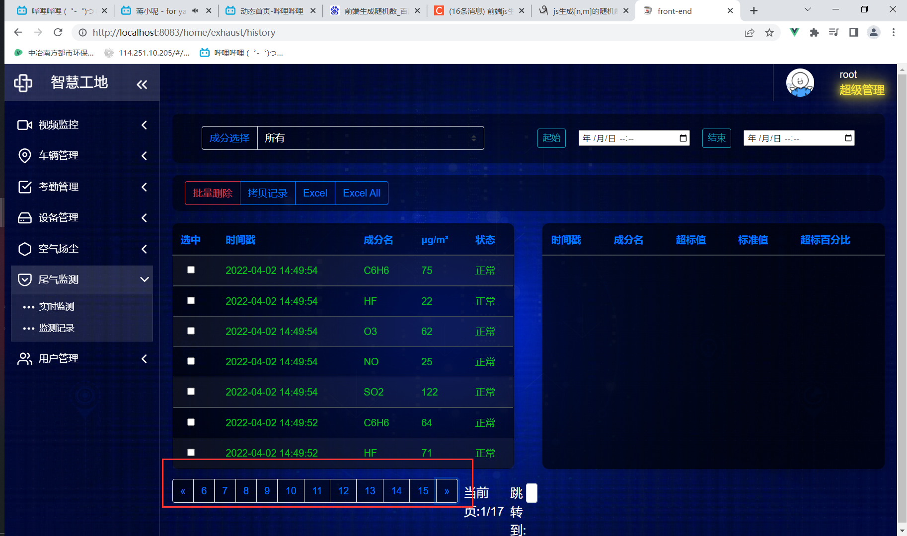

**<font color='purple'>这里本来应该是五个分页才对啊，怎么变成10个了？？？</font>**

**<font color='purple'>解决：这里函数用错了：是slice而不是splice函数！！！</font>**

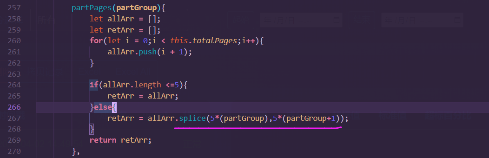


改成slice函数就行了：
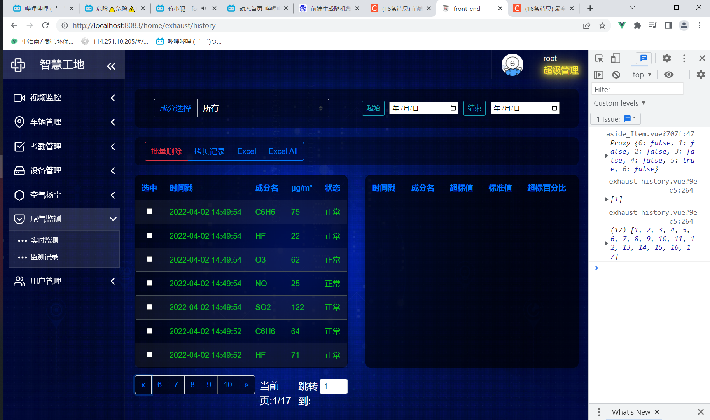


# 32、需求思路

https://echarts.apache.org/examples/zh/editor.html?c=pictorialBar-dotted


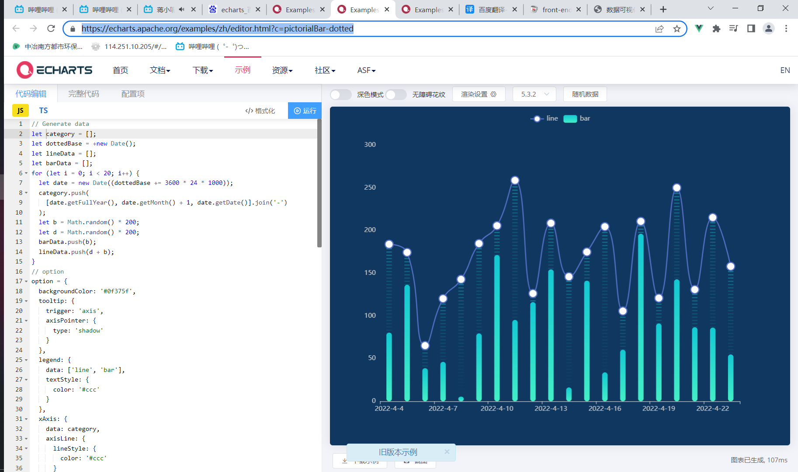

**这图用来做考勤的模块挺好的。**


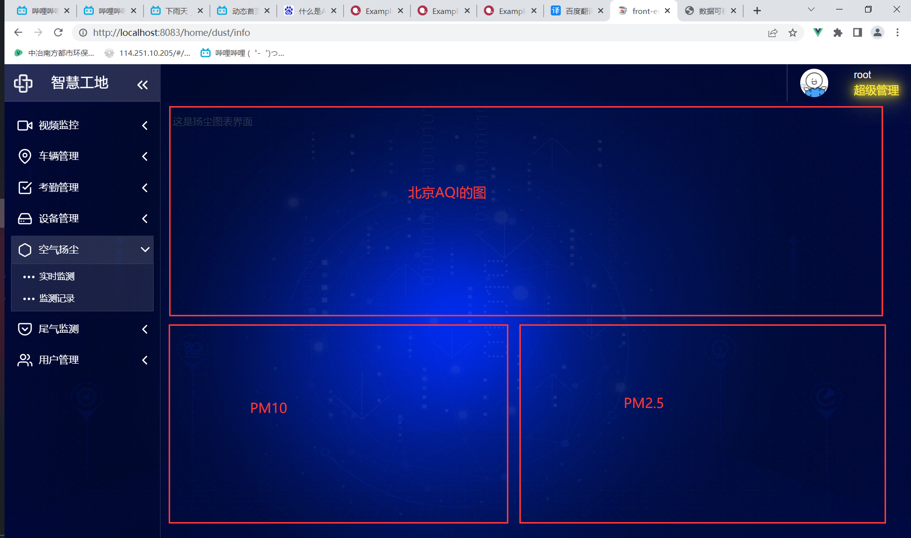


**和原来的数据不同的是，这两张报表的数据来源是不一致的...可以说两者的关系几乎没有什么关系，不像原来的那个，右边的表是从左边的表中的超标数据提取出来的。所以上面的操作的框中的内容也是不一样的，应该也是要分两个。左边有左边的操作框，右边有右边的操作框，然后查询框也是不一样的，左边的AQI报表应该只有根据时间戳和严重程度来查询的功能，右边的报表，**

**<font color='purple'>算了，直接整合成一个就行了。</font>**


# 33、BUG【webpack图片获取】

当backgroud的url变为参数时候，就获取不到正确的图片了...

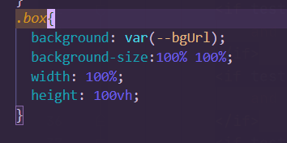


css属性值的变量化：

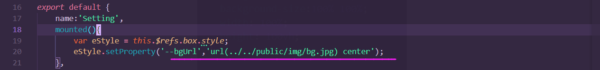

这个路径是获取不到的。

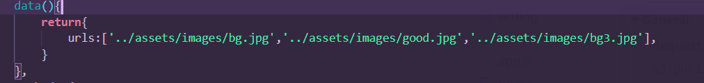

这些也都不行啊。。。给我个理由.


**解决：用下面的路径就行了：**
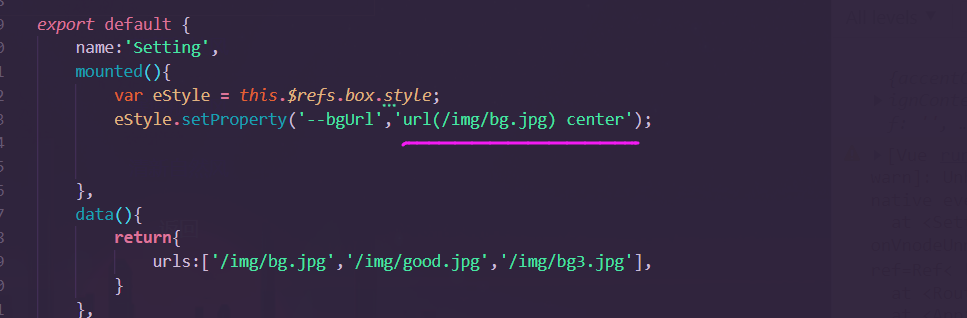

**<font color='purple'>因为webpack会打包编译整个项目文件的，所以原来的路径就找不到了，看看跑起来的项目中的打包后的路径：</font>**


**<font color='red'>用这个路径就行了</font>**


# 34、BUG【logic:背景切换】

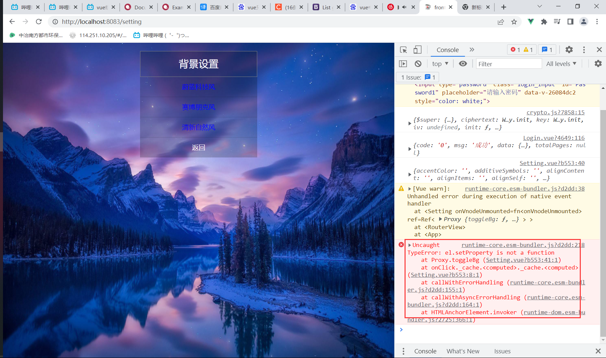


bug原因：

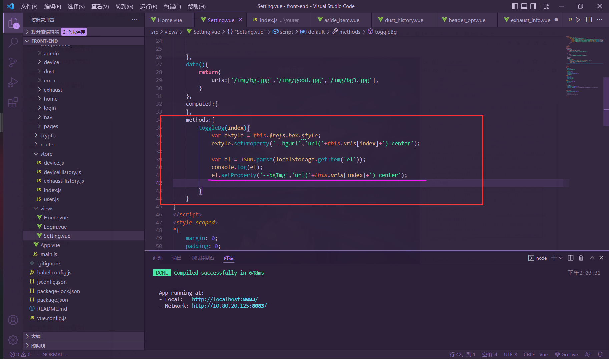


**<font color='red'>为什么我用localStorage存储过后，再拿出来就没有用了？先说一下我的本来的思路：就是把dom.style这个对象，重新设置一下Property就行了，但是由Home组件独路由到Setting组件后，Home组件的dom.style对象就会消失了，所以要把它存储在localStorage中，然后再在Setting组件中拿出来重新设置一下--bgImg就行了，但是经过JSON转换过的对象就不是原来的那个对象了，这个就涉及到一个JSON的坑...</font>**


**<font color='purple'>JSON的坑：</font>**

**<font color='purple'>如果对象是一个dom对象或者是dom.style对象，那么经过JSON.stringify(obj)和JSON.parse(str)后，出来的那个对象就不是曾经的对象了，很可能就是说JSON的stringify和parse仅仅适用于 json串。我艹了...</font>**


**<font color='purple'>localStorage的坑</font>**

**<font color='purple'>只能存储字符串，所以几乎必会和JSON结合起来使用的，但是因为JSON有上面的坑，所以只要是想在localStorage中存储dom对象和dom.style对象都是不行的。</font>**


**<font color='red'>思路上的致命错误：</font>**

**<font color='purple'>就是路由到Setting组件的时候，因为vue路由机制的原因，Home组件都已经消失了，所以再获取它的dom.style有什么意义捏？不如在Setting组件切换背景的时候，把图片的路径存储到localStorage中，然后返回的时候重新加载Home组件的时候它会获取到这个新的路径从而切换背景，这个多好，多简单</font>**


# 35、需求思路

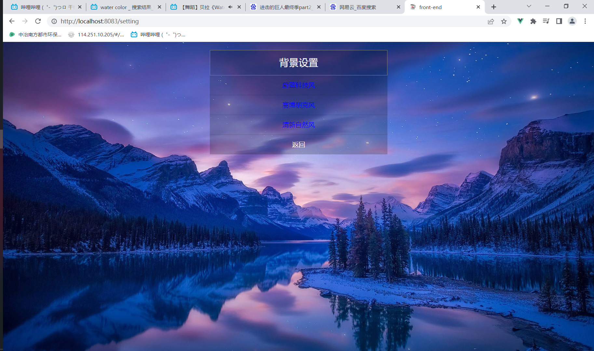

**<font color='purple'>点击背景的切换时，会闪过一片的白的然后才完成图片的加载对吧，这个太刺眼了，所以只要把背景颜色的白色改成灰色就行了，就会柔和一点。</font>**

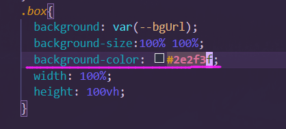


# 36、需求思路【html加载动画】

https://www.bilibili.com/video/BV1at411G7Gu?from=search&seid=9285956438980348139&spm_id_from=333.337.0.0


## 36.1、优化

### 优化一：

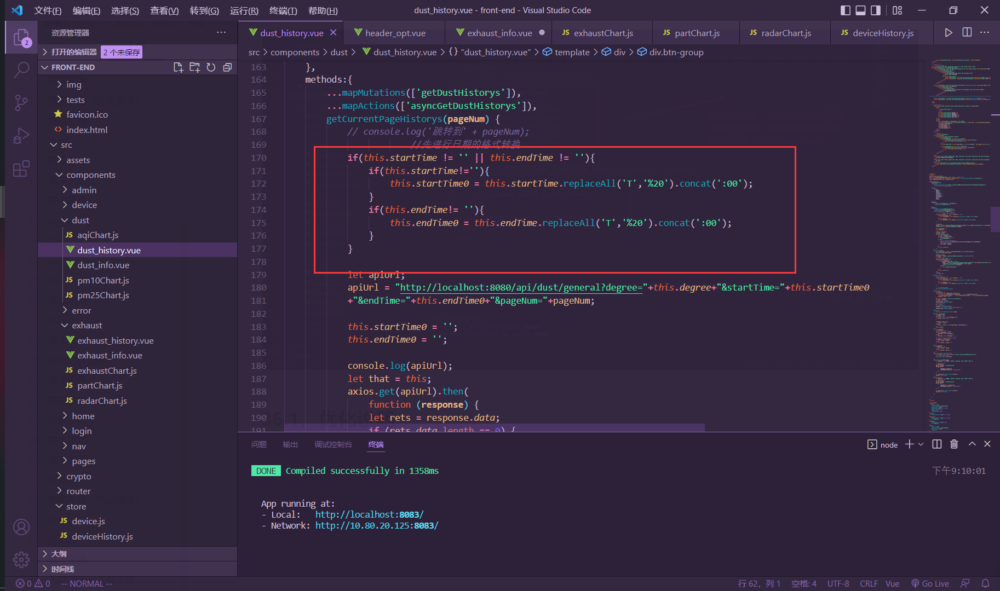

**<font color='purple'>在一开始就给接口函数添加上了有关日期的判断，使得点击页面跳转而无法带上日期参数的情况解决了</font>**


### 优化二：

**<font color='purple'>对于导出表的excel数据，也使用了Json导出excel，使得原来的那个插件的日期错误的bug得到了修复</font>**


# 37、BUG【html元素覆盖】

**当时我对这个bug十分不解，现在忽然相到了...**

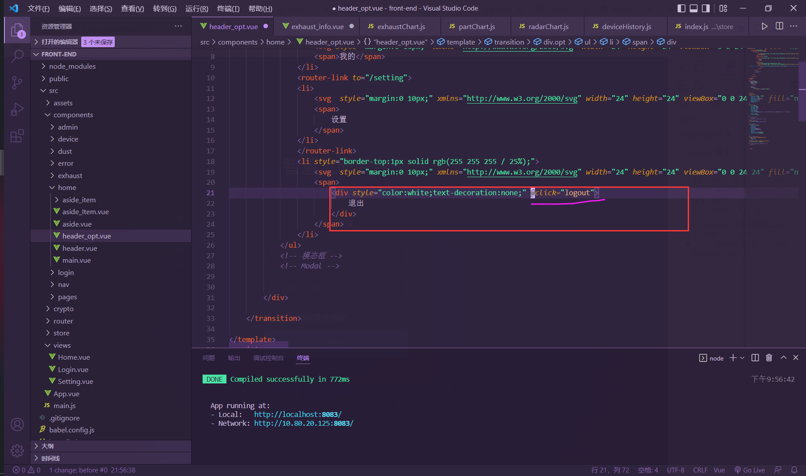

**我把这个事件写在了这个小框框当中。。。**

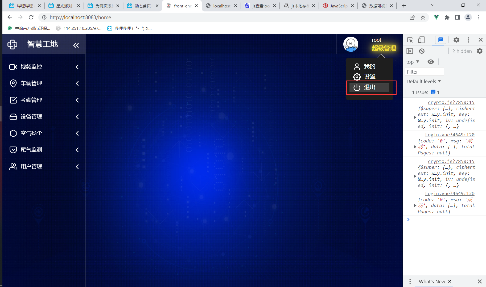

**而这一整个的范围是li标签啊，真是服了。。。范围这么小点个屁啊，现在我终于知道了！**


# 38、需求分析【bootstarp分页改进】

**<font color='red'>终于到了员工考勤模块的分析，这个模块我是这么考虑的，首先还是要先把用户权限的标志位颜色改一下，然后是把分页的跳转联动效果给做出来并且同一所有的分页都在右下方的位置；把这两个优化做好后，再去考虑这个员工考勤模块，把原来的该删的删除掉，提炼出必要的字段，然后再去网上把刷脸认证的接口找出来，把刷脸打卡机的设备模拟出来就行了</font>**


## 38.1、分页模块的设计思路


**<font color='purple'>每个页组最多有5个页码，然后点击>> 和<<可以切换上一个页组和下一个页组，当前页显示  当前页码数/总页数   点击跳转的时候当前页和整个页组都要变化。</font>**


**<font color='blue'>源码实现：</font>**

js部分：

```js
 partPages(cgroup){
            let allArr = [];
            let retArr = [];
            for(let i = 0;i < this.totalPages;i++){
                allArr.push(i + 1);
            }

            if(allArr.length <=5){
                retArr = allArr;
            }else{
                retArr = allArr.slice(5*(cgroup),5*(cgroup+1));
            }
            return retArr;
        },
        nextGroup(cgroup){
            let allGroup = -1;
            //先计算出allGroup所有的组数
            if(this.totalPages%5 == 0){
                allGroup = this.totalPages/5;
            }else{
                allGroup = this.totalPages/5 + 1;
            }
            //再判断当前组数+1后是否会大于总组数
            if(cgroup+1 > allGroup-1){
                this.cgroup = cgroup;
            }else{
                this.cgroup = cgroup + 1;
            }
        },
        upGroup(cgroup){
            if(cgroup-1 < 0){
                this.cgroup = cgroup;
            }else{
                this.cgroup = cgroup - 1;
            }
        }, 
        jumpTo(jump){
            //如果要跳转的话先要判断一下要跳转到的页码的是否在范围内
            //不在范围内的话就退出函数吧
            if(jump < 1 || jump > this.totalPages){
                alert('页码超出范围!');
                return;
            }

            let groupIndex = 0;
            //要求页面跳转的时候，页码组也要跟着联动是吧...
            //那得先确定它是哪一个组的...
            if(jump%5==0){
                groupIndex = Math.floor(jump/5) - 1;
            }else{
                groupIndex = Math.floor(jump/5);
            }

            // console.log(groupIndex);
            this.cgroup = groupIndex;
            this.getCurrentPageHistorys(jump);
        },
```

template部分：

```html
<div class="scroll">
            <nav aria-label="Page navigation example">
                <ul class="pagination">
                    <li class="page-item" @click="upGroup(cgroup)">
                        <a class="page-link" href="javascript:;" aria-label="Previous">
                            <span aria-hidden="true">&laquo;</span>
                        </a>
                    </li>
                    <li class="page-item" v-for="(item,index) in partPages(cgroup)" :key="index" @click="getCurrentPageHistorys(item)">
                        <a class="page-link" href="#" >{{item}}</a>
                    </li>
                    <li class="page-item" @click="nextGroup(cgroup)">
                        <a class="page-link" href="javascript:;" aria-label="Next">
                            <span aria-hidden="true">&raquo;</span>
                        </a>
                    </li>
                </ul>
            </nav>

        </div>
        <div style=" color: White; margin-left: 10px; align-self: flex-start; margin-top: 7px;font-size:20px;">
            当前页：{{cpage}}/{{totalPages}}
        </div>
        <div style=" color: White; margin-left: 10px; align-self: flex-start; margin-top: 8px;font-size:20px;">
            跳转到：
        </div>
        <div class="input-group-sm" style="margin:0px 0px;width:5%;padding-top:7px;">
            <input type="text" class="myInput form-control" v-model="jump" @keydown.enter="jumpTo(jump)"/>
        </div>
    </div>
```


## 38.2、人员考勤模块分析1

**既然要管人，这个人一定会有身份，属于哪个公司的？属于哪个班组的，属于什么工种的？**

**<font color='blue'>在录入后台人员的数据的时候就用二维码扫码，让员工自己填写好字段，提交后直接入库，妈的真的NICE。这样就免了自己录数据了哈哈</font>**

公司的参建类型才会有：总包单位，材料单位，运输单位这些东西，班组主要就是管理班组和劳务班组，管理班组和劳务班组中又会子类就是工种：

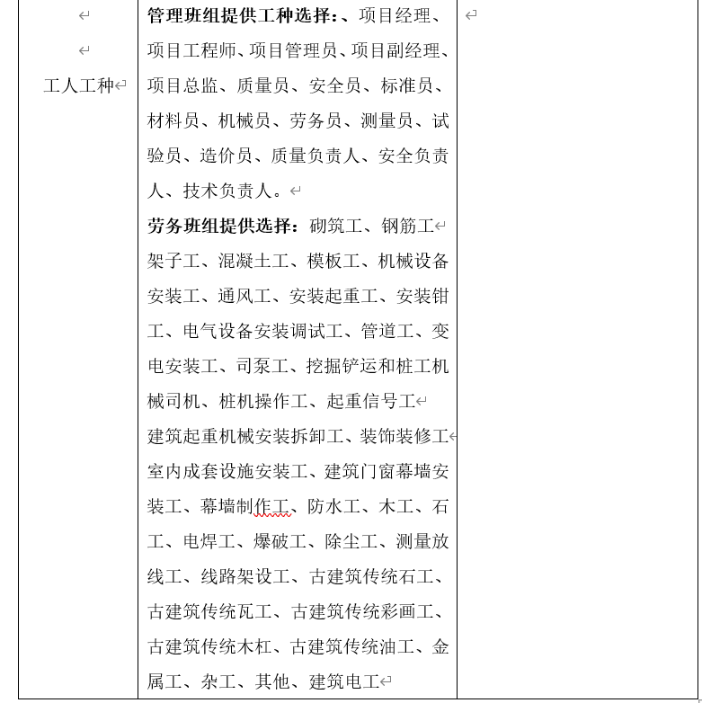


**<font color='purple'>签到的状态主要可以分成：已签到，迟到，未签到，补签到；迟到的没话说直接扣工资，如果你实际上迟到了但是可以使用补签的功能，把这个签到，提交补签的申请，然后经过领导的审核同意后就可以把他的那条记录改成补签到了。补签的时候一定要加上要补签的是哪一天，这样数据库才能唯一定位到这条记录，嘻嘻</font>**

**<font color='purple'>那还有一个申请请假的功能也必须给工人端给安排上楼。哈哈5天内做完，真的可以了，就算熬夜这波也要做完了。</font>**


因为是签到对吧，所以你一定是要设置上班打卡的时间才对啊，所以在右侧的导航栏必须要添加一个导航栏的子项，叫做“考勤设置”，在这个页面你可以设置上班打卡的时间，正因为如此我才突然想到好像尾气排放的阈值部分也需要添加这样的一个子模块吧，来设置各个排放物的阈值，可是这个配置项的数据应该存放在哪里呢？默认值又是多少呢？；我去，工作量莫名其妙变大了捏》》》因为工人的提交 请假申请和补签申请 ，所以又必须要去在右侧添加一个子项目：叫做“消息通知”，工人提交的请假申请和补签申请应该又一张表记录一下，。。。


### 38.2.1、人脸识别API

**<font color='purple'>百度云人脸识别API的教程：https://www.bilibili.com/video/BV1mJ411k7nD?p=1</font>**

### 38.2.2、java二维码打开网页

**<font color='purple'>使用二维码注册员工信息的方法教程：https://www.bilibili.com/video/BV1Mf4y1C7ZT?p=1</font>**


## 38.3、时间规划

4月底的话基本上就要把毕设和论文都交掉了，对吧，基本考勤模块5天内搞定，视频模块3-4天，最后一个5天，还能挤出几乎一个礼拜的时间把论文写好，然后去准备面试找工作了。


照片上传的教程：使用element-ui加

https://www.bilibili.com/video/BV1aQ4y1k79k?from=search&seid=12397680132153966882&spm_id_from=333.337.0.0

uploadFile组件的使用

https://www.bilibili.com/video/BV17m4y1Q7gn?p=11

后端SpringBoot

https://www.bilibili.com/video/BV1ei4y1M7Kf?spm_id_from=333.851.header_right.history_list.click


## 38.4、BUG（logic:尾页删除问题）

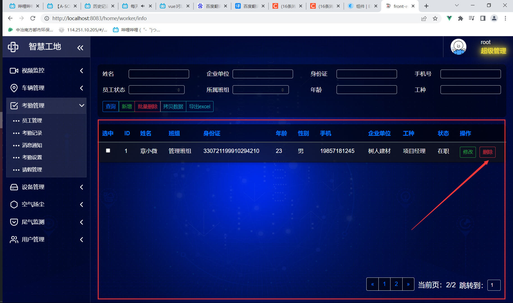

**<font color='red'>这时候删除这条记录，如果还保留原来的页码去访问后端的话就会出bug的！，所以还是增加和修改一样，直接回到第一页不就行了，这么折磨干什么呢？</font>**


**直接重新刷新然后更新页码就行了。**


**<font color='purple'>感觉这样比较合理哦，就是所有的查询条件还是要带上的，但是页码直接重新刷为1就行了。如果有页组数的话也重新刷为1就行了。</font>**


**<font color='purple'>要么删除的时候重新获取一下总的页数吧，如果当前页码数比较大那就把当前的页码减一（因为最小的总页数为1，所以减一也不怕），然后重新带上查询参数取访问页面就行，如果当前的页数比总页码数要小的话，那就不用把页码数减一了，直接带上参数和页码数访问后盾接口就行了。</font>**

**<font color='red'>这个bug的触发条件就是最后一页，然后把该页所有的记录都删除掉的时候就会触发，这个bug先放在这里吧，之后又机会再去改掉，</font>**


## 38.5、element文件上传组件

```html
                    <el-upload action="http://localhost:8080/api/worker/info/upload"
                                :limit="1" 
                                accept=".jpg"
                                :on-success="handleSuccess"
                                :file-list="fileList"
                                list-type="picture"
                                style="align-self:flex-start;width:70%;"
                    ><!--最多允许上传一个-->
                        <el-button size="small" type="primary">点击上传</el-button>
                    </el-upload>
```

**<font color='blue'>action就是点击 “点击上传” 按钮后把文件上传到的目标服务器路径；limit就是指最多上传一个文件，accept表示只接受.jpg文件格式，on-success表示文件上传成功时候的回调函数，有一个file参数，flie-list绑定页面中一个数组变量，该数组中存放了上传成功后的文件的对象，list-type就是上传成功后的展示列表，用图片来展示。</font>**


## 38.6、后端文件上传代码

```java
    //图片上传接口：参考教程:https://www.bilibili.com/video/BV1ei4y1M7Kf/?spm_id_from=333.788.recommend_more_video.-1
    @PostMapping("/upload")
    @CrossOrigin
    public Result fileUpload(MultipartFile file, HttpServletRequest req){

        String originName = file.getOriginalFilename(); //获取上传上来的文件的原始文件名
        if(!originName.endsWith(".jpg")){  //如果不是：以.jpg结尾，那就直接返回上传的格式有问题
            return Result.error("-1,","图片格式不正确!");
        }

        //这个路径有公网获取得到的写法的，
//        String savePath = "E:\\Vue3.0\\毕业设计\\FileStorage\\"+timeStamp;
//        String savePath = req.getServletContext().getRealPath("/")+timeStamp;

        String ProjectPath = System.getProperty("user.dir");
        String savePath = ProjectPath.substring(0,ProjectPath.lastIndexOf('\\')+1)+"FileStorage";
        File folder = new File(savePath);
        if(!folder.exists()){
            folder.mkdirs();
        }
        String newName = UUID.randomUUID().toString() + ".jpg";
        try{
            //最核心的就是这一段代码了，就是把传上来的文件给转储到指定的文件夹下并且重命名捏
            file.transferTo(new File(folder,newName));

            /**
             * 正确的公网ip全路径写法：
             * String realPath = req.getSchema() + "://" + req.getServerName+":"+req.getServerPort() + timeStamp + newName;
             * */
            String realPath = savePath+"\\"+newName;
//            String realPath = req.getScheme()+"://"+req.getServerName()+":"+req.getServerPort()+timeStamp+newName;
            /**
             * 要想正确访问到这个路径可能得配置ngix代理了，不然没有办法获取得到路径的...
             * */


            return  Result.success(realPath);
        }catch (IOException e){
            e.printStackTrace();
            return  Result.error("-1",e.getMessage());  //异常居然还有这个函数，哈哈挺好用的学到了
        }
```


**<font color='purple'>如果真的要实现扫码填表的话，那就要涉及到公网和手机端的程序设计了，难度巨大！时间上来说应该不太可能够的，不如搞一个功能叫做从excel导入数据，就是先让各个班组的人都把自己的人统计好写在excel表当中，然后再汇总，通过导入excel的方式将数据添加进数据库里，这样不是也可以吗哈哈。</font>**


# 39、bug23

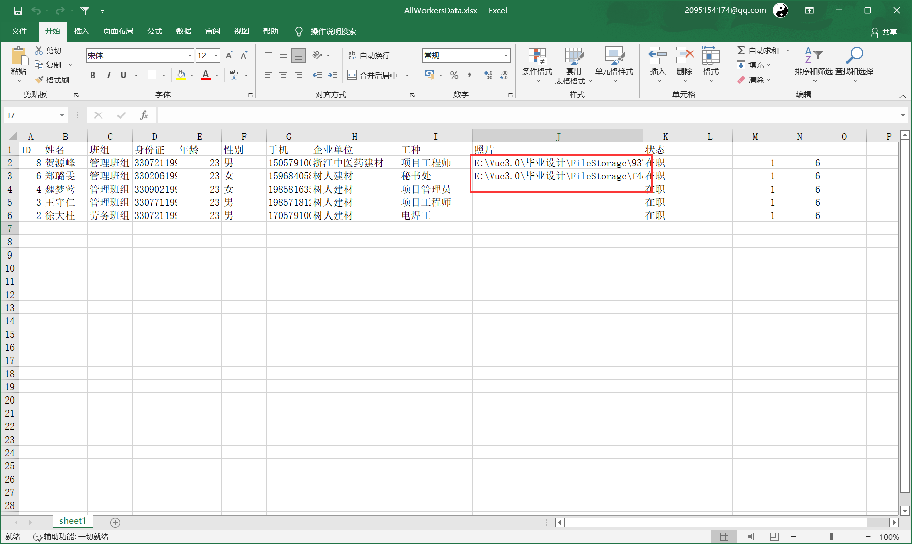


**<font color='purple'>导出的照片是路径而不是图片捏。。。这个bug挺严重的吧...</font>**

**妈的吓老子一跳，这个没有什么的，excel单元格本身好像也不太支持照片的...**


## 39.1、bug（grammar:input文件上传语法）

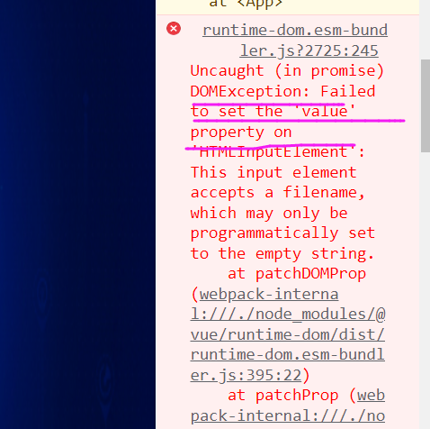

**<font color='purle'>原因：因为这个input输入框的类型是file类型的，然后你把value设置成一个字符串，当然会报错啊！</font>**

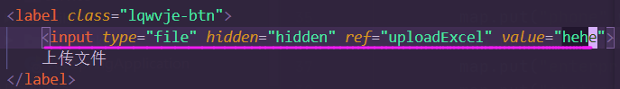


## 39.2、tips多嵌套触发点击

```html
                <label class="lqwvje-btn">
                    <input type="file" hidden="hidden" ref="uploadExcel">
                    上传文件
                </label>
```

**==<font color='purple'>对于file类型的input，这是添加文字的最好方法了，大概；就是我发现如果一个button或者a标签，外层嵌套了label可以随便点击触发的，但是如果嵌套了其他标签，比如li的话，就比较难触发了（还记得登出困难的那个bug吗，555）</font>==**


## 39.3、js获取导入的excel数据

博文参考：http://www.luofenming.com/show.aspx?id=ART2021033000002


## 39.4、SpringBoot一个类中不能调用其他接口的问题

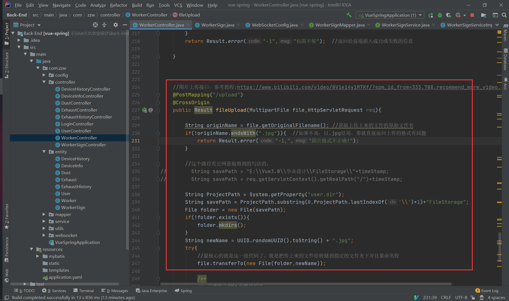

**<font color='purple'>我想在其他接口中调用fileUpload函数是不行的，因为这就是他们规定好的，很烦人，那如果又重新写一份的话，不是显得很冗余吗，所以我想到一个办法就是把这个接口提取出来成为一个普通的方法，然后再这个/upload接口中再用函数封装一下就行了，封装的艺术哈哈</font>**


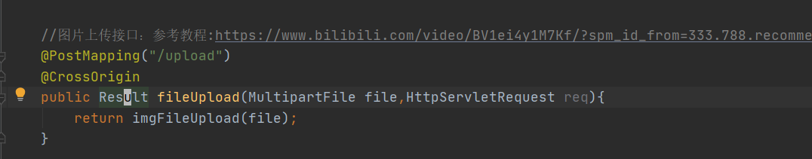

**这样写真的简单多了。**


## 39.5、同于不同

函数名不同，参数不同，其他的逻辑都是相同的...


## 39.6、需求分析

**<font color='purple'>既然已经大致了解了百度云人脸识别的方式，那么在每次新增员工的时候，都必须要把员工的照片不仅上传到服务器指定的文件夹下，还要把照片和员工的唯一id注册到百度云的人脸识别库，</font>**


**<font color='purple'>先把基础的删，改，查完成，然后再把上面的代码改一下，最后把增的那个二维码和调用手机摄像头联系起来就行了。</font>**


## 39.7、逻辑bug

**<font color='purple'>哈哈又给自己搞了一个坑，那就是用自动生成的id当做员工的唯一id，这会导致一个问题，就是如果该用户的id和照片入库了以后，然后删除该用户，但是人脸库里还有他，然后下一次再重新把他添加回去的时候，他的id已经变了；所以人脸库当中就会出现两个一样的照片和人但id不一样...这样话还不如用身份证当做人脸识别库的唯一id比较好捏哈哈。要么删除的时候把人脸库中对应的记录也一起删除掉。。。</font>**


## 39.8、BUG（SpringBoot注解）

主要就是@PostConstruct注解

说明：https://blog.csdn.net/m0_53288098/article/details/122355201


主要就是使用SpringBoot的配置类：

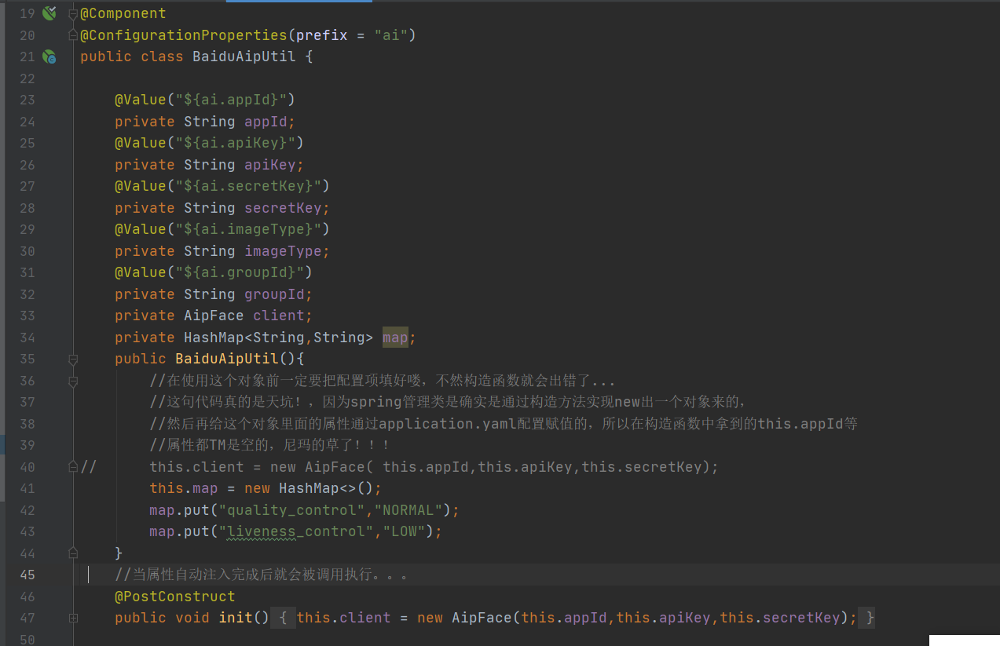

**主要就是boot配置类的对象的生成过程要提一下，就是首先SpringBoot会读取配置类，然后通过配置类的无参构造方法生成一个配置对象，然后才会从yaml配置文件中读取对应的属性的值并注入，当属性值注入完成的时候，调用被@PostConstruct注解的方法。**


# 40、BUG【图片后缀大小写】


**==<font color='red'>前端bug</font>==**


**==<font color='red'>我们发现在前端的员工更新页面中，点击照片上传后，在后端服务器指定的FileStorage中没有该图片，说明后端上传该图片是失败的...可是按道理来说的话，后端的图片上传接口是没有问题的呀，说明前端点击按钮可能有问题。。。</font>==**


**==<font color='red'>因为ele的文件上传组件有错误的钩子，所以我们可以配置一个文件上传错误时候的钩子然后看看文件上传是不是发生了什么错误？</font>==**

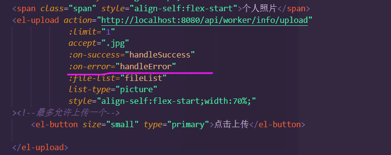


结果：
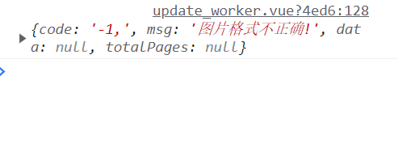

**<font color='purple'>原来是.jpg大写了，我草！！！</font>**

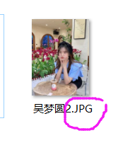


**==<font color='red'>把jpg从大写转换到小写的方法：</font>==**

**<font color='purple'>文件夹选项：取消（隐藏已知文件类型的扩展名），然后文件重命名，直接把后缀从大写改成小写就可以</font>**

# 41、需求思路

## 补签业务

**<font color='purple'>我之前的关于补签的的业务逻辑是有错误的，因为是刷脸成功之后就会添加一条签到的记录，这条记录中签到的状态应该只有两种，要么签到成功，要么就是迟到！，补签到应该是单独一个在上方操作框的按钮，点击后弹出一个小型的表单，然后填入补签人的信息就行了。。。然后生成的记录中，签到状态才是补签到。。。</font>**

对于签到状态的理解又加深了一点点，哈哈哈。


# 42、需求思路

## 设置考勤时间

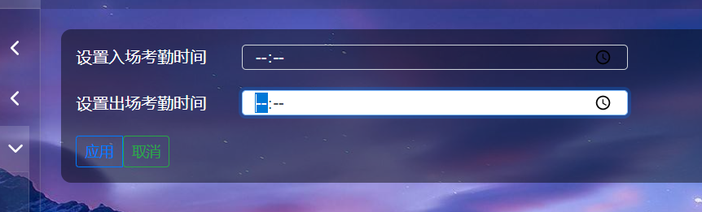


**<font color='purple'>我的思路是这样的，点击应用后，首先检查不为空，然后把本地缓存的localStorage中的两个属性inTme和outTime进行清空，然后把这个通过后台的update的语句更新上班时间和下班时间，更新成功后，再在本地使用localStorage存储inTime和outTime，下次进入配置页面的时候，如果这个localStorage不为空，就直接从这里面提取出来显示</font>**


## 42.1、BUG（logic:400坏的请求）

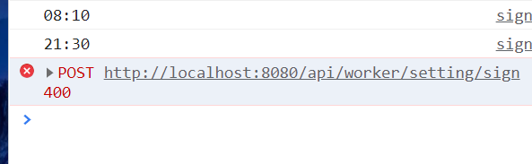


**<font color='red'>最近请求报错的情况很多，我真的应该好好反思一下为什么会有这么多的请求报错了。。。明明已经很熟悉了但还是漏洞百出，不太应该的。。。</font>**

解决：
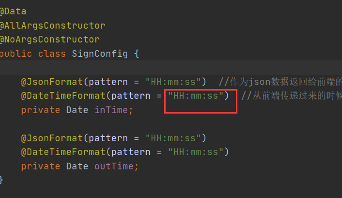

**<font color='purple'>因为我这里是时分秒的格式，而前端是时分的格式，所以格式错误，就会发生bad request了</font>**

==**<font color='red'>基本上像400这样的错误都是 参数设置有问题。</font>**==


## 42.2、需求思路

**<font color='red'>对于扫描二维码打开手机摄像头，拍摄照片（延时3秒）然后把照片发送到二维码指定的人脸识别后端接口就行了。</font>**


**<font color='purple'>妈的我真的服了，最后还不是要公网的ip才能把手机图片给传送上去，真的无语，这老师最后也没有用手机扫码啊，真的是服了，就他妈离谱，和手机这种其他设备没公网怎么交互？？浪费时间，直接不需要用二维码了，就在操作框上在添加一个入场打卡和出场打开就行。。。</font>**


## 42.3、需求思路

**<font color='purple'>原来文件也是可以直接上传到接口的参数中的，这个虽然在之前的uploadfile的中有使用过，但没有得到足够的重视！可以通过post请求的formdata的file类型来向服务器传递一个MutipartFile对象，哈哈。。。</font>**

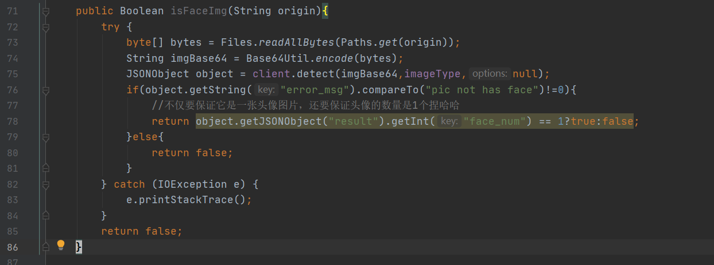


==**怎么说呢，好像对服务器端的文件操作有了更多的了解。**==

（origin or file）

==**<font color='red'>可以通过把文件或者文件路径上传到服务器进行操作处理，，就是在对接口进行传递文件参数的时候，要么直接通过formdata file的形式直接传递一个MutipartFile file，也可以把文件的本地路径直接传递上去，然后通过一些代码把origin路径转成MutipartFile对象后再进行操作，哈哈</font>**==

比如下面的代码就可以将一个文件的本地origin路径转成MutipartFile对象捏：

```java

    /**
     * 通过文件路径把获取multipartFile对象的方法
     * */
    public MultipartFile getMultipartFile(String filePath) throws IOException {
        File file = new File(filePath);
        FileInputStream fileInputStream = new FileInputStream(file);
        MultipartFile multipartFile = new MockMultipartFile(file.getName(), file.getName(),
                "application/sql", fileInputStream);
        //long size = multipartFile.getSize();
        //System.out.println("转成成功,size="+size);
        return multipartFile;
    }
```


**<font color='purple'>还有我发现对文件的操作很喜欢用到getBytes这样的方法，把文件打散成最原始的bytes字节然后再进行其他的操作，就比如下面的代码。</font>**


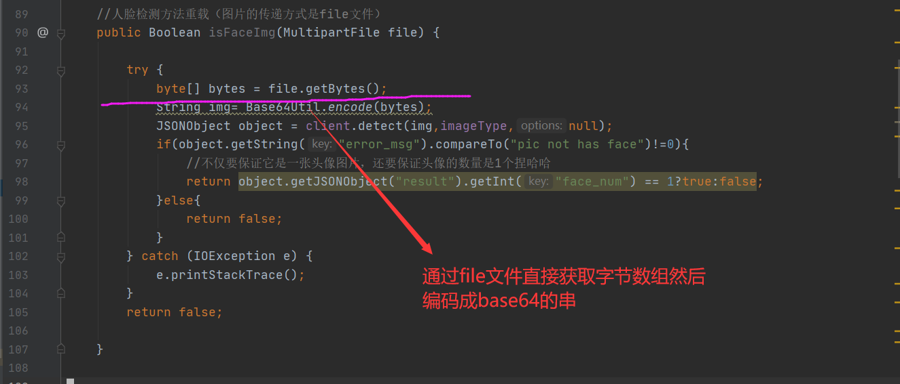


## 42.4、需求思路

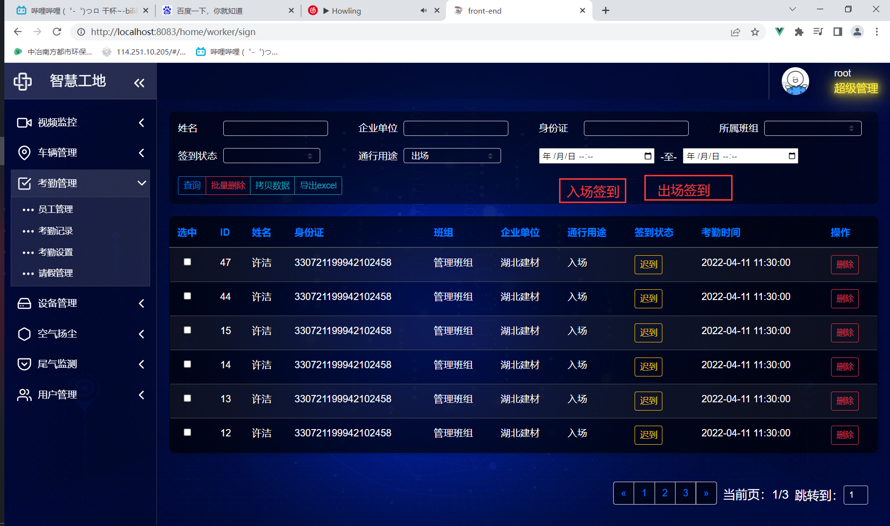

**<font color='purple'>点击入场签到后，应该跳转到落地页，然后通过摄像头拍摄照片，并且把出入场的code（入场是1，出场是2）传输给后端的接口，后端根据这个code确定添加的记录是入场或者是出场，然后再对签到状态进行判断，通过获取config数据库中的记录确定，对进场或出场的时间戳进行比对，比对结果有三种（签到成功，迟到，早退）</font>**


# 43、项目经验

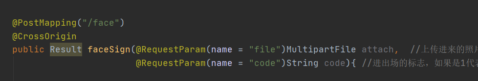

**==<font color='blue'>之前我只是知道有get请求的requestParam参数接受方式，还有其他请求的ReqeustBody接收json串的方式，现在又有了post的form-data方式，也是用的@ReqeustParam注解，还可以传输文件</font>==**


java中三种获取当前时间的方式：
https://blog.csdn.net/weixin_44147688/article/details/122052434


## 43.1、时间比较

mysql数据库中的时间是 TIME类型的，如果直接转换成java中的Date类型，你猜会怎么着？

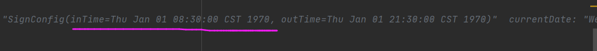

**好家伙！直接穿越回1970年，巨牛逼！！！**


**在java中如果将一个HH:mm:ss的字符串转成Date类型，它的日期也是1970那一天。**


## 43.2、时间比较的方法

**<font color='purple'>本来我想直接比较两个 hh:mm:ss类型的时间的，但是发现所有的时间比较方法都是基于Date对象的...给我整无语了，突然想到那就把年月日弄成一样的再比较不就行了吗？哈哈，所以直接用Date 接收数据库中的时间，然后先把当前时间用</font>**

```java
//首先还是先获取一下时间戳，为了对比是否迟到或早退用的
long systemTime = System.currentTimeMillis();
SimpleDateFormat sdf = new SimpleDateFormat("HH:mm:ss");
String currentTime = sdf.format(systemTime);
```

**<font color='red'>先转成HH:mm:ss的字符串，然后再用Date date = sdf.format(currentTime)，转成1970年的时间，然后再进行比较就行了，哈哈可以哈。</font>**

## 43.3、Mybatis BUG

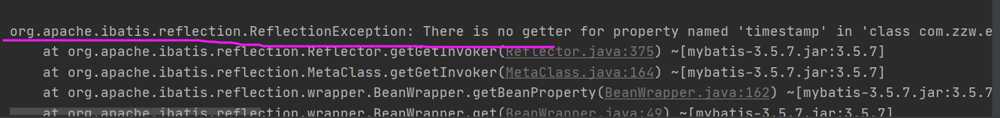

**<font color='red'>像这样子的报错一定是mybatis.xml配置文件中的sql语句出错了。。。</font>**

**解决：原来是字段的大小写处错了捏...说明数据库对字段的大小写是敏感的！！！**

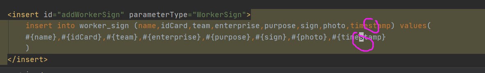


## 43.4、BUG（单词拼写错误）


**看不懂捏？？**

**解决**

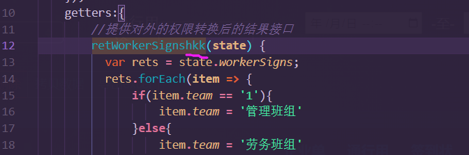


**因为刚刚进入这个页面的时候卡了，然后疯狂按kkkkk然后不小心把函数名给改变掉了，真实废物捏！**


## 43.5、如何使用电脑摄像头

- **==<font color='red'>首先得确保你的摄像头设备是开启的状态，不然用不了</font>==**

**控制面板->设备管理器->摄像机**

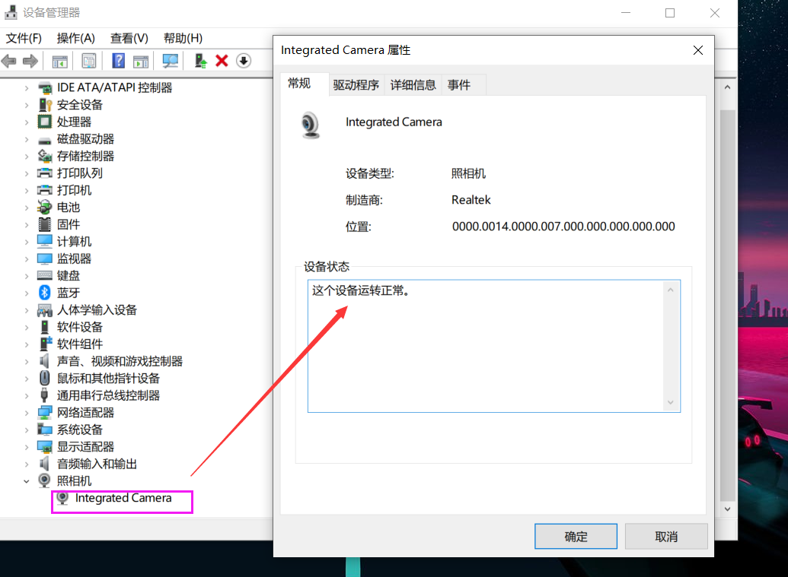

**这个设备要能正常运转才行！**

==如果这里显示摄像头是禁用的状态，可以通过 驱动程序选项卡，启用摄像头==

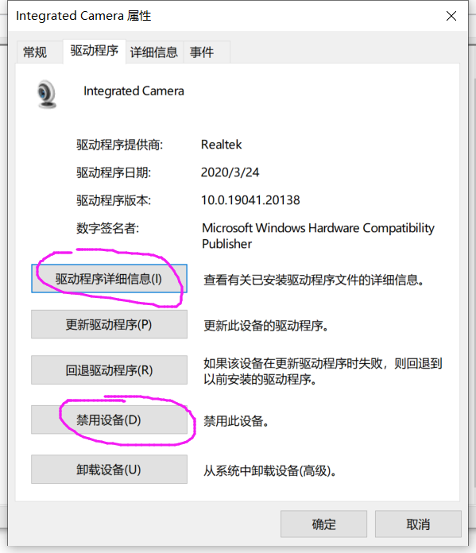


## 43.6、调用摄像头的js教程

```js
<!DOCTYPE html>
<html lang="en">
<head>
    <meta charset="UTF-8">
    <meta http-equiv="X-UA-Compatible" content="IE=edge">
    <meta name="viewport" content="width=device-width, initial-scale=1.0">
    <title>Document</title>
    <script type="text/javascript" src="https://unpkg.com/webcam-easy/dist/webcam-easy.min.js"></script>
    <style>
        a{
            padding:10px;
            background-color: orange;
            color:white;
            text-decoration: none;
        }

    </style>
</head>
<body>
    <video id="webCam" autoplay playsinline width="800" height="600"></video>
    <canvas id="canvas"></canvas>

    <a download onclick="takeAPhoto()">快照</a>
    
</body>
<script>
    const webCamDom = document.getElementById("webCam");
    const canvasDom = document.getElementById("canvas");

    //创建webcam对象
    const camera = new Webcam(webCamDom,"user",canvasDom);

    //开启摄像头
    camera.start();
    console.log('摄像头已开启');

    //拍摄一张照片。
    function takeAPhoto(){
        let picture = camera.snap();
        document.querySelector('a').href = picture;
    }

</script>
</html>
```

js库：webcam-easy：https://www.npmjs.com/package/webcam-easy


## 43.7、bug（伪bug）

```js
            const webCamDom = this.$refs.webCam;
            const canvasDom = this.$refs.canvas;

            //创建webcam对象
            const camera = new Webcam(webCamDom,"user",canvasDom);

            //开启摄像头
            camera.start();
            console.log('摄像头已开启');
```


如果用$refs来获取dom对象，对于new Webcam对象来说会构造不出来的，所以只能使用document.getElementById才行。

"推翻上述结论！"

**这个完全是可以的，vue中简便获取dom对象的方式完全是没有问题的，至于为什么当时会爆那个bug我也确实不清楚。。。**


**<font color='purple'>使用setTimeOut的方式和setInterval的方式进行延迟摄影都是不可以的，必须实现摄像机自己定时拍摄才行内。<font color='red'>不是,这个是可行的，但是因为刚开始加载并开启摄像头的时候，需要一定的时间，看起来是setTimeout是摄像头展示延时了，其实只是加载的慢而已...把setTimeOut的时间延长就可以了比如10s钟；</font></font>**


# 44、经典bug


**==<font color='purple'>我们之前遇到bug的时候就很烦很难受，这是不和道理的，正确的做法应该是谋定而后动，看到bug要先回想一下这个bug我之前是不是遇到过？引发这个bug的错误操作有哪些？然后有一个大致的方向之后才去进行挑错，改正，如果一个bug你之前从来都没有遇到过，那更应该找出这个bug的诱因，然后记录到脑袋库中才对！！！</font>==**

**<font color='purple'>不是函数这个bug我们之前不是已经遇到很多次了吗，首先看函数名有没有写对，然后再看方法有没有写在methods域中，最后也是最常见的就是this.fun()，的this指针有没有搞错！（这里确实是这个操作引发的）</font>**

# 45、BUG【logic:时区经典bug】

**描述：前端时间写入到数据库后，时间变了**

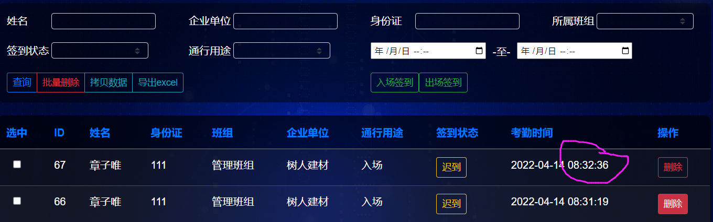

**<font color='red'>时间戳又TM的错误了...</font>**

**<font color='purple'>谋：之前我遇到过这个bug的，不过已经解决了，为什么现在又在这里出现呢？先看一下以前的会不会出问题吧，如果以前的出了问题，说明这个bug根本就没有解决，如果以前的没有问题，就要看看这次我又用了什么骚操作喽...</font>**


解决：

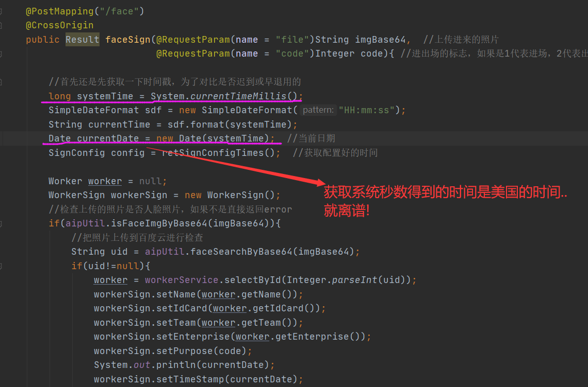

**<font color='purple'>直接new Date()就行了，不需要从系统秒数来获取当前的时间了。。。</font>**

**"直接推翻，不是这个原因！！！"**


**<font color='blue'>因为是这样的，一个标椎时间是时间 + 时区，只有这两个都确定才能确定一个标准时间，这TM的是常识，</font>** 

**<font color='blue'>然后java 中的new Date 的CST其实就是UTC+08:00的东八区时区</font>**

**然后UTC其实就是格林威治标准时区，通过它的增加或减少来确定确定其他时区的时间。**


**<font color='red'>系统时间是UTC+08:00也就是东八区北京时区，然后的话在java中使用new Date获取到的时间也是东八区的时间，所以使用new Date获取到的时间和系统时间绝对是完全对应的。</font>**


还记得整合mybatis的时候的url地址吗?

```yaml
url: jdbc:mysql://localhost:3306/vuespringboot?serverTimezone=UTC&useUnicode=true&characterEncoding=utf-8
```

**==<font color='blue'>这里如果不设置serverTimezon=UTC的话，mysql服务器的默认时间就系统时间，所以它的时区就是UTC+08:00，现在设置了UTC那么就指明了mysql的时区是格林威治标准时区，所以，在java中new一个Date再写到数据库中的话，数据库中的时间会比原来的时间提前 8个钟头。那么为什么还要设置这个呢？因为前端js获取到的new Date()很特殊，前端获取到的时间是系统时间，但是时区却是UTC时区，。。。而且好像js代码不能解决这个问题。。。真离谱，所以如果后端服务器从前端拿到了一个时间，他在后端显示的时间要比原本时间晚了8个钟头，然后再把这个时间存放到数据库中时，因为数据库的时区是UTC所以又会减少8个钟头，所以数据库时间就能和前端的时间一一对应了！！（根本原因是因为两个都是UTC时区的时间）</font>==**


**在以UTC为标准时区的时候，如果想要把java 服务器的时间和前端的对应起来，那只能加8个钟头了，加完后，看起来两个时间是不一样的，但是 其实是对应的，因为标准时间 = 时间 + 时区**

```java
 long systemTime =  System.currentTimeMillis();
        SimpleDateFormat sdf = new SimpleDateFormat("HH:mm:ss");
        Date currentDate = new Date(systemTime + 28800000);  //东八区
```


提炼总结：

其实很简单，你一拿到一个时间就先判断它的时区是什么？

比如 **2022/4/14 22:36:00 UTC+08:00**

好了，现在如果数据库连接的时候设置了UTC，

那么这时候写到数据库的时间就是

**2022/4/14 14:36:00 UTC+00:00**

如果这时候我想把2022/4/14 22:36:00这个时间写入到数据库中的话，那该怎么办呢？

要么在java中把这个时间+8个钟头后再传入数据库，

要么从前端拿到这个时间然后传到数据库


# 46、需求思路【封装思路】

描述：在做人脸识别模块的时候，我要把百度提供的人脸识别API封装到utils包下，然后供其他类调用，但发现很难用，因为我的封装方式有问题，**<font color='purple'>一定要封装最核心的，不会变的那些代码，这样才能灵活应用于各种场景！！</font>**

```java
    public String faceSearch(byte[] bytes){
        String imgBase64 = Base64Util.encode(bytes);
        JSONObject object = client.search(imgBase64,imageType,groupId,null);
        if(object.getInt("error_code") == 0){
            JSONObject subObj = object.getJSONObject("result");
            JSONArray userList = subObj.getJSONArray("user_list");
            if(userList.length() > 0){
                JSONObject aUser = userList.getJSONObject(0);
                Double score = aUser.getDouble("score");
                return score > 80?aUser.getString("user_id"):null;
            }
        }
        return null;
    }
```

**<font color='purple'>像这种代码，最核心的明明是client.search()方法，你向这样封装起来的话，那它只能接收bytes了，不能接收base64的字符串了，何必呢？？？就像我在代码中发现，js好像不能直接在代码中构造一个file对象传递给后端服务器，所以只能把base64的编码传过去了，那你用这个方法，不是用不了了吗？...最后还要改</font>**


**<font color='red'>万变不离其宗，在封装方法的时候一定要注意，只有恒常不变的那部分才能被封装起来！！！</font>**


## 46.1、需求思路（合理封装示例）

```java
   //核心的方法封装
    public String faceSearchByBase64(String imgBase64){
        JSONObject object = client.search(imgBase64,imageType,groupId,null);
        if(object.getInt("error_code") == 0){
            JSONObject subObj = object.getJSONObject("result");
            JSONArray userList = subObj.getJSONArray("user_list");
            if(userList.length() > 0){
                JSONObject aUser = userList.getJSONObject(0);
                Double score = aUser.getDouble("score");
                return score > 80?aUser.getString("user_id"):null;
            }
        }
        return null;
    }

    //加一层封装
    public String faceSearchByBytes(byte[] bytes){
        String imgBase64 = Base64Util.encode(bytes);
        return faceSearchByBase64(imgBase64);
    }

    //再加一层封装
    public String faceSearchByOrigin(String origin){
        try{
            byte[] bytes = Files.readAllBytes(Paths.get(origin));
            return faceSearchByBytes(bytes);
        }catch (IOException e){
            e.printStackTrace();
        }
        return null;
    }

    public String faceSearchByFile(MultipartFile file){
        try{
            byte[] bytes = file.getBytes();
            return faceSearchByBytes(bytes);
        }catch (IOException e){
            e.printStackTrace();
        }
        return null;
    }
```

**<font color='purple'>上面的代码中 faceSearchByBase64就是对百度人脸识别接口的最底层封装，那如果传进来的是一张图片的字节数据，那就可以调用faceSearchByBytes，先把字节数据转成base64编码的字符串然后再调用底层接口就行了；同样的传进来的是一张图片的本地原始路径，就可以使用faceSerachByOrigin先转成字节数组再调用ByBytes方法，这样写多清晰，哈哈。</font>**


## 46.2、背景知识

### 46.2.1、base64编码方式

**Base64 就是一种基于 64 个可打印字符来表示二进制数据的表示方法**。

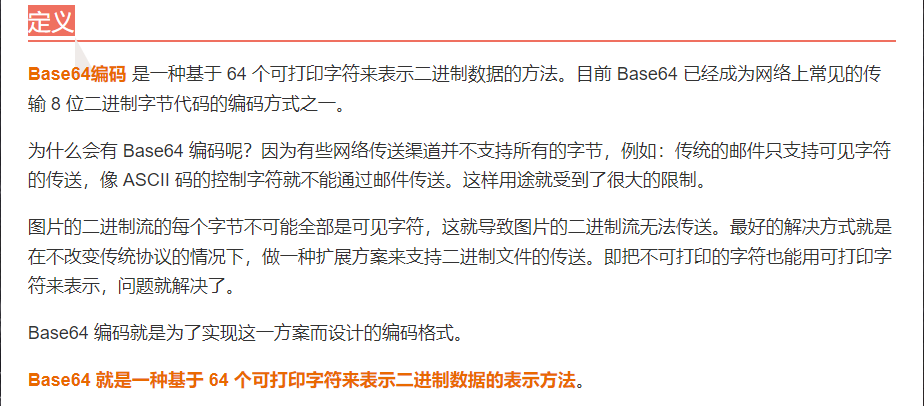

参考博文：https://blog.csdn.net/kexuanxiu1163/article/details/97717969

**一张被base64编码过的图片可以通过以下方式在浏览器中访问：**

**data:image/png;base64,后面跟上base64的编码，这串东西就能在url中浏览了**

### 46.2.2、MultipartFile对象

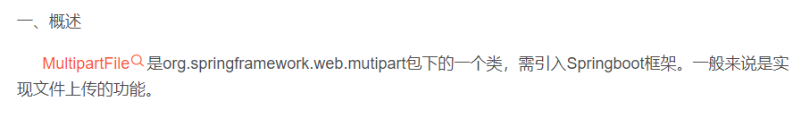

在项目中，我前端使用element ui的文件上传组件上传图片 给后端服务器的，然后下面是后端的代码：

```java
    /**
     * 通过文件路径把获取multipartFile对象的方法
     * */
    public MultipartFile getMultipartFile(String filePath) throws IOException {
        File file = new File(filePath);
        FileInputStream fileInputStream = new FileInputStream(file);
        MultipartFile multipartFile = new MockMultipartFile(file.getName(), file.getName(),
                "application/sql", fileInputStream);

        return multipartFile;
    }

    /**
     * 因为上传文件到服务器的接口不能直接在另一个函数中调用，所以直接copy一份，调用这个接口就行了。
     * */
    public Result imgFileUpload(MultipartFile file){

        String originName = file.getOriginalFilename(); //获取上传上来的文件的原始文件名
        if(!originName.endsWith(".jpg")){  //如果不是：以.jpg结尾，那就直接返回上传的格式有问题
            return Result.error("-1,","图片格式不正确!");
        }

        String ProjectPath = System.getProperty("user.dir");
        String savePath = ProjectPath.substring(0,ProjectPath.lastIndexOf('\\')+1)+"FileStorage";
        File folder = new File(savePath);
        if(!folder.exists()){
            folder.mkdirs();
        }
        String newName = UUID.randomUUID().toString() + ".jpg";
        try{
            /**1、最核心的函数就是这个*/
            file.transferTo(new File(folder,newName));
            String realPath = savePath+"\\"+newName;
            return  Result.success(realPath);
        }catch (IOException e){
            e.printStackTrace();
            return  Result.error("-1",e.getMessage());  //异常居然还有这个函数，哈哈挺好用的学到了
        }
    }


    //图片上传接口：参考教程:https://www.bilibili.com/video/BV1ei4y1M7Kf/?spm_id_from=333.788.recommend_more_video.-1
    @PostMapping("/upload")
    @CrossOrigin
    public Result fileUpload(MultipartFile file,HttpServletRequest req){
        return imgFileUpload(file);
    }
```

**==对于文件的一些操作我也只能学到皮毛，这里有两个函数，教你怎么把文件路径转换成multipartFile对象，还有就是使用MultipartFile对象的transferTo方法把文件保存到目标文件夹下==**

参考教程：https://www.bilibili.com/video/BV1ei4y1M7Kf/?


### 46.2.3、java操作JSON对象

```java
        JSONObject object = client.search(imgBase64,imageType,groupId,null);
        if(object.getInt("error_code") == 0){
            JSONObject subObj = object.getJSONObject("result");
            JSONArray userList = subObj.getJSONArray("user_list");
            if(userList.length() > 0){
                JSONObject aUser = userList.getJSONObject(0);
                Double score = aUser.getDouble("score");
                return score > 80?aUser.getString("user_id"):null;
            }
        }
```

**在java中JSON对象的类型为JSONObject，获取到它的实例后，其实就是使用键值对的方式取出一个键对应的值就行了，比如json.getInt("键名")，如果一个键对应的是一个json对象，可以用json.getJSONObject("键名")获取，如果一个键对应的是一个json数组则可以用json.getJSONArray("键名")来获取。**


### 46.2.4、前端上传文件

方式一：element ui

```html
                    <el-upload action="http://localhost:8080/api/worker/info/upload"
                                :limit="1" 
                                accept=".jpg"
                                :on-success="handleSuccess"
                                :file-list="fileList"
                                list-type="picture"

                    ><!--最多允许上传一个-->
                        <el-button size="small" type="primary">点击上传</el-button>
                    </el-upload>
```

**具体的每个属性的含义可以参考官方文档，这个就是点击 “点击上传” 按钮然后就会弹出资源管理器，让你选择一个文件，选中后就会将文件以form-data file的参数形式传递给后端接口。**


方式二：input type="file"

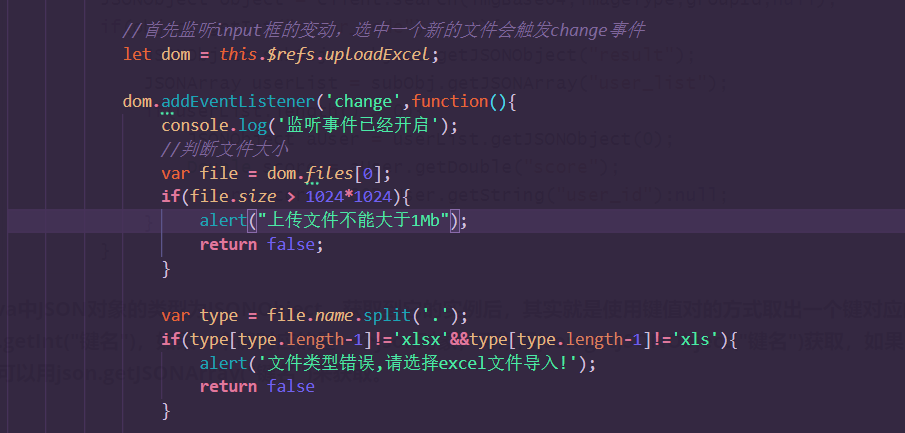


**通过input输入框，然后监听它的change事件，选中弹出的资源管理器中的文件后监听函数就被触发了，然后可以通过dom.files[0]在js中获取到那个文件的对象，然后可以通过axios post方法把文件传给后端接口上去**


**现在都什么年代了，千万不要再用什么form取提交了,form能完成的axios一定能完成，而且更加强大！！！**

### 46.2.5、js导出多个函数
这个真的很有用，是精益求精的体现哈哈。
https://www.csdn.net/tags/Ntjagg2sNTUxNTEtYmxvZwO0O0OO0O0O.html

推荐方式：
```js
function test1(str) {
  test2(str);
}

function test2(str) {
  console.warn(str);
}

  //注意这里的default就不用添加了，不然的话会报bug的！
export default {
  test1,
  test2
};
```
因为这样做的话，导出的时候是可以这样导出的：
import {stringToNull,dateFormat} from '../../utils/utils'
**所以就可以直接在methods中调用这两个方法了，如果先放到对象里再导出，导出的时候还要去 对象.方法这样使用函数，巨麻烦!**  


# 47、BUG【logic:bootstrap组件添加错误】


**为什么上面所有的内容都显示不出来呢？控制台也没有报错啊？就很奇怪**

**解决：  **

看下面的代码，我把它放在v-for中了，这就导致生成的这个modal弹出表有n张，然后id就不唯一了捏...服了。


# 48、bug【vue图片引用错误】

**webpack打包后引入assets中的图片报错的问题**

解决：https://juejin.cn/post/6844903689308602382  

因为项目使用了vue-cli脚手架，所以直接写本地路径会访问不到图片，经过cli打包后图片的路径都已经改变了，使用下面的方式就能愉快的访问到了：


    <select id="selectOneCar" parameterType="string" resultType="CarHistory">
        select * from car_history where IMEI = #{IMEI} and
        id>=(select id from car_history where IMEI = #{IMEI} and carStatus=0 order by id desc limit 1,1) order by id desc
    </select>
```

这个只能解决渣土车已经行驶过一次然后停下来的情况，对于刚刚初始化入库的渣土车来说，更本获取不到，因为它只有一个0，没有两个0；尤其是只有最初的那个0然后还在移动中的这种情况，最麻烦。
	
解决：
```sql	
select * from car_history where IMEI = 'GNK48481' and
        id>=IFNULL((select id from car_history where IMEI = 'GNK48481' and carStatus=0 order by id desc limit 1,1),1)
	order by id desc
```

**使用了IFNULL(expr1,expr2)函数，如果表达式1为null则返回表达式2，不然直接返回表达式1本身捏，这样如果它只有一个0，那么表达式1为空，所以id>=1然后就可以返回该车辆的所有路径数据了捏，哈哈天才有没有**
	
	
## 50.3、底层bug


**我本来是想把这个信息框弄成完全透明的，但结果失败了，原因是在调用mark的setLabel方法的时候，amap底层就已经设置好了
展示的label的背景是白色的。。。**
	


**所以无论我在content属性里怎么修改dom样式，都没有用的，ul的样式可以覆盖掉它从这个类继承下来的样式，但是这个类本身又不会消失。。。这是amap底层设计好的，改变不了，真的吐了，还有就是，如果在vue组件中新添一个类放到ul中，结果是没有用的...无法载入的...这个大概也是他们底层设计好的，真是服了**
	
## 50.4、需求思路
地图实时展示车辆路径的的功能基本上已经做完了，所以，终于来到喷淋模块了。行百里者半九十啊，喷淋模块今天必须要完成！虽然系统已经完成了80%了，但是也不可以放松啊，还有很多的细节要调整，论文要跟进，面试要准备，事情多的是。不能掉以轻心啊。
	
**对于喷淋模块，我想把它和车辆进出的模块直接联系在一起，然后用柱状的图进行显示，就是一个柱状图的x轴是每一天的日期，然后一个x轴的点位有两个数据，一个是进场的喷淋数据，还有一个是出场的喷淋数据，对于喷淋的具体时间来说可以考虑直接显示在大屏上就行了（没办法了...太细致做不下去了应该）。**

## 50.4、bug（grammar:HashMap无序性）
我都已经在sql语句中用order by 排过序了，为什么到前端的数据还是无序的捏？？
**因为HashMap是无序的,而LinkedHashMap才是有序的!!!服务了HashMap线程又不安全，又无序，真是垃圾死了**
	
	
# 51、bug【代码逻辑错误】
**echart图表resize()报错的问题。**

图像怎么也自适应不了窗口的变化，然后一直报这个错误。。。

解决：

**因为这里只有this.plChart设置了option!，而plChart本身却没有进行任何的设置！，而监听事件中用的又是plChart.resize()...此时的plChart连图表设置都没有加载，哪里能搞resize()呢？？那么把监听事件中的plChart换成this.plChart不就行了吗？结果更加错误...这个我也不知道为什么了，哈哈**
	
# 52、摄像头录制
参考文档：https://blog.csdn.net/vir56k/article/details/116195047?spm=1001.2101.3001.6650.1&utm_medium=distribute.pc_relevant.none-task-blog-2%7Edefault%7ECTRLIST%7ERate-1.pc_relevant_antiscanv2&depth_1-utm_source=distribute.pc_relevant.none-task-blog-2%7Edefault%7ECTRLIST%7ERate-1.pc_relevant_antiscanv2&utm_relevant_index=2
	
参考视频教程：	https://www.bilibili.com/video/BV1rq4y1u7W2?from=search&seid=1943929839225423489&spm_id_from=333.337.0.0
这个视频教程的主要作用就是告诉我们摄像头录制的视频的格式要设置成 imie:'video/webm'才能是顺利的保存下来...哈哈哈

https://blog.csdn.net/lxw_hk2_zy/article/details/109898510
多种视频格式的讲解
	
# 53、最终主页的设计思路
**多种先做的是车辆的进出喷淋模块，一般来说，要向进出模块推送三条数据，然后向喷淋模块推送5条数据，不仅要实现转轮的效果，还要实现实时更新的效果...我估计肯定是会用到vuex的，因为Index页面的数据量太大了。然后就是数据分配的问题，要么就是一次性就像前端推送5条数据，然后前端自己来展示三条的数据和5条的数据，这个问题还有是由后端来解决会比较好，因为后端要确定是进入还是出去的，只有后端链接数据库时候比较好判断。前端的太慢了.然后数据就是今日的数据，不是最近的数据就是今天的。就算是空的也没有关系。**	

因为好像如果每次都是后端返回5条数据的话，那么前端应该这么刷新呢？再把最新的一条数据取出来然后放到末尾然后再进行轮转吗？？那既然如此的haul为什么不一开始就直接向前端传递一条最新的数据就行了，然后再前端设置后buffer，这个buffer只能容得下3条数据或者5条数据，然后数据量一超过就行轮转这样不是更加的合理吗.
	
**这个东西是不是很像数据结构中的队列，没有错他就是队列，哈哈终于遇到了和数据结构相关的东西了!**
	
# 54、bug
**<font color='red'>这个bug，因为仔细看那个sunday的具体日期和date的具体日期，所以days真正的值应该是2.9差不多，又因为是int类型所以变成了2了，所以就很离谱...</font>**

 

5日期类以及日期的常用的一些用法真的应该好好的总结一下。以备以后使用啊！	
	
# 54、需求思路【echartY轴无小数】
设置echarts图表的y轴不允许出现小数
http://www.duanlonglong.com/qdjy/1233.html


# 55、bug【高德地图api文档错误】

bug描述：

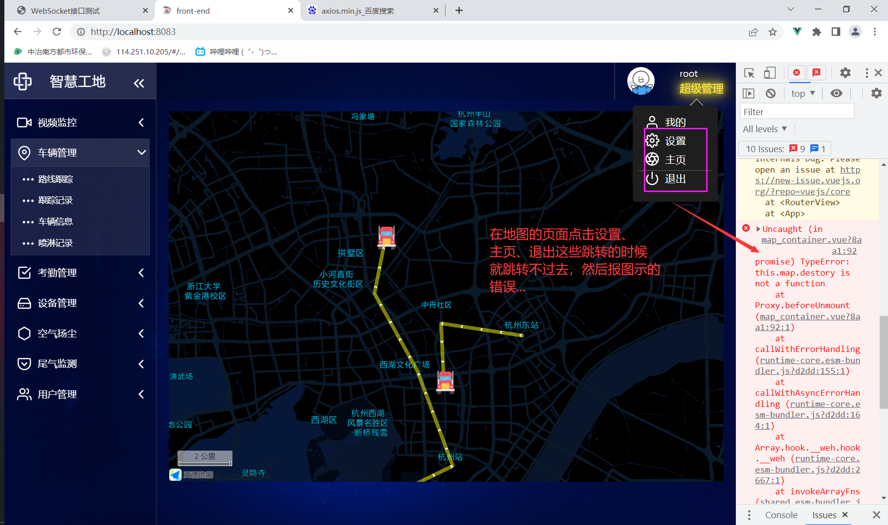


**<font color='purple'>分析：因为在路由切换的时候，会把组件销毁掉的，所以我在map_container组件的beforeUmount函数里面写了一个销毁地图的方法：</font>**

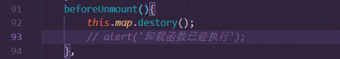

**<font color='purple'>报这个错误应该有两种可能：一种就是this.map不存在，值为Null，还有一种可能就是destory它确实不是一个函数。。。查看高德地图的api文档可知，destory确实是一个函数，没有问题的。</font>**

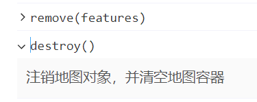

**<font color='purple'>那么也就是说，this.map=null喽。。。为什么捏？在beforeUnmount中打印出来看看：</font>**


**<font color='purple'>这就是一个完整的地图对象，没毛病啊？为啥不能调用destory函数呢？...我真的无语啦😅要不换成 this.map.destory试试...</font>**

```js
    beforeUnmount(){
        // console.log(this.map);
        this.map.destory;
        // alert('卸载函数已经执行');
    },
```

**<font color='purple'>结果成功了</font>**

**==官方文档都有Bug的，真的是🤬，还请阿里414捏😇==**


# 56、需求思路

**<font color='red'>需求描述：关于如何在主页显示地图的方式，本来我是想重新写一遍地图加载的代码的，但是一下看，那个原来的地图组件不是可以直接引入到Index组件中的吗？所以我就直接引入了，这就是组件复用的好处吗，我真的太爱了🥵</font>**

```js
import MapContainer from '../components/map/map_container.vue'

export default {
    name:'Index',
    components:{
      MapContainer
    },
```

**==导入到index组件当中来，然后再template模板中使用就行了。==**

```js
            <div class="map">
              <map-container></map-container>
            </div>
```

**组件复用，yyds😋**


# 57、需求思路

**<font color='red'>需求描述，不知道是不是因为我的代码写的太烂的原因，很可能存在内存泄漏的问题，这就导致我每次打开前端和后端项目的时候电脑不一会就变得非常非常卡顿了，所以我想解决这个问题，后端我想使用maven打包项目，这样每次启动项目就不需要打开庞大的idea了，前端我也想进行组件的webpack打包，然后先得用vue调试插件调试一下，看看内存泄漏的情况...</font>**


## 57.1、打成jar包的教程

教程参考：https://www.bilibili.com/video/BV1SA411q72G?from=search&seid=1512760566977430975&spm_id_from=333.337.0.0

- 一般是先执行clean 然后再执行package命令就行了。
- 打包成功后，jar包会放在target目录下，进入这个目录然后执行java -jar vue-spring-0.0.1-SNAPSHOT.jar命令就可以在控制台启动后端的项目了。


## 57.2、bug

bug描述：使用jar包启动服务器然后再前端操作一段时间后发现前端没有响应了。。。然后服务器报了个错：

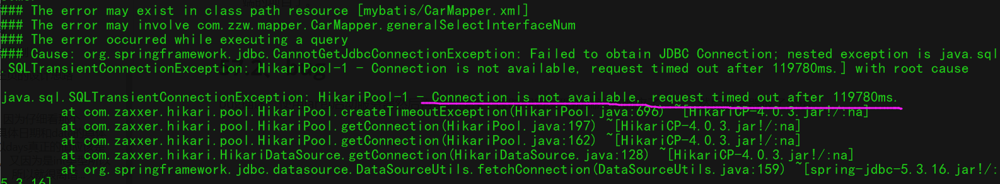

**<font color='red'>大概是连接池的连接数量不够了。。。难怪之前用idea启动项目的时候用了一会就卡了，很可能就是连接数的问题！</font>**

bug的可能原因：
 ``* 此属性控制允许连接在池中保持空闲状态的最长时间。仅当minimumIdle(默认为10)定义为小于maximumPoolSize(默认10)时，此设置才适用。一旦池达到MinimumIdle(默认10)连接，空闲连接将不会退出。连接是否以空闲状态退役，最大变化为+30秒，平均变化为+15秒。在此超时之前，连接永远不会因为闲置而退役。值为0表示永远不会从池中删除空闲连接。最小允许值为10000ms（10秒）。默认值：600000（10分钟）
 ``* (连接允许在池中闲置的最长时间),依赖minimumIdle<maximumPoolSize>
 ``*设置minimumIdle(最小空闲连接数)=5,设置最大连接数=10,当空闲=1,当总连接=5,空闲的5个连接将增加10分钟的空闲时间 1
 ``*/
private` `Integer idleTimeout;


**<font color='blue'>个人认为产生该bug的最有可能的原因应该就是这个配置项的问题了，就是因为默认mininumIdel=10;maximumPollSize=10这时候空闲的那些连接便不会退出了捏。。。</font>**


# 60、项目深入优化

==**<font color='red'>本章节主要是用于项目的优化改进，我认为知识技能的深入掌握不能没有根的基底，所以最好的深入学习vue技术的方式，就是对原来的项目不断的进行精进；虽然我也考虑过重开一个项目进行根深入的学用掌握，但是项目的成本太高了，还不如在原来的项目上优化改进来的方便有效。</font>**==

# 61、axios并发请求

axios中文文档参考：http://www.axios-js.com/zh-cn/docs/#%E5%B9%B6%E5%8F%91

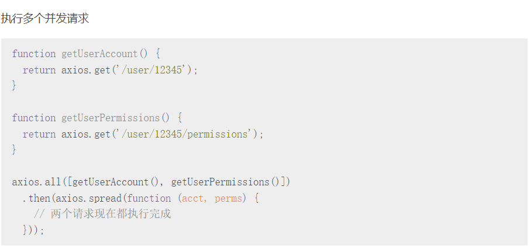

- 因为在原有的项目中，就是一个接口一个接口的去进行请求，如图所示：

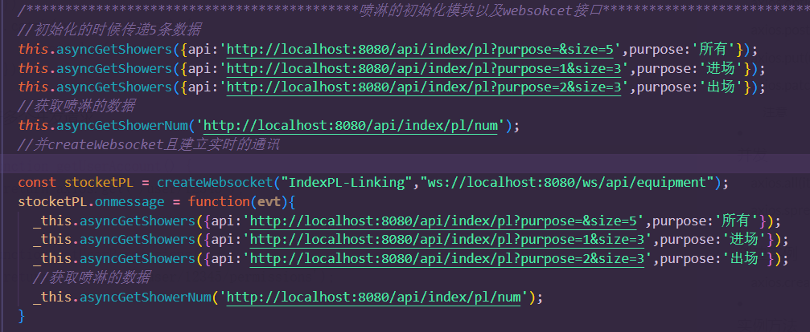

所以我就想把它做成并发的请求模式，这样会比较高效。

## 1、switch...case...

MDN文档参考：https://developer.mozilla.org/zh-CN/docs/learn/JavaScript/Building_blocks/conditionals


## 2、并发错误

**<font color='red'>改成并发消息后，前端并发了axios请求，但是后端没有返回对应的请求。。。</font>**

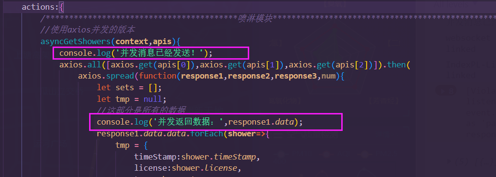

控制台：

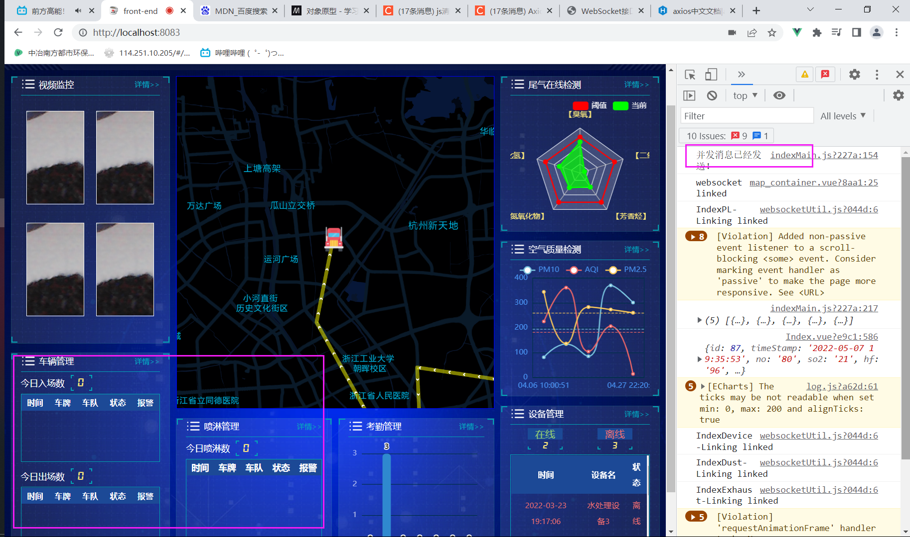

初步推断应该是后端处理并发的时候出现了问题了。。。明天再解决吧


### 2.1、情况描述

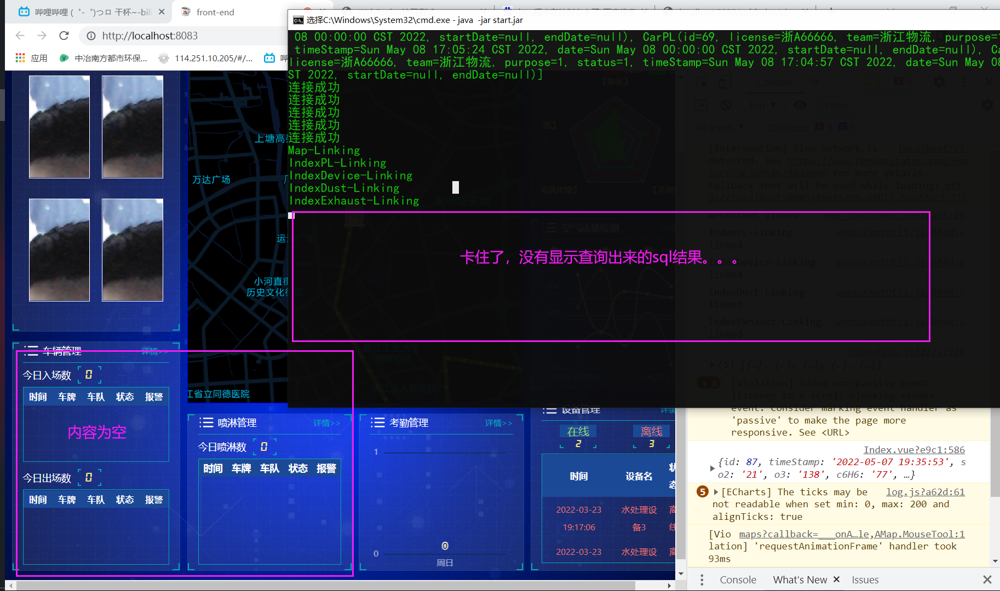

- **<font color='purple'>分析：如果想要解决这个问题那么就必须要看到java程序在执行过程中，这一步到底干了什么导致整个程序卡死了。。。不然不可能解决的</font>**

### 2.2、初步怀疑HashMap线程不安全引起

看一下代码：

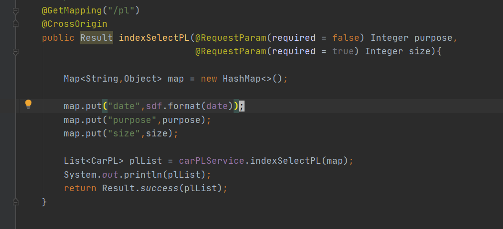

- 因为是并发的请求，所以一下子有三个请求打到了这个接口上，但是又因为，HashMap<>()是线程不安全的捏，所以就会产生数据读取不出来的情况，修改成ConcurrentHashMap<>()试试：
- 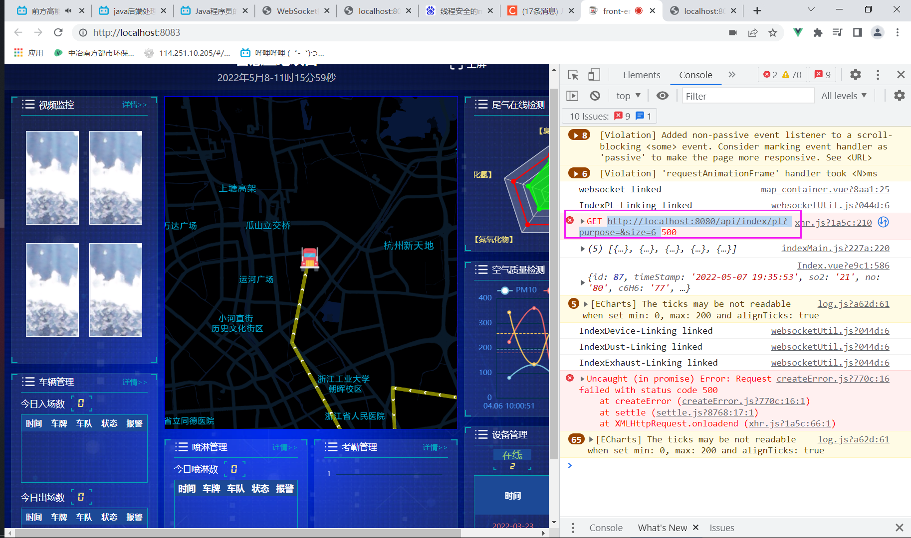

- 报错了，因为这个map不允许put一个空指针...

### 2.3、初步解决

- **<font color='red'>使用锁保证HashMap<>()的并发操作不会崩溃就行了</font>**

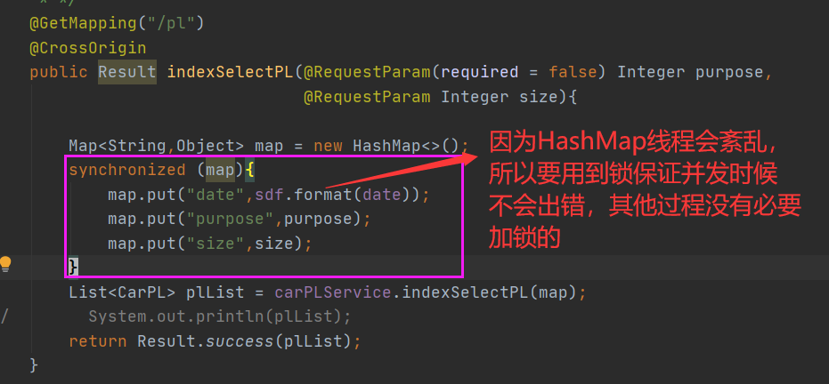

**==<font color='red'>然后程序就又正常的运行了还行吧，哈哈;至于更进一步的探索只能再出BUG的时候改进了。</font>==**


# 62、前端大方向

- **<font color='purple'>首先就是布局flex，然后是组件使用，因为说到底前端还是要看颜值的，所以一定要积累一个优质的组件库，然后让页面非常漂亮（得加钱嘻嘻），然后是axios操作，不难看文档就行，然后是时间操作和文件（excel，图片，视频）操作，然后更进一步是CommonJS库中各种API的高级调用，最后才是性能优化以及新框架和ES标准的学习，搞清楚先后然后把基础的东西打好地基，然后背一下面试题基本可以找到一份比较好的工作了。</font>**


63、


