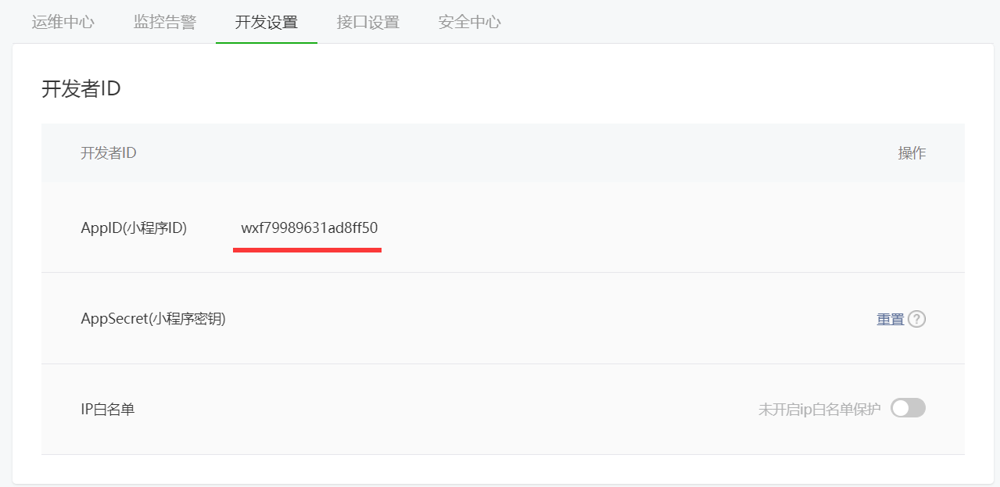

# 微信小程序开发

向日葵：


教程：https://www.bilibili.com/video/BV12K411A7A2?from=search&seid=2093172691147355404&spm_id_from=333.337.0.0&vd_source=365d13057e58bb6a007cdd5275785229

# 1、小程序简介

- **<font color='deeppink'>小程序是无需安装用完即走的，但其实是需要安装的只不过因为提及特别小，所以下载速度很快，用户感觉不到而已。</font>**

- **小程序刚发布的时候要求大小不能超过1M，现在是2M了。**

# 2、小程序开发准备工作

- 微信公众平台：https://mp.weixin.qq.com/

登录成功之后就可以来到小程序开发管理的后台系统了。


**==<font color='deeppink'>小程序账号申请：</font>==**


**现在的教程：**


# 3、移动端相关知识

## 3.1、物理像素

要理解它就要知道屏幕是由一个一个小像素点而集成的对吧，

1、物理像素就代表屏幕的分别率（1920*1080就表示宽有1920个像素点，高有1080个像素点）

2、显示设备能控制的最小单元。

## 3.2、设备独立像素 & css像素


**==<font color='deeppink'>设备独立像素和css像素是程序可以控制的像素，也就是最常使用的px</font>==**


## 3.3、dpr


**因为dpr=2所以，已知设备独立像素是375*667就可以换算出物理像素（屏幕分别率为750\*1334）**


## 3.4、移动端适配方案

### 3.4.1、viewpoint适配


**==就是使用上面的那个标签来实现，就是说把device-width设备宽度赋值给width布局的宽度，然后两者的比例是initial-scale=1.0，也就是这个两个相等了==**

### 3.4.2、rem适配


使用js原生实现：（淘宝的适配方案）


==函数防抖就是当窗口改变的时候不要快速的调用remRefresh()函数==

使用第三方库来实现：


# 4、小程序特点概述

- 没有dom，组件化开发，


# 5、小程序开发工具

***在开发后台可以通过 开发->开发管理->开发设置查看小程序的ID***



创建一个小程序


**开发主界面：**


- 一般选择小程序模式就行了
- 普通编译就是编译一整个小程序，然后点击右边的编译就可以编译整个小程序了
- 预览，就是你审核通过了，然后会返回给你一个二维码，你扫码进行真机的测试

**<font color='red'>预览功能要注意的是，一般情况下只有你自己才能够进行预览的。要想添加别人进行预览的话，可以在开发管理后台的成员管理然后添加体验成员。</font>**

- 自动预览功能：


只有开发者可以使用这个功能，更加的方便快捷


- **<font color='deeppink'>真机调试功能就是预览的调试版本，比预览更加牛逼！！</font>**

- **清除缓存的功能也很叼，可以把所有的缓存都清除掉，包括编译缓存，登录缓存，授权数据缓存**


- 上传就是项目完成后发布一个版本而已
- 版本管理就是和git绑定在一起。
- 详情页


# 6、小程序文件结构


- 这个和vue-cli默认生成的脚手架是一样


## 6.1、project.config.json

**这个文件就是项目的配置文件了，一般来说就下面两项比较经常改变的：**


**==<font color='deeppink'>这里面几乎所有的配置都可以用图形化的界面进行配置的，如下：</font>==**


## 6.2、sitemap.json

- **这个配置的是是否允许微信搜索能搜索到你的程序页面，提高程序的曝光率。**

```json
{
  "desc": "关于本文件的更多信息，请参考文档 https://developers.weixin.qq.com/miniprogram/dev/framework/sitemap.html",
  "rules": [{
  "action": "allow",
  "page": "*"
  }]
}
```

**==<font color='deeppink'>默认的配置的话就是所有的页面都允许被爬取！</font>==**


## 6.3、三大文件

- **<font color='blue'>add.js：该文件调用一个App();函数用来注册整个小程序的</font>**


- **<font color='blue'>app.json文件，用来对整个小程序进行全局配置的地方</font>**

```json
{
  "pages":[
    "pages/index/index",
    "pages/logs/logs"
  ],
  "window":{
    "backgroundTextStyle":"light",
    "navigationBarBackgroundColor": "#fff",
    "navigationBarTitleText": "Weixin",
    "navigationBarTextStyle":"black"
  },
  "style": "v2",
  "sitemapLocation": "sitemap.json"
}
```

- **<font color='deepred'>Pages节点：第一项配置就是页面路径配置，注意，不能在pages前面加/的，不然会爆炸的！</font>**
  - **<font color='deepblue'>pages设置默认的启动页面为第一行的配置项页面，哈哈</font>**
- **<font color='deepred'>Window节点：主要看三个navigationBar，第一个是导航背景颜色（只支持16进制颜色），第二个是导航栏标题内容，最后是导航栏文字样式（目前只支持white和black两种颜色）</font>**

- Style节点：选择版本
- sitemapLacation节点：指定从哪里加载sitemap.json文件的

# 7、第一个页面

- 如何快速新建一个页面？


- **<font color='deepred'>然后选中新建好的文件夹，右键->新建Page，这样开发工具会自动帮你把所有的4个文件，以及路径配置搞好的。</font>**

- **<font color='deepred'>小程序会给所有的页面最外层套一层 page元素，我们可以在公共样式中设置page的高度为100%;</font>**


# 8、小程序基础语法

## 8.1、数据绑定

### 8.1.1、初始化数据

#### part1：初始化数据

```js
  /**
   * 页面的初始数据
   */
  data: {
    msg: '测试数据'
  },
```

**查看页面变量：**


#### part2：调用数据

```html
  <view>
    <text>{{msg}}</text>
    <text>Hello World!</text>
  </view>
```


#### part3：修改数据

```js
  /**
   * 生命周期函数--加载钩子，最先执行的钩子函数
   */
  onLoad(options) {
    console.log(this)
  },
```

**这里的this就是本页面的实例对象，看看里面的内容：**


**<font color='deepred'>这个(...)是什么意思呢？之前我一直以为是调试工具省略的写法，但其实不是的，这个是调用getter的写法。</font>**


**<font color='deeppink'>就是调用getter属性才能获得到里面的内容。</font>**

**<font color='deepred'>小程序并没有像vue2一样对数据进行代理劫持，所以vue2中可以直接this.key = value，但是小程序中只能通过this.data.key来访问数据，而且要修改数据的话应该使用this.setData()方法才行。</font>**


```js
  onLoad(options) {
    console.log(this.data.msg)
    this.setData({
      msg: '许洁'
    })
    console.log(this.data.msg)
  },
```


**==<font color='deepred'>这里是一个很有意思的地方，就是在钩子函数中，数据的修改是同步的，而在vue和react中，钩子函数中的数据修改是异步的</font>==**


## 8.2、vue2劫持代理的原理

**...有点难，先放一放。**


## 8.3、事件绑定

### 8.3.1、事件的分类


**<font color='red'>为什么会有事件冒泡呢？这就要涉及到事件流的三个阶段了，捕获阶段：从外向内；执行阶段；冒泡阶段：从内向外；就是捕获阶段不是直接在子元素就捕获的，而是从外向内一层层元素捕获传递给子元素（或者说是被点击的元素）的，然后子元素执行目标方法以后，还要把事件冒泡回去，让父元素也执行它的方法，这个就是一个机制问题。</font>**


### 8.3.2、事件的绑定


**==<font color='deepred'>事件定义的位置就是与 data, onLoad这些函数同级别的位置</font>==**

## 8.4、路由跳转

**<font color='deeppink'>在微信小程序中，路由跳转是由wx提供的api实现的，参考如下：</font>**


### 8.4.1、wx.navgateTo

**<font color='deepred'>最常使用的就是wx.navigateTo，以及wx.nagefateBack返回了</font>**

```js
Page({
  data: {
  },
  jumpTo() {
    wx.navigateTo({
      url: 'pages/my/index',
    })
  },
```

**==<font color='deepred'>如果这样写的话，会提示找不到页面的！</font>==**


**<font color='deepred'>因为它认为你这个是相对路径，所以前面加了一层pages/index的，所以找不到的，要写绝对路径。</font>**

- ***它的特点是可以通过topBar的返回按钮返回***


### 8.4.2、wx.redirectTo


```js
  jumpTo() {
    wx.redirectTo({
      url: '/pages/my/index',
    })
  },

```


**<font color='deeppink'>如果使用了redirectTo的话，上面就会变成回到主页的按钮了</font>**

### 8.4.3、局部配置标题

**想要改变不同页面的标题，使用局部配置就行了。**

```json
{
  "usingComponents": {},
  "navigationBarTitleText": "天道"
}
```

## 8.5、小程序生命周期


**<font color='deepred'>这里涉及到了两个线程，一个是view视图加载的线程，另一个是js对象加载的线程</font>**

- **==onLoad就是页面一加载就立马执行，而且只会执行一次==**
- **==onShow就是页面显示的时候执行，和onHide相对，会执行多次，刚一开始onLoad结束后，onShow便会第一次执行了==**

- **==onReady就是把所有的data数据都渲染到view上面后，才会执行调用，只会执行一次==**

- **onHide就是页面隐藏的时候会被调用，像wx.navigateTo执行后，就会隐藏原来的页面**
- **onUnload就是页面关闭，销毁的时候会被调用，像wx.reLaunch执行后。。。**

